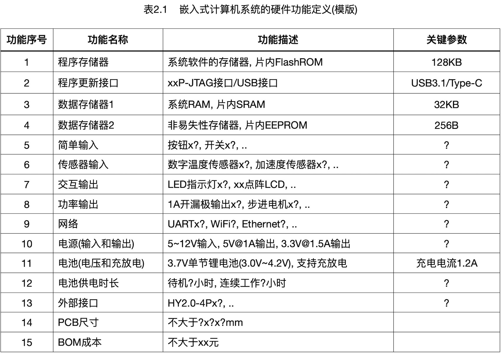
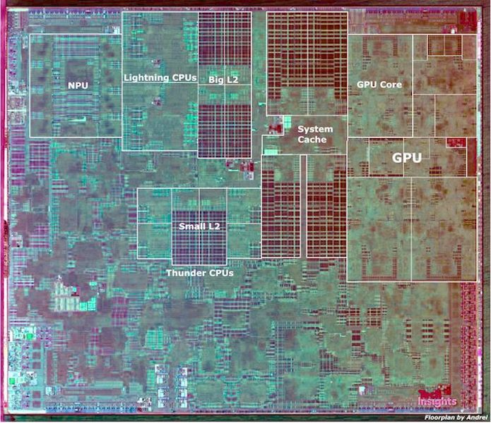

===========================
1.2 嵌入式系统硬件
===========================

将桌面计算机主板、CPU、内存和其他标准外设组装在一起就可以完成一台桌面计算机。几乎所有的嵌入式计算机系统都是由一个
或多个PCB组成，微控制器必须像其他集成电路一样地焊接到PCB上，并为其提供必要的工作电源，并面向特定应用需求的输入/输出
设计通用的或专用的接口。

BlueFi是一种典型的嵌入式计算机系统，一块比信用卡还小的PCB，板上不仅有主微控制器(nRF52840)，还有网络协处理器(ESP32)，
如图1.6所示。

.. image:: ../_static/images/c1/bluefi.jpg
  :scale: 25%
  :align: center

图1.6  嵌入式计算机系统示例：BlueFi(来自杭州乐伴科技)

大多数人拿到BlueFi时都能认出LCD显示屏、按钮、彩灯、喇叭等输入/输出功能部件，但是我们看到更多的是各种各样的集成电路。
图1.6列出BlueFi的主要功能单元，本节的目的不关心其硬件细节，本书第4～9章将逐步地探讨硬件细节和相关的软件。如果你现在
就想了解BlueFi的硬件和软件细节，请参考BlueFi的在线向导 [1]_ 。

.. image:: ../_static/images/c1/bluefi_functional_unit.jpg
  :scale: 25%
  :align: center

图1.7  BlueFi功能单元

使用BlueFi的运动传感器(包括加速度、陀螺仪和地磁传感器)、彩色LCD显示器、按钮等组件，我们可以实现前一节最后的任务的
一部分：运动步数，当然这个任务必须还有相应的软件才行。如何记录运动轨迹呢？需要GPS(全球定位系统)。无论是我国的北斗
系统或是美国的GPS，根据GPS定位原理，我们需要一个专用的外设能够接收北斗卫星的信息并通过多颗卫星的数据信息确定使用者
的具体经纬度。BlueFi现在并没有GPS功能单元，怎么办呢？我们首先需要了解是否有现成可用的GPS功能单元，再进一步了解如何
与BlueFi的主控制器连接起来。很幸运！市面上很多GPS功能单元可用，而且他们大多数都采用UART(通用异步串行收发器)接口，
BlueFi的金手指拓展接口上正好支持这一接口。

如果不考虑体积、重量和功耗，实现一个能够记录运动轨迹和步数的运动手环原型机似乎并不难，但绝对与组装桌面计算机的过程
完全不同，实现嵌入式计算机系统的过程或许需要动用烙铁来实现组件之间的连接，也有可能需要你设计一块PCB。

嵌入式计算机系统是以微控制器为核心，并根据特定应用需求设计专用的输入/输出功能单元的接口，再将全部功能单元布置在一块或
多块PCB上，还需要PCB生产、电子元件焊接等工序才能完整地得到一种嵌入式计算机系统的硬件。

嵌入式计算机系统的开发流程如图1.8所示。计算机系统的硬件和软件是不可分割的，必须实施软硬件协同开发才能实现完整的
计算机系统，我们将在下一节探讨嵌入式计算机系统软件及其开发。

.. image:: ../_static/images/c1/ec_dev_flow.jpg
  :scale: 25%
  :align: center

图1.8  嵌入式计算机系统的硬件开发流程

----------------------------

面向特定应用，满足特定应用需求。这是嵌入式计算机系统与其他类型计算机系统的最大区别。事实上，嵌入式计算机系统只是
一种特殊的产品。按照“5W理论” [2]_ 的产品设计思维，我们很难在嵌入式计算机系统类的硬件研发过程中达成创新产品！现今绝大多数
嵌入式计算机系统的创新产品几乎都依靠软件。这是为什么？随着集成电路技术的飞速发展，硬件设计完全依赖各种功能性集成电路，
满足特定应用需求的硬件设计过程更像是简单的功能性加法，富有经验的嵌入式计算机系统硬件工程师只是把工作做到正确而已。
我们这样的说法不希望打击你的学习兴趣，更希望你不必过渡地想象嵌入式计算机系统硬件的复杂性，把某些工作做到正确实属不易，
满足应用需求而缺少创新也是正确的选择。

面向特定应用的嵌入式计算机系统的硬件功能定义是一件非常重要且极具挑战性的工作，虽然满足功能是最低要求，同时必须考虑成本约束、
体积和重量约束、功耗约束、连续无故障运行时间等约束。嵌入式计算机系统的功能定义阶段最重要的输出是一张表格，如表1.2所示的模版。

虽然嵌入式计算机系统的产品功能主要依赖系统软件，但必须有合适的硬件提供支撑，但是冗余的硬件功能定义不仅增加BOM成本(原材料成本),
还可能增加故障率。俗话说“做得越多错的越多”，正好满足功能的硬件定义是最佳的选择。请你为前一节最后部分提到的运动手环产品的
设计一个硬件功能定义表。

基于前面定义好的嵌入式计算机系统的功能表(请参考表1.2的模版)，我们将进入整体方案设计阶段，即确定使用何种体系架构的微控制器、
确定输入和输出及其接口、确定网络及其接口、确定电源等方案。这个阶段不仅要翻阅资料(查找相近的成熟方案，翻阅相关硬件的数据页)，
或许还要对某些方案的细节做前期验证(方案可行吗)，这个阶段是嵌入式计算机系统设计的关键，也是耗时最长的工作。本节只讨论硬件方案，
但与软件开发密切相关，譬如我们选择使用某个体系的微控制器很可能源于软件开发工具链和相关的功能库资源等。当然，我们始终需要保持
“最低成本”的理念。

整体方案的设计阶段将会输出一个与图1.7相似的功能单元图，不仅按照硬件功能定义表给出各个功能单元的硬件方案，甚至需要在图中更详细地
表达各个硬件功能单元之间的连接关系。此时，你可以尝试绘制一个“能够记录运动轨迹和步数的运动手环”的整体方案框图。

方案的优化是极其重要的。当你在汇报方案之前，是否已经确认自己已经反复优化过多次，如果你有记录笔记/日记的习惯，汇报方案时或许
需要你回溯方案优化的过程。优化的目标可以从很多方面，如成本、开发周期、可靠性、体积等等。对比不同方案是硬件设计的主要优化方法，
有经验的工程师自己就有很多种方案，那么新手如何获取更多种方案呢？试着凝练适合自己项目的关键词，在嵌入式计算机系统相关的论坛、
开源社区搜索相关方案，譬如github网站 [3]_。

经过反复推敲、讨论后的整体方案的实施工作是电路设计、PCB布局。这个阶段的工作虽然很容易，但也可能会导致整个项目失败！表面上仅仅
是依据硬件方案的电路原理图设计和布板，实际上这些工作必须考虑元件的封装、功率、散热、PCB生产工艺、贴片和焊接工艺、组装和测试工艺
等。譬如前面提到的运动手环产品，安装空间狭小，你如何将所有硬件功能和电池全部置于20x8x10mm的空间内呢？这又是一项极具挑战性的工作。
我们需要花费大量的时间去优化产品种用到的每一种电子元件的空间占比和成本但不能影响系统的功能。

一旦完成PCB布局之后，PCB生产、贴片和焊接生产可以依靠代工工厂来完成，留给我们的研发工作就是硬件测试、功能验证和改进。

----------------------------

你从上述的研发流程和流程分析中是否已经发现设计和实施一种嵌入式计算机系统硬件部分所涉及的知识和能力有哪些？数字和模拟电路知识、
电路设计和分析能力、功能性电子元件知识、计算机原理相关的知识、微控制器及其体系架构知识、计算机接口及其应用知识、电子CAD能力、
传感器和执行器的原理及其相关理化知识和材料知识、产品设计能力等等。如果把软件设计和实施也考虑进去，我们还需要具备软件开发能力、
算法及其相关的数学知识等。

研发面向特定应用的嵌入式计算机系统与其他类计算系统相比，不是单纯地追求最好的计算性能、最短的服务响应，其他计算机系统的功能
需求和工作环境相对较为统一，但嵌入式计算机系统的功能需求、接口形式、工作环境、交互和操作方法等都是面向特定应用而订制化的，
需要开发者具备跨学科的知识和能力。很遗憾的是，陷于篇幅本书并不能为你提供全方位的知识和能力训练，我们也一定能帮助你成为嵌入式
计算机系统的初级产品开发者。

----------------------------

.. Note::  平板电脑是属于嵌入式计算机系统吗？

  前一节我们将现今的计算机系统分为5类，本节初步了解嵌入式计算机系统的特点、硬件开发等，有人把PMD类系统，
  如平板电脑，归类嵌入式计算机系统。因此，我们有必要对PMD稍作说明。

  首先看一看Tech Insights提供的Apple A13处理器的扫描电镜图，如图1.9所示。A13使用台积电的7nm工艺(这是半导体制造领域
  最先进的制程)，其多方面的性能都远超华为的骁龙865和麒麟990，据说A13是业界最快的处理器。A13处理器与桌面计算机使用的CPU存在很大
  区别：CPU只有处理器核(或许是多种多核)、Cache(高速缓存)、总线接口等三个部分；A13不仅具有ARM内核和Cache、GPU(图形处理单元)、
  NPU(AI神经处理单元)，还有音视频接口、WiFi、USB、DDR SDRAM控制器及其接口，以及GPIO等。A13处理器是Apple发布的最新版
  iPhone和iPad的核心。如果我们把A13看作嵌入式计算机系统的“主板”，但缺少RAM和ROM(iPad的DDR SDRAM和闪存都是处理器之外),
  但A13内部的确包含WiFi、USB等网络外设功能单元。这也是我们单独将iPad等平板电脑单独归为一类的原因，无论是从他们的处理器、
  主板架构、供电，或是从软件系统等角度看，PMD类系统与其他计算机系统存在较大的差异。

  通过搜索引擎我们可以找到Apple iPad的更详细细节，iPad2的拆机和A5处理器(iPad2的核心)的扫描电镜图等请翻阅 [4]_ 的第1.4.3节。

图1.9  Apple A13处理器的扫描电镜图(来自Tech Insights)

----------------------------

参考文献：
::

.. [1] https://python4bluefi.readthedocs.io/zh_CN/latest/index.html#
.. [2] https://baike.baidu.com/item/5W%E7%90%86%E8%AE%BA/10209874?fr=aladdin
.. [3] https://github.com/
.. [4] 计算机组成与设计：硬件/软件接口(第5版), David A. Petterson, John L. Hennessy著, 陈微 译, 机械工业出版社, 2018

