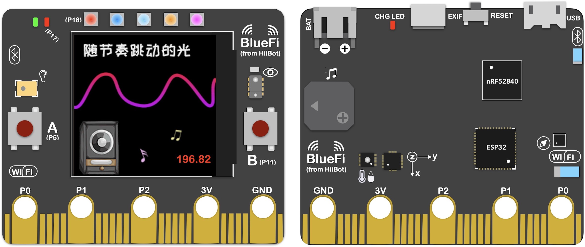
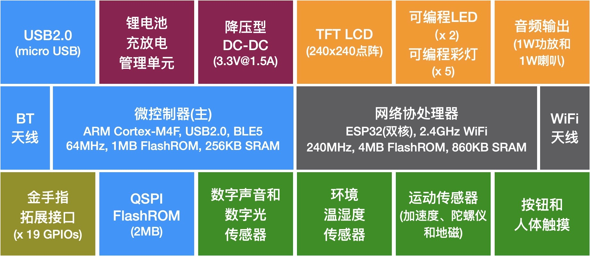
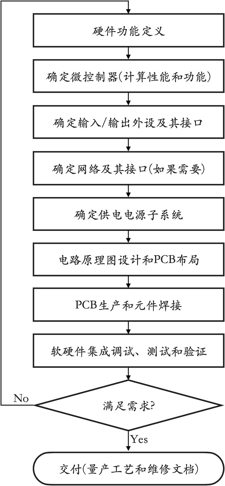

===========================
1.2 嵌入式系统硬件
===========================

将桌面计算机主板、CPU、内存和其他标准外设组装在一起就可以完成一台桌面计算机。几乎所有的嵌入式计算机系统都是由一个
或多个PCB组成，微控制器必须像其他集成电路一样地焊接到PCB上，并为其提供必要的工作电源，并面向特定应用需求的输入/输出
设计通用的或专用的接口。

BlueFi是一种典型的嵌入式计算机系统，一块比信用卡还小的PCB，板上不仅有主微控制器(nRF52840)，还有网络协处理器(ESP32)，
如图2.1所示。

图2.1  嵌入式计算机系统示例：BlueFi(来自杭州乐伴科技)

大多数人拿到BlueFi时都能认出LCD显示屏、按钮、彩灯、喇叭等输入/输出功能部件，但是我们看到更多的是各种各样的集成电路。
图2.2列出BlueFi的主要功能单元，本节的目的不关心其硬件细节，本书第4～9章将逐步地探讨硬件细节和相关的软件。如果你现在
就想了解BlueFi的硬件和软件细节，请参考BlueFi的在线向导 [1]_ 。

图2.2  BlueFi功能单元

使用BlueFi的运动传感器(包括加速度、陀螺仪和地磁传感器)、彩色LCD显示器、按钮等组件，我们可以实现前一节最后的任务的
一部分：运动步数，当然这个任务必须还有相应的软件才行。如何记录运动轨迹呢？需要GPS(全球定位系统)。无论是我国的北斗
系统或是美国的GPS，根据GPS定位原理，我们需要一个专用的外设能够接收北斗卫星的信息并通过多颗卫星的数据信息确定使用者
的具体经纬度。BlueFi现在并没有GPS功能单元，怎么办呢？我们首先需要了解是否有现成可用的GPS功能单元，再进一步了解如何
与BlueFi的主控制器连接起来。很幸运！市面上很多GPS功能单元可用，而且他们大多数都采用UART(通用异步串行收发器)接口，
BlueFi的金手指拓展接口上正好支持这一接口。

如果不考虑体积、重量和功耗，实现一个能够记录运动轨迹和步数的运动手环原型机似乎并不难，但绝对与组装桌面计算机的过程
完全不同，实现嵌入式计算机系统的过程或许需要动用烙铁来实现组件之间的连接，也有可能需要你设计一块PCB。

嵌入式计算机系统是以微控制器为核心，并根据特定应用需求设计专用的输入/输出功能单元的接口，再将全部功能单元布置在一块或
多块PCB上，还需要PCB生产、电子元件焊接等工序才能完整地得到一种嵌入式计算机系统的硬件。

嵌入式计算机系统的开发流程如图2.3所示。计算机系统的硬件和软件是不可分割的，必须实施软硬件协同开发才能实现完整的
计算机系统，我们将在下一节探讨嵌入式计算机系统软件及其开发。

图2.3  嵌入式计算机系统的硬件开发流程

----------------------------

面向特定应用，满足特定应用需求。这是嵌入式计算机系统与其他类型计算机系统的最大区别。事实上，嵌入式计算机系统只是
一种特殊的产品。按照“5W理论” [2]_ 的设计思维，我们很难在嵌入式计算机系统类的硬件研发过程中达成创新产品！现今绝大多数
嵌入式计算机系统的创新产品几乎都依靠软件。这是为什么？随着集成电路技术的飞速发展，硬件设计完全依赖各种功能性集成电路，
满足特定应用需求的硬件设计过程更像是简单的功能性加法，富有经验的嵌入式计算机系统硬件工程师只是把工作做到正确而已。
我们这样的说法不希望打击你的学习兴趣，更希望你不必过渡地想象嵌入式计算机系统硬件的复杂性，把某些工作做到正确实属不易，
满足应用需求而缺少创新也是正确的选择。

设计一个合适的嵌入式计算机系统满足特定需求，满足功能是最低要求，满足成本约束、体积和重量约束、功耗约束、连续无故障运行
时间等需求是一件充满挑战的工作。我们有理由相信，嵌入式计算机系统研发工程师将是集成电路设计领域的最佳创意创新导师，
这符合上游驱动的创新模式。

.. Note:: 上游驱动的创新模式

  上游驱动的创新模式在人类进化史上最重要的一种外力驱动型创新。事实证明，过去几年的新零售、新商业模式已经明显地推动全球
  科技的发展，这些领域的创新者最初仅仅是满足需求，当他们发现现有的技术很难满足需求时，整合技术团队艰难地实现各种略大于0
  的极小创新最后被聚集成世人瞩目的创新成果。WSC(仓库级计算机)和云计算机是此类创新的典型代表，虽然WSC并没有改变计算机系统
  的基础架构。

通过对特定应用的需求分析，我们能够准确地定义嵌入式计算机系统的硬件功能，需要什么样的计算速度和计算能力？需要多大存储容量？
需要哪些输入/输出功能？需要什么样的网络接口？等等。

----------------------------

参考文献：
::

.. [1] https://python4bluefi.readthedocs.io/zh_CN/latest/index.html#
.. [2] https://baike.baidu.com/item/5W%E7%90%86%E8%AE%BA/10209874?fr=aladdin
.. [3] 

