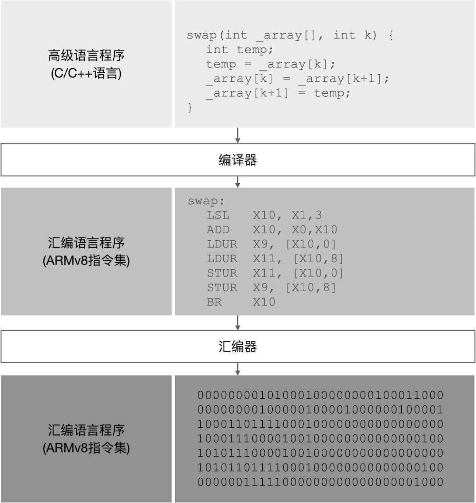
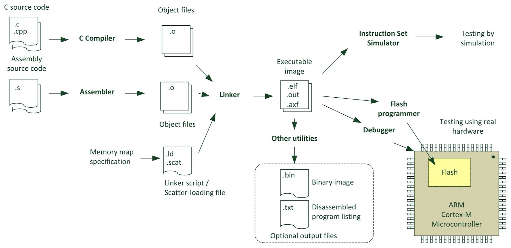
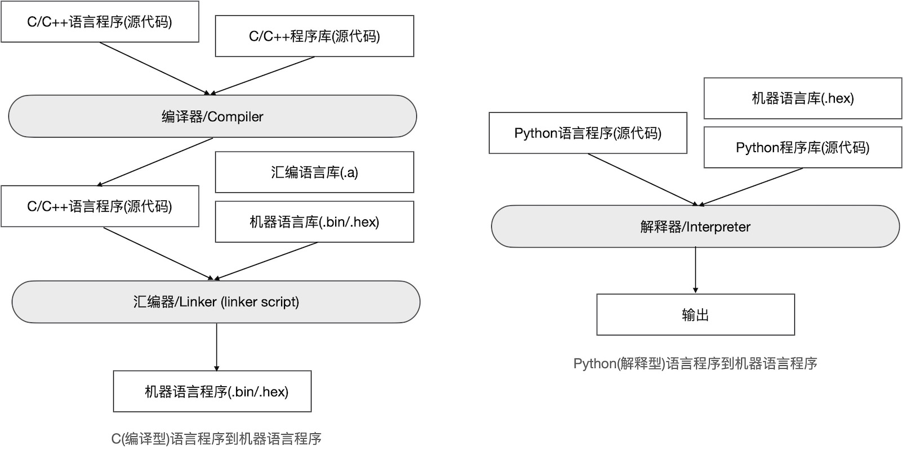
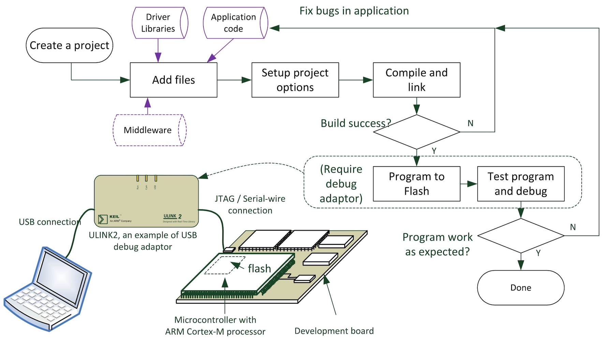
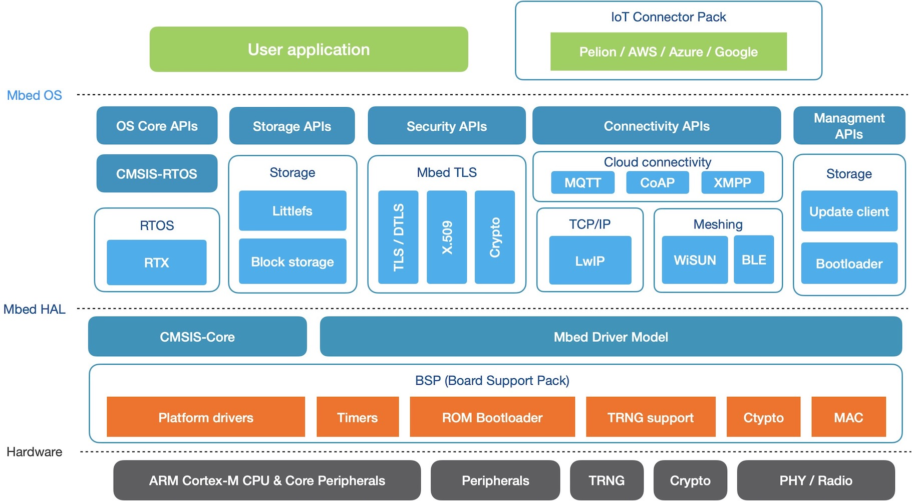

===========================
1.3 嵌入式系统软件
===========================

硬件是计算机系统的基础设施，软件决定计算机系统具有什么样的功能。图书馆内供读者查询信息的设备就是一台标准的桌面计算机，
银行或政府办事大厅的排队取号、叫号设备也是一台标准的桌面计算机，这些设备的硬件区别几乎仅有可能是外设，决定这些设备功能
的因素只有软件，准确地说软件指的是应用程序，如图书馆信息查询系统软件、排队系统软件等。请注意，本书不刻意区分“程序和软件”。

事实上，所有计算机系统的硬件只能执行几十到几百种机器指令，无论是数百万行的应用程序或是几百行应用程序都是为了实现
某种特定功能而有序地组合起来的机器指令。机器指令从诞生那一刻起就是二进制形式表示，人类很难读懂机器指令，所以现代的所有
计算机体系架构的每一种机器指令都有方便人类识别的指令助记符。指令助记符，也称汇编指令。

或许你从来没有见过汇编指令级别的程序，即使见到这样的程序，你或许也觉得可读性极差！你能想象计算机诞生的早期的那些程序员们
使用机器指令/二进制码编写程序的难度吗？从上世纪70年代开始，计算机科学的一个重要分支就是高级编程语言及其编译器的研究，
Python、C/C++、Java等高级编程语言大大地提高程序员们的工作效率，使用很少的语句就能实现很强大的功能。高级编程语言输出
的软件必须经过一系列的处理最终变成特定计算机系统硬件能够认识并执行的机器语言程序。我们通常把高级语言程序处理为机器语言程序
的软件统称为工具链，包括编译器(将高级语言程序编译成特定机器的汇编语言程序)和汇编器(将汇编语言程序、汇编库、二进制库、常量等
映射到特定硬件的程序存储器可用的机器码程序)。以ARMv8机器指令集为例，我们将一段C程序编译为汇编语言程序并通过汇编转换为
二进制机器码的过程 [1]_，如图1.10所示。

图1.10  将高级语言程序转换为汇编语言程序再转换为机器语言程序的流程

高级编程语言不仅提高程序员的工作效率，还能让程序员使用接近自然语言的方式来思考问题和解决问题。二进制格式的机器语言程序是
为特定机器订制的，但高级编程语言的程序是可移植的，譬如我们使用不同的工具链可以将同一个C/C++程序转换不同机器的机器语言程序。
当然，任何高级语言程序的可移植性还受限于程序本身，或者说受限于程序员的工作。

----------------------------

使用过桌面计算机编写应用程序经历的绝大多数人都写过将字符串“hello world”显示在屏幕上的最简单应用程序，这个程序最关键的几行
代码就是告知编译器“加载标准输入/输出库”，并使用标准输入/输出库的字符流输出“hello world”字符串。即使需要编写、编译、执行如此
简单的程序之前必须安装文本编辑器软件、桌面计算机CPU和高级编程语言相关的工具链等软件，大多数情况你的确只安装了一个软件，
我们应该称之为“集成开发环境(IDE)”，譬如Visual Studio Code及C/C++工具链安装包。IDE本身是桌面计算机的一种应用程序，专门
用来编辑高级语言程序的文本，并将高级语言程序编译、汇编成为桌面计算机能够执行的机器指令程序。

在桌面计算机上编写高级语言程序、编译、汇编产生的本机可执行的机器语言程序，这个过程所用到的工具已有很多种选择，甚至高级语言
本身也有很多种选择。我们在桌面计算机上编写高级语言程序，能否在嵌入式计算机系统上执行呢？答案是肯定的。基于前一节的知识，
我们很容易想象嵌入式计算机系统的机器语言程序(二进制程序)必须装在到微控制器芯片内的程序存储器中执行，这与桌面计算机的应用程序
的执行完全不同。以C/C++语言为例，我们在桌面计算机上编写高级语言程序，并借助于目标嵌入式系统CPU的工具链将其转换为目标系统CPU
能够识别并执行的机器语言程序，这个过程称为交叉编译。

譬如我们的目标嵌入式系统CPU使用ARMv8指令集，我们需要一个IDE在桌面计算机上编写C/C++程序，并有IDE的工具链将C/C++程序转换成
ARMv8机器的二进制格式程序。高级语言程序和机器语言程序的片段如图1.10所示。另一个问题是，我们如何将嵌入式计算机系统的机器语言
程序从桌面计算机磁盘转移到微控制器的ROM内呢？我们把这个文件转移过程称作程序下载，也有人称之为烧录程序。这个过程必须借助于一些
专用的软硬件工具，譬如JTAG。

本书的第三章将会深入探讨嵌入式计算机系统的交叉编译、程序下载。使用桌面计算机的IDE应用程序和嵌入式计算机系统下载工具等实现
交叉编译和程序下载的流程如图1.11所示 [2]_。

图1.11  嵌入式计算机系统软件开发(以C/C++编程语言开发ARM Coretx-M系统为例)

----------------------------

当前，Python编程语言是全球最流行的高级编程语言之一，本书的很多示例都将使用Python语言。Python是一种可读性极高的脚本语言，
相较于C/C++、Fortran等高级语言更接近人类的自然语言，Python语言的程序员们考虑问题的方式更接近日常习惯。使用C/C++和Python
编程有什么区别？现今的程序员们很多都同时掌握多种编程语言，同一个问题可以使用不同种语言来解决，而且任何高级语言程序都需要使用
某些工具软件将其转换成机器语言程序。同一种计算机上执行C/C++程序和Python脚本程序有不同的技术路线，如图1.12所示。

图1.12  编译型语言程序和解释型语言程序如何被机器执行

C/C++是典型的编译型高级语言，程序源码必须经过工具链处理成特定机器可执行的机器语言程序才能让计算机执行，程序的执行效率很高，
但是源码的任何小改动都必须再用工具链处理一次。Python是典型的解释型高级语言，脚本程序被特定机器的Python解释器逐行地转换
成机器语言程序片段并在当前运行环境立即执行立即输出结果，脚本语言无需预先编译，仅在运行时才逐行解释、执行、输出，编写和修改源码
的效率很高(相较于C/C++语言，Python语言的程序员们的工作效率更高)，但Python程序的执行效率较低，Python脚本程序依赖特定的
解释器。嵌入式计算机系统运行Python脚本程序前必须已经启动Python解释器，嵌入式系统的Python解释器本身是一个独立程序，
Python解释器能够循环地“读取-估算-输出”Python脚本程序文件的每一行。

同样的问题，Python源码如何下载到嵌入式计算机系统呢？我们将在第3章回答这个问题。随着解释型编程语言的发展，现在很多解释型
语言都能够在极小程序空间和有限内存资源的嵌入式计算机系统上执行，如Python、JavaScript等，你可以使用搜索引擎找到相关的解释器
和可运行的硬件平台。很显然，现今的所有嵌入式计算机系统都支持执行效率更高的编译型语言，如C/C++、Go等，取决于他们的工具链。
嵌入式计算机系统的硬件具有体积小、重量轻、低功耗、低时钟频率和执行速度(即弱计算能力)、有限存储空间(程序空间和数据空间)、
丰富的可编程I/O资源等，执行脚本语言程序的速度将更慢。

----------------------------

桌面计算机是我们开发嵌入式计算机系统软件的主要工具，安装有文本编辑器、编译器、汇编器等工具链(IDE)软件的桌面计算机本称作宿主
计算机，嵌入式计算机则称作目标系统或目标板/开发板。这种开发模式所使用的工具链一定是交叉工具链，将编译型语言的源码程序和库文件
转换成能够在目标板上执行的机器语言程序/二进制文件，下载工具将二进制文件下载到目标板的FlashROM中。不同的目标板，尤其不同的
微控制器架构体系所使用的交叉工具链是完全不同的。

图1.13  用桌面计算机(宿主)和下载工具开发嵌入式计算机系统软件的流程(以ARM Cortex-M系列为例)

除了交叉开发的工具链软件之外，下载工具是很重要的一种嵌入式系统开发工具。下载工具的核心任务是将宿主机器生成的二进制文件下载到
目标板的程序存储器内，这个下载过程与普通的文件复制/拷贝完全不同。下载过程分为两种：生产过程中下载和在系统/在板程序下载，前者
是微控制器芯片未焊接到目标板时使用专用的工装夹具把机器语言程序下载到芯片内的FlashROM，后者是微控制器芯片已经焊在目标板上借助于
专用的在系统/在板程序下载接口把程序下载到FlashROM中。现今的绝大多数微控制器都支持在系统/在板程序下载。某些下载工具还提供在系统/
在板仿真和调试程序的功能，譬如JTAG下载工具。

微控制器开发者为了简化在系统/在板下载程序的工具，为微控制器增加一个独立的状态：下载程序状态，以区别于执行用户程序的状态，这个状态
执行一种极小的专用程序与宿主计算机通讯，完成用户程序的下载/更新。微控制器进入下载/更新程序状态时所执行的专用程序被称作Bootloader。
微控制器何时进入Bootloader状态呢？通用的做法是，当系统复位时某几个特定GPIO引脚被置为特定状态，系统复位后将立即进入Bootloader状态，
此时可以下载/更新用户程序。支持Bootloader更新用户程序的微控制器可以通过USB、异步串口(UART)、I2C、SPI等通讯接口实现程序下载，
对于带有USB或异步串口的微控制器来说，使用Bootloader更新用户程序几乎是零成本的，仅仅是数据线。

----------------------------

通过本节的内容，我们初步了解嵌入式计算机系统的软件开发和程序下载的基本方法。与桌面计算机的应用程序开发相比，嵌入式计算机系统的软件
开发有什么区别？桌面计算机具有Windows、macOS或Linux等桌面操作系统，这些标准的OS环境都会为程序员们提供应用程序接口(API)，不管你使用
C/C++或是Java语言都有相应功能的API帮助开发者实现输入/输出和网络功能。然而，嵌入式计算机系统并没有标准的OS，而且使用编译型语言编程即使
有嵌入式OS，其软件开发流程(如图1.11和图1.13)与桌面计算机应用程序开发完全不同。嵌入式计算机系统使用的OS，如FreeTROS、R-Thread等，
本质上是一种程序库或称中间件，跟我们编写的应用程序源码一起编译和汇编才能成为一个完整的嵌入式计算机系统应用程序。

譬如，ARM Cortex-M体系架构的微控制器开发者可以使用ARM官方的开源嵌入式OS——Mbed OS [2]_，基于这个OS开发基于ARM Cortex-M体系架构
的嵌入式计算机系统与桌面计算机应用程序开发风格相似，都是使用OS提供的API，但编译和汇编用户程序时必须将嵌入式系统OS一起处理成完整的机器语言
程序(二进制文件)。ARM Mbed OS的架构如图1.14所示。

图1.14  ARM Mbed OS架构

使用不同类型的OS开发嵌入式计算机系统软件的风格、思路和方法或许完全不同，但编译和汇编时都会将所用的OS作为组件一起处理。

----------------------------

参考文献：
::

.. [1] 计算机组成与设计：硬件/软件接口(第5版), David A. Petterson, John L. Hennessy著, 陈微 译, 机械工业出版社, 2018
.. [2] https://os.mbed.com/
