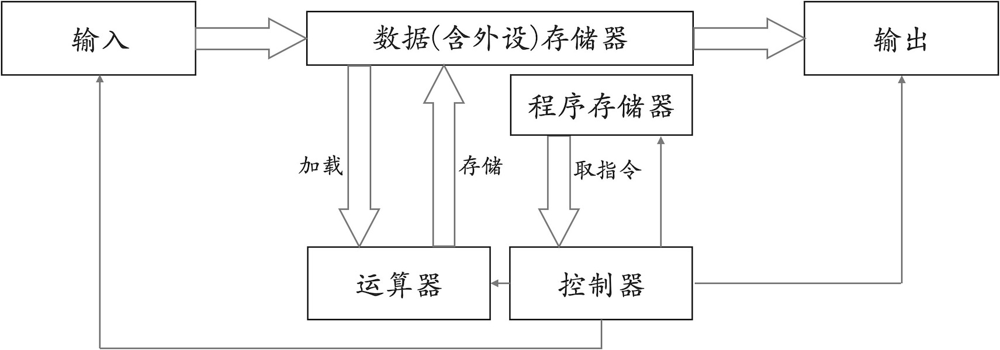
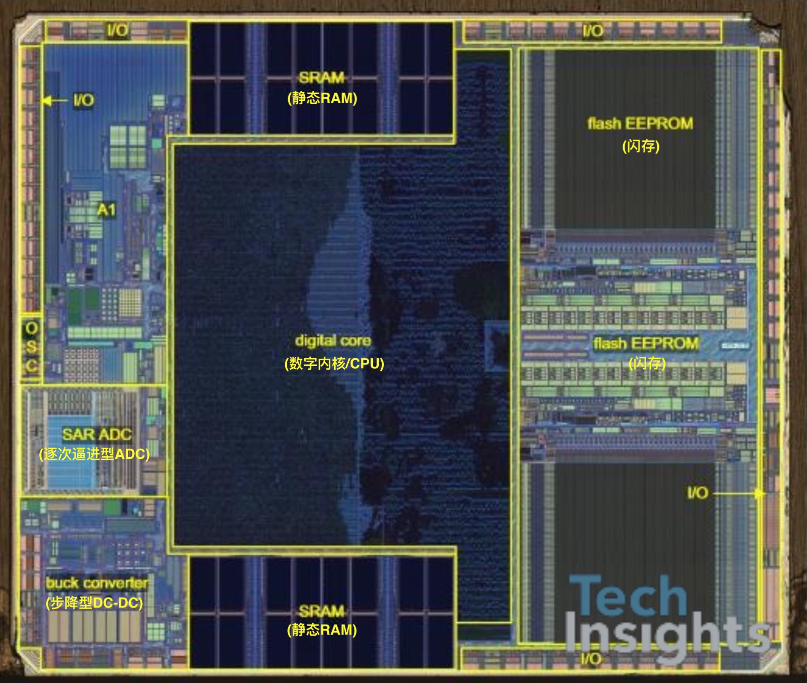
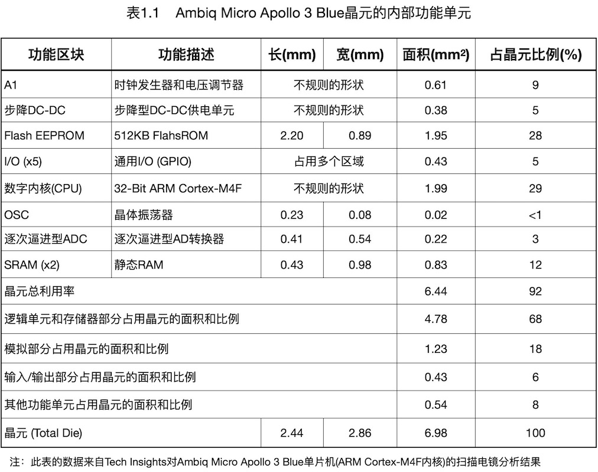
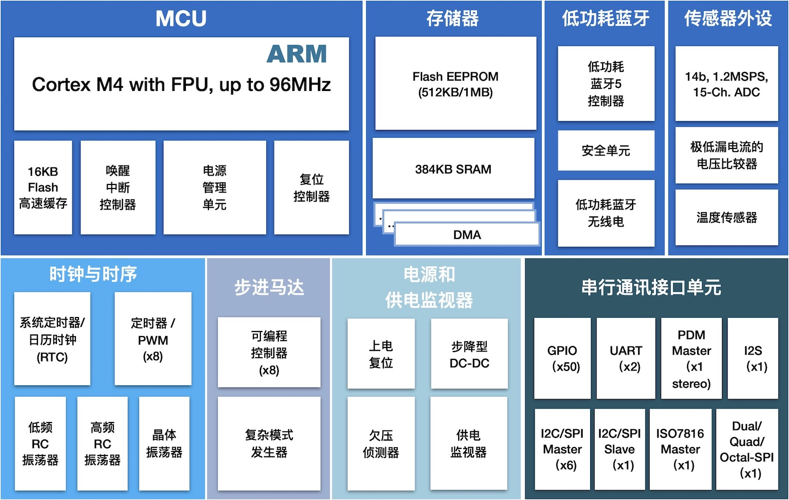

===============================
1.1 桌面计算机vs嵌入式计算机
===============================

今天的计算机系统大体上可以分为以下五种 [1]_ ：

  1. PMD(个人移动设备)，平板电脑/Pad、智能手机等
  2. PC(个人/桌面计算机)，学习、办公等工作场景使用的电脑
  3. Server(服务器)，面向可靠的大规模文件和计算服务场景所使用的计算机系统
  4. WSC(仓库级/集群计算机)，SaaS、云计算、网络数据服务等场景所使用的计算机系统
  5. ECS(嵌入式计算机系统)，智能机、物联网等应用领域使用的计算机系统

平板电脑电脑虽然已有十余年的发展历史，虽然早期被称作“个人数字助理”的PMD几乎非常小众，但随着Android、iOS系统日渐成熟
而步入高速发展的轨道，尤其App的生态系统彻底让PMD成为一类独特的计算机系统，这类PMD也正在改变我们的生活、学习和工作方式。
今天的每一位成年人都在使用PMD，千亿级的PMD市场已经成就苹果(美国)、华为(中国)这样级别的公司。PMD类计算机系统不仅要求大
屏幕、交互流畅、移动网络、媒体采集和播放等功能，还需要电池供电、续航时间、便携(体积和重量)等特性，今天的很多场合使用的
PMD几乎不可能使用其他计算机系统来代替。

桌面计算机是我们的日常工具，无论你是学生、科研工作者、政府或企业职员，PC是每天必用的工具。所以PC是人们最为熟悉的一种
计算机系统。在本节后续的内容中我们还会进一步了解PC的基本结构和功能单元。除体积之外，平板电脑(PMD)和桌面计算机(PC)之间
的界限比较模糊，笔记本电脑是典型的便携式桌面计算机，包括上网本，这些PC与PMD一样采用电池供电，体积也较小。但是，PC和PMD
使用完全不同的OS，PMD更强调能效优化的软硬件。

服务器过去被称作大型机，现在被称作服务器。服务器是证券、银行等金融系统的中心计算机系统，与PC相比服务器的可靠性和并发服务
响应等指标是至关重要的，同时服务器的可拓展性也十分重要，包括计算容量、内存、磁盘、网络带宽等，可拓展性能够更好地适应使用
者的业务量变化。除了金融系统，电信、航空等领域的大型企业，天气预报和石油勘探等应用领域，以及需要超大量科学计算和数值处理
的科研项目(如蛋白质结构计算)等，大多数都会采用服务器搭建自己的计算中心。

软件即服务(SaaS)、云计算和网络数据服务都依赖仓库级计算机，虽然我们绝大多数人从来没有亲眼见过这类计算机，但是我们每天都
在使用这类计算机。譬如，使用百度或Google搜索引擎在互联网上查找某些信息时就是由WSC为我们提供互联网搜索服务。服务器更像是
一台具有强大计算机能力、超大存储能力和网络吞吐量的PC，而WSC是数千台甚至数万台无屏无键盘的PC组成的集群计算机系统，并用高
速网络相互连接在一起 [1]_。我们可以这么想象：一个集装箱内部设置若干个机架，每个机架上规则地排列着数十台计算机
并用高速网络设备将他们互联，集装箱内还有不间断的供电系统、冷却系统，关键是竟有数百个这样的集装箱！事实上，WSC的确就是这样。
WSC是超级计算机的一种现代版本，早些年超级计算机的性能指标曾代表一个国家的科研实力，各国之间曾在这个领域角力。当然，搭建
WSC也绝对不是把数千个计算机主板、存储器插入机架那么简单，供电、冷却、故障转移、均衡和并行处理效率等都是极具挑战的工作。

嵌入式计算机系统是在役数目最大的计算机系统，每辆汽车平均使用20个此类计算机系统，每个家庭平均使用20个此类计算机系统，马路
边的每个路灯、自动生产线的每个工位装置的内部都至少有1个此类计算机系统。随着IoT(物联网)基建的逐步推进，未来的嵌入式计算
机系统数量真的会跟沙子一样多！这种说法的确有点夸张，但实际的IoT基建在农业、交通、建筑、环境、工业、服务等行业的深度布局，
嵌入式计算机系统将会成为最广泛的计算机类型是毋庸置疑的。

我们粗略地把计算机系统分为这5类，平板电脑、桌面计算机、服务器、仓库级计算机的未来势必随需求变化而变化，但是大多数从业者仍
能从中预测他们的发展趋势。然而，嵌入式计算机系统依然很独特：满足特定应用场景的订制化计算机。譬如，运动手环所使用的计算机与
冰箱的计算机不可能相互替代。

下面我们通过对比PC与ECS来了解ECS。“抽象”是计算机体系架构师们的伟大思想之一 [2]_，抽象的思想能够很好地隐藏细节、简化模型。
使用抽象的思想对比PC和ECS，我们甚至还会发现上述所有类别的计算机系统仍遵循冯.诺伊曼模型或哈佛模型。

图1.1 冯.诺伊曼结构的计算机模型

.. Note:: 冯.诺伊曼架构和哈佛架构

  美籍匈牙利数学家冯.诺伊曼于1946年首次提出计算机体系结构的设想：把程序本身当作数据来对待，程序和该程序处理的数据用同样的
  方式存储。这个设想被称作“存储程序原理”。冯.诺伊曼同时还提出这一设想的结构组成、工程模型和工作方法，如图1.1所示。今天我们
  对计算机的组成结构抽象为更简介的三个部分：处理器(CPU)、存储器、输入和输出，而且计算机科学领域的发展始终围绕这三个部分。

  随着计算机的处理器速度不断地提升，而存储器的访问速度并不能与之匹配时，各种改进版的计算机体系结构被提出来，最著名的是哈佛
  体系结构，如图1.2所示。哈佛计算机体系结构将程序存储器独立出来，甚至程序存储器单元拥有独立的地址总线和数据总线。执行程序
  期间程序存储器是只读的状态，非易失的存储器的读操作速度比写操作快很多个数量级，因此很多人认为哈佛结构的计算机体系架构比
  冯.诺伊曼结构更合理。

图1.2 哈佛结构的计算机模型

------------------------

与其他四类计算机系统相比，嵌入式计算机系统面向特定应用场景的订制化特性使得此类系统具有各种各样的形态，但是本书仍然能帮助
我们找到此类计算机统一的开发方法，包括系统的硬件和软件两个方面。这也是本章的核心内容之一。

桌面计算机及其外设通过计算机主板连接在一起组成整个系统，外设属于输入/输出和网络类设备，主板的周边配置有HDMI、USB、
Ethernet、音视频等标准接口，将标准的输入/输出和网络类外设插入主板周边接口即使没有任何专业知识的人也不会插错，这是因为
主板制造商和外设制造商都遵循相同的接口标准。

图1.3 桌面计算机系统及其主板

除了标准接口之外，计算机主板仍包含有复杂的电路，如图1.3右图所示。主板包含CPU插槽、内存插槽、显卡插槽、SATA硬盘插槽、
通用扩展接口的PCI插槽，以及电源插座等，主板上最重要的组件是芯片组，俗称“北桥”和“南桥”，他们分别是连通CPU和内存、CPU和
输入/输出的总线接口芯片，因此他们被称作“桥”。当然，主板上还有BIOS(基本输入/输出系统)芯片、日历时钟芯片等基本的硬件单元，
或许还有USB控制器和USB Hub、高速以太网控制器和物理层芯片、WiFi无线网络单元、BlueTooth网络单元等硬件。

按照冯.诺伊曼体系模型，看起来很复杂的计算机主板仍被分割为CPU、存储器和输入/输出三部分。CPU是最重要的核心，约占一台计算机
1/3的成本，大多数主板支持多种型号的CPU芯片，考虑系统关键部件的升级和维护需要，大多数主板上只有CPU插座，可用于同一个主板的
CPU应该拥有完全兼容的引脚。存储器仅是内存，虽然BIOS也属于存储器(严格地说是程序存储器)，由于其使用非常特殊，往往被忽略。
除去CPU和存储器之外，主板上其他所以组件都属于输入/输出类，硬盘和闪存盘也都属于此类。有人喜欢把网络类单独列出来，但列为
输入/输出类也没有非议。

.. Note::  兼容机和计算机接口标准

  兼容机曾经是购买计算机时最佳的省钱方案，购买者可以根据自己的预算选择计算机的配置，包括主板、CPU、内存、硬盘等关键部件。
  即便是使用同一个级别的CPU，最低配置的和最高配置的计算机会相差数千元。兼容机如何做到可配置？这归功于计算机配件生成商们
  都遵循全球统一的接口标准，譬如AGP接口标准、PCI接口标准、USB接口标准等等，购买者只需要根据预算选择符合标准的高性能部件
  (意味着高预算)或低性能部件(意味着低预算)，但不必担心电气兼容性和功能等方面的问题。计算机系统的相关接口标准非常多，虽然
  有些标准已经被废止，但你可以通过搜索引擎查阅到这些标准，绝大多数计算机标准都是免费的。

标准化和全球化让桌面计算机的硬件和软件打破国界，所有从业者都以相关的国际标准设计、开发和制造计算机的硬件和软件，兼容的软硬
件能够相互替换，虽然不同厂家不同型号的主板差异很大，但他们可以使用相同的CPU、芯片组、内存和输出/输出设备。然而，嵌入式计算机
系统设计、开发和制造却是另外一番景象。

嵌入式计算机系统的主板是什么样子呢？知名的技术洞察者网站 [3]_ 使用扫描电镜帮我们呈现出一种嵌入式计算机系统的“主板”，如图1.4
所示。实际上，嵌入式计算机系统的“主板”是一颗芯片，俗称单片机(单芯片计算机的简称)。单片机芯片包含计算机系统的CPU、存储器(含
数据存储器、外设存储器和程序存储器)、输出/输出功能单元及其接口，几乎具备桌面计算机主板的全部功能。

图1.4 Ambiq Micro Apollo 3 Blue的扫描电镜图(来自Tech Insights)

图1.4中的晶元扫描电镜图是一颗外形5x5x0.65mm的BGA封装的微控制器，该微控制器是Ambiq公司的Micro Apollo 3 Blue系列产品之一，
CPU采用英国ARM半导体设计公司的Cortex M4F微内核，并使用台积电(TSMC)的40nm工艺生产线制造。Tech Insights根据扫描电镜图进一步
给出该微控制器上的主要功能单元的尺寸和占晶元的比例，参加表1.1所示。

为了更容易与桌面计算机主板的功能单元做对比，我们根据Ambiq公司的产品资料页绘制出Micro Apollo 3 Blue系列产品的功能框图，
如图1.5所示。

图1.5 Ambiq Micro Apollo 3 Blue的功能单元

根据表1.4，微控制器内部的CPU、存储器(含Flash EEPROM和SRAM)占整个晶元的69%，对应图1.5中左上角的两个部分：MCU和存储器。

微控制器是嵌入式计算机系统的核心，作用与桌面计算机的主板相近。微控制器是一颗集成电路，拥有几个到上百个可编程通用I/O引脚与
嵌入式计算机系统的外设连接，而桌面计算机主板是一块印刷电路板(PCB)，板边缘配置有多种标准的计算机外设接口用于连接桌面计算机
外设。

上面示例的微控制器内部的CPU(微内核)仅有1.99平方毫米，而大多数的桌面计算机CPU约300平方毫米，远大于整个微控制器！桌面计算机
的CPU主要采用Intel、AMD、ARM等半导体设计公司的产品体系，微控制器芯片内部的CPU除了Cortex M4F微内核之外，还有哪些体系呢？
我们将在第2章认识微控制器的CPU体系。本节我们只关心不到微内核与桌面计算机的CPU有哪些区别。微控制器芯片内部的微内核的体积不及
通用CPU的1%，时钟速度约是通用CPU的0.5~5%(Intel i7系列CPU加速频率约3.6GHz，大多数微内核频率仅8~180MHz)，功耗约是通用
CPU的0.1% (Intel i7系列CPU的功耗约83W，而大多数微控制器的整体功耗约100mW)。

微控制器内部的微内核(CPU)占用空间极小、功耗极低，同时时钟速度也非常低，计算性能肯定远不及桌面计算机的CPU。我们为什么需要
这样的CPU？运动员使用的运动数据(计步、运动变向、爆发力等)采集器(如手环、脚环、智能纽扣等)不仅不能影响运动员的运动，最好能
让运动员感觉不到这些装置的存在。微控制器是实现运动数据采集器的最佳选择，也是所有穿戴类智能产品的最佳选择。物联网路灯、
物联网环境检测仪，以及我们日常生活中用到的小型智能家电产品等都适合使用微控制器，而不适合使用桌面计算机的CPU。

微控制器作为嵌入式计算机系统的“主板”，其I/O引脚是标准化的吗？这个问题不能简单地回答“是”或“不是”，只能给出折衷的说法“部分是标准的”。
本书的第4～7章来探究部分标准的嵌入式系统I/O接口。

使用桌面计算机的输入/输出外设时，我们总会在某些细节上发现软件方面的兼容性。譬如，你需要为桌面计算机系统安装一个USB驱动程序
(一种特殊的软件)，否则无法使用某种USB外设。或许你还记得产品说明书要求你根据自己桌面计算机所用的OS安装对应的驱动程序，
主流的桌面计算机系统OS只有Windows、macOS、Linux三种，产品开发商只需要提供这三种OS的驱动程序即可。然而，嵌入式计算机
系统并没有这么幸运。虽然市面上也有数十种主流的嵌入式计算机系统的OS，但占用的市场份额几乎都非常小，甚至大量嵌入式计算机系统
根本就没有使用OS，即使我们有标准化的外设硬件接口，软件依然是一项很难标准化的工作。本章第3节将探讨嵌入式计算机系统的软件
及其开发方法。

------------------------

想象你现在有一个任务：使用Ambiq的Micro Apollo 3 Blue微控制器设计一个运动手环，用来记录我们一天内的运动轨迹、步数。
你目前仅有一颗集成电路级别的“主板”——微控制器，如何实现一个完整的运动手环呢？这的确与你拿到一块桌面计算机主板到组装一台
完整的桌面计算机的工作完全不同。

-------------------------

参考文献：
::

.. [1] 计算机体系结构：量化研究方法(第5版), John L. Hennessy, David A. Petterson著, 贾洪峰 译, 人们邮电出版社, 2013
.. [2] 计算机组成与设计：硬件/软件接口(第5版), David A. Petterson, John L. Hennessy著, 陈微 译, 机械工业出版社, 2018
.. [3] https://www.techinsights.com/
