===========================
2.1 ARM体系
===========================

ARM官方 [1]_ 公布的数据说“累计出货ARM体系架构的芯片超过1600亿颗”。根据ARM的商业模式(ARM体系架构及相关技术的设计和授权)，这间英国公司
已是全球最大的IP(知识产权)服务商，某些数据看已是行业垄断型企业。全球著名的半导体公司，包括Microchip [2]_、NXP [3]_、ST [4]_、TI [5]_ 
等，虽然各自都拥有自主的CPU体系架构仍购买ARM的授权并生产和销售ARM体系架构的微控制器(MCU)和微处理器(MPU)。虽然MIPS和POWER体系架构也有一些使用
授权的半导体公司，相比ARM的授权业务量是微乎其微。ARM为什么如此受捧呢？我们首先需要了解ARM的体系架构。

虽然ARM第一代体系架构发布于1985年(与第一代MIPS体系架构同年发布)，这是最精简的32位CPU，没有Cache(高速缓存)仅使用3万颗晶体管，因此功耗
较低，但效能不比Intel 80286差。上世纪90年代初与苹果电脑公司合作开发新的ARM核使得ARM进入快速发展轨道，并从上世纪末陆续发布ARM7TDMI、ARM9和ARM11等
微处理器。其中ARM7TDMI是最成功的ARM处理器，他支持16位Thumb指令、调试(Debug)接口、64位乘法指令、EmbeddedICE片上断点和观察点，以及低功耗、
高速和高代码密度等特性都正好满足那个时期个人数字助理、数字移动电话等便携设备的需求。2003年之后ARM发布ARMv7-M、ARMv7-R和ARMv7-A三个不同系列的
微内核分别针对嵌入式系统市场、高性能实时处理器市场和应用处理器市场，近几年还针对IoT和AI应用市场发布对应的三个系列的v8版本。

自2004年开始，ARM将其IP产品统称为“ARM Cortex”，并分为M、R、A三个系列，现有产品阵列如图2.1所示。三个在用的主版本v6、v7和v8，图中仅列
出v6的两种型号：M0和M0+，实际上还有一种面向FPGA(可编程门阵列)设计和实现的IP，被称作ARM Cortex-M1。v8相较于v7的主要区别是针对IoT和AI应用
的性能提升和优化。另外，v8的A系列增加64位处理器。

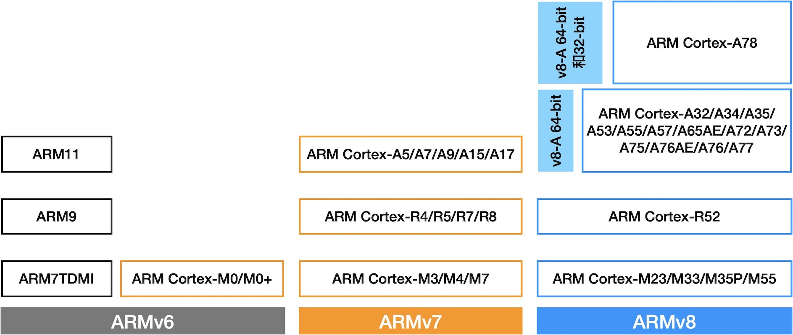

图2.1 ARM Cortex系列CPU的分类和型号

虽然ARM Cortex-M0和M0+两种微内核属于ARMv6版，但发布日期却在ARMv7之后，他们是综合ARMv7的存储器系统和编程模型等技术，支持Thumb-2指令集
并针对功耗做进一步优化之后的v6版体系架构。ARM Cortex-M3(v7-M)于2003年发布，而ARM Cortex-M0(v6)于2009年才发布，ARM Cortex-M0+与
ARM Cortex-M7都是2012年发布的微内核。采用ARM Cortex-M0和M0+微内核的MCU是目前最便宜的32位MCU，市场价格与8位MCU持平，性能远超8位MCU
且功耗更低。ARM公司使用ARM Cortex-M0和M0+两种微内核再次刷新“最精简的32位处理器”设计，两种微内核的内部功能(组件)框图分别如图2.2和图2.3所示。

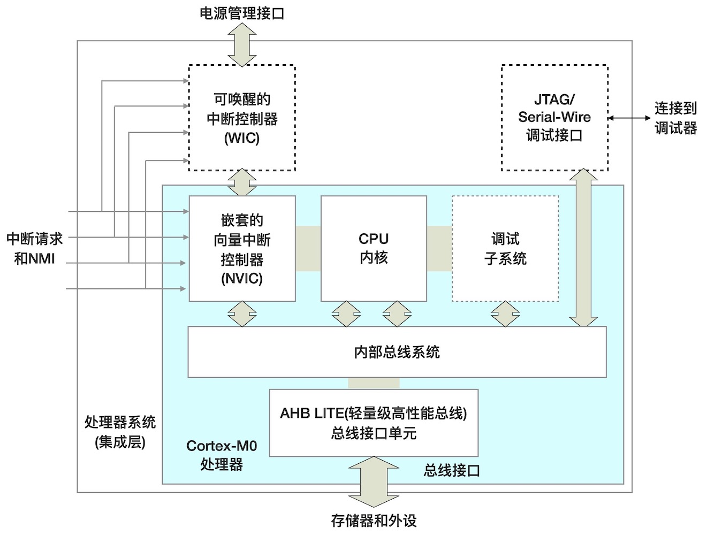

图2.2 ARM Cortex-M0的内部功能(组件)框图

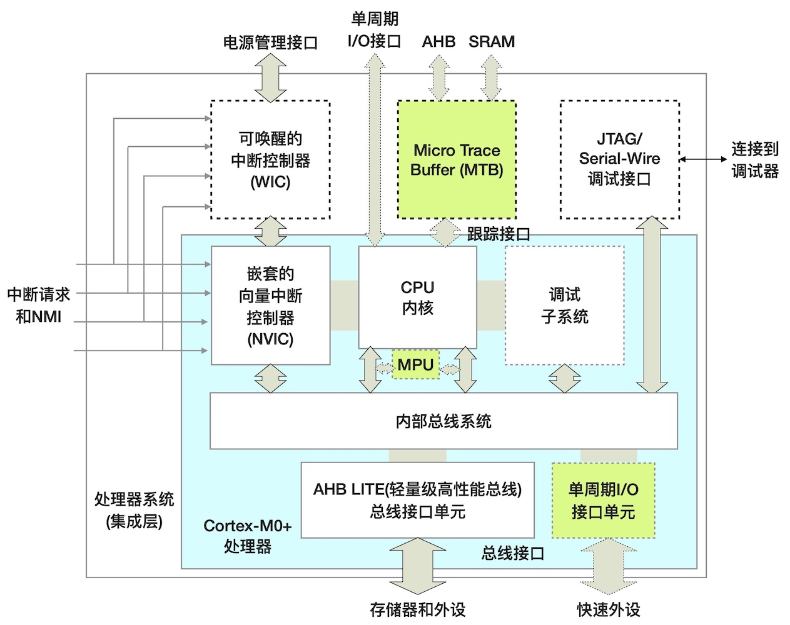

图2.3 ARM Cortex-M0+的内部功能(组件)框图

比较图2.2和图2.3不难发现，M0和M0+的区别很小，M0+支持单周期I/O及其接口，并增加软件调试的跟踪接口，而且这些都是可选择性的组件。显然，功能组件方面
M0+完全兼容M0。事实上，ARM Cortex-M0与ARM Cortex-M3的CPU内核都采用3级流水线(Pipeline)，而ARM Cortex-M0+的CPU内核却采用2级流水线，
因此M0+的动态功耗明显低于M0和M3。

.. Note:: CPU的流水线(Pipeline)技术

  CPU的流水线是一种加速程序运行过程的技术，将一条将指令分解为多步，并让连续多条指令的各步操作重叠，从而实现几条指令并行处理，以加速程序运行。
  保存在指令存储器中程序指令必须经过取指令(Fetch)、指令译码(Decode)和执行指令(Execute)三步，因此3级流水线是最简单的、最易实现的技术方案。
  ARM Cortex-M0和M3都是采用3级流水线技术，指令执行过程为：正在执行第n条指令时，第n+1条指令正好被译码，同时从指令存储器读取第n+2条指令。
  ARM Cortex-M0+的2级流水线技术是如何分解指令的执行步骤呢？如图2.4所示，2级流水线将一条指令的执行拆分为4步：取指令、预译码(Pre-decode)、
  主译码(Main-decode)和执行指令。ARM Cortex-M0+的2级流水线技术是在每一个时钟周期执行两步，从而形成2条指令的并行处理效果。3级以上的流水线
  仍保持3步的指令执行分解，但多级流水线很容易受跳转指令影响：当执行到跳转指令时，流水线上已经预取的和预译码的指令必须先清空并根据跳转指令的
  执行结果重新取指和译码。同时多级流水线需要更多的触发器单元从而增加CPU的动态功耗、CPU晶元的面积和封装体积。

  .. image:: ../_static/images/c2/arm_cortex-m0plus_2s_pipeline.jpg
    :scale: 30%
    :align: center

  图2.4 ARM Cortex-M0+的2级流水线

相较于ARM Cotex-M0/M0+体系架构不大于50MHz的CPU时钟速度，M3和M4的时钟速度可达200MHz，这就意味着适合于M3和M4微内核的存储器和I/O外设
必须具备与之匹配的访问速度。然而，必须注意半导体领域的“速度与成本始终保持单调的正比关系”！很多种外设的速度非常低的，如按钮和继电器切换速度仅仅是
数十毫米。高速CPU和低速外设之间的矛盾如何解决呢？半导体技术工程师使用总线桥技术很好地解决这一问题：CPU和存储器之间不仅采用高速总线还
增加Cache(高速缓存)单元，CPU与低速外设之间采用总线桥和低速外设总线，这样的总线桥隔离技术不仅能够保持CPU拥有高速时钟，并保持低速外设的低成本。

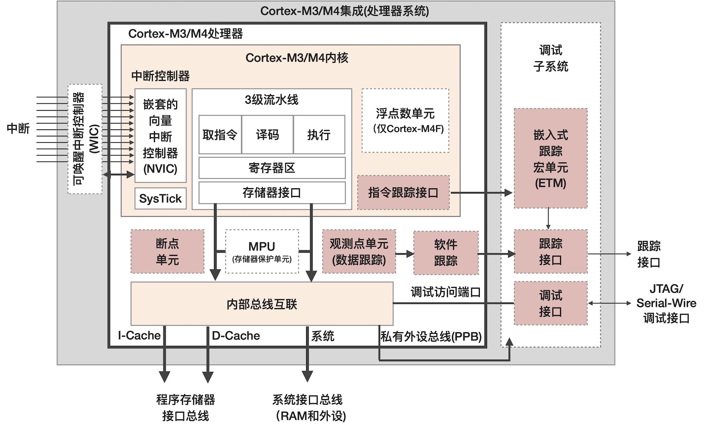

图2.5  ARM Cortex-M3/M4的内部功能(组件)框图

ARM Cortex-M3和M4微内核的内部功能(组件)如图2.5所示。与图2.3和图2.4相比，M3和M4微内核拥有更丰富的软件调试接口(断点、数据和指令观察点等)，
还具备专用的硬件浮点数处理单元，以及I-Cache(取指令专用的高速缓存)和D-Cache(访问数据存储器专用的高速缓存)单元。

截止2020年中期，ARM Cortex-M系列最高速度的微内核已高达1GHz，足以流畅运行Linux系统！详见NXP [6]_ 的i.MX RT系列微控制器产品页面的相关介绍。
NXP的i.MX RT1xxx微控制器采用ARM Cortex-M7微内核，图2.6给出该内核的简易功能(组件)框图。几乎已接近桌面计算机系统CPU速度的MCU完全归功于先进
的半导体工艺制程和紧耦合的存储器(TCM)技术。与ARM Cortex-M4F的单精度FPU相比，M7采用双精度的FPU以满足更高精度的计算需求。另外，M7的内部互联
总线和片上存储器的位宽度都达到64位，拓宽单次访问的位宽度也是提升吞吐量的一种有效方法。

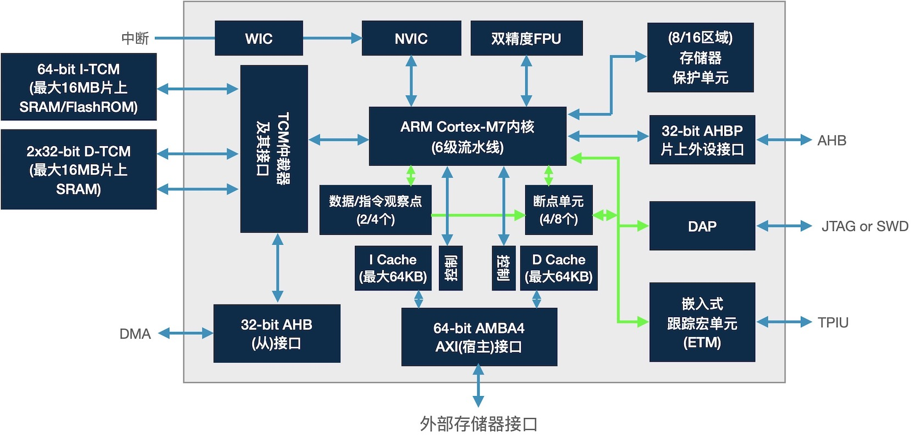

图2.6  ARM Cortex-M7的内部功能(组件)框图

对比ARM Cortex-M系列微内核的功能(组件)我们不难发现，多级流水线的32位CPU内核是必须组件，中断子系统(包括WIC和NVIC)和调试子系统也是必须
的组件，虽然内部互联总线也是必须的组件但随着CPU内核速度的增加而越来越复杂。存储器与CPU内核之间是否需要Cache仍取决于CPU的速度，存储器保护
单元(MPU)是绝大多数MCU的一种可选择组件。FPU是ARM Cortex-M4和M7两种微内核的可选组件，M4只能使用单精度的FPU而M7配备双精度的。

半导体制造商如何使用ARM授权制造具体的MCU产品呢？图2.7是ARM公司提供的使用ARM Cortex-M0+微内核的MCU设计示例。

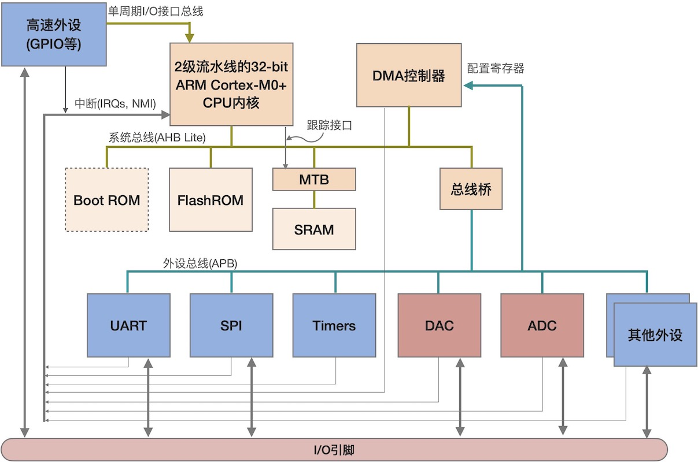

图2.7  使用ARM Cortex-M0+微内核的MCU内部结构

Microchip的SAMD21系列ARM Cortex-M0+ MCU的内部结构如图2.8所示。使用ARM Cortex-M4F微内核的Nordic的nRF52840的内部结构图2.9所示。

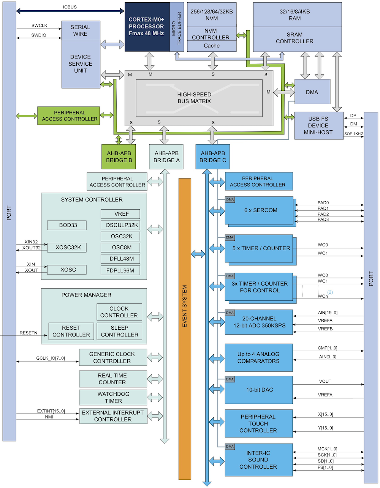

图2.8  Microchip的SAMD21系列MCU内部结构

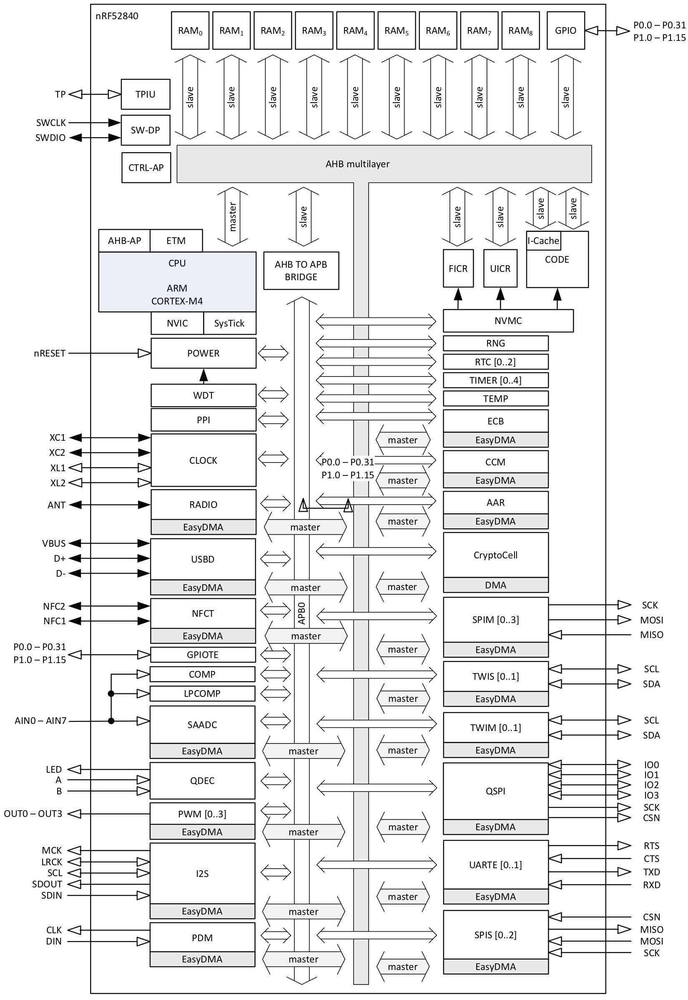

图2.9  Nordic的nRF52840内部结构

从这些MCU示例中可以清晰地看到ARM Cortex-M的CPU内核、DMA控制器、片上的ROM和SRAM存储器、片上的各种外设、调试接口等功能组件，以及连接
这些单元的内部总线系统(AHB、APB和总线桥等)。表明上看，nRF52840比SAMD21复杂很多，实际上的主要区别是片上外设的多少，以及CPU和存储器
之间的耦合方式。

------------------------

从低于50MHz到高达1GHz的ARM Cortex-M系列MCU，技术和成本等方面的差异非常大，ARM公司提供如此多样性的微内核之原生动力是为了满足多样性的嵌入式
计算机系统。使用时无存在感的穿戴类产品需要低工作电压和极低功耗的、低计算需求的MCU，嵌入式的机器视觉和机器听觉设备不仅需要低功耗更需要高性能
计算能力和浮点数处理能力。当我们仔细阅读ARM Cortex-A系列微处理器相关的历史演变和性能发展文档之后，一定会发现常规的性能提升和产品迭代，但微
内核的结构体系的变化并不大。但ARM Cortex-M系列微内核之间确存在极大的差异，究其原因是为了解决高速CPU、存储器、低速外设之间的矛盾问题(性能
和成本之间的折衷)。

此外，我们需要注意ARM Cortex-M系列微内核的MPU与普通的MMU(存储器管理单元)存在较大区别。MPU的基本原理是将系统的存储器分割为不同功能区域，
譬如code区、data区、prepherial区，通过配置MPU来管理这些存储区各自的起始地值和长度、读写权限，是否使用缓存和缓存方式(写通或写回)，是否
为可执行区等。MMU是用于CPU管理虚拟存储器和物理存储器的控制单元，MMU不仅为多线程和多用户系统提供存储分区的权限管理，还负责将虚拟地址映射到
物理地址。

------------------------

存储器系统是计算机系统的重要组成部分，MCU芯片内部的存储器大约占据晶元面积的1/4左右，成本方面占1/3左右，存储器系统的访问速度和访问方法也
严重影响MCU的整体性能。ARM Cortex-M系列微内核的存储器系统是如何组织？如何访问的呢？

ARM Cortex-M系列微内核的存储器采用扁平化管理，使用32位的地址总线宽度意味着整个存储空间共4G(即2^32)字节，片上或片外的全部程序存储器、
数据存储器和外设等都位于这4GB空间内。ARM公司将4GB空间简单地均分为8个区(每个区块的大小正好0.5GB)，并指定每个区块的主要用途、访问属性等。
如表2.1所示。

表2.1 ARM Cortex-M存储系统及其分区

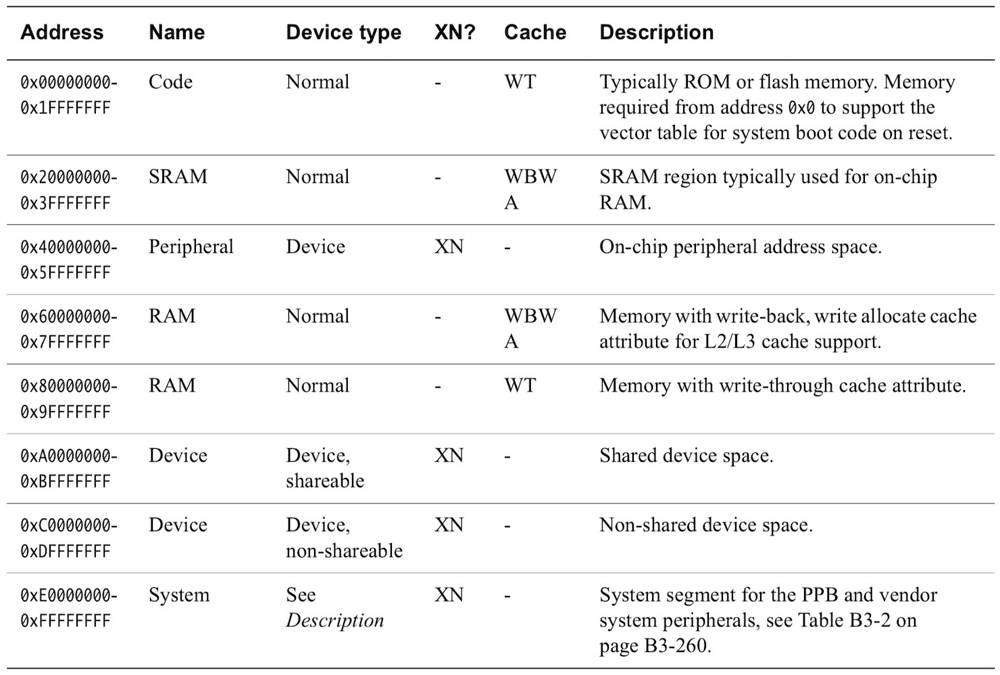

ARM Cortex-M系列微内核的扁平化管理方法将系统所有资源(包括存储器和外设)统一编址到4GB空间，且被粗略地分割为8个功能分区，外设的编程
控制和操作几乎与SRAM一样，这样既可以保持各被授权半导体厂商最大的产品设计自由度，并保持使用ARM体系架构的嵌入式系统软件的兼容性。
ARM体系架构之所以受到广泛认可，不只是其先进的32位微内核设计，合理的存储器系统组织和管理方法也是关键因素之一，受此影响的工具链、软件
库和中间件形成易用的软件生态环境大大地简化嵌入式系统开发。

ARM Cortex-M系列微内核中的特殊外设被ARM称作私有外设，如SysTick、NVIC、MPU、系统配置和状态、系统异常处理、系统调试和控制等。
访问和配置这些私有外设相关的地址空间可以控制ARM Cortex-M系统工作模式，从0xE000-0000开始的1MB空间被固定用于这些私有外设。

.. Note:: Cache的写属性

  表2.1中的Cache写属性使用简写字母WT、WBWA分别代表什么意思？WT(Write-Through)即直写，这是最简单的、最低效率的Cache写操作，
  存储器控制器直接将Cache块的内容写入片上存储器，这就意味着需要耗费内部总线流量；WB(Write-Back)即写回，这是一种更好的Cache写操作
  方案，WB是尽可能减少Cache到存储器的更新，仅当需要(如某个Cache块需要被占用)时才将Cache块内容更新到存储器中；WA(Write-Allocate)
  即写分配，存储器控制器首先加载存储器中的某些数据块到Cache中，写回Cache通常是写分配的。高速ARM Cortex-M的CPU内核使用WBWA属性的
  Cache访问SRAM。然而，直写Cache都是非写分配的。

此外，XN(eXecute Never)即一个存储分区是否允许执行。表2.1中的外设/设备区是不允许执行的，而ROM和RAM区都是允许执行的。ROM区通常用于
保存程序指令，被称作可执行区是很容易理解的。RAM区为什么允许执行呢？通常RAM的访问速度都大于ROM，从RAM区取指令的速度比ROM快，
但是RAM是易失性存储器(掉电即丢失数据)，需要系统每次启动时将ROM中的程序指令复制到RAM区，再从RAM区开始执行程序。从调试程序的角度，
我们可以将正在反复修改的程序直接写到RAM区并从RAM区执行程序不仅速度快，而且有利于节约ROM的写寿命。

计算机系统资源的“一切皆地址”，ARM Cortex-M系列微内核将系统的全部资源映射到4GB空间内，我们在编程时使用指令将某个输入外设的对应存储器
地址单元的内容加载到CPU内核的某个寄存器中，即外设的读操作，将CPU内核的某个寄存器内容更新到某个输出外设的对应存储器地址单元中，即外设
的写操作。ARM Cortex-M系列微内核属于典型的Load-Stroe架构类型，即任何操作都必须在CPU内核的寄存器间进行，而且所有外设都没有Cache，
任何的外设操作都被统一为Load(加载)和Store(存储)操作。

ARM Cortex-M的CPU内核中有多少个寄存器可用呢？仅有16个(物理上是17个)32位寄存器！分别称作R0, R1, .., R15。此外，ARM Cortex-M
还有几个特殊寄存器，包括3个程序状态寄存器、3个中断/异常屏蔽寄存器和1个控制寄存器。图图2.10所示。

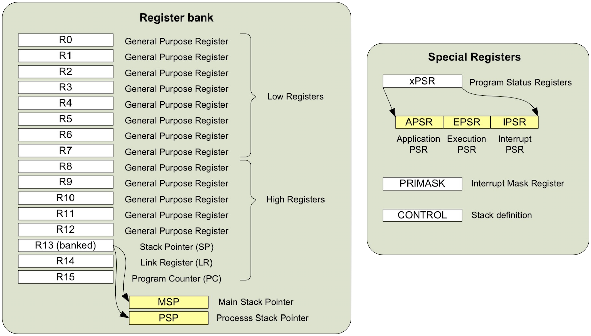

图2.10  ARM Cortex-M的寄存器

R0～R7可以被16位Thmub指令操作也可以被32位的ARM指令操作，但R8~R12只能由ARM指令操作。R13是堆栈指针寄存器，ARM Cortex-M在物理上有
两个堆栈指针寄存器：MSP(主堆栈指针)和PSP(进程堆栈指针)，任何时候R13到底对应物理上的那个寄存器由CONTROL(控制)寄存器所控制。两个堆栈
指针的结构是为了满足运行操作系统和用户进程的需要。R14是连接寄存器(LR)，用于存储子程序或函数的返回地址。R15是程序计数器(PC)，读R15将
得到“当前正在执行的指令存储地址+4”。

读取程序状态寄存器将会得到当前指令的执行结果，如是否溢出、是否进位等，设置控制寄存器将会改变系统CPU的执行模式，如启用FPU处理浮点数等。
关于ARM Cortex-M的详细寄存器介绍请参考 [7]_ 和 [8]_ 的相关章节内容。

-------------------------

与其他CPU体系架构相比，尤其CISC(复杂指令集的CPU)和哈佛结构的CPU，ARM Cortex-M系列的架构和系统资源管理更简洁，所以其指令集也更简单。
图2.11给出ARM Cortex-M支持的全部指令集。

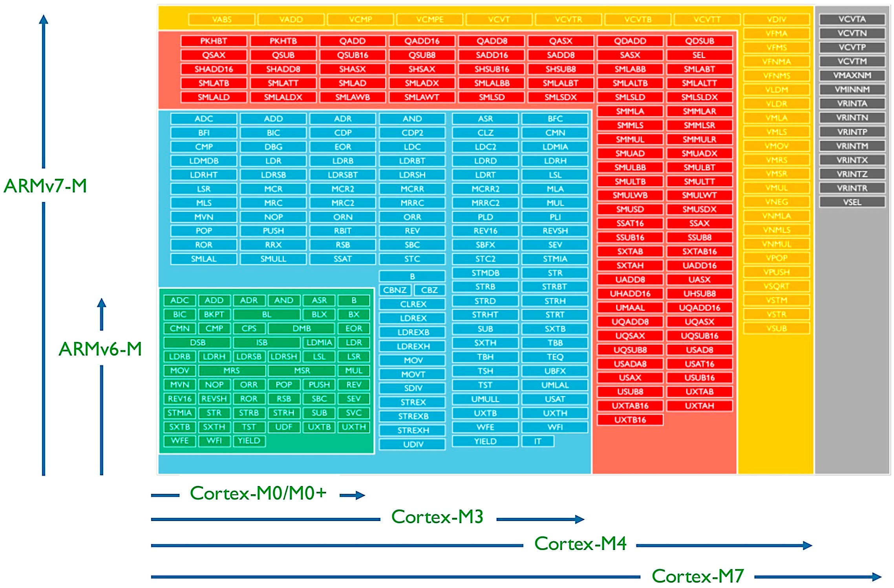

图2.11  ARM Cortex-M指令集(仅ARMv6和ARMv7-M)

上图中并不包括ARMv8-M支持的指令，如果需要查看这些指令，请参考“ARM Cortex-M入门”文档 [9]_ 。事实上，我们在使用ARM Cortex-M系列MCU
开发嵌入式系统的过程中并不会直接使用其指令集，C、Python等是最常用的嵌入式系统软件的编程语言。从指令集可以看出，ARM Cortex-M系列的不同
型号微内核之间是向下兼容的，如M0+的硬件无关的二进制代码能够直接在M3上执行。

所谓与硬件有关的代码是，某个特定的MCU的特定外设所使用的存储器地址空间与其他MCU很可能完全不同。硬件无关的代码，如数据处理算法(排序、查找)等，
只是对一段数据进行处理并给出结果。

-------------------------

为了更好地理解ARM Cortex-M体系架构，我们需要对其内部互联总线系统稍作了解。在本节前面的很多图中都能看到AHB、APB等总线，他们都属于AMBA标准。
AMBA(Advanced Microcontroller Bus Architecture)最初由ARM定义用于数字半导体产品设计，于1996年公开并成为半导体设计领域的一类片上组件
互联协议标准。AMBA标准已经被多次更新和迭代，如表2.2所示。

表2.2  AMBA标准总线协议类及其演变

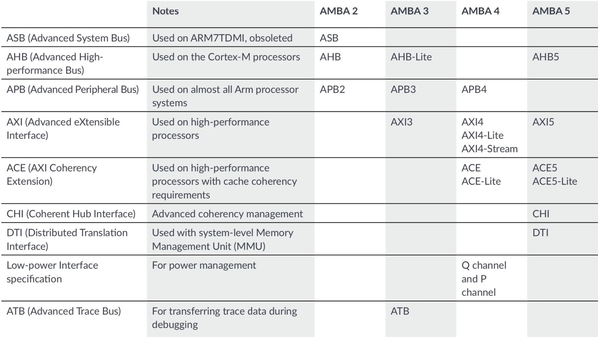

虽然AMBA只是应用于芯片内部的功能单元之间互联的总线，但与其他计算机系统总线并无本质区别，高速的、宽位的总线能够提供更高的数据吞吐量，
譬如AHB(先进的高性能)总线适合于CPU内核与存储器、CPU内核与USB等高速外设之间互联，APB(先进外设总线)总线组合AHB-APB桥用于将各类
外设间接地连接到CPU内核。就像桌面计算机的主板一样，CPU和Cache控制器通过北桥(并行数据总线桥)与DRAM互联，CPU通过南桥与各种不同速度的
外设互联。计算机主板上的各种总线都是一组物理上的信号线和电气的、时序的规范所定义，但MCU芯片内部的互联总线无法用肉眼观察到。

每一个MCU芯片都有若干个I/O引脚，极少数片上外设不需要引脚，如定时器等不需要占用芯片的外部引脚，其他外设都需要通过I/O引脚与MCU外部
的功能单元或电子元件连接。譬如，当某个嵌入式系统需要使用一种小型的LCD显示器时，我们必须占用MCU的几个I/O引脚和内部的SPI或I2C外设
接口将显示器电路单元CPU连接起来，然后编程将某些寄存器中的数据写入LCD显示器的RAM中，这样的接口电路设计实际上是将LCD的RAM写端口映射
到嵌入式系统的SPI或I2C外设的某个或某些存储器空间。我们将在第5章和第6章中学习这样的接口电路设计和存储器映射方法。

-------------------------

ARM体系架构是非常成熟的，与之相关的参考书非常多，如果需要深入了解ARM Cortex-M系列体系架构的片上系统(SoC)设计，推荐阅读 [10]_ 参考书，
本节的内容仅仅是对ARM Cortex-M系列微内核的体系架构的一种简要综述。

参考书 [7]_ 将帮助我们深入了解ARM Cortex-M0和M0+两种微内核的基本架构和原理，以及指令集、编程模式和软件设计相关的知识，
参考书 [8]_ 是关于ARM Cortex-M3和M4两种微内核的。

-------------------------

参考文献：
::

.. [1] www.arm.com
.. [2] www.microchip.com
.. [3] www.nxp.com
.. [4] www.st.com
.. [5] www.ti.com
.. [6] https://www.nxp.com/products/processors-and-microcontrollers/arm-microcontrollers/i-mx-rt-crossover-mcus:IMX-RT-SERIES
.. [7] Joseph Yiu, The Definitive Guide to ARM Cortex-M0 and Cortex-M0+ Processors (2nd-Edition), Elsevier, 2015
.. [8] Joseph Yiu, The Definitive Guide to ARM Cortex-M3 and Cortex-M4 Processors (3rd-Edition), Elsevier, 2013
.. [9] ARM Cortex-M for Beginners, https://community.arm.com/cfs-file/__key/communityserver-blogs-components-weblogfiles/00-00-00-37-85/Cortex_2D00_M-for-Beginners-_2D00_-2017_5F00_EN_5F00_v2.pdf
.. [10] Joseph Yiu, System-on-Chip Design with ARM Cortex-M processors, ARM Education Media, 2019

