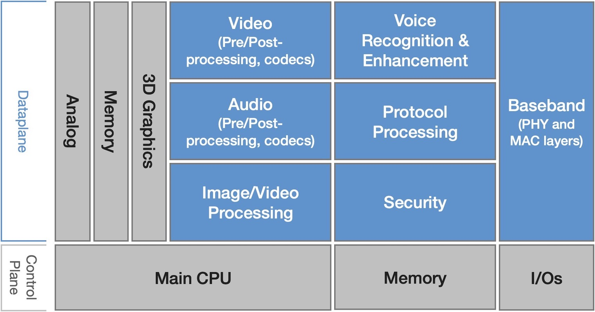
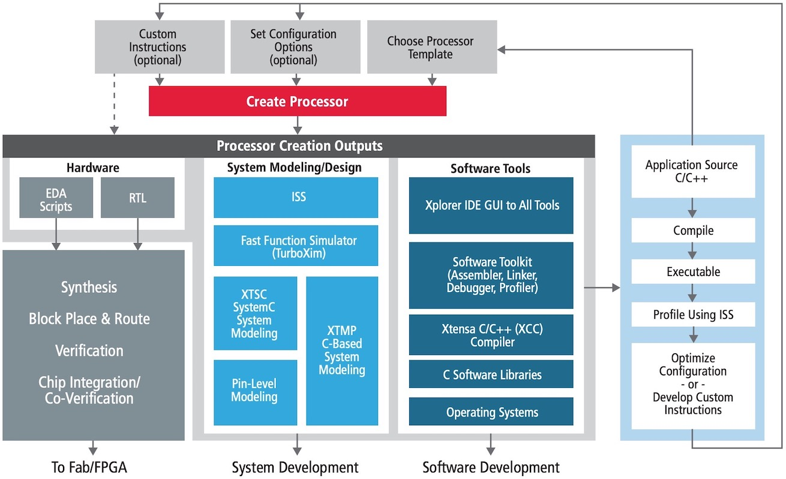
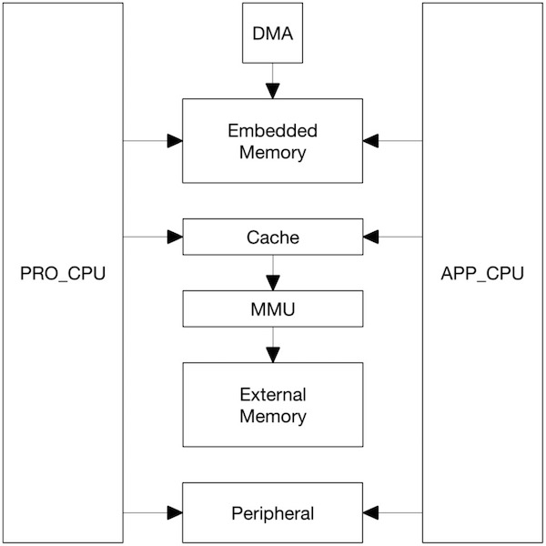
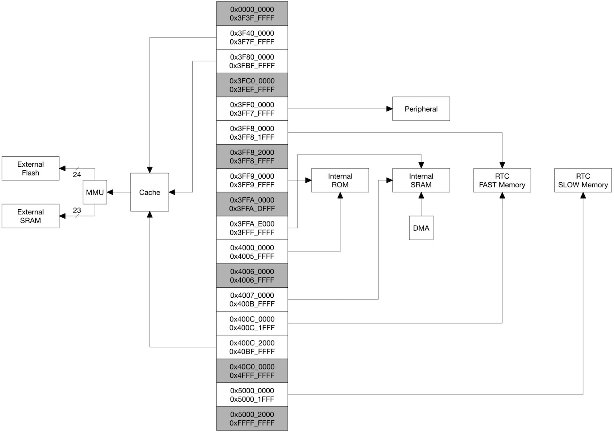
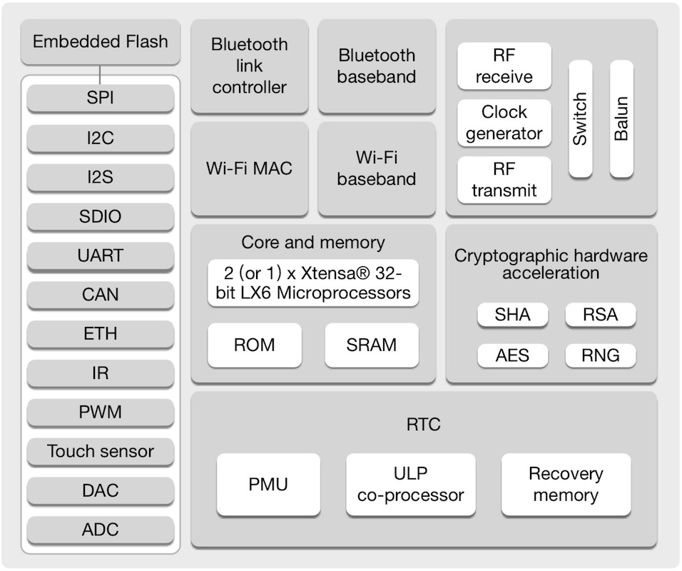

===========================
2.3 其他体系
===========================

ARM ISA和RISC-V ISA都是为了构建通用的微处理器。以32位微处理器为起点的ARM ISA后来引入16位Thumb指令集是一种打补丁方案以迎合市场需求的变化，
作为后来者的RISC-V ISA预留扩展指令和设计接口应对未来需求。据说，Intel x86 ISA的指令已经超过3600，指令数是该指令集在本世纪初期的12倍！
Intel x86 ISA是CISC(复杂指令集计算机)的典型代表，RISC(精简指令集计算机)的拥护者据此吐槽CISC。

计算机的数据处理量级将不断地增加，尤其大数据和多媒体类应用场景，SIMD(单指令多数据流)类指令意图提升数据吞吐量(加载更多数据到内核寄存器)确保
高速微处理器单次能够处理更多数据。然而，很多人已经发现这种被动解决方案并不理想，大量数据处理或专用算法应该交给专用硬件单元(或协处理器核)来
处理，于是GPU(图形处理单元)或NPU(神经网络处理单元)等大数据处理单元和深度学习单元已增加到微处理器内部。增加这些硬核不仅仅是增加晶元面积，
这些硬核单元与CPU内核、存储器、外设等单元之间的互联总线设计将越来越复杂，如何保障他们的协作效率是一个新问题。

Cadence作为三大半导体设计软件供应商(另外两家是Synopsys和Mentor Graphics)之一，早在十年前就已开始着手解决这一问题。从半导体设计角度，
问题本质是越来越复杂的需求和越来越复杂的系统引起设计成本越来越高。现在的Cadence不仅仅提供EDA软件，还提供Tensilica Xtensa内核IP [1]_ ，
以及HiFi音频/语音处理DSP、图像/视频处理DSP和ConnX类的基带DSP等硬核，用户可以根据自己的需求使用Cadence EDA工具自动生成订制化的芯片级
产品设计输出并可以直接交给半导体制造商或加载到FPGA。Cadence借助于自身的EDA工具优势，以及全新的“CPU+DPU”设计方案(如图2.16所示)，
目前已经有超过上千种基于Tensilica Xtensa内核IP的订制化的SoC(片上系统)用于电脑周边、手机、音视频设备、网络设备、存储设备、家庭娱乐等设备，
其中最具代表性的有AMD的显卡和声卡、EPSON和HP的打印机、Microsoft的MR设备——Hololens(混合现实的头戴式显示器)等。而且，全球诸多知名半导体
制造商都有使用Tensilica Xtensa内核IP，其中包括Intel、Boardcom、Sumsung等，以及华为海思、上海乐鑫等国内半导体公司 [2]_ 。

图2.16  Tensilica Xtensa内核IP的概念设计

Tensilica是1997年才成立的一间小公司，最初只是打算以ASIC(专用集成电路)为基础想用户提供可重构的微内核设计服务和对应软件工具设计服务，
2013年被Cadence以很高的溢价收购，其中关键的原因很可能是“可重构的微内核”设计理念，将该理念和现成的内核IP整合到EDA工具中成就全新的微处理器
设计方法，尤其对于那些需要订制化的、差异化微处理器的客户，这无异于是最佳的选择，从需求直接到产品输出大大地缩短微处理器芯片的研发周期，
加上专业级设计软件服务还能大大地降低失败风险。“Using and Customizing Tensilica Processors Is Easier Than You Think”是Cadence
的宣传口号。基于Tensilica Xtensa内核IP的订制化SoC产品的软硬件开发流程如图2.17所示。

图2.17  基于Tensilica Xtensa内核IP的SoC产品软硬件开发流程

通过上述内容我们初步了解CPU体系架构的变化趋势以及Cadence的应对方法。根据特定产品和市场需求，使用Tensilica Xtensa内核IP和Cadence的EDA
工具订制SoC，这显然是针对大批量产品的市场，如桌面打印机等。基于该IP的通用型SoC是什么样的？

最知名的Tensilica Xtensa内核的通用SoC是上海乐鑫的ESP8266系列和ESP32系列 [3]_ 。乐鑫于2014年发布的高集成度WiFi SoC——ESP8266至今还有大量应用，
他采用超低功耗的32位Tensilica L106内核，CPU时钟速度最高可达160MHz。ESP8266内置WiFi协议栈可将80%的处理能力留给用户程序，这正式Cadence的
DPU硬核和CPU内核协作达成的高效能目标。2016年9月发布的ESP32系列采用32位Tensilica Xtensa LX6双内核，CPU始终速度最高达240MHz，内置WiFi和
BlueTooth协议栈。ESP32的双核分别称作(用作)Pro-CPU(协议处理CPU)和App-CPU(应用处理CPU)，其系统结构示意图见图2.18。

图2.18  ESP32双核系统结构图

ESP32片上的和片外存储器以及外设都分布在两个CPU的数据总线和/或指令总线上，两个CPU的地址映射呈对称结构，即访问同一目标的地址是相同的，
每个CPU都具有4GB(32-bit)的地址空间，其中小于0x40000000的部分属于数据总线的地址范围，0x40000000~0x4FFFFFFF的部分属于指令总线的地址范围，
大于0x5000_0000的部分是数据总线与指令总线共用的地址范围。ESP32地址映射方法如图2.19所示。

图2.19  ESP32的地址映射

ESP32的片上存储器非常有限 [5]_ ，内部ROM仅448KB，内部SRAM 520KB，另外有2个8KB的RTC供电区的快速存储器和慢速存储器。如此有限的片上存储器资源
与ESP32的高性能和高集成度严重不匹配。这是为什么呢？或许是成本和市场价格因素，或许是留给用户根据需要自行添加。ESP32支持QSPI(四倍速SPI接口)外扩
FlashROM且最大容量达16MB，以及QSPI接口的PSRAM(伪静态RAM)最大容量达8MB。按需外扩能保持成本最优，但增加PCB面积。ESP32系列SoC的功能组件如图2.20所示。

图2.20  ESP32的功能组件

上图中可以看出部分ESP32仅为单核，但所有ESP32内部都带有一个超低功耗的协处理器(ULP co-processor)，他独立于主CPU，即使主处理器进入深睡眠(deep-sleep)
或掉电状态协处理器仍继续工作仅消耗系统极少电量(协处理器被布局在RTC供电区)，对于电池供电的系统来说这是非常有用的设计。

2019年7月底上海乐鑫发布最新一代的ESP32——ESP32-S2，相较于之前的ESP32系列他的最大变化是，采用7级流水线架构的32位Xtensa LX7单核，砍掉BlueTooth部分，
增加USB OTG、视觉传感和LCD外设接口，外设进一步压缩片上的ROM(128KB)和SRAM(320KB)，允许QSPI接口的外扩ROM和PSRAM最大容量达1GB。
该产品具体细节请查阅其规格说明书 [6]_ 和使用手册 [7]_ 。 值得注意的是，Xtensa LX7内核已属于VLIW(超长指令集架构)，采用Tensilica自有的FLIX(可变长度
指令扩展)技术达到并行操作的目的，Intel IA-64架构也属于VLIW，每个时钟周期可执行20条指令。Xtensa LX7内核的并行操作效果还没有具体的数据。

.. Note::  SoC、MCU、MPU、CPU

  我们把ESP32系列产品称作SoC，即片上系统，而不是MCU或CPU。这是为什么呢？望文生义就可以区分他们，虽然现今的MCU与SoC的界线已经非常模糊。请注意区分这些概念。

与ARM Cortex和RISC-V等相比，ESP32使用的可配置的Xtensa内核是非常小众，甚至有人认为是ESP8266和ESP32让Xtensa内核为外界所知，过去受Tensilica商业模式
的影响。ESP8266和ESP32系列的成功得益于乐鑫自主研发的软件平台——ESP-IDF，即ESP集成开发框架 [8]_ 。

-------------------------

MIPS体系架构的知名度非常高，由大名鼎鼎的John L. Hennessy教授主导设计(Tensilica公司的创始人——Chris Rowen也是MIPS的发起人之一)，全球很多家半导体公司
都有MIPS的授权，也包括我国的一些半导体研发结构和公司，如中科院计算所的龙芯、北京君正的X1000E等都属于MIPS架构，全球最大的MIPS系半导体公司是台湾的MTK
(联发科)。MIPS ISA是RISC类型的典范，主要作为32位MPU(微处理器)的内核使用。

IBM的POWER(Performance Optimization With Enhanced RISC)体系架构也是四大主流架构(x86、ARM、MIPS和POWER)之一，也属于RISC型，主要作为服务器、
网路设备的CPU和MPU的内核使用。

在嵌入式计算机系统领域，由于功能需求多样、价格高低差距极大，即便是ARM Cortex-M体系架构也仅占部分市场份额，即便是32位MCU已大行天下，却仍有很多种8位和
16位MCU产品在用。我们无法用少量文字就覆盖现有的CPU架构体系，尤其较老的架构体系不仅结构简单且资料多，甚至在很多半导体制造商的官网就可以很好地了解。

-------------------------

参考文献：
::

.. [1] https://ip.cadence.com/knowledgecenter/know-ten/dataplane-design
.. [2] https://ip.cadence.com/about/customer-profiles
.. [3] https://www.espressif.com/zh-hans/products/socs
.. [4] https://docs.espressif.com/projects/esp-idf/zh_CN/latest/esp32/index.html
.. [5] ESP32技术参考手册, https://www.espressif.com/sites/default/files/documentation/esp32_technical_reference_manual_cn.pdf
.. [6] ESP32-S2技术规格书, https://www.espressif.com/sites/default/files/documentation/esp32-s2_datasheet_cn.pdf
.. [7] ESP32-S2技术参考手册, https://www.espressif.com/sites/default/files/documentation/esp32-s2_technical_reference_manual_cn.pdf
.. [8] ESP-IDF编程指南, https://docs.espressif.com/projects/esp-idf/zh_CN/latest/esp32/index.html