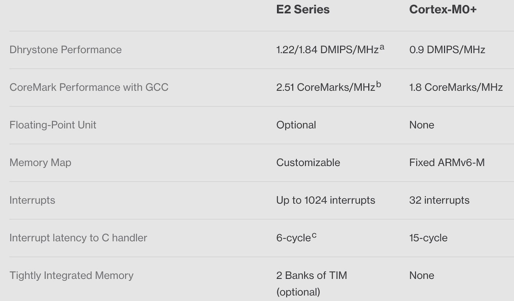

===========================
2.2 RISC-V体系
===========================

RISC-V是目前最热门的开源指令集架构，"-V"表示第5代。2010年，RISC-V始于美国加州大学伯克利分校并行计算机实验室(Parallel Computing Laboratory)
的David A. Patterson教授指导的团队 [1]_ ，并得到全球很多志愿者和从业者的贡献。开源，意味着任何人都可以自由地使用该指令集架构于任何目的而不必支付
任何费用。RISC-V架构诞生的时间较晚，而且经过很多从业者反复打磨，不仅适合于设计仓库级计算机系统CPU，也适合于个人移动设备的微处理器和嵌入式计算机
系统的MCU。与商业版的ARM Cortex、Intel x86等体系架构相比，开源和免费已经非常吸引诱人，单个体系架构就能适合多种应用场景更让RISC-V备受瞩目。

  .. Note:: 2017年图灵奖获得者

  RISC-V指令集架构由David A. Patterson主导设计，MIPS指令集架构由John L. Hennessy主导设计，两位分别来自加州大学伯克利分校
  和哈佛大学的教授还获得2017年度图灵奖。图灵奖被誉为计算机科学领域的诺贝尔奖，奖项的名称是为了纪念计算机科学的先驱——艾伦·图灵(英国)。
  两位教授不仅分别主导RISC-V和MIPS体系架构设计还时常合作著书，如 [2]_ 和 [3]_ 几乎是计算机科学领域必读的参考书、体系架构领域的Bible，
  也被很多大学的当作教材，[3]_ 的第5版分为三种，分别为MIPS版、RISC-V版和ARM版，计算机体系架构领域的两位大师合作研究计算机体系架构
  不断地追求更快的、更低功耗的RISC微处理器，并创建一套系统性的、量化的方法，他们的成果已经被学术界和工业界广泛应用。

RISC-V之前四代都是在David A. Patterson教授的主导之下，从上世纪80年代就已开始，一直以学术研究和教学为目的，直到2010年之后才进入高速发展阶段并进入商业应用。
虽然RISC-V现在炙手可热，但正式版的文献非常少，“The RISC-V Reader”的中文译本 [4]_ 算是最正式的指令集架构(ISA)指南性中文参考书，其第二作者——
Andrew Waterman不仅是首个RISC-V微处理器的设计者也是SiFive公司创始人。目前，SiFive已经推出E、S、U三个系列的RISC-V体系架构的商用微内核 [5]_ ，
E系列RISC-V微内核是32位的，主要面向低功耗的、低成本的嵌入式系统，该系列又分为2-、3/5-、7-子系，其中E20采用2级流水线仅使用13.5K个逻辑门。
SiFive的E2子系列明显对标ARM Cortex-M0/M0+系列，两者的性能对比如图2.12所示。

图2.12  SiFive RISC-V E2系列微内核与ARM Cortex-M0+系列微内核的性能对比

图中的“Dhrystone”和“CoreMark”分别是两种CPU运算能力测试标准软件，前者主要检验CPU的整数运算速度(每秒执行指令数)；后者是较综合的测试，让CPU执行
列表处理(排序、查找、插入和删除等)算法、矩阵运算和状态机等，然后给出综合得分。这些基准测试软件都是采用C语言编写的，测试前将C代码移植、编译到目标
CPU平台才能测试，这一过程可能会影响测试结果。

通过图2.12可以看出，SiFive的E2子系列的中断响应延迟明显小于ARM Cortex-M0+，而且支持更多个中断向量和中断请求源。E2子系列的存储器系统完全由
MCU制造商自行订制的，而M0+则必须遵照ARMv6的规则。

年轻的、开源的RISC-V体系架构如果必须与历史悠久的、非开源的商业ARM Cortex体系架构做对比，反而对ARM体系不公平！历史悠久的ARM体系一直是商用IP，
产品向后兼容是必须的，必然会带着一些今天看起来该甩掉的包袱。

开源的RISC-V指令集架构与ARM Cortex授权的IP存在很大的差异，甚至是两种不同层次的IP。SiFive的核心业务是使用开源的RISC-V指令集架构设计
出适合不同应用场景的微处理器IP并授权给半导体制造商，本质上与ARM公司业务区别很小。与SIFive业务极为相似的国内公司——芯来科技也已推出N、NX和UX
三个系列的RISC-V体系架构的商用微内核，在芯来科技官网 [6]_ 可以查阅到该公司的IP及其介绍。阿里巴巴旗下的平头哥半导体有限公司也采用RISC-V ISA
推出玄铁、无剑和含光等三个系列的面向IoT(嵌入式)和AI应用场景的IP。

以IP授权为业务核心的半导体设计公司相对较少，有数据显示全球已逾500家半导体制造商正在生产或研发RISC-V体系架构的半导体产品，人们都很期待开源的RISC ISA
能够像Linux那样在半导体领域创造辉煌。

-------------------------

RISC-V ISA并不是惟一的开源ISA，为什么RISC-V备受欢迎呢？我们需要了解RIAC-V ISA的指令集及其特点才能确定其原因。RISC-V ISA也有多个版本，
其中RV32I和RV64I分别32位和64位的RISC-V基础整数指令集，其他都属于可选择的扩展型指令集，如RV32E是面向嵌入式系统应用的扩展类型，RV32E仅有
16个寄存器而RV32I有32个寄存器(寄存器个数越少则CPU内核的实现成本越低)。RISC-V的开放性和可扩展性(且具有标准的扩展方式)是其核心竞争力之一。
通过预留的拓展方法保持RISC-V的性价比不断地提升以满足未来应用场景，已有自定义扩展指令的RISC-V微处理器可满足当下的深度学习和增强现实等应用。

图2.13是芯来科技推出的RISC-V体系架构的一种微内核——N200系列的功能组件图。图中的“扩展指令”单元是专门为订制化用户提供的设计接口(NICE IF)。

图2.13  RISC-V ISA的一种微内核实现的功能组件(芯来科技N200系列微内核)

ARM Cortex-M指令集包含32位的ARM32指令和16位的Thumb指令，后来增加的16位Thumb指令有利于提高代码密度(短指令仅使用16位编码)，同时增加使用难度。
RV32I仅有6类47条指令，而且所以指令都是32位长度，每一类指令即为一种指令格式。RV32I的6种格式指令分别是，用于寄存器-寄存器操作的R型指令，
用于短立即数和访存load操作的I型指令，用于访存store操作的S型指令，用于条件跳转操作的B型指令，用于长立即数的U型指令，用于无条件跳转的J型指令。
年轻的开源RISC-V ISA的指令简洁性很高，易用性也很高。今天我们使用任何体系架构的CPU都涉及(交叉的或非交叉的)工具链，使用指令集的难以程度将会
影响工具链的效率和输出代码的执行效率。此外，指令集越简洁则指令解码的实现成本越低，尤其在低成本低功耗的嵌入式系统领域的应用。指令集的简洁性、
易用性和低实现成本是RISC-V的核心优势之一。

无论RISC-V ISA多么简洁易用，但终究需要硬件设计来才能得到CPU实现。有人把RISC-V ISA比作是建筑设计的效果图或蓝图，把最终的CPU设计比作大厦的
建筑施工图，这是一种恰当的比拟。胡振波 [7]_ 的“手把手教你设计CPU: RISC-V处理器篇”是国内少有的CPU硬件设计参考书，由苏黎世联邦工学院和博洛尼亚
大学共同维护的开源项目——“lbex core” [8]_ 是非常完善的一个RISC-V ISA的具体实现，该项目的2级流水线CPU内核如图2.14所示。

图2.14  RISC-V ISA的一种CPU内核实现框图(lbex core)

将ISA变成具体的CPU实现需要使用硬件设计工具，譬如lbex core使用SystemVerilog作为设计工具。使用硬件描述语言(HDL)编程来实现数字集成电路和CPU
内核是重要工作，当然设计工具还必须支持仿真和模拟来验证设计，最后交给半导体制造商生产。SiFive、芯来科技、平头哥半导体等都是提供开源RISC-V ISA
的标准微内核和订制化的内核设计服务。再回来看ARM的两种IP授权模式：ARM Cortex ISA授权模式和ARM Cortex IP授权模式。开源的RISC-V ISA体系架构
只有设计IP授权模式。

值得一提的是著名硬盘供应商——美国的西部数据公司(WDC/Western Digital Corporation) [9]_ 通过CHIPS Alliance发布三种RISC-V体系的开源的
微内核设计 [10]_ ：EH1、EH2和EL2等，EH1和EH2分别采用单路和双路9级流水线且多方面的性能都超过ARM Cortex-A15，EL2是面向嵌入式系统应用场景。
按WDC的官方说法，这些开源的微内核不仅用于自家的各类硬盘等存储产品种，还会大量出现在其他家产品中。从WDC可以看出，开源的RISC-V ISA将有可能打破
Intel、ARM等商业微内核的垄断地位，更多企业将会基于此开源的ISA设计自主的微处理器用于自家产品，不仅有利于保护产品的知识产权，还能降低产品成本。

-------------------------

是否已有RISC-V体系架构的微处理器产品呢？有。如图2.15所示，这是一颗非常有趣的MCU芯片！支持RISC-V的RV32IMAC指令集(含M、A和C等3类扩展指令)，
采用芯来科技的2级可变长度流水线的N200系列微内核，由北京兆易创新推出的我国首颗RISC-V体系架构的MCU芯片。

图2.15  北京兆易创新的GD32VF103系列MCU的内部功能组件

如果将图2.15与前一节的图2.8(SMD21)和图2.9(nRF52840)对比，这三种MCU在功能组件和内部互联总线等方面极为相似，但高速外设USB的连接方法
略有区别：SAMD21系列和nRF52840的USB设备都是连接在APB上，而GD32VF103系列的USB直接与AHB连接。

显然，无论采用那种CPU架构体系，MCU的CPU内核(含中断控制器等)、片上数据和程序存储器、高速总线接口(含Cache等)、片上高速外设、低速外设总线接口(含总线桥)、
片上低速外设等必要组件及其互联总线都是存在的，如果采用开放的互联总线标准，最终这些MCU的区别都是一些小细节和外设的多少、I/O引脚的多少。

-------------------------

与历史悠久的、成熟的ARM Cortex ISA相比较，RISC ISA年轻、开放，但是从ISA到CPU微内核的具体实现还有很多设计工作，甚至还需要掌握半导体的制造
工艺才能设计出性能、功耗、价格等方面达到最优的MCU芯片产品。

任何CPU架构体系都需要软件生态的支持，包括工具链、中间件和软件库等，RISC-V体系的软件生态还很弱，需要更多从业者作出大量贡献才可能逐步成熟。

-------------------------

参考文献：
::

.. [1] https://riscv.org/
.. [2] 计算机体系结构：量化研究方法(第5版), John L. Hennessy, David A. Petterson著, 贾洪峰 译, 人们邮电出版社, 2013
.. [3] 计算机组成与设计：硬件/软件接口(第5版), David A. Petterson, John L. Hennessy著, 陈微 译, 机械工业出版社, 2018
.. [4] The RISC-V Reader, David A. Patterson & Andrew Waterman, Strawberry Canyon, 2017.9 (中文译本下载地址：http://riscvbook.com/chinese/RISC-V-Reader-Chinese-v2p1.pdf )
.. [5] https://www.sifive.com/risc-v-core-ip
.. [6] https://www.nucleisys.com/product.php
.. [7] 手把手教你设计CPU: RISC-V处理器篇, 胡振波, 人民邮电出版社, 2019
.. [8] https://ibex-core.readthedocs.io/en/latest/introduction.html
.. [9] https://www.westerndigital.com/company/innovations/risc-v
.. [10] https://github.com/chipsalliance
