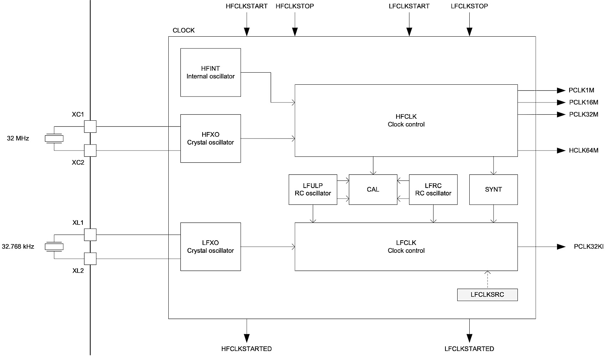
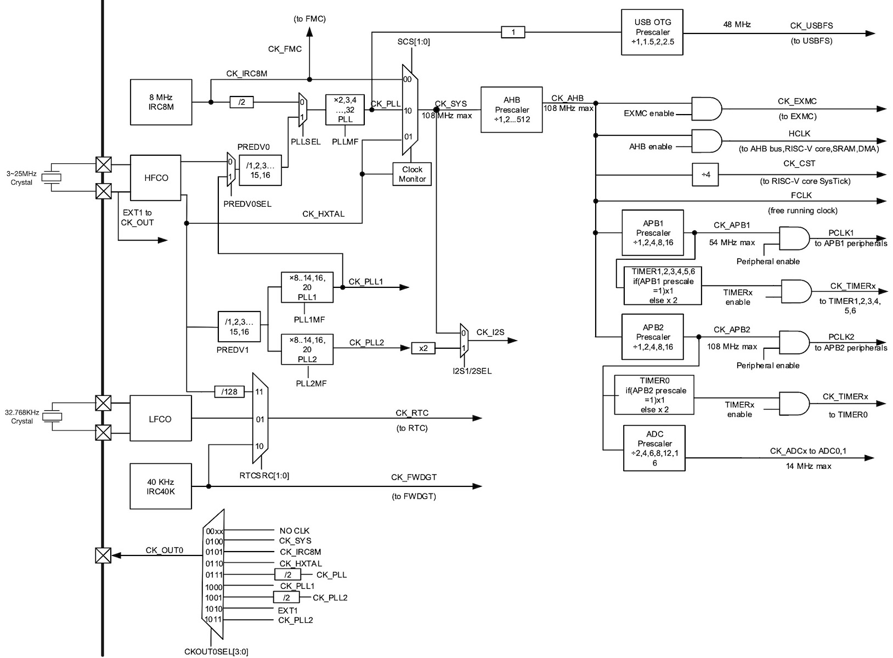

===========================
2.7 系统时钟与复位
===========================

系统时钟与复位是所有计算机系统中最基础的功能单元，两者都属于系统MCU的定位信号，他们确保系统MCU片上所有功能单元保持同步。本节首先了解嵌入式系统
MCU的片上和片外的复位源，以及不同复位源的复位效果，然后了解MCU的时钟源和时钟树，以及低功耗模式所需要的时钟门控等。

几乎所有MCU芯片都有一个专用的或复用的外部复位信号输入引脚，输入信号的有效电平取决具体MCU设计，而且有效电平的宽度(持续时间)也有具体要求。
务必注意，必须使用MCU的主时钟频率来度量“外部复位信号有效电平的宽度”。其原因在本节后面给予说明。

由于现代嵌入式系统的大多数MCU芯片内部都带有DC-DC单元为CPU内核、片上存储器或高速外设供电，DC-DC单元的输入电压会被监测以确保正常的工作电压范围，
这样的监测电路被称作片上电压监视器。当MCU的外部电源电压低于报警阈值时，片上电压监视器会产生“低供电电压报警信号”，或可当作中断请求信号；
当MCU的电压过低(称作复位阈值电压)可能造成DC-DC单元无法正常输出内核工作电压时，片上电压检测器将产生系统内部复位信号并持续到外部供电电压超出复位阈值。
显然，片上电压监视器也能产生“上电复位”效果(即冷复位)，当嵌入式系统上电时，MCU的外部供电电压有一定的爬升时间，在外部供电电压达到复位阈值电压前，
MCU一直处于复位状态。

MCU的片上看门狗定时器(Watchdog Timer)单元也会产生系统内部复位信号。嵌入式系统软件受某些因素(如软件Bug或寄存器值非法改变等)影响发生逻辑错误而陷入意外的死循环，
此时系统软件无法按预期的任务逻辑处理事务，片上看门狗定时器单元正是为了避免嵌入式系统软件陷入此状态，正常的任务逻辑必须在看门狗定时器溢出周期到达前
将定时器复位避免溢出，但系统软件陷入意外的死循环时不能给看门狗定时器复位，看门狗定时器溢出时产生复位信号将系统复位让系统退出意外状态。

并不是所有MCU都带有片上看门狗定时器单元，我们还有专用的外部看门狗定时器可用，但必须占用一个I/O引脚复位外部专用的看门狗定时器，外部看门狗定时器
产生的复位信号可以当作MCU的外部复位信号使用。

软件复位也是一种特殊的系统内部复位。一般的软件复位方法分两种：一种方法是使用指令集中专用的复位/重启指令；另一种方法是系统控制单元的某个寄存器写入
特定的值产生复位信号。两种方法都需要MCU的系统控制单元配备必要的硬件电路产生系统内部复位信号。

我们可以使用外部唤醒信号将处于深睡眠等低功耗状态的MCU唤醒，这种唤醒与外部复位完全不同，唤醒必须保持某些内部状态不变但确保CPU内核重新开始执行程序，
唤醒效果只是将CPU内核或其他相关片上外设复位。由于CPU内核被唤醒信号复位，所以我们将这一特殊过程称之为唤醒复位。

总之，除了唤醒复位之外，其余的系统复位不仅将CPU内核复位，同时将片上其他功能单元也复位。复位，意味着被复位的功能单元相关的存储器(尤其可读且可写的
功能寄存器)全部恢复到默认值。譬如，程序计数器(PC)被恢复到默认值意味着CPU内核将从这个默认值所指定的指令存储器单元开始取指令和执行指令。
复位后各内部功能单元的状态和相关存储器的默认值可通过半导体厂商提供的文档找到。

  .. Hint::  MCU的复位源

    - 外部复位

      - 复位引脚(与外部复位电路、复位按钮、看门狗定时器复位等连接)

    - 内部复位

      - 低电压复位 (Brownout Reset)
      - 上电复位 (Power On Reset)
      - 看门狗定时器复位 (Watchdog Reset)
      - 软件复位 (Software Reset/Reboot)
      - 唤醒复位 (Wakeup Reset)

注意，这里虽然列举出很多种复位源，但并不是所有MCU都支持这些复位。

-------------------------

嵌入式系统MCU的片上时钟功能单元使用内部的或外部的振荡器作为基础时钟源，为产生低功耗模式和片上RTC(日历时钟)的低频时钟信号，以及正常工作模式的高频时钟信号，
绝大多数MCU都支持两路基础时钟源：32.768KHz的低频振荡器(LFO)和数MHz的高频振荡器(HFO)。譬如，nRF52840的系统时钟如图2.30所示。

图2.30  nRF52840的系统时钟功能单元

上图左边的两种振荡器频率分别为32.768KHz和32MHz，nRF52840能够使用外部低频的和高频的振荡源与片上的晶体振荡器(Crystal Oscillator)电路结合
产生32.768KHz低频的和32MHz高频的基准时钟信号，也可以使用片上的精度较低的32.768KHz和64MHz内部RC振荡器产生两种基准时钟信号。内部低频时钟控制
电路将产生一个PCLK32KI时钟信号(稳定频率为32.768KHz)提供给系统内部功能单元；内部高频时钟控制电路使用基准时钟将产生4种不同频率的时钟信号：
HCLK64M、PCLK32M、PCLK16M、PCLK1M，其中HCLK64M的频率为64MHz当作CPU内核及其周边高速外设和存储器的工作时钟，该时钟信号带有门控电路在CPU内核
进入低功耗模式时将被关断，另外三种时钟信号的频率分别为32MHz、16MHz和1MHz，且都能用门控电路关断，这些时钟信号为片上外设单元提供基准时钟。

虽然时钟单元并不属于CPU内核体系架构的部分，但考虑到嵌入式系统所用MCU的CPU内核都需要考虑低功耗设计，MCU的片上时钟单元必须满足这一要求。
从nRF52840的多种频率的片上外设时钟信号可以看出，半导体设计师已经为不同用途和不同速度的外设准备好合适频率的时钟信号以确保系统每一个功能部件的
功耗都降到最低。

当系统上电复位期间，片上的低精度RC时钟自动开启并达到稳定为CPU内核执行Bootloader程序提供工作时钟，我们在Bootloader程序内配置或切换整个系统的时钟信号，
以及每一种片上外设的时钟信号。由于高精度的低温漂的石英晶体元件体积较大难以集成到芯半导体芯片内部，低精度的低成本的RC振荡器很容易集成，
当某些片上功能单元对时序要求很严格或对时钟频率要求很精确，如异步串行收发器所用的时钟频率不准确会引起较高误码率。所以，虽然有片上振荡器可用，
有些系统仍需要使用外部的高精度低温漂的振荡源。

对nRF52840来说，低速外设的时钟频率仅仅是CPU内核时钟频率的1/64，当系统复位信号同时将CPU内核和片上低速外设复位，复位信号的宽度必须不小于低速外设
时钟信号的一个周期。

为了方便对比，通过对比找出MCU系统时钟的共性和个性设计。图2.31给出RISC-V体系的MCU——GD32VF103的时钟树，这颗MCU芯片的时钟系统也采用片内RC振荡器，
以及片外低频的和高频的振荡器，要求低频振荡器的频率也是32.768KHz，高频振荡器频率可选择3~25MHz的某个值；片上RC振荡器的频率分别为40KHz和8MHz。

图2.31  GD32VF103的时钟树

为什么要求片外高精度低频振荡器频率为32.768KHz而不是40KHz呢？这跟数字分频器的实现原理有关，32.768KHz的基准时钟信号被32分频将能得到高精度的
秒时钟信号，从图2.31可以看出，GD32VF103的低频基准时钟信号仅有RTC使用。GD32VF103能够使用片上8MHz的RC振荡源或片外3~25MHz的振荡源产生108MHz
的高频主时钟，这需要使用锁相环(PLL)电路才能产生稳定频率的基准时钟信号，锁相环的特性归功于反馈(Feedback)的作用。

GD32VF103的主时钟CK_SYS的频率是可编程的，通过配置锁相环单元的控制参数即可。通过对CY_SYS信号分频得到最高频率达108MHz的CK_AHB时钟信号，
通过时钟门控提供给RISC-V微内核。换句话说，GD32VF103的RISC-V微内核的时钟是可以关闭的(进入低功耗工作模式)，而且时钟频率是可调节的。
使用更多种可编程分频器和时钟门控处理CK_AHB时钟信号为片上外设提供不同频率的基准工作时钟。

-------------------------

片上供电电源系统和时钟系统的设计是为满足嵌入式系统的低功耗和高计算性能等需求，各半导体厂商的设计略有区别，总体上设计理念和方法是相似的。

