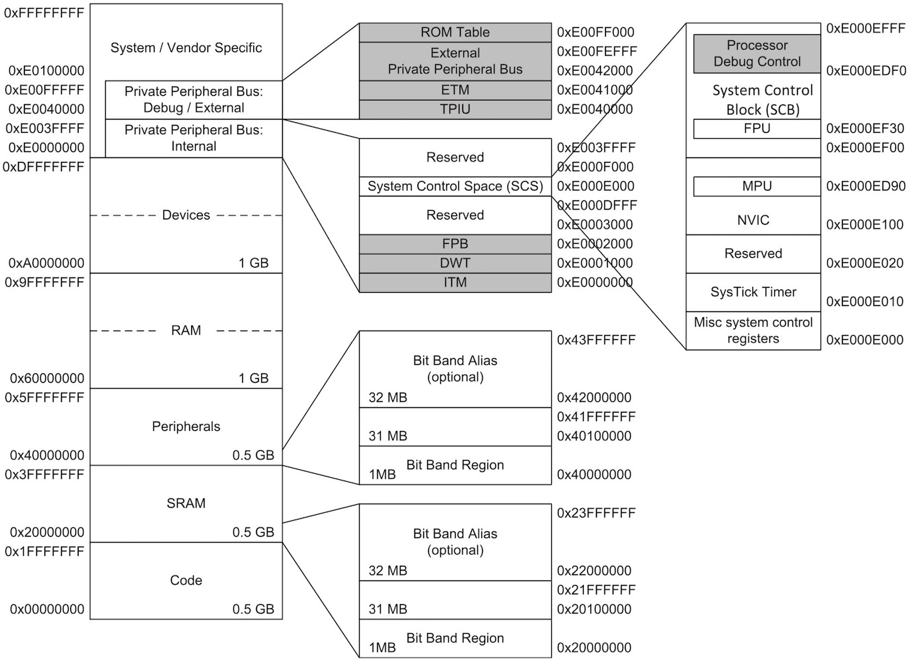
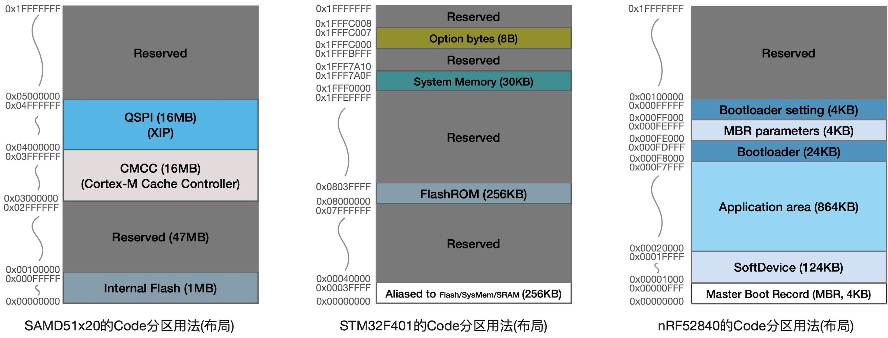
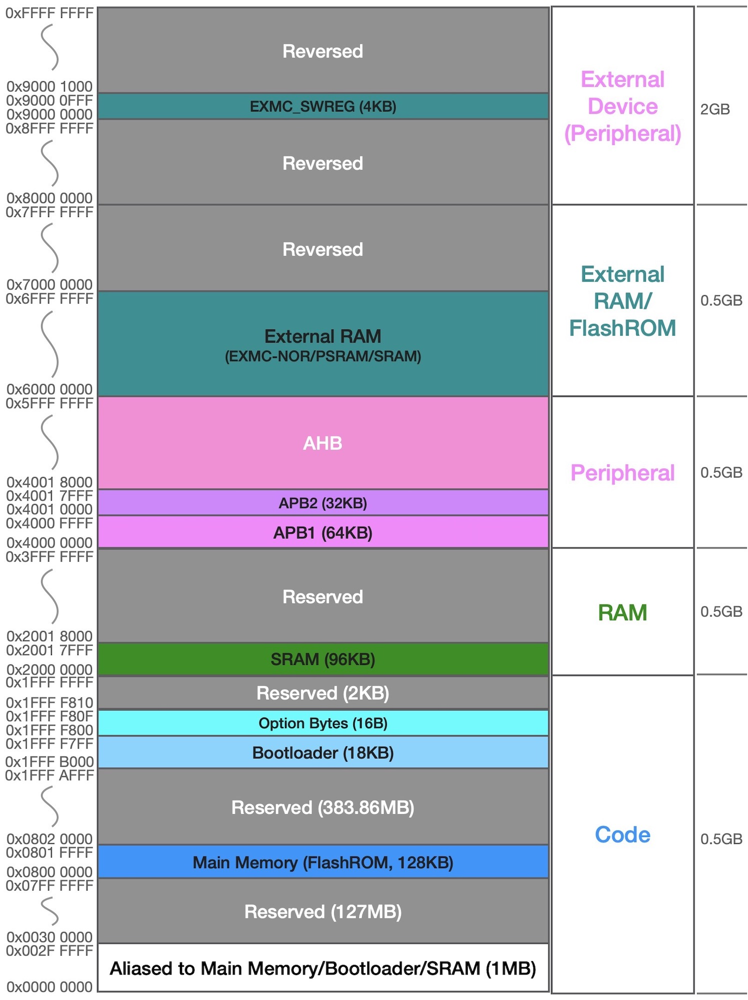

===========================
2.4 存储器系统
===========================

“一切皆地址”是计算机系统资源管理的基本规则，虽然RISC已经完全把内核中的寄存器完全独立并使用Ri这样的别名来访问，但CISC的内核寄存器不仅有别名也被分配独立地址。
“惟一地址”是区分计算机系统资源的基本规则。譬如，我们在程序中定义两个变量va和vb，编译器(属于工具链的一部分)会自动帮我们从计算机系统中确定两个不会有任何歧义的
存储单元来保存他们，没有歧义的意思是改变va时不会影响vb的值。你或许认为，这两个变量肯定在RAM/内存的某些单元。这个想法不准确，RAM/内存是计算机系统主存储器，
但不是惟一的。本节将了解嵌入式计算机系统的存储器及其映射规则。

--------------------------

我们在表2.1中认识过ARM Cortex-M体系架构的MCU必须遵循的存储器系统分区规则，ARM要求所有被授权设计和生产ARM Cortex-M半导体产品都必须使用32位地址总线宽度，
整个存储器系统为4GB(2^32个字节)容量并按照表2.1规定的功能分区使用，将系统的片上SRAM和FlashROM、片外扩展的SRAM和FlashROM、片上外设、片外扩展的外设等资源，
以及ARM Cortex-M系列微内核私有的外设资源(如SysTick、NVIC等)全部按功能分类映射到8个0.5GB的不同功能分区中，无论是访问变量还是访问某个I/O引脚(读其状态或
写/改变其状态)统一为访问4GB地址空间内的某些地址单元。这种统一的地址映射方法看起来简单粗暴，但是效益很高，尤其是软件编程方面。我们以ARM Cortex-M3/M4微内核
为例，图2.21给出其存储器映射规则。

图2.21  ARM Cortex-M3/M4系列MCU的存储器系统映射规则

连接在ARM Cortex-M3/M4微内核的私有总线上的内部外设和调试接口被固定映射到0xE00000000~0xE0FF000(共1020KB)地址空间，这其中的4KB地址空间(从0xE000E000开始)
是系统控制单元专用的，包括SysTick、NVIC、MPU、FPU等。SysTick是一个专用的定时器，我们可以对其进行配置(溢出周期、溢出中断请求等)为系统软件提供时间基准，
向NVIC的相关地址单元写入特定值即可允许或禁止CPU内核响应某些中断请求，通过对MPU的配置可以设置软件对特定存储区域的访问权限，FPU是Cortex-M4选用的浮点数处理单元，
通过对其相关存储单元进行配置以启用/停用FPU等。

除了ARM Cortex-M私有的外设之外，其他片上外设都是由半导体设计师定义的，也都被分配有专用的地址空间，用软件编程访问(读/写)这些空间的地址单元即可实现对外设的操作。

考虑到ARM Cortex-M3/M4所面向的嵌入式系统应用领域需要单个二进制位的操作，如控制某个I/O引脚上连接的LED指示灯的亮/灭，SRAM分区和片上外设分区的前1MB地址空间
的每一个二进制位都是可以单独访问的，为此专门分配32MB空间用作位带别名区(Bit Band Alias)以确保访问这些二进制位仍使用相同的32位地址总线。当然，位带别名区是
可选的地址映射方案，这意味着不是所有的ARM Cortex-M3和M4系列MCU都支持这样的二进制位访问方法。

ARM规定的存储器系统分区映射规则是粗线条的，留给半导体设计师们很大的灵活性。下面对比三种不同半导体厂家的、同属ARM Cortex-M4系列MCU的Code分区具体用法(布局)，
如图2.22所示。三种MCU型号分别为SAMD51x20、STM32F401、nRF52840，分别来自Microchip(Atmel)、ST、Nordic，他们都使用ARM Cortex-M4微内核，CPU的最高
时钟速度分别为120MHz、80MHz、64MHz。

图2.22  三种ARM Cortex-M4系列MCU的Code区使用

虽然ARM为Cortex-M4系列MCU预留0.5GB地址空间的Code分区，地址范围为0x00000000~0x1FFFFFFF，但是实际MCU芯片的片上FlashROM容量没有超过2MB的！上图中的三种
MCU的片上FlashROM容量分别为1MB(SAMD51x20)、256KB（STM32F401)和1MB(nRF52840)，他们的容量与0.5GB相比不足1/500。既然ARM留给半导体设计师足够大的灵活性，
各半导体厂商的产品设计师们可以大展拳脚来演绎自己对MCU应用系统设计的理念。

SAMD51x20将Code分区的前80MB分割为4各部分：1MB FlashROM从起始地址开始，然后将前48MB的其余空间保留(未来可能会设计更大容量FlashROM时再用)，接着的16MB用于
Cache控制器，剩下的16MB留给QSPI接口扩展的外部FlashROM。整个Code分区都属于可执行指令区，这意味着SAMD51x20可以直接从片外扩展的QSPI接口的FlashROM中取指令
并执行指令，即该MCU支持片外扩展的16MB的QSPI接口FlashROM。

STM32F401是ST公司ARM Cortex-M4系列MCU产品中最低配的，仅有256KB片上FlashROM且被分配在Code分区的0x08000000~0x0803FFFF地址空间，另外还有一个30KB的专用
FlashROM区——System Memory被分配在0x1FFFFFFF~0x1FFF7A0F地址空间，以及仅有8各字节的电源电源检测和看门狗定时器等复位控制单元的配置信息被分配在0x1FFFC000~
0x1FFFC007地址空间。其中System Memory区30KB FlashROM专门用于存储Bootloader程序，关于Bootloader的内容将在第3章专门介绍。值得注意的是，STM32F401的
Code分区最前面的256KB别名区，这是一个非物理存储器区，与Cortex-M3/M4的位带别名区的用法相似，访问Code分区的这个别名区时根据MCU的Boot引脚电平来决定对应的物理
存储器分区，具体细节参加第3章的内容。

Nordic(位于挪威特隆赫姆市)是一家以BlueTooth、ZigBee等无线通讯解决方案见长的半导体公司，为保护知识产权该公司的BlueTooth协议栈以二进制库的形式提供给客户使用，
图2.22中占用124KB的SoftDevice就是BlueTooth协议栈的二进制库被固定分配在0x00001000~0x0001FFF地址空间。nRF52840总共有1MB片上FlashROM，被固定分配在
0x00000000~0x000FFFFF地址空间，其中最前面的4KB用于存放主引导区记录(MBR)信息，接着是124KB的BlueTooth二进制库，然后就是864KB的用户/应用程序区，
接着是24KB的Bootloader程序区，最后的两个4KB分别用于存放MBR和Bootloader的参数。

仅从三种MCU的Code分区用法不能说那种更好。SAMD51x20的Code分区用法最简单明了，还给嵌入式系统工程师预留最大灵活性，可以没有Bootloader，最大程序存储空间达16+1MB，
可以自行任意分割这17MB存储空间的用法；STM32F401的Code分区中固定30KB空间独立用于Bootloader或其他功能，他与256KB主FlashROM相互独立；Nordic设计师把nRF52840
的1MB FlashROM的功能分区切割得非常详细，如果有兴趣了解其后背的目的，可以查阅Nordic的DFU(设备固件升级)相关文档。

ARM Cortex-M4的片上RAM分区和两个片外RAM分区(总计1.5GB也都属于XIP)的用法相对简单，但是仍有很大的灵活性。ARM Cortex-M4的片上外设分区和两个片外外设分区
(总计1.5GB)分配给分别连接在AHB和APB上的各种外设使用。

--------------------------

采用RISC-V ISA的MCU的存储器系统和映射规则并没有统一的规定，而是完全由设计师来确定。首先来看一看北京兆易创新和芯来科技的设计师是如何定义GD32VF103这颗RISC-V
ISA MCU的存储器系统及其映射规则，如图2.23所示。GD32VF103采用32位宽度的地址总线，与ARM Cortex-M系列MCU相同都有4GB存储空间。

图2.23  一种RISC-V ISA MCU(GD32VF103)的存储器系统映射

通过对比图2.21、图2.22和图2.23可以看出，GD32VF103的存储器映射规则与ARM Cortex-M系列相似，尤其最前面的2GB地址空间。

--------------------------

Linux社区流行的“一切皆文件”是Linux OS开发和应用编程的一条“军规”，“一切皆地址”是计算机系统资源管理的“军规”。本节仅仅从嵌入式系统全局角度来存储器系统及其
映射规则，以及Code分区的用法示例，没有涉及32位嵌入式计算机存储器系统的(大/小)端模式、(字/半字/字节的)对齐和非对齐访问规则、存储器分区属性和访问权限、
存储器分区的重映射和重定位等概念。

具体的ARM Cortex-M系列MCU的存储器系统

--------------------------

参考文献：
::

.. [1] http://www.gd32mcu.com/cn/product/risc
