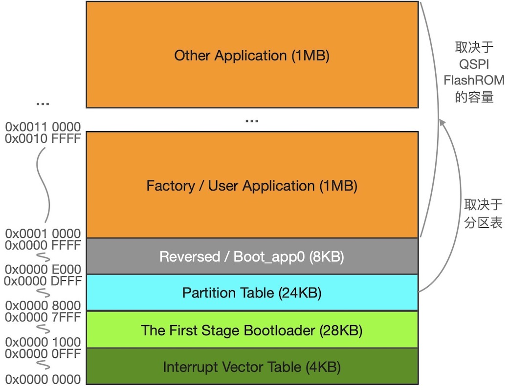

===========================
2.5 系统的工作模式
===========================

当我们打开桌面计算机系统电源或按下复位按钮之后，大多数情况只是等待OS启动完毕才能继续其他操作，偶尔需要按几个组合键进入特殊的状态，譬如进入BIOS配置状态。
绝大多数现代嵌入式计算机系统也有相似的启动过程，但是正常情况下的启动速度几乎“秒杀”桌面计算机。本节我们将从嵌入式系统通电或复位后开始了解系统的工作状态和工作模式。
虽然细节方面与桌面计算机的启动过程有很大区别，但是工作模式方面却很相似。

嵌入式系统主程序是否带有OS的角度，本节内容包含两种嵌入式系统：带有OS的系统和无OS系统。带有OS的嵌入式系统CPU如何执行OS和应用程序/线程呢？

我们给嵌入式系统通电或复位之后CPU立即开始执行程序。这里有问题：第一条指令在哪个地址空间呢？一旦开始执行指令，CPU的行为或程序的执行结果由编程者事先确定，
甚至将产生可遇见的结果/效果。另一个问题是：OS启动前编程者应该安排CPU做哪些工作？无OS的嵌入式系统在进入主程序之前CPU又应该做哪些工作呢？

嵌入式系统CPU的工作状态和工作模式如图2.25所示，总体上分为2种状态：调试状态和执行指令状态。调试状态是借助于专用的Debug工具，如JTAG工具和Trace工具等，
可以通过设置断点、单步等方法暂停CPU执行指令，并使用调试工具获取CPU内寄存器值和存储器值(含变量和外设)等帮助程序开发者掌握系统内部状态。程序开发者可以
借助于Debug工具强制终止系统CPU停止执行指令或继续执行指令。

现代的嵌入式系统CPU几乎都支持标准JTAG或兼容的调试工具，虽然大多数简单的嵌入式系统软硬件开发并不必需这样的调试步骤，但是这些调试工具都有一种最基本的功能：
固件下载。嵌入式系统软件开发需要经历代码编辑、交叉编译和下载过程，其中下载过程常常使用Debug工具。

图2.25  嵌入式系统CPU的工作状态和工作模式

调试状态仅仅是嵌入式软硬件开发阶段才需要的。抛开调试状态，在正常的指令执行状态中，绝大多数嵌入式系统CPU包含两个工作阶段：引导阶段和正常运行(主程序)阶段。

引导阶段的程序被称作“Bootloader”，这一小片程序将执行一些必要的硬件单元初始化操作，如RAM初始化操作、外部ROM存储器接口初始化操作等，为执行主程序做好准备工作。
在Bootloader，嵌入式系统CPU可能处于两种工作模式：特权的线程模式和异常处理模式。“特权的线程”指的是，这个期间可以用指令访问系统内所有资源。“异常处理”包括软件
和硬件异常、中断请求响应等，除以零是典型的软件异常，非法访问某些存储地址将导致硬件异常。在异常处理模式，绝大多数都是执行中断服务程序响应系统的中断请求，
所有嵌入式系统的软件开发者都会尽可能避免软件或硬件异常，但“万一出现的异常”必须被正确地处理否则将导致系统出现不可预测的行为。为了降低固件下载成本，
部分Bootloader还有DFU(Device Firmware Update)功能以取代专用调试器的程序下载功能，当然这必须借助于专用的DFU软件的支持。譬如，ESP32的Bootloader可以
使用芯片的UART(通用异步收发器)与桌面计算机的ESP-Tools软件连接下载固件，STM32M401和nRF52840的Bootloader都可以直接使用芯片的USB端口与桌面计算机的DFU
软件工具连接下载固件。

如果在执行Bootloader程序阶段无需更新固件则直接开始执行嵌入式系统的主程序。对于无OS的主程序，嵌入式系统CPU分为两个工作模式/状态：特权的线程模式和异常处理模式。
带有OS的主程序，嵌入式系统CPU分为三种工作模式/状态：特权的线程模式、无特权的线程模式和异常处理模式。特权的线程指的是OS，非特权的线程一般是普通应用程序/线程，
两者的主要区别是允许OS访问系统的全部资源而普通应用程序/线程只能访问属于本线程的资源，普通应用程序/线程需要访问系统其他资源时必须借助于OS的某些接口(即API)才行。

图2.25是以ARM Cortex-M系列微内核的MCU为例来说明CPU的工作模式，而RISC-V体系架构的CPU将特权模式和非特权模式分别称作“机器模式(M mode)”和“用户模式(U mode)”，
并增加一种叫做“监督模式(S mode)”，对于嵌入式系统来说只需要RISC-V体系架构的M mode和U mode，如果同时支持三种模式能够实现Unix型OS。

无论名称怎么取，嵌入式系统CPU能够在多种模式下执行指令主要目的是系统资源访问权限管理和资源保护，非特权的模式或用户模式都是为了限制这个模式下CPU执行指令(或用户
程序)的行为。譬如，两个用户线程都会向显示器内存写入数据，如果出现同时向同一地址写入不同数据会出现什么样的结果？原则上带有OS的嵌入式系统软件的系统资源都由OS访问，
CPU在执行用户应用程序/非特权的线程时不能直接访问系统资源，只能借助于OS。

--------------------------

当嵌入式系统上电或复位后，Bootloader阶段是可选择的，最简单的无OS嵌入式系统CPU只需要一些初始化操作之后立即就进入特权的线程模式，当发生异常或中断时则根据当时的条件
执行异常处理或中断服务程序，然后返回特权的线程模式。图2.25种所有虚线框的部分都是可选择的。那么如何选择进入或不进入Bootloader呢？支持可先泽进入或不进入Bootloader的
MCU一般都带有Booting选项控制引脚，譬如ESP32的GPIO0和GPIO2引脚、STM32F401的Boot0和Boot1引脚等都是专用于Booting。这种MCU的上电或复位期间将会把Booting选项
控制引脚的状态保存下来，复位完成后将根据这些引脚状态确定是否进入Bootloader。

ESP32、STM32F401、GD32VF103等三种特殊MCU的引导选项及复位期间的控制引脚状态之间关系见图2.26所示。STM32F401和GD32VF103两种MCU的Code分区的前1MB地址空间
是片上主闪存(Main Memory)、系统存储器(即Bootloader)和SRAM的别名区，复位期间Boot1和Boot0两个引脚的状态决定复位后的别名区与三种物理存储器种的一个对齐，
并从对应的物理存储器开始取指令。ARM Cortex-M系列微内核的CPU被复位后，其程序计数器(PC，即R15)的值从Code分区0x00000004地址单元加载(务必注意，是将Code分区
的这个地址单元内容加载到PC)，这一设计很容易从硬件设计上实现按配置从指定区域开始执行程序。这一点，GD32VF103几乎与ARM Cortex-M系列微内核的CPU完全一致。

然而，ESP32的引导过程却更复杂。严格地说，ESP32的Bootloader有两种：DFU Bootloader和正常启动的初始化操作的Bootloader。DFU Bootloader在半导体生产过程
种就已固化在Internal ROM中，芯片上电或复位后将根据GPIO0和GPIO2两个引导选项控制引脚在复位期间的状态确定是否进入这个Bootloader，一旦启动这个Bootloader则
等待ESP-Tools软件与之通讯，并将最新版DFU Bootloader下载带Internal SRAM中然后重新初始化UART端口并与ESP-Tools软件通讯下载程序(或更新固件)。如果复位时
GPIO0为高电平，复位后将开始正常启动的初始化操作，首先初始化QSPI接口并从QSPI FlashROM的0x00001000地址单元开始加载程序到ISRAM(指令SRAM)中，这一阶段的
Bootlaoder程序也是固化在片内ROM(用户不能修改)，然后从ISRAM中执行这个Bootloader开始加载分区表并根据分区表确定主程序的初始地址，最后从这一地址开始取指令
即启动主程序。更详细的ESP32引导过程和初始化操作请参加上海乐鑫的官方论坛 [1]_ 和相关文档。关于DFU Bootloader与ESP-Tools软件之间的通讯协议详见 [2]_ 。
从QSPI FlashROM的0x00001000地址单元开始所加载的并从ISRAM中执行的Bootloader是用户可编程的，虽然加载分区表、定位主程序首地址等初始化操作是这个Bootloader
的默认功能，用户可以增加一些系统必需的其他初始化操作。注意，此处所用的地址编码仅仅是FlashROM芯片从0地址开始的，与ESP32的4GB地址空间编码无关，图2.26给出
ESP32通过QSPI外扩的NOR型FlashROM存储器的分区细节，最前面的64KB已经被乐鑫详细地定义，其他存储单元的用法和分区容量由用户通过分区表来指定。

图2.26  ESP32外扩的QSPI FlashROM存储器分区

前面的内容中，我们多次将ESP32称作SoC而不是MCU，主要因为ESP32的片上功能远超一般的MCU芯片，包括双核、MPU和MMU等。带有MMU(存储器管理单元)的计算机系统支持
虚拟内存和物理内存之间映射所以能够运行Linux/Unix型OS。ESP32片外扩展的容量达16MB的FlashROM被映射到0x400C2000~0x40BFFFFF(仅11MB)地址空间，实际是
由MMU来完成的。

前面以ESP32、STM32F401、GD32VF103等三种MCU的引导选项及控制引脚之间关系说明从Bootloader到嵌入式系统主程序的启动过程，这些过程适合SAMD51和nRF52840吗?
事实上，SAMD51、nRF52840和STM32F401都是ARM Cortex-M4F为CPU内核的MCU芯片，但是他们的Code分区设计存在明显的差异：SAMD51和nRF52840的Code分区的最前面
1MB是主闪存，但STM32F401 Code分区最前面的1MB则是3个物理存储器分区(其中一个分区就是Bootloader)的别名区，如图2.22所示。这意味着，SAMD51和nRF52840是否
需要Bootloader完全取决于嵌入式系统的软件设计。

--------------------------

综上所述，嵌入式系统从上电或复位直到用户主程序启动，期间的经历由半导体设计师和嵌入式系统的软硬件设计师来确定，包括固件更新Bootloader、初始化操作Bootloader等。
是否启动并进入Bootloader的方法基本都是以复位期间某些Booting选项控制引脚的状态来决定，每一种特定MCU都有专用的/复用的Booting控制引脚，硬件设计师将根据这些特性
设计Booting电路单元方便快速进入Bootloader。

--------------------------

参考文献：
::

.. [1] https://esp32.com/viewtopic.php?f=25&t=8030 
.. [2] https://github.com/espressif/esptool/wiki/Serial-Protocol
