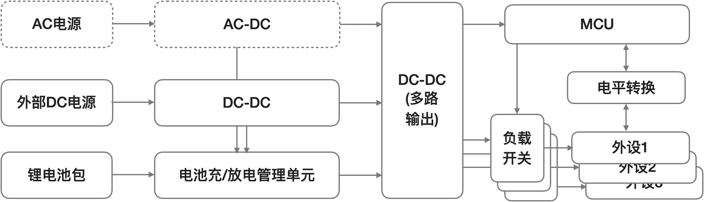
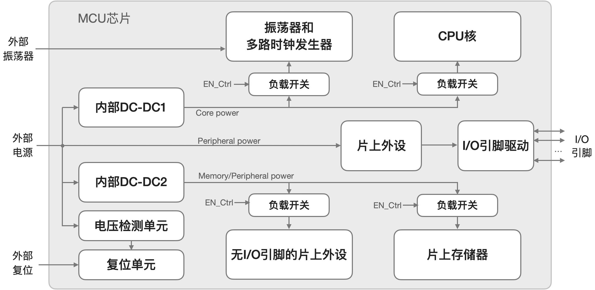
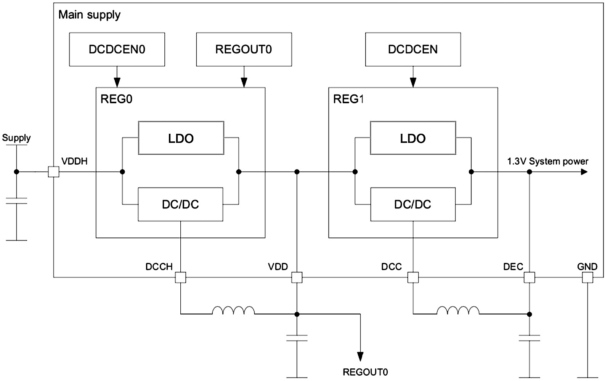

===========================
2.6 系统的电源
===========================

低功耗是嵌入式系统最主要的追求目标之一，尤其电池供电应用场景中的产品功耗是最重要的指标。CPU时钟速度越高动态功耗越大，CPU速度越高则必须有与之匹配的高速存储器，
高速存储器也会增加功耗，为保持嵌入式系统的计算能力和功耗之间的平衡，MCU的半导体设计阶段就确保CPU支持正常/全速工作模式和多种低功耗工作模式，譬如睡眠模式和深度睡眠模式；
让CPU极短时间内高速运行待事务处理完毕后立即进入长时间睡眠，这是从软件设计角度降低功耗的一种方法；CPU进入睡眠之前关闭大功耗外设的电源，这是从系统硬件电路设计
角度降低功耗的一种方法。

从半导体设计角度降低系统功耗的方法有很多种，除了CPU的低功耗模式外还有多路块状时钟控制、状态维持的电源控制、可唤醒中断的中断控制器等方法，Joseph Yiu [1]_ 
使用一章(第6章)的篇幅来介绍ARM Cortex-M系列MCU在半导体设计阶段如何优化功耗。

本节将了解嵌入式系统MCU的供电电源和低功耗设计，并了解电源域、DC-DC变换、负载开关等概念。现代嵌入式计算机系统的供电电源输入范围非常宽，如单节电池仅1.5V供电、
3V纽扣电池供电、单节/多节锂电池供电等低压可变的电源，再如使用USB 5V供电、工业12V或24V电源供电、48V通讯电源供电等等，但是绝大多数MCU及片外扩展的存储器和外设
等电子元件都需要稳定的3V或5V电源，嵌入式系统的PCB板上必须带有DC-DC或AC-DC变换电路单元，能够将宽输入的供电电源变换成稳定的可供MCU及其外设工作的电源。
嵌入式系统的供电电源拓扑如图2.27所示。
DC-DC变换指的是，将一种/一定范围的输入电压变换为某种稳定的电压输出且满足设定的功率，包括降压型和升压型DC-DC，以及线性变换或开关变换两种DC-DC。AC-DC变换指的是，
将交流输入电压通过整流、降压等变换能够输出设定功率的稳定直流电压。这些系统级电源设计非常重要但不是本节重点，我们的重点是MCU的供电电源设计和降低功耗的方法。

图2.27  嵌入式系统电源拓扑

当我们让嵌入式系统CPU进入睡眠或深睡眠的低功耗模式之前必须控制负载开关切断系统外设的电源才能达到降低系统功耗之目的，如果外设的供电电压是多种类型(如1.8V、
2.75V、3.3V、5V等都是常用的外设工作电压)则必须使用多路负载开关来分别控制每一个外设的电压开关。这样的供电电源设计称作多电源域，各个电源域的工作电压和功率不同，
而且有独立的负载开关控制。这种电源域设计也常用于MCU芯片内部，用于控制片上外设电源开关。MCU片内的电源拓扑如图2.28所示。

图2.28  嵌入式系统MCU片内电源拓扑

降低高速CPU动态功耗的有效方法之一是，降低CPU核工作电压，譬如STM32F401的CPU核仅有1.2V，由于CPU核与片上存储器之间的连接信号密度较大(如32位地址总线和
32位数据总线)，必须降低片上存储器的工作电压以简化接口。然而片上外设，尤其使用I/O引脚的片上外设则与外部供电电源电压保持一致。当CPU进入(轻)睡眠模式时，
CPU将停止工作，但必须使用状态维持的电源控制(State retention power gating)技术确保CPU内部寄存器内容维持不变，片上振荡器、存储器和外设仍继续工作，
被中断唤醒后将立即继续工作。当CPU进入深睡眠模式时，不仅CPU完全掉电工作，振荡器和片上外设全部停止工作，仅片上SRAM数据仍保留，被外部中断或复位唤醒后将
花费更长时间重新开始工作。很显然，(轻)睡眠的功耗远大于深睡眠。

除了片上内建的多路DC-DC输出分别为CPU内核、时钟发生器单元、片上存储器、片上外设等功能单元独立供电外，还可以根据CPU的低功耗模式切断这个单元的供电和状态维持
电源，而且每一个功能单元的时钟频率也是可编程和独立控制的。MCU片上的多电源域和多时钟域设计，实现各域独立供电电源和维持电源及其开关控制，以及各域独立的
可编程时钟频率和开关控制都是为了优化性能域功耗之比达到最大。

下面我们来了解一种特定MCU芯片的片上供电电源，如图2.29所示。nRF52840能够在很宽范围的外部电源(DC2.5V～5V)条件下无需外部DC-DC器件即可为系统供电，
因为该MCU片上有2个串级的DC-DC单元(可独立编程工作在线性模式或开关模式)，第一级DC-DC的输出电压可编程为1.8V~3.3V可为片上外设和片外扩展的外设供电，
第二级DC-DC输出1.3V固定电压为CPU核和片上存储器供电。

图2.29  nRF52840片上的供电电源

如果使用nRF52840片上的开关模式DC-DC则必须使用外部功率电感和电容，这些分离元件很难集成到芯片内部。在GD32VF103的片内功能单元图(图2.15)中可以看出，
这个RISC-V体系架构的CPU内核工作电压仅1.2V，外设工作电压与器件的VDD一致。

-------------------------

如何平衡嵌入式系统的低功耗和高速CPU时钟之间的矛盾，涉及MCU半导体设计和系统软硬件设计等阶段的工作，本节主要了解MCU的低功耗模式，以及配合低功耗模式
所需要的片上供电电源拓扑。

-------------------------

参考文献：
::

.. [1] Joseph Yiu, System-on-Chip Design with ARM Cortex-M processors, ARM Education Media, 2019

