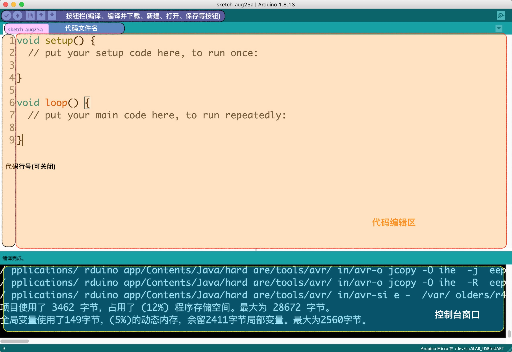
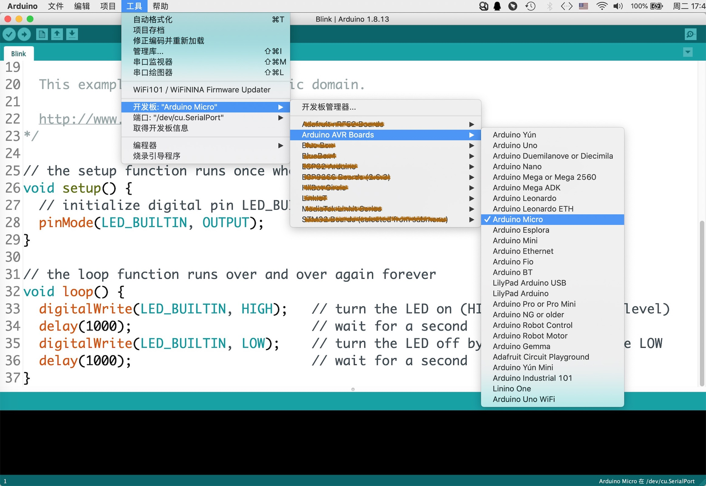
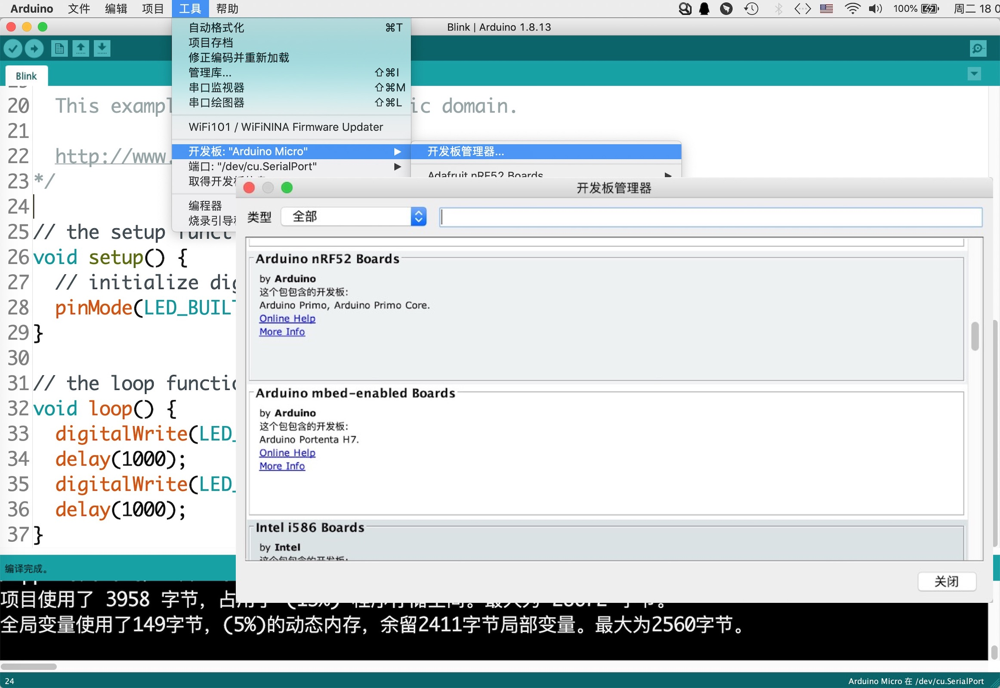
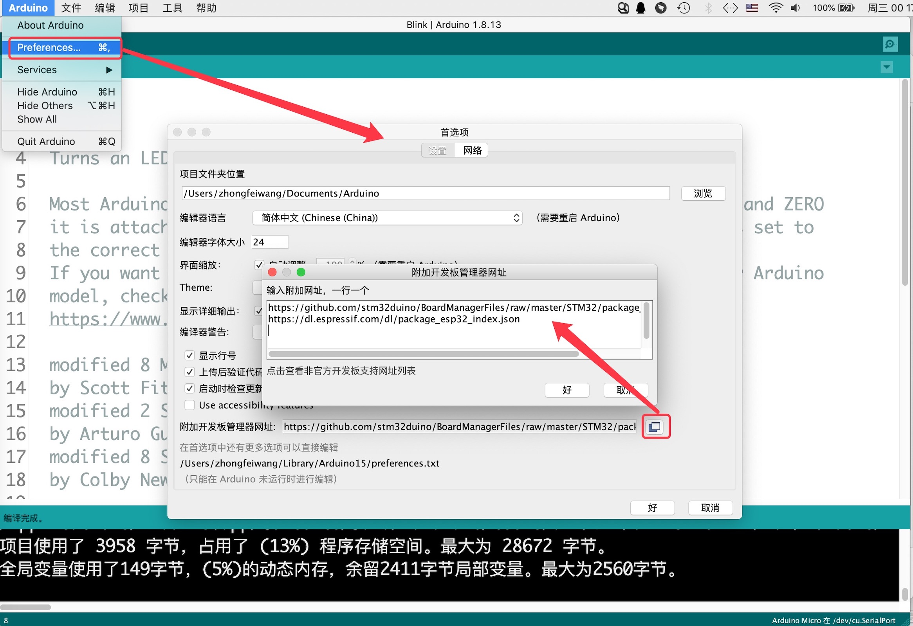
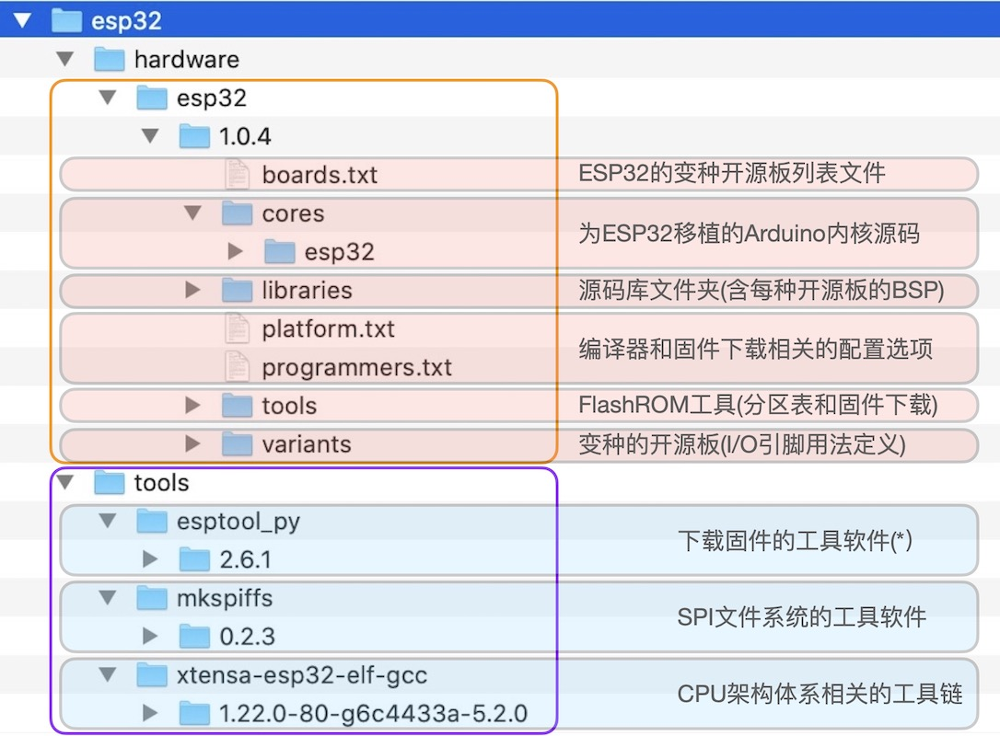
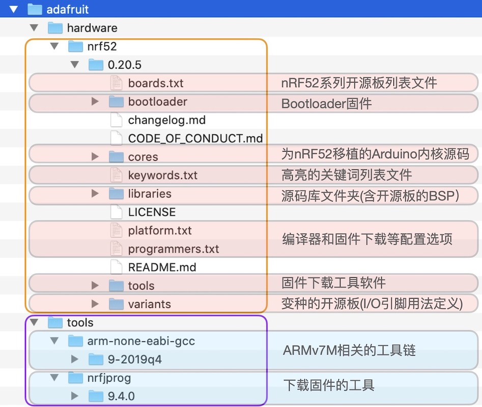
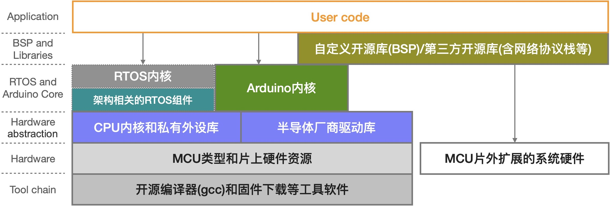

===========================
3.4 Arduino IDE
===========================

现在的Arduino已是开源(Open Source)的代名词，Arduino是全球最大的电子和编程开源社区。截止目前，Linux是最成功的开源OS，Arduino是最成功的嵌入式软硬件开发平台，
Python是当下最流行的开源编程语言。

Arduino [1]_ 自称使用“Arduino编程语言”。事实上，Arduino使用C/C++语言，并增加一些内部函数。Arduino编程语言的详细说明请参考 [2]_ 页面。
与标准C/C++编程语言相比，Arduino编程语言针对嵌入式系统的应用开发不仅增加一些硬件相关的内部函数、数据类型和常数。

当我们提到Arduino时，大多数情况指的都是“Arduino IDE”和“兼容Arduino IDE的开源板”，前者是一种嵌入式系统软件开发平台，后者是一类嵌入式系统硬件。
目前Arduino社区支持8位的AVR系列MCU(来自Atmel)，以及32位的ARM Cortex-M系列和ESP系列MCU。安装Arduino IDE时，Arduino官方的AVR系列开源板BSP
(板级支持包)软件、内部函数和AVR的工具链(编译器等)，其他系列开源板的BSP软件和相关工具链可以在运行时安装。具体的安装步骤将在下一节内容中给出，本节我们首先了解
Arduino IDE的基本功能和使用流程，以及兼容Arduino的开源板的一些特性。

--------------------------

Arduino IDE的主界面如图3.16所示，代码编辑区和控制台占据大部分窗口，IDE软件顶部是菜单栏和快捷按钮区。Arduino IDE的控制台和代码编辑区的大小是可以改变的，
将鼠标悬停的两个区域的分界线处，当鼠标符号变为上下箭头时即可拖动两个区域的边界线以改变两个区域的大小。

图3.16  Arduino IDE主界面

与专业级IDE相比，Arduino IDE没有项目文件树、寄存器和断点等信息窗口，但是Arduino的软件项目仍支持多个源文件，并采用标签窗口来管理多个源文件。
首次打开Arduino IDE将会看到默认的Arduino程序，如下：

.. code-block::  c
  :linenos:

  void setup() {
    // put your setup code here, to run once:

  }

  void loop() {
    // put your main code here, to run repeatedly:

  }

这个默认的Arduino程序由两个部分组成：初始化部分(setup()函数)和主循环部分(loop()函数)，如果按照C/C++的习惯，应该有“main()”函数，
他们与“main()”函数什么关系呢？事实上，在Arduino软件项目都包含有一个与MCU类型(硬件资源)相关的Arduino内核软件包，其中有一个名叫“main.cpp”
的源码程序，标准C/C++要求的“main()”函数就在这个源文件中被定义，而且“setup()”和“loop()”两个函数就在这里被调用。当系统通电或执行复位之后，
“setup()”，即初始化函数中的程序语句仅执行一次；“loop()”中的程序语句将会循环执行。表面上看起来与C/C++程序有区别，譬如下面的程序代码：

.. code-block::  c
  :linenos:

  void setup() {
    // put your setup code here, to run once:
    pinMode(LED_BUILTIN, OUTPUT);
  }

  void loop() {
    // put your main code here, to run repeatedly:
    digitalWrite(LED_BUILTIN, HIGH);  // turn the LED on (HIGH is the voltage level)
    delay(500);                       // wait for half second
    digitalWrite(LED_BUILTIN, LOW);   // turn the LED off by making the voltage LOW
    delay(500);                       // wait for half second
  }

本质上，这两个函数已经在“main.cpp”文件中的“main()”函数中被调用，如果打开该文件我们会发现，“main()”函数中调用“setup()”之前还有其他的函数被调用，
譬如系统硬件时钟初始化、RTOS初始化等，这样的程序结构有利于降低使用者的难度，开发者可以把某些跟MCU底层硬件相关的或跟RTOS相关的初始化工作全部安排妥当，
然后再调用“setup()”按使用者意图执行初始化。

上面示例代码的初始化程序仅一个语句，即设置“LED_BUILTIN”这个可编程I/O引脚为“OUTPUT”模式。主循环中的4个程序语句分别有注释，即设置“LED_BUILTIN”引脚为高电平，
然后延时500ms，再将“LED_BUILTIN”引脚设为低电平，再延时500ms。由于主循环“loop()”内的程序语句被无条件地循环执行，所以这个程序的执行效果是完全可以想象的。

如果你已熟悉C/C++编程语言，上面例子中的“pinMode(,)”、“digitalWrite(,)”和“delay()”函数调用显然都是标准的C/C++语句，这些函数都是Arduino的内部函数，
无需使用“#include <>”这样的预处理指令。除了程序结构、内部函数、硬件相关的变量和常数之外，Arduino与普通C/C++编程并无区别。

既然Arduino IDE是面向嵌入式系统应用软件开发，具体支持哪些类型的开源板呢？点击菜单栏中的“工具——>开发板”，将会看当前安装的Arduino IDE所支持的开源板列表。
如图3.17所示。首次安装Arduino IDE时，仅支持AVR系列的开源板(Arduino AVR Boards)。虽然开源板列表中并不能直接看出每一种板所使用的MCU类型，
但Arduino社区习惯上为每一种开源板取一个独特的惟一的名称，使用板名称到Arduino官网或搜索引擎即可查到这个板的具体参数。

图3.17  Arduino IDE支持的开源板列表

Arduino IDE还支持其他开源板吗？Arduino官方支持的开源板类型多达近百种，主要包括AVR系列和ARM Cortex-M两个系列。对于官方支持的开源板，
只需要使用菜单栏的“工具——>开发板——>开发板管理器”打开“开发板管理器”窗口，并在这个窗口种浏览或搜索、安装某种开源板的BSP和相关工具链即可，
然后在Arduino IDE中即可使用这些软件工具对该开源板进行软件编程。Arduino的开发板管理器窗口如图3.18所示。

图3.18  Arduino IDE的开发板管理器

在Arduino开源社区，还有更多种兼容Arduino的开源板并非官方支持的却非常活跃，譬如ESP32。如何在Arduino IDE中使用非官方的开源板呢？Arduino 
IDE对非官方开源板的支持也非常完善，而且与官方支持的开源板一样地使用“开发板管理器”窗口安装BSP和编译器等相关软件包，只要求非官方开源板的开发者
必须自行维护并使用url托管一个JSON格式文件，该文件中指定该开源板所使用的CPU体系架构类别、编译器工具链、下载工具软件包，以及该开源板的BSP等，
这些软件包的下载地址(url)也必须在这个JSON文件中给定。我们只需要将某个非官方支持的开源板的JSON文件的url告知Arduino IDE，具体方法如图3.19所示，
然后再打开“开发板管理器”窗口，在搜索输入框中输入该开发板的名称即可安装该开源板相关的所有软件包。

图3.19  为Arduino IDE添加非官方的开源板的JSON描述文件的url

请注意，上图是在macOS系统中使用Arduino IDE，与Windows和Linux系统的情形略有区别。如果我们直接打开并查看某个非官方的开源板的JSON描述文件，
或许有益于理解前述的内容。CPU体系架构类别，指定CPU的指令集；将C/C++程序代码转换成汇编语言程序和机器码必须使用指令集结构体系相关的工具链；
使用什么样的下载软件工具将编译后生成的机器码文件(即固件)下载到嵌入式系统的FlashROM中？有了这个工具软件，我们可以使用Arduino IDE的“编译并下载”
快捷按钮“一键实现”C/C++程序源码转换成机器码并下载到目标板；每一个开源板都有特殊定义的硬件资源，依据分层抽象的编程思想，每一个开源板应该有一套BSP
来封装特定的硬件资源。

显然，每一个开源板的BSP是开发者为使用者所订制的一组软件。在Arduino社区内，兼容Arduino的开源板的BSP必须也是开源的，即一组使用C/C++语言编写的
硬件资源管理和接口程序源文件。

了解非Arduino官方支持的开源板的BSP和相关工具软件包的管理方法之后，我们是否可以自定义兼容Arduino的开源板呢？可以。自定义兼容Arduino开源板之前，
我们必须了解Arduino开源板的硬件特性和软件架构。譬如兼容Arduino的ESP32系列开源板是非官方的，但上海乐鑫(ESP32系列MCU的生产商)为争取Arduino开源社区的用户，
专门开发一套兼容Arduino开源平台的软件包，这个软件包中的文件树如图3.20所示。

图3.20  用于Arduino开源平台的ESP32软件包文件树

使用Arduino IDE的“开发板管理器”窗口安装这个软件包所需要的JSON描述文件的url如下：

  https://dl.espressif.com/dl/package_esp32_index.json

从文件树的结构中我们可以看出，一个自定义的兼容Arduino的开源板的软件包中有“hardware”和“tools”两个文件夹。前一个文件夹中主要包含“移植的Arduino内核源码”、
“开源库文件夹(含每种开源板的BSP)”和“FlashROM分区表和固件下载的工具软件”等，并为ESP32系列的开源板预留资源定义文件和开源板列表文件等；后一个文件夹相对简单，
任何一种ESP32硬件板都必须使用到的工具链软件，这些工具与上海乐鑫官方的C/C++集成开发平台——ESP IDF所用的一样。

很显然，如果我们打算使用ESP32作为MCU来定义兼容Arduino的开源板，“tools”文件夹中的所有软件都完全保留，“hardware”文件中与开源板相关的文件必须进行移植，
包括“boards.txt”(将自定义的开发板添加到列表中)、“variants”文件夹(在这里指定自定义的开发板的I/O引脚用法)、“libraries”文件夹(自定义的开源板的BSP)等。

再看一种官方支持的MCU类型的移植。nRF52系列采用ARM Cortex-M4微内核的MCU，该系列是Arduino官方支持的，Arduino Nano 33 BLE [4]_ 系列开源板使用该MCU。
处于种种原因，有很多人将nRF52系列开源板的软件包进行再次移植，譬如图3.21所示的文件树就是其中的一种版本(来自知名的开源产品供应商——Adafruit)。

图3.21  用于Arduino开源平台的nRF52系列软件包文件树(非Arduino官方的版本)

对比图3.20和图3.21不难发现，虽然文件树的基本结构相似，也还存在区别：nRF52系列的软件包中包含有Bootloader文件夹，但没有SPI文件系统操作工具。
我们在前一章的内容中已了解过ESP32的Bootloader，他完全由上海乐鑫定义和维护。但nRF52系列FlashROM仅有一个Code区域，Bootloader应该从哪个地址单元开始、
占用多少KB等都有系统开发者定义和维护，Bootloader与用户的主程序、蓝牙协议栈(Nordic提供的二进制库)共享这个Code区域。

兼容Arduino的开源板硬件有什么特征呢？MCU类型、I/O引脚资源定义等应遵循Arduino开源社区的规则。其中MCU类型涉及Arduino内核源码移植、工具链等，
I/O引脚资源定义的规则是为了确保开源库的兼容性，譬如前面示例中用到的“LED_BUILTIN”引脚，这是绝大多数Arduino开源板都会使用的可编程指示灯的控制引脚，
不同开源板的这个引脚名称必须使用“LED_BUILTIN”，不使用“P1.0”等名称是为了避免自定义开源板的硬件连接区别。

值得一体的是，Arduino平台仍支持RTOS，开源的RTOS源码文件和非开源的RTOS二进制库都包含在上述的软件包中，而且RTOS的接口函数的声明文件放在Arduino内核源码目录中。
譬如前述的ESP32和nRF52两种Arduino软件包都支持开源的FreeRTOS，我们可以在软件包找到这个RTOS的源码文件夹和接口函数声明文件，需要使用这个RTOS时，
只需要使用“#include <FreeRTOS.h>”(或“#include <rtos.h>”，接口函数名称或有不同)即可。

基于Arduino开源平台的软件架构如图3.22所示。如果说使用Arduino开源平台开发嵌入式系统软件比较容易，从软件架构上可以看出，用户程序代码(应用程序)与硬件系统比较远，
甚至都无需直接使用半导体厂商的驱动库，更不会直接访问存储单元地址。与实际硬件资源的距离越远，程序编码越容易。

图3.22  基于Arduino开源平台的软件架构

--------------------------

Arduino不是惟一开源的嵌入式系统开发平台，绝大多数MCU产品的半导体厂商都提供适用于自家MCU产品的开源平台(平台本身的软件不开源)，譬如上海乐鑫、Microchip、
NXP、ST、TI等都有相关的开源软件开发平台。ARM作为最大的半导体设计公司，也提供开源的开发平台——mBed，但mBed平台仅支持ARM Cortex-M系列MCU。
近几年PlatformIO平台在嵌入式系统开源社区也非常流行，主要归功于Microsoft免费的Visual Studio Code平台的推广，VSC+PlatformIO的集成开发环境用户目前也非常多。
有趣的是PlatformIO开发平台兼容Arduino平台，即Arduino平台支持的源码库、用户程序源码都可以直接在PlatformIO平台使用。

Arduino、mBed和PlatformIO等开源平台都使用C/C++编程语言，因此这些平台都必须有交叉编译工具链和固件下载等工具软件，虽然每一种平台都支持“一键编译并下载”功能，
将用户程序源码和使用的库一起经编译、连接等操作后输出机器码文件(固件)，再由下载工具软件将固件下载到FlashROM的Code区域。使用这种“编辑/修改-保存-编译-连接-下载”
的程序开发过程，每修改一次程序都需要耗费较长时间才能让系统开始执行修改后的固件，软件开发和软件验证的周期较长。然而，使用Python编程语言开发软件时，
这个过程的耗时明显缩短，我们使用“编辑/修改-下载文件”两步即可完成Python脚本程序的一次修改。

--------------------------

参考文献：
::

.. [1] https://www.arduino.cc/
.. [2] https://www.arduino.cc/reference/en/
.. [3] https://github.com/arduino/Arduino/wiki/Unofficial-list-of-3rd-party-boards-support-urls
.. [4] https://store.arduino.cc/usa/nano-33-ble
