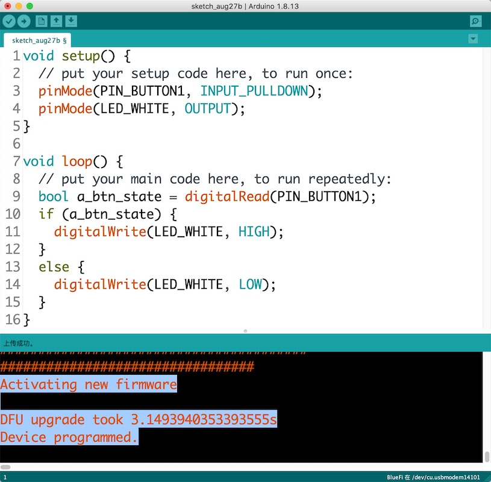

===================================
3.5 创建一种兼容Arduino的开源板
===================================

前一节初步了解Arduino开源平台及软件开发的基本流程和基本框架，用Python脚本语言编写嵌入式系统软件主要依赖Python解释器，如果系统预装Python解释器后，
我们的软件开发工作几乎只需要一个文本编辑器软件工具即可，但使用C/C++这样的编译型语言的Arduino开源平台开发软件时，需要的软件工具要多很多。

本节内容需要自己动手实践，一步一步地创建一种兼容Arduino的开源板及其BSP。这个过程不需要任何硬件电路设计和电子电路分析等知识，其中涉及一些硬件接口方面的概念，
我们将在后续的章节中逐步深入掌握，本节不必深究，只需要根据硬件功能单元及其接口的关系结构框图，以及开源社区的相关软件资源创建一个兼容Arduino开源平台的BSP，
并能够在Arduino开源平台开发这个开源板的应用软件。首先来认识本节课使用到的开源板——BlueFi的硬件资源，如图3.23所示。

图3.23  BlueFi的硬件资源

BlueFi带有一个与BBC MicroBit开源板完全兼容的40P“金手指”(这是一种特殊的PCB工艺)扩展接口，40P“金手指”的信号定义如图3.24所示。

.. image:: ../_static/images/c3/bluefi_board_40pin_if_signals.jpg
  :scale: 40%
  :align: center

图3.24  BlueFi的40P“金手指”接口信号

BlueFi板上的大多数功能单元的基本功能都是众所周知的，不需要看电路原理图就能了解其中的硬件资源及其I/O的用法，我们使用功能单元的关系结构框图来描述硬件原理，
如图3.25所示。每一个功能单元所用的关键电子元件的型号都已经清楚地列举，如果需要了解某个元件的接口细节和用法，请使用搜索引擎查阅相关资料(Datasheet)。

图3.25  BlueFi的功能单元及其接口(硬件资源和I/O引脚用法)

BlueFi使用nRF52系列的MCU(Arduino官方支持的)——nRF52840作为主控制器，ESP32(非官方支持的)作为网络协处理器，两者之间采用SPI接口互联，
其中nRF52840的SPI工作在主模式(Master)，ESP32的SPI接口工作在从模式(Slave)。SPI接口的具体细节和编程控制参加第6章。nRF52840片上带有4个独立的
SPI接口功能单元，一个用作TFT-LCD的接口，一个用作扩展片外FlashROM，一个与ESP32连接，预留一个给40P“金手指”拓展接口。由于nRF52840带有现场可编程的I/O单元，
除了片上的ADC单元和蓝牙天线等，绝大多数片上外设功能单元使用的I/O信号可编程映射到任意I/O引脚，SPI使用的具体I/O引脚在图中已逐一列举。

nRF52840带有2个I2C接口单元，一个用于连接BlueFi板上的4种I2C接口的传感器，包括温湿度传感器、3-DoF地磁传感器、6-DoF运动传感器(含加速度和陀螺仪)、
集成光学传感器等，另一个I2C接口预留给40P“金手指”拓展接口和4P拓展接口。I2C是一种总线型的2线接口标准，理论上一组总线可挂接128个外设，
每一个外设必须占用惟一的7位从地址，其中运动传感器需要专门的中断请求信号与主控制器连接。

板上的5颗彩灯采用DMX协议，使用单线传输数据，且采用级联形式连接，因此仅占用MCU一个I/O引脚。BlueFi使用MCU片内PWM(脉宽调制)功能单元产生声音信号输出给音频功放，
静音时为达到最低功耗(静音时关闭音频功放的电源)，使用一个I/O引脚控制音频功放的电源。所以，音频信号和音频功放电源控制各占用一个I/O引脚。
MEMS麦克风使用PDM(脉冲密度调制)接口与主控制器内部的PDM解码功能单元连接，占用主控制器2个I/O引脚。此外，BlueFi还有3个按钮输入(一个固定作为系统复位)和
2个可编程LED指示灯(红色和白色各一颗)。

BlueFi支持USB供电或单节3.7V锂电池供电，当使用USB的5V供电时可以为锂电池充电，因此板上带有单节锂电池充放电单元(充放电电压范围：3.2~4.2V)。
板上的开关型DC-DC的输入电压范围是3.2～5.5V，输出电压范围是3.1～3.3V，其他所有功能单元都使用DC-DC输出的电源供电。

nRF52840片上带有一个全速的USB2.0接口，可用于Bootloader、用户程序与宿主计算机通讯。

--------------------------

对BlueFi的硬件资源稍作了解之后，我们可以用Arduino IDE和开源社区的资源为BlueFi搭建一个兼容Arduino的软件开发环境。主要工作包含以下步骤：

  1. 安装Arduino IDE，打开Arduino IDE
  2. 配置Arduino IDE的首选项(添加非官方开发板JSON描述文件网址)，重启Arduino IDE
  3. 使用Arduino IDE的开发板管理器选择并安装“nRF52”开发板的软件包(库和工具)
  4. 打开“nRF52”软件包(文件夹)，按以下步骤添加自定义的BlueFi板的BSP和环境配置：
  
    a. 使用文本编辑器修改boards.txt
    b. 定义BlueFi的I/O引脚用法(variants文件夹)
    c. 指定BlueFi的Bootloader文件
    d. 添加BlueFi的BSP源文件(libraries文件夹)
  
  5. 验证开发环境

安装Arduino IDE的步骤需要根据桌面计算机所用操作系统和版本从Arduino官网下载安装文件，并按照Arduino官网的向导完成Arduino IDE的安装。
下面我们将从第2个步骤开始。

--------------------------

配置Arduino IDE的首选项(Preferences)。使用非官方支持的MCU类型或开发板时，使用首选项添加开发板的JSON描述文件的url，然后就可以使用Arduino IDE的开发板管理器安装相应软件包。
对于官方支持的MCU类型或开发板，如果自定义的开源板不打算用Arduino官方的软件包，这里的步骤也是必须的。

虽然nRF52系列MCU已是Arduino官方支持的，以我们的特殊目的，有意不使用官方的软件包。如何找到其他的非官方支持的兼容Arduino的“nRF52”软件包呢？
使用浏览器打开“https://github.com”，这是全球最大的开源代码托管仓库。在github上搜索关键词“nrf52 arduino”，将会找到这个仓库中的搜索结果。
图3.26中列出搜索到82的相关项目(默认按匹配度降序排列搜索结果)，我们打算使用搜索结果中最匹配的“adafruit/Adafruit_nRF52_Arduino”，
点击该项目的链接，可以查看该项目的源码，以及相关说明。

图3.26  使用github搜索“nrf52 arduino”的结果

上图的搜索结果中，第2项是Arduino官方的nRF52项目，第4项是Adafruit贡献的nRF52的开源Bootloader项目。本节内容中，我们将忽略Bootloader的工作，
Bootloader是一个独立的应用程序，每一个BlueFi都已带有这个功能，跳过这个环节并不影响其他工作。

根据“adafruit/Adafruit_nRF52_Arduino”的相关说明，这个项目的开发板描述文件的url如下：

  https://www.adafruit.com/package_adafruit_index.json

然后我们打开Arduino IDE的首选项窗口，参照图3.27所示，使用复制-粘贴操作将上面的url添加到“附加开发板网址管理器”区域。值得注意的是，
Arduino IDE的“附加开发板网址管理器”允许添加多个url，但每一个url必须独立占用一行。图3.27看到的就是多个url的效果。

图3.27  Arduino IDE首选项中添加nRF52开发板的url

配置Arduino IDE的首选项之后，必须关闭-再开启IDE软件以确保配置选项生效。接下来，我们就可以使用Arduino IDE的“开发板管理器”来安装这个非官方的兼容Arduino的nRF52的软件包。

--------------------------

使用Arduino IDE的“开发板管理器”安装非官方的nRF52系列开发板的软件包。在Arduino IDE中菜单栏，选择“工具——>开发板——>开发板管理器”，
在打开的“开发板管理器”窗口的搜索输入框中输入“nrf52”，滚动鼠标就可以发现“Adafruit nRF52”系列开发板，如图3.28所示，选择该开发板软件包的最新版本，
点击“安装”按钮即可自动开始安装。

图3.28  使用Arduino IDE的开发板管理器搜索开发板

请注意，这个安装步骤是在线安装的，要求我们的电脑必须已经联网，而且安装前自动根据该开发板的JSOM描述文件中的信息确定相关软件包的位置，并自定下载，
最后自动安装，安装的耗时长短取决于安装期间的网速。安装完成后，关闭“开发板管理器”窗口回到Arduino IDE主界面，再次使用菜单栏选择“工具——>开发板”，
你将会看到“Aadfruit nRF52 Boards”系列开发板的列表。据此验证我们是否成功地安装软件包。

根据我们电脑使用的OS，已经安装好的nRF52系列开发板的软件包(文件夹)位置略有区别，不同系统的文件夹的路径如下：

  - Windows: %APPDATA%\Local\Arduino15\packages\
  - macOS : ~/Library/Arduino15/packages/
  - Linux : ~/.arduino15/packages/

其他开发板的软件包，无论是否是Arduino官方支持的，也都安装在该路径。为什么需要了解这个安装路径呢？我们下面将会在该文件夹中自定义兼容Arduino的开发板。

注意，对于所有非Arduino官方支持的开发板，无论是否已经安装相应软件包，如果Arduino IDE首选项的“附加开发板网址管理器”中没有指定开发板的JSON描述文件的url，
该系列开发板将不会出现在开发板列表。如果保留开发板的JSON描述文件的url在Arduino IDE首选项的“附加开发板网址管理器”中，将已经安装的该系列开发板的软件包删除，
该系列开发板的名称仍会列在开发板列表。

--------------------------

将自定义的开发板添加到开发板列表中。现在查看Arduino IDE的“Adafruit nRF52 Boards”列表，没有BlueFi这个板。下面步骤可以将BlueFi添加到这个列表中。
我们先将当前使用的开发板指定为“Adafruit nRF52 Boards”列表中的“Adafruit CLUE”，然后你会发现“工具”下拉菜单中的“开发板”下方多了两项：
Bootloader和Debug，分别用于指定Bootloader版本(含Nordic蓝牙协议栈的版本)和Debug级别。因为我们使用非官方支持的开发板，“工具”下拉菜单中新增的信息肯定不是官方的。
Arduino IDE从哪里获取这些信息呢？已安装的开发板软件包中的“boards.txt"。现在使用文本编辑器打开已安装的软件包文件中的“..\packages\adafruit\hardware\nrf52\0.20.5\boards.txt”，
我们修改这个文件即可将自定义的开发板加入到“Adafruit nRF52 Boards”列表中。文件夹路径中的“0.20.5”是软件包的版本号，随你安装的版本而变。

滚动鼠标直到“boards.txt”文件最底部，使用复制-粘贴操作将下面的文本完整地添加到该文件的最后面，并保存该文件(覆盖原始的文件)。
然后重新打开Arduino IDE，“BlueFi”名称将出现在“Adafruit nRF52 Boards”列表中。

.. code-block::  C
  :linenos:

  # ---------------------------------------------
  # BlueFi nRF52840
  # ---------------------------------------------
  bluefinrf52840.name=BlueFi

  # VID/PID for bootloader with/without UF2, Arduino + Circuitpython App
  bluefinrf52840.vid.0=0x239A
  bluefinrf52840.pid.0=0x80B1
  bluefinrf52840.vid.1=0x239A
  bluefinrf52840.pid.1=0x00B1
  bluefinrf52840.vid.2=0x239A
  bluefinrf52840.pid.2=0x80B1
  bluefinrf52840.vid.3=0x239A
  bluefinrf52840.pid.3=0x80B2

  # Upload
  bluefinrf52840.bootloader.tool=bootburn
  bluefinrf52840.upload.tool=nrfutil
  bluefinrf52840.upload.protocol=nrfutil
  bluefinrf52840.upload.use_1200bps_touch=true
  bluefinrf52840.upload.wait_for_upload_port=true
  bluefinrf52840.upload.maximum_size=815104
  bluefinrf52840.upload.maximum_data_size=237568

  # Build
  bluefinrf52840.build.mcu=cortex-m4
  bluefinrf52840.build.f_cpu=64000000
  bluefinrf52840.build.board=NRF52840_BLUEFI
  bluefinrf52840.build.core=nRF5
  bluefinrf52840.build.variant=bluefi_nrf52840
  bluefinrf52840.build.usb_manufacturer="Hangzhou LeBan"
  bluefinrf52840.build.usb_product="BlueFi"
  bluefinrf52840.build.extra_flags=-DNRF52840_XXAA {build.flags.usb}
  bluefinrf52840.build.ldscript=nrf52840_s140_v6.ld
  bluefinrf52840.build.vid=0x239A
  bluefinrf52840.build.pid=0x80B1

  # SofDevice Menu
  bluefinrf52840.menu.softdevice.s140v6=0.3.2 SoftDevice s140 6.1.1
  bluefinrf52840.menu.softdevice.s140v6.build.sd_name=s140
  bluefinrf52840.menu.softdevice.s140v6.build.sd_version=6.1.1
  bluefinrf52840.menu.softdevice.s140v6.build.sd_fwid=0x00B6

  # Debug Menu
  bluefinrf52840.menu.debug.l0=Level 0 (Release)
  bluefinrf52840.menu.debug.l0.build.debug_flags=-DCFG_DEBUG=0
  bluefinrf52840.menu.debug.l1=Level 1 (Error Message)
  bluefinrf52840.menu.debug.l1.build.debug_flags=-DCFG_DEBUG=1
  bluefinrf52840.menu.debug.l2=Level 2 (Full Debug)
  bluefinrf52840.menu.debug.l2.build.debug_flags=-DCFG_DEBUG=2
  bluefinrf52840.menu.debug.l3=Level 3 (Segger SystemView)
  bluefinrf52840.menu.debug.l3.build.debug_flags=-DCFG_DEBUG=3
  bluefinrf52840.menu.debug.l3.build.sysview_flags=-DCFG_SYSVIEW=1

上面这些文本内容需要稍作了解。这些文本是从“boards.txt”已有的某个板的描述复制-修改而来。这些文本内容看，“#”为首的行显然是说明性的，
从这些说明可以看出文本内容共分为5类：1) 指定USB的vid(即Vendor ID)和pid(Product ID)，其中pid有惟一性要求，正确地指定这个值可以让Arduino 
IDE通过USB的pid识别已连接在电脑USB端口开发板的名称；2) 指定下载固件的工具属性，BlueFi使用Bootloader下载用户程序固件，这个Bootloader使用
的宿主计算机软件是Nordic官方的nrfutil；3) 指定编译器的配置，其中很重要的选项是mcu内核系列、cpu时钟频率、Arduino内核、Arduino变种板的名称、
编译时使用的脚本选项文件(ldscript)，以及USB的vid和pid；4) Nordic蓝牙协议栈的选项菜单栏项目和默认值；5) Debug菜单栏的项目和默认值。

上面使用的USB vid和pid的值由Adafruit分配确保唯一性，我们已经使用Adafruit为BlueFi开源板分配的值，其中vid固定为0x239A，但Bootloader期间pid使用0x00B1，
Arduino应用程序的pid固定为0x80B1，运行Python解释器时pid使用0x80B2。

虽然我们的自定义开源板——BlueFi的名称已经出现在“Adafruit nRF52 Boards”系列开源板的列表中，但工作并没有完成。接下来我们需要按照图3.25所示的硬件资源和
I/O引脚用法自定义一个名叫“bluefi_nrf52840”的变种板，并使用“variant.h”和“variant.cpp”指定BlueFi板上I/O引脚的用法。

务必注意，变种板名称“bluefi_nrf52840”已经在修改“bozrds.txt”文件期间指定了。如果你需要使用其他名称，请再返回去修改“board.txt”。

--------------------------

指定自定义开源板的的I/O引脚用法。在已安装的Adafruit nRF52系列开发板的软件包文件夹中，进入“..\packages\adafruit\hardware\nrf52\0.20.5\variants\”文件夹，
这里已经若干个子文件夹，每一个子文件夹包含一种nRF52变种板的I/O引脚用法文件。

为了减少输入，我们可以采用“复制-粘贴-修改-保存”等操作来完成这一步工作。复制一个子文件夹后，将新复制的子文件夹名称修改为“bluefi_nrf52840”，
然后进入该子文件夹并修改“variant.h”和“variant.cpp”两个文件。

很显然，两个文件都属于C/C++的源文件。“variant.cpp”是按照Arduino开源社区的惯例，将主控制器的I/O引脚名称重新编号映射成连续的序数(如0~40)，
抛弃半导体厂商们的“PA.x”、“P0.x”和“P1.x”(x是序数)命名习惯。使用文本编辑器或代码编辑器打开“variant.cpp”文件，首先删除其中的全部代码，
然后将下面的代码复制-粘贴到“variant.cpp”文件中，最后再按需要增加版本或版权说明等注释信息，并保存该文件。

.. code-block::  c
  :linenos:

  #include "variant.h"
  #include "wiring_constants.h"
  #include "wiring_digital.h"
  #include "nrf.h"

  #define _PINNUM(port, pin)     ((port)*32 + (pin))

  const uint32_t g_ADigitalPinMap[] =
  {
    // D0 .. D20
    _PINNUM(0, 28),   // D0  is P0.28 (GPIO D0 / AI0 / UART RX)
    _PINNUM(0, 2),    // D1  is P0.02 (GPIO D1 / AI1 / UART TX)
    _PINNUM(0, 29),   // D2  is P0.29 (GPIO D2 / AI2)
    _PINNUM(0, 30),   // D3  is P0.30 (GPIO D3 / AI3)
    _PINNUM(0, 3),    // D4  is P0.03 (GPIO D4 / AI4)
    _PINNUM(1, 7),    // D5  is P1.07 (GPIO D5 / Left button)
    _PINNUM(0, 8),    // D6  is P0.08 (GPIO D6)
    _PINNUM(0, 25),   // D7  is P0.25 (GPIO D7)
    _PINNUM(0, 23),   // D8  is P0.23 (GPIO D8)
    _PINNUM(0, 21),   // D9  is P0.21 (GPIO D9)
    _PINNUM(0, 19),   // D10 is P0.19 (GPIO D10)
    _PINNUM(1, 9),    // D11 is P1.09 (GPIO D11 / Right Button)
    _PINNUM(0, 16),   // D12 is P0.16 (GPIO D12)
    _PINNUM(0, 6),    // D13 is P0.06 (GPIO D13 / SCK)
    _PINNUM(0, 4),    // D14 is P0.04 (GPIO D14 / MISO / AI5)
    _PINNUM(0, 26),   // D15 is P0.26 (GPIO D15 / MOSI)
    _PINNUM(0, 1),    // D16 is P0.01 (GPIO D16)

    _PINNUM(1, 12),   // D17 is P1.12 (GPIO D17 / Red LED  [not exposed])
    _PINNUM(1, 10),   // D18 is P1.10 (GPIO D18 / NeoPixel [not exposed])

    _PINNUM(0, 0),    // D19 is P0.00 (GPIO D19 / SCL)
    _PINNUM(0, 31),   // D20 is P0.31 (GPIO D20 / SDA / AI6)

    // D21 & D22 - PDM mic (not exposed via any header / test point)
    _PINNUM(0, 9),    // D21 is P0.09 (MICROPHONE_CLOCK)
    _PINNUM(0, 10),   // D22 is P0.10 (MICROPHONE_DATA)

    // D23 .. D27 - TFT control (not exposed via any header / test point)
    _PINNUM(0, 7),    // D23 P0.07 (TFT SCK)
    _PINNUM(1, 8),    // D24 P1.08 (TFT MOSI)
    _PINNUM(0, 5),    // D25 P0.05 (TFT CS)
    _PINNUM(0, 27),   // D26 P0.27 (TFT DC)
    _PINNUM(1, 13),   // D27 P1.13 (TFT LITE)

    // QSPI pins (not exposed via any header / test point)
    _PINNUM(1, 3),    // D28 is P1.03 (QSPI SCK)
    _PINNUM(1, 2),    // D29 is P1.02 (QSPI CS)
    _PINNUM(1, 1),    // D30 is P1.01 (QSPI Data 0)
    _PINNUM(1, 4),    // D31 is P1.04 (QSPI Data 1)
    _PINNUM(1, 6),    // D32 is P1.06 (QSPI Data 2)
    _PINNUM(1, 5),    // D33 is P1.05 (QSPI Data 3)

    // ESP32SPI WiFi pins (not exposed via any header / test point)
    _PINNUM(0, 22),   // D34 is P0.22 (WIFI SCK)
    _PINNUM(0, 17),   // D35 is P0.17 (WIFI MISO)
    _PINNUM(0, 20),   // D36 is P0.20 (WIFI MOSI)
    _PINNUM(0, 15),   // D37 is P0.15 (WIFI BUSY)
    _PINNUM(0, 24),   // D48 is P0.24 (WIFI CS)
    _PINNUM(1, 0),    // D39 is P1.00 (WIFI RESET)
    _PINNUM(0, 13),   // D40 is P0.13 (WIFI PWR)

    // D41 .. D44 - on board sensors pins (not exposed via any header / test point)
    _PINNUM(0, 11),   // D41 is P0.11 SENSORS_SCL
    _PINNUM(0, 12),   // D42 is P0.12 SENSORS_SDA
    _PINNUM(0, 14),   // D43 is P0.14 LSM6DS33 IRQ (ACCELEROMETER_INTERRUPT / IMU_IRQ)

    _PINNUM(1, 14),   // D44 is P1.14 White LED (WHITE LED)

    // D45 & D46, on board Buzzer pins (not exposed via any header / test point)
    _PINNUM(1, 11),   // D45 is P1.11 Audio Amplifier Enable (SPEAKER ENABLE)
    _PINNUM(1, 15),   // D46 is P1.15 Speaker/Audio
  };

  void initVariant()
  {
    // LED1
    pinMode(PIN_LED1, OUTPUT);
    ledOff(PIN_LED1);

    // Disable TFT LITE powering up
    pinMode(PIN_TFT_LITE, OUTPUT);
    digitalWrite(PIN_TFT_LITE, LOW);
  }

“variant.cpp”文件中的关键就是使用第6行的宏定义声明一个常量型数组，这个宏就是将nRF52840原始的I/O引脚编号映射为0～46这样的序数，常量数组中的各项的排序
是自定义的，譬如我们将A按钮的输入引脚——P1.7排在第5个位置(计算机领域的习惯有“第0个”位置)，在使用Arduino IDE编写程序时，可以直接使用“const uint8_t 
a_buttonPin=5”定义别名变量来访问A按钮，编译器根据“variant.cpp”文件的这个常量数组自动地将“a_state = digitalRead(a_buttonPin)”中的“a_buttonPin”转换为“P1.7”。

对于I/O引脚用法的特殊处理，Arduino开源社区的这个惯例有两个方面的目的。其一是软件开发者不必直接访问半导体厂商提供的驱动库，对“P1.7”引脚状态的读操作，
意味着读取这个I/O引脚状态所对应的存储器地址单元；其二是提高Arduino软件的可移植性。

在“variant.h”文件中，根据图3.25指定BlueFi的I/O硬件用法。同样地处理，用复制-粘贴-保存操作将下面的代码覆盖“variant.h”文件中原始内容。

.. code-block::  c
  :linenos:

  #ifndef _VARIANT_BLUEFI_
  #define _VARIANT_BLUEFI_

  // Master clock frequency 
  #define VARIANT_MCK       (64000000ul)
  #define USE_LFRC    // Board uses RC for LF

  #define _PINNUM(port, pin)    ((port)*32 + (pin))

  #include "WVariant.h"

  #ifdef __cplusplus
  extern "C"
  {
  #endif // __cplusplus

  // Number of pins defined in PinDescription array
  #define PINS_COUNT           (47)
  #define NUM_DIGITAL_PINS     (47)
  #define NUM_ANALOG_INPUTS    (7)
  #define NUM_ANALOG_OUTPUTS   (0)

  // LEDs
  #define PIN_LED1             (17)
  #define PIN_NEOPIXEL         (18)

  #define LED_BUILTIN          PIN_LED1
  #define BUILTIN_LED          PIN_LED1

  #define LED_RED              PIN_LED1
  #define LED_WHITE            44

  #define LED_STATE_ON         1      // State when LED is litted

  // Buttons
  #define PIN_BUTTON1          (5)    // Button A
  #define PIN_BUTTON2          (11)   // Button B

  // Microphone
  #define PIN_PDM_DIN           22
  #define PIN_PDM_CLK           21
  #define PIN_PDM_PWR           -1  // not used

  // Buzzer
  #define PIN_BUZZER            46

  // Analog pins
  #define PIN_A0               (0)
  #define PIN_A1               (1)
  #define PIN_A2               (2)
  #define PIN_A3               (3)
  #define PIN_A4               (4)
  #define PIN_A5               (14)
  #define PIN_A6               (20)

  static const uint8_t A0  = PIN_A0 ;
  static const uint8_t A1  = PIN_A1 ;
  static const uint8_t A2  = PIN_A2 ;
  static const uint8_t A3  = PIN_A3 ;
  static const uint8_t A4  = PIN_A4 ;
  static const uint8_t A5  = PIN_A5 ;
  static const uint8_t A6  = PIN_A6 ;

  #define ADC_RESOLUTION       14

  // Serial interfaces (UART)
  #define PIN_SERIAL1_RX       (0)
  #define PIN_SERIAL1_TX       (1)

  // SPI Interfaces
  #define SPI_INTERFACES_COUNT 3

  // nRF52840 has only one SPIM3 runing at highspeed 32Mhz
  // This assign SPIM3 to either: SPI (0), SPI1 (1).
  // If not defined, default to 0 or SPI.
  #define SPI_32MHZ_INTERFACE  1

  // SPI (P13~P16)
  #define PIN_SPI_SCK          (13)
  #define PIN_SPI_MISO         (14)
  #define PIN_SPI_MOSI         (15)

  static const uint8_t SS   = (16);
  static const uint8_t MOSI = PIN_SPI_MOSI ;
  static const uint8_t MISO = PIN_SPI_MISO ;
  static const uint8_t SCK  = PIN_SPI_SCK ;

  // SPI1 (TFT-LCD)
  #define PIN_SPI1_SCK          (23)
  #define PIN_SPI1_MOSI         (24)
  #define PIN_SPI1_MISO         (28)

  static const uint8_t SS1   = (25);
  static const uint8_t MOSI1 = PIN_SPI1_MOSI ;
  static const uint8_t MISO1 = PIN_SPI1_MISO ;
  static const uint8_t SCK1  = PIN_SPI1_SCK ;

  // On-board TFT display
  #define PIN_TFT_CS            25
  #define PIN_TFT_DC            26
  #define PIN_TFT_LITE          27
  #define PIN_TFT_RST           -1  // not used

  // On-board WiFi 

  // Wire Interfaces (I2C)
  #define WIRE_INTERFACES_COUNT 2

  #define PIN_WIRE_SCL        (19)
  #define PIN_WIRE_SDA        (20)

  static const uint8_t SCL  = PIN_WIRE_SCL ;
  static const uint8_t SDA  = PIN_WIRE_SDA ;

  #define PIN_WIRE1_SCL       (41)
  #define PIN_WIRE1_SDA       (42)

  static const uint8_t SCL1 = PIN_WIRE1_SCL ;
  static const uint8_t SDA1 = PIN_WIRE1_SDA ;

  // QSPI Pins
  #define PIN_QSPI_SCK         28
  #define PIN_QSPI_CS          29
  #define PIN_QSPI_IO0         30
  #define PIN_QSPI_IO1         31
  #define PIN_QSPI_IO2         32
  #define PIN_QSPI_IO3         33

  // On-board QSPI Flash
  #define EXTERNAL_FLASH_DEVICES   W25Q16JV_IM
  #define EXTERNAL_FLASH_USE_QSPI

  #ifdef __cplusplus
  }
  #endif

  #endif

在这个文件中定义的“LED_BUILTIN”宏已在前一节的示例代码中出现过，这个宏仍然是Arduino社区的惯例：所有Arduino开源板都有一个可编程的LED指示灯，
并称之为“内建的LED”。“LED_BUILTIN”只是开源板的一个I/O引脚的用法，上面的代码中还有两个按钮使用的引脚、MEMS麦克风的PDM接口引脚、
I2C和SPI等接口的引脚。

--------------------------

关于BlueFi的Bootloader，我们在前面已经提到，由于每一个BlueFi板的生产阶段就已经在FlashROM中固化有现成的Bootloader固件，你可以跳过这一步。
如果我们打算在Arduino IDE环境升级Bootloader固件，就需要在路径“..\packages\adafruit\hardware\nrf52\0.20.5\bootloader\”文件夹中创建一个名叫
“bluefi_nrf52840”的子文件夹，并点击下面的链接下载最新版的hex格式文件和zip压缩格式的文件：

  . :download:`hex格式Bootloader文件 <../_static/dl_files/bluefi_bootloader_files/bluefi_bootloader-0.3.2_s140_6.1.1.hex>`

  . :download:`zip格式Bootloader压缩文件 <../_static/dl_files/bluefi_bootloader_files/bluefi_bootloader-0.3.2_s140_6.1.1.zip>`

并将下载到本地的这两个文件复制到“..\packages\adafruit\hardware\nrf52\0.20.5\bootloader\bluefi_nrf52840\”文件夹内。
在Arduino IDE中升级/更新nRF52系列开源板的Bootloader固件有两种方法。其一是使用Segger的J-Link软件 [1]_ 和 Nordic官方的nRF52命令行工具软件 [2]_ ，
并将nRF52840的USB虚拟串口作为通讯接口，将hex格式Bootloader文件下载到开源板上来更新Bootloader固件；另一种方法是使用Adafruit改进的nRF52命令行工具软件，
无需J-Link软件，同样将nRF52840的USB虚拟串口作为通讯接口，将zip格式Bootloader文件下载到开源板来更新Bootloader固件。

如果选择第2种方法，更新Bootloader固件的软件工具已经在nRF52系列开源板的软件包中，无需下载其他软件。如果选择第1种方法，需要先现在两个软件工具。
到底选择哪种方法并不重要，目标都是一样的。具体的更新Bootloader固件的方法可以使用Arduino IDE的工具菜单栏配置，一旦配置好，并且已安装好更新Bootloader固件的软件工具，
以及两种格式的最新版Bootloader固件都已下载到“..\packages\adafruit\hardware\nrf52\0.20.5\bootloader\bluefi_nrf52840\”文件夹。
如图3.29所示，最后点击“工具——>烧录引导程序(Burning Bootloader)”即可。

图3.29  在Arduino IDE中更新nRF52系列开源板的Bootloader的配置

务必注意，嵌入式系统的Bootloader是一种与硬件有关的应用程序，每一种开源板的Bootloader程序都是订制化的，或许只是从同类型开源板的Bootloader简单移植的，
任何硬件的细微差别都可能导致功能失效。BlueFi在用的Bootloader是从另一个开源项目 [3]_ 移植过来的。

--------------------------

现在我们可以使用一个简单的程序来验证前面的工作是否正确。前述的步骤中，最关键的是“指定自定义开源板的的I/O引脚用法”。如果我们能够成功地编译、下载BlueFi的第一个Arauino程序，
说明前面的工作路径是正确的。完整的示例代码如下：

.. code-block::  c
  :linenos:

  void setup() {
    // put your setup code here, to run once:
    pinMode(PIN_BUTTON1, INPUT_PULLDOWN);
    pinMode(LED_WHITE, OUTPUT);
  }

  void loop() {
    // put your main code here, to run repeatedly:
    bool a_btn_state = digitalRead(PIN_BUTTON1);
    if (a_btn_state) {
      digitalWrite(LED_WHITE, HIGH);
    }
    else {
      digitalWrite(LED_WHITE, LOW);
    }
  }

这个示例代码的程序逻辑非常简单，初始化程序(setup()函数内)只是把“PIN_BUTTON1”和“LED_WHITE”的模式分别配置为数字下拉输入和输出，
这两个别名在BlueFi的I/O引脚用法的“variant.h”文件中使用宏定义的方式分别给予声明，在菜单栏选择“工具——>开发板——>BlueFi”即指定编译时使用我们自定义的BlueFi开源板的I/O用法。
“INPUT_PULLDOWN”、“OUTPUT”、“HIGH”和“LOW”都是Arduino平台的常量，参加页面 [4]_ 的说明。主循环程序(loop()函数内)读取左/A按钮的状态并赋值给布尔型变量“a_btn_state”，
然后判断“a_btn_state”是否为真/true，为真则将白光LED控制引脚设置为高电平，否则设置为低电平。

将上面的代码复制-粘贴到Arduino IDE的源码编辑区，点击“编译并下载”按钮，这个简单的程序很快就被编译输出nRF52的机器码文件，
Arduino IDE自动将该文件下载到BlueFi的MCU的FlashROM中。结果如图3.30所示。

图3.30  编译并下载自定义开源板——BlueFi的第一个Arduino程序

现在你可以按下BlueFi的左/A按钮，并观察白光LED指示灯的变化：按下A按钮，白光LED指示灯亮；释放A按钮，白光LED指示灯灭。你看到相同的程序执行效果了吗？

--------------------------

读取按钮的状态并根据其状态控制白光LED的亮或灭，程序逻辑非常简单，但是这可以证明我们自定义的开源板——BlueFi的Arduino软件开发环境的搭建工作已经成功。
如果不成功，从点击“编译并下载”按钮之后，你会发现Arduino IDE在其控制台中用红色字体帮助我们列出出发生错误的代码行，以及可能的错误原因。根据这些提示信息，
仔细排查前面的工作到底错在哪里。

现在我们希望能使用BlueFi的TFT-LCD显示当前环境温湿度信息、绘制图案，彩灯能显示绚丽的光效，喇叭能发出悦耳旋律等等。如何能够快速实现这些希望呢？
我们需要为BlueFi订制一个BSP，使用BSP的单个接口就可以获取当前环境温度、环境湿度、声音响度或按钮状态等，使用BSP的单个接口就可以控制喇叭产生指定频率和响度的基本音调、
某颗彩灯颜色和亮度、TFT-LCD上显示指定参数的文本和图案等。如何设计这个BSP呢？这是一个小型软件工程项目，当我们无从下手时，首先从规划软件的层次架构开始。

BlueFi的BSP软件层次架构请参考图3.31。我们暂时不考虑BSP软件的内部细节，只关心外部接口分类和依赖库。图中可以看出，BSP的作用是简化用户代码对BlueFi硬件的访问，
譬如用户代码不必直接使用I2C接口读取温度传感器内部的寄存器而是直接调用单个接口即可获取当前温度值，这个BSP API的下面就必须有代码来实时I2C接口初始化、
检验硬件连线的有效性、读取寄存器、处理数据等，最后由这个API返回温度数值，从用户代码中甚至不知道温度传感器的型号、I2C从地址等。
针对BlueFi的特定硬件资源，这个BSP的接口类型和数量都是确定的。

.. image:: ../_static/images/c3/bluefi_bsp_for_arduino_structure.jpg
  :scale: 30%
  :align: center

图3.31  BlueFi的BSP软件层次架构

根据图3.31，我们需要完成的BSP软件设计与传统概念上的BSP有本质上的区别，由于nRF52的Arduino内核(含半导体厂商的驱动库和RTOS等)的存在，
BlueFi的这个BSP软件不必直接访问寄存器和存储器层次的硬件资源。

每一个特定开源板都有一套订制化的BSP源码，BSP软件的编码工作量较大，且涉及很多硬件接口、软件算法和代码封装等工作，我们将从下一章开始逐步完成整个BlueFi的BSP软件设计工作，
期间我们还将掌握相关的嵌入式系统软硬件设计模式和设计方法，以及硬件接口原理和相关概念。

--------------------------

参考文献：
::

.. [1] https://www.segger.com/downloads/jlink#J-LinkSoftwareAndDocumentationPack
.. [2] https://www.nordicsemi.com/Software-and-Tools/Development-Tools/nRF-Command-Line-Tools 
.. [3] https://github.com/adafruit/Adafruit_nRF52_Bootloader 

