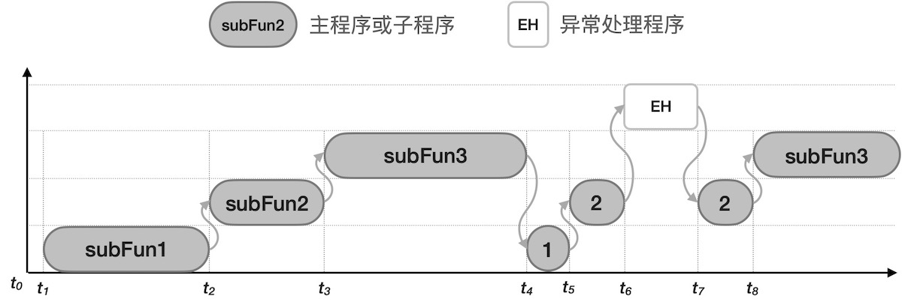

===========================
3.2 无OS的嵌入式系统软件
===========================

绝大多数嵌入式系统软件并不使用OS，本节将探讨无OS的嵌入式系统软件设计模式。我们知道，无论多么精简的RTOS都会占用嵌入式系统的Code和Data资源，
占用多少KB的ROM和RAM是RTOS的关键指标之一，当然RTOS的任务调度器也会占用CPU的时间。功能和业务逻辑相对简单的嵌入式系统所使用的MCU性价比高，
意味着CPU的时钟速度尽可能低(低速带来多方面的低成本效应)，ROM和RAM资源也尽可能小(够用就好)，RTOS所占用的资源在这样的系统中比例将很高。

当我们不使用RTOS时，最好的嵌入式系统软件设计方法是，仍按照功能和业务逻辑将软件分割为多个子功能或子业务并编写相应的子程序，系统初始化完毕后，
在一个无穷循环内顺序地调用各个功能子程序即可。如图3.5所示。不使用OS时，嵌入式系统MCU只需要两个工作模式：特权模式和异常模式，前者循环执行正常主循环，
后者响应中断或处理软硬件异常。图中的每一个子程序都可以访问系统的任何资源，所有子程序的权限是相同的。

图3.5  无OS的嵌入式系统软件模型

假设某个无OS嵌入式系统软件有3个功能性子程序，“子程序1”执行异步串行通讯功能(从串口接收指令并执行指令)，“子程序2”执行传感器的数据采样和滤波，
“子程序3”负责刷新显示器和指示灯状态。很显然，“子程序1”的执行时间会随着串口接收信息变化，如果没有新的接收消息时几乎不占用CPU时间，另外两个子程序
的执行时间相对固定，尤其数据采样和处理“子程序2”。另外，使用中断服务程序处理系统按钮，按钮可以调整数据采样分辨率、时间间隔等。

图3.6给出无OS软件的执行过程。由于“子程序1”的执行时长受串口接收到消息的影响，假设图中第二次循环时“子程序1”的执行时间很短，执行数据采样的“子程序2”
的执行间隔也随之变短，当“子程序1”的执行时间很长数据采样间隔也随之变长。响应中断和异常也会影响传感器数据的采样间隔。按功能子程序轮转方式的无OS软件
无法确保任何一个功能程序的正常执行间隔，或者说无法保证在预定的时间点之前完成，所以这样的软件系统属于非实时的。为了改善这样的软件系统的实时性，
我们需要尽可能地缩短每一个功能性子程序的执行时间，当执行所有子程序的循环周期接近或小于预定的实时处理周期时，这样的系统就属于实时的。

图3.6  无OS的嵌入式系统软件执行过程

与带有OS的嵌入式系统软件的执行过程(如图3.7)相比，无OS软件主程序的循环周期完全受每一个子程序的执行时长影响。即使非抢占型的情况，RTOS调度器仍能
确保每一个任务按固定的间隔周期执行，抢占型RTOS还能根据任务优先级来调度任务执行。假设图3.7中的三个任务与图3.6中的三个功能性子程序分别实现相同功能，
任务2执行传感器数据采集必须确保固定时间间隔(称作采样周期)，借助于RTOS很容易实现这一实时性要求。但无OS的嵌入式系统软件想要实现这样的目的就相对更难，
需要系统软件设计者精心测试和改善才能达成的。

图3.7  有OS的嵌入式系统软件执行过程

异常处理程序(Exception Handler)的执行将会打破常态的主循环，无论是否有OS，允许被响应的中断或软硬件异常发生时，正在执行的任务或子程序将被暂停，
系统先执行EH然后再返回被暂停的地方(称作断点)继续执行。所有优秀的嵌入式系统系统软件的EH都保持尽可能短的执行时间，譬如几个微妙的时间，以保证正常主循环
的执行周期不受EH的影响。

另一种无OS的嵌入式系统软件设计方法与RTOS的任务驱动相似，称之为中断驱动的软件。现代MCU支持上百个中断请求源，包括外部输入中断、内部功能单元中断等，
譬如串口(UART)接收到字符的中断和字符发送完毕的中断。中断驱动的无OS嵌入式系统软件的架构如图3.8所示，当中断请求发生时，CPU立即退出轻度睡眠状态，
执行中断服务程序，然后继续进入轻度睡眠。

图3.8  中断驱动的(无OS的)嵌入式系统软件架构

中断驱动的嵌入式系统软件的主循环仅有一行代码，即进入睡眠模式，这样可以确保每次响应中断之后再次进入睡眠模式。伪码如下：

.. code-block::  c
  :linenos:

    ISR1 () {
      // functional code for ISR1 
    }
    Task2 () {
      // functional code for ISR2 
    }
    Task3 () {
      // functional code for ISR3 
    }

    main () {
      // Initialize the system hardware
      // initialize the system interrupt
      while(1) {
         entrySleepMode();
      }
    }

中断驱动的嵌入式系统软并不确保实时性。任意中断请求发生并被响应时或有其他中断请求，根据中断系统初始化时所设定的优先级诸葛响应中断，如果高优先级中断
服务程序的执行时间很长将会使得低优先级中断延迟响应。但是使用高优先级的定时中断来保证前面提到的“传感器数据采集和处理”固定周期，使用相似的思路可以
达成某些特定任务的实时性要求。

在异常处理模式执行的中断服务程序不宜太长时间，而且异常模式下对系统内资源的访问可能存在冲突，譬如两个不同优先级的中断服务程序可能会访问同一个系统资源，
如果处理不慎则会引起系统硬件异常。为了避免这种风险，我们可以采用中断服务程序向主循环的子程序发送消息的形式来解决，也就是将执行时间较长的中断服务程序分成两部分，
需要快速响应的且执行时间较短的部分仍放在中断服务程序中，执行时间较长的部分作为一个子程序的形式放在主循环程序体内，当第一部分执行完毕后设置一个布尔型变量为True，
当主循环中的子程序检测到该变量为True时则执行第2部分程序。这种程序架构如图3.9所示。

图3.9  中断驱动和子程序轮转的(无OS的)嵌入式系统软件架构

使用中断驱动和子程序轮转的无OS嵌入式系统软件的基本设计思路是，将系统功能划分为高实时性任务和低实时性任务，并将高实时性任务按执行时间长短分为两类：
短时间型和长时间型。短时间型的高实时性任务的代码放在中断服务程序内，并把相应的中断设为最高优先级；把长时间型的高实时任务分割成两部分，需要快速响应
的部分代码放在中断服务程序内，其他功能代码设计成子程序放在主循环体内等待消息则执行，而且这部分代码如果出现大延迟仍能达成可接受的实时性。
对于低实时性任务来说，代码实现的方法不受限制，可采用低优先级中断驱动型，也可以采用子程序轮转型。

--------------------------

本节虽然给出几种无OS嵌入式系统软件的设计模式和方法，但实际的模式远不止这些。嵌入式系统软件的开发并不像桌面计算机系统那样具有统一的开发环境、
开发架构和设计方法，由于RTOS的类型繁多且没有统一的API和开发环境，嵌入式系统软件开发工作量完全取决于系统功能的复杂度，功能复杂的和资源丰富的系统
软件开发建议采用RTOS，借助于RTOS的多任务调度器更容易管理系统资源和功能解藕的软件设计。

--------------------------

参考文献：
::

.. [1] 
