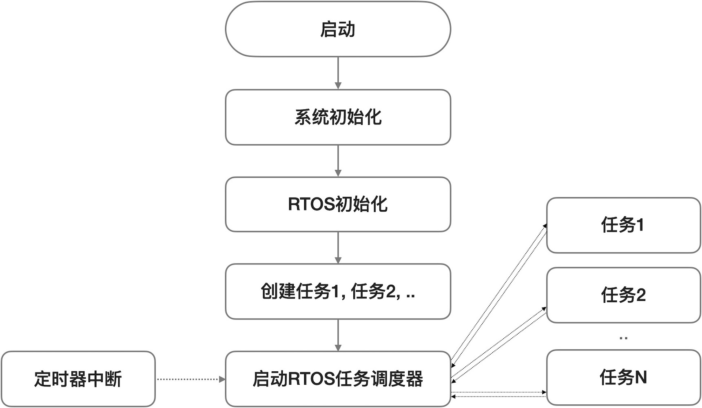
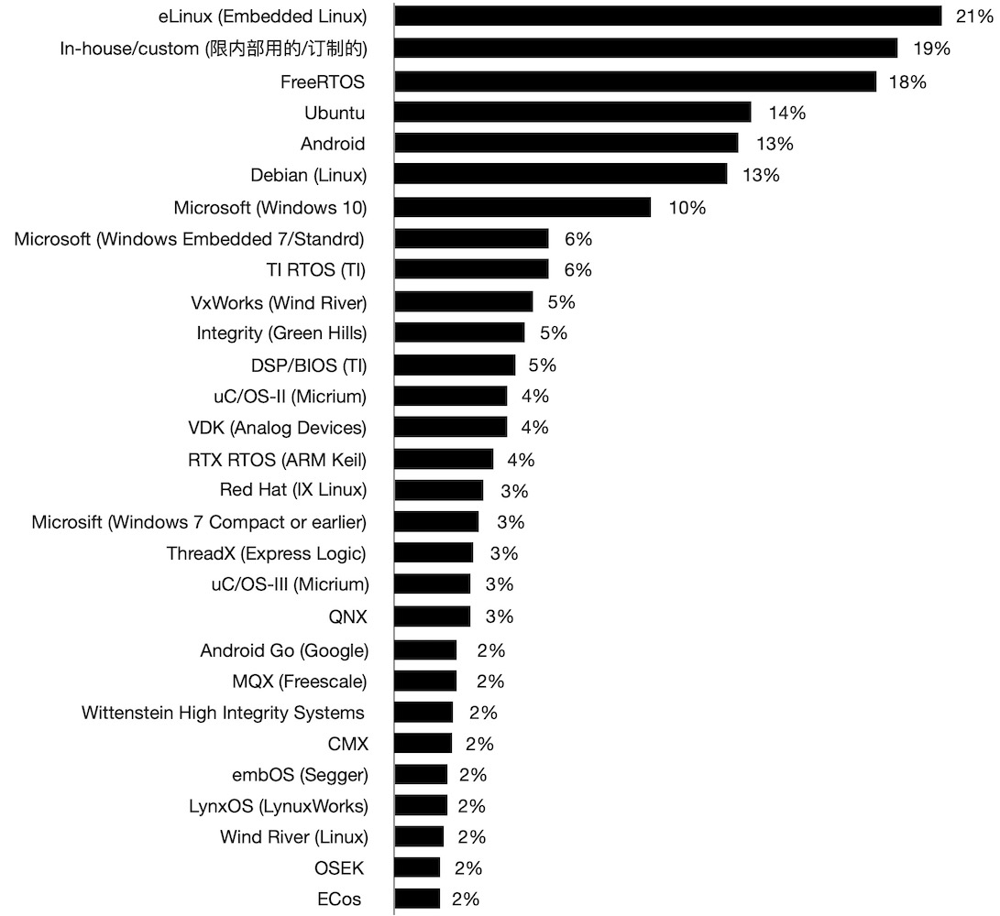
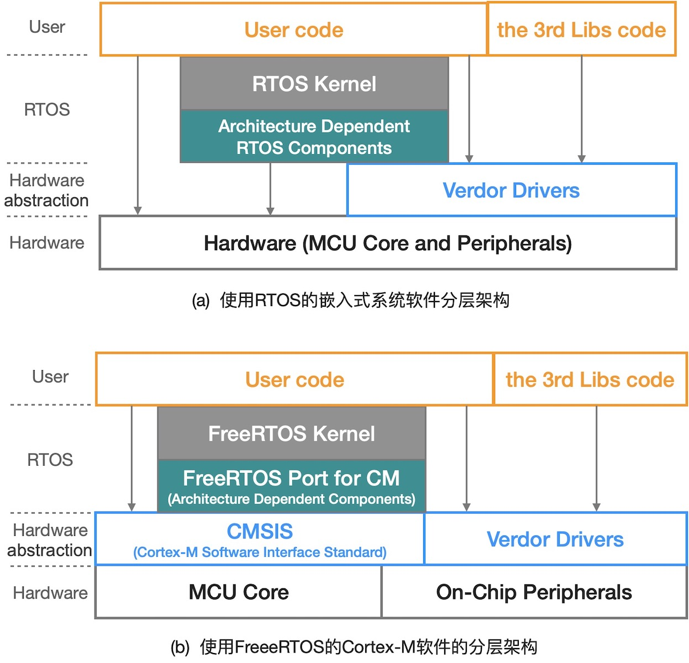
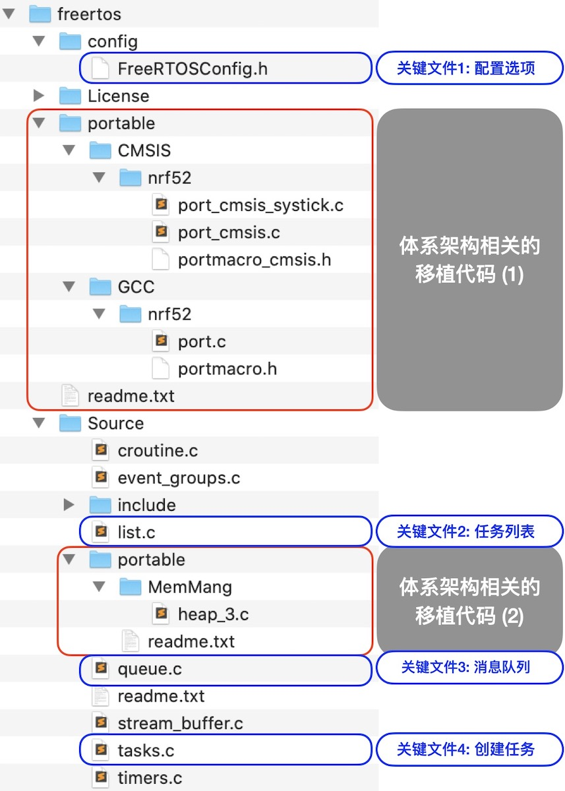

===========================
3.1 有OS的嵌入式系统软件
===========================

桌面计算机系统和PMD(个人移动设备)的软件开发统称为应用程序(或称作App)开发，在Windows、Linux、macOS、iOS、Android等标准OS环境运行的应用程序
开发的难点是算法和软件性能优化等，开发重点是API(应用程序接口)的应用，开发方法和开发环境非常成熟。但是，开发带有OS的嵌入式系统软件却完全不同。

嵌入式系统软件可以使用的OS通常被称作嵌入式OS(Embedded OS)或RTOS(RealTime Operating System)，在OS环境运行的软件绝大多数都采用事件驱动的
(Event Driven)风格，但RTOS种类繁多且无统一的、标准的API，也没有统一的开发环境，很多RTOS仅支持几种MCU(目前没有完全通用的RTOS)。实时操作系统意味着，
某个事件发生所触发的任务必须在预定时间内完成(不是最快完成，而是在预定的截止时间之前完成)。

嵌入式OS都是多任务的(单任务的OS没有使用价值)，借助于OS的任务调度器(Task Scheduler)可以并行执行多个任务。带有RTOS的嵌入式系统软件模型如图3.1所示，
系统启动后执行必要的初始化操作(如Bootloader)、RTOS初始化，然后创建多个任务并启动调度器，这些操作都是一次性执行的代码，RTOS调度器本身是一个无穷循环，
他在定时器中断的辅助下控制多个任务并行执行。

图3.1  多任务RTOS的模型

现代MCU大多数都支持RTOS，如支持特权的和非特权的工作模式、异常模式等。一般来说，RTOS内核工作在特权模式，可以访问和管理系统内全部软硬件资源，
用户任务程序工作在非特权模式只能访问属于本任务的资源。异常模式是专门处理软硬件异常和中断服务。使用RTOS编写嵌入式系统软件的(伪码)风格如下示例：

.. code-block::  c
  :linenos:

    Task1 () {
      // some of the initialization code for Task1 
      while(1) {
        // functional code for Task1 
      }
    }
    Task2 () {
      // some of the initialization code for Task2 
      while(1) {
        // functional code for Task2 
      }
    }
    Task3 () {
      // some of the initialization code for Task3 
      while(1) {
        // functional code for Task3 
      }
    }

    main () {
      // Initialize the system hardware
      // initialize RTOS
      xCreakTask(Task1); // creat the Task1, and apend it on the list of task 
      xCreakTask(Task2); // creat the Task2, and apend it on the list of task 
      xCreakTask(Task3); // creat the Task3, and apend it on the list of task 
      vTaskStartScheduler(); // start the scheduler of RTOS, this is an endless loop
    }

任务调度器能够并行处理多任务的机制是，将CPU的时间分割为多个时间片并分配给已经创建的多个任务，每个任务占用CPU的一个时间片，当正在执行的任务的时间片
消耗完毕时，调度器实施任务切换(即将正在执行的任务挂起，继续执行下一个任务)，每一个任务按分配的时间片占用CPU一定时间后被挂起，如此无穷地循环，
让我们感觉多个任务被并行执行。其中，时间片的分割粒度由定时器的中断/溢出周期来决定，通过对定时器溢出周期的编程配置即可改变时间片粒度。

这是一种最简单的按时间片轮转的多任务调度器，当我们需要优先处理某些任务时，抢占型RTOS就很必要。抢占型RTOS的任务调度器相对复杂，每个任务不仅有自己的
时间片，还有自己的优先级，正在执行的低优先级任务的时间片可能会被高优先级的任务抢占。

嵌入式系统软件使用OS有什么益处呢？支持任务驱动和多任务的软件设计方法能够将复杂的嵌入式系统软件分割成多个易于实现的简单任务软件，不仅易维护还能确保实时性。
譬如无人机的飞控系统软件需要实时无线通讯、实时姿态控制、实时避障、实时定位、视频采集和视频流回传等功能，几乎所有功能都需要很高的执行频次，
如果没有RTOS的支持直接编写飞控系统软件将会耗费很长的开发时间。

使用OS的缺点是哪些？任何RTOS都需要额外占用嵌入式系统有限的ROM空间和RAM空间，如ucLinux需要2MB RAM；RTOS的任务调度器需要占用CPU的时间实现任务调度
和任务切换，尤其任务切换时需要将待挂起任务的寄存器等状态信息保存到该任务的控制块(TCB)并将待调度的下一个任务的寄存器等状态信息从其TCB中恢复，
这个过程需要耗费一定的CPU时间；每个任务的TCB肯定会额外的占用RAM空间。因此，简单的嵌入式系统软件完全没有使用RTOS的必要。

在嵌入式系统开发过程中使用RTOS还存在一些困难。其一是，RTOS种类繁多且无统一的标准API，甚至对开发环境和软件工具也有特殊要求(没有统一的开发环境)；
其二是，昂贵的商用RTOS授权费，虽然也有很多种免费的甚至开源的RTOS可以选择，但是没有技术支持也可能会增加软件开发时间和技术成本；其三是，RTOS的Bug，
虽然所有RTOS研发者都认为自己已经尽力做到最好，但复杂的RTOS内核软件和相关中间件本身就是庞大的软件系统，有Bug是在所难免的。

--------------------------

RTOS的实际使用情况咋样呢？图3.2是根据EETims杂志2020年初发布的全球操作系统市场调查结果，其中包含很多种RTOS。

图3.2  2019年操作系统市场全球调查(数据来自EETimes杂志)

去掉我们熟悉的桌面计算机系统的OS，其他的几乎都是RTOS，限内部使用的/订制的OS除外。免费且开源的eLinux [1]_ 和FreeRTOS [2]_ 的市场占有比例占绝对优势，
比例相近的TI RTOS [3]_ 和VxWorks [4]_ 分别是免费的和商业的RTOS，但相较于免费且开源的uC/OS-II和uC/OS-III [5]_ 的总体比例还是有差距，
半免费的(即个人免费但企业非免费)QNX [6]_ 和低授权费的MQX [7]_ 的比例也很接近。

很显然，完全免费且开源的RTOS非常受欢迎。注意，eLinux并不是实时的OS，适合PMD类计算机系统。FreeRTOS、TI-RTOS、uC/OS-x等属于免费完全开源的RTOS，
他们的市场占有比例与使用难易度和通用性有关：FreeRTOS和uC/OS-x都是通用型RTOS，但后者使用难度略大于前者；TI-RTOS仅支持TI自己的MCU和DSP，
DSP/BIOS应该是TI-RTOS的内核(在TI官网的名称是SYS/BIOS)。虽然ARM Keil的RTX RTOS [8]_ 和国产的RT-Thread [9]_ 等免费RTOS都未上榜，
但他们拥有自己的大量用户。

图中的所有RTOS都支持基本的时间片轮转调度和按任务优先级抢占调度模式，在RTOS初始化阶段通过编程来配置或编译前使用配置文件来选择模式。

--------------------------

初始化RTOS、创建任务、启动多任务调度器等是使用RTOS的最基本工作，使用RTOS开发嵌入式系统软件时我们一定会遇到共享资源和任务间通讯等高级问题。
多个任务需要共享嵌入式系统的硬件资源(如内存、外设等)是很常见的，譬如两个任务都需要向同一个UART端口写入单行型字符串信息，如果这个共享资源处理不当，
我们一定会发现一个字符串被另一个字符串分割的现象(相信这不是你想要的)。互斥(Mutual Exclusion)机制及其接口是RTOS解决共享资源问题的常规方法，
需要使用共享资源的每一个任务必须对预先定义的互斥变量进行查询(如果被其他任务锁定则该任务将被挂起)、锁定(锁定成功即可使用共享资源)、(使用完毕立即)释放等互斥访问共享资源的过程。
任务间通讯问题出现在业务逻辑耦合的多任务软件设计过程种，譬如一个高优先级的任务A负责控制ADC按指定采样周期采集语音，另一个高优先级B的任务负责将
采集的语音数据滤波后存入内存，还有一个低优先级的任务C负责将语音流数据通过网口发送至云端，任务A和任务B之间需要借助于通讯或共享内存来协作执行，
任务C需要等待任务B的消息才会开始传送数据流，任务B必须根据任务C的传送进度决定是否能够继续保存语音数据(如果流数据存储空间是满的时候任务B需要暂停写内存)。
信标、队列和邮箱等都是RTOS常用的任务间通讯方法，但不是所有RTOS都支持这些方法。更详细的RTOS知识请参考Jim Cooling [10]_ 和 [11]_ ，以及前文
提到的RTOS的官网文档。 

使用RTOS的嵌入式系统软件架构是啥样的呢？图3.3(a)和图3.3(b)分别给出通用型架构、FreeRTOS用于ARM Cortex-M的嵌入式系统软件架构。
图中可以看出，除了RTOS内核(Kernel)之外，RTOS还有一部分组件与具体的嵌入式系统MCU的架构有关。当FreeRTOS用于ARM Cortex-M系列MCU时，
我们必须做一部分代码移植(Porting)工作，如图3.3(b)所示。

图3.3  基于RTOS的嵌入式系统软件架构

如果Windows用户或许有上亿之多，FreeRTOS的用户数量接近其2倍，或许包含基于FreeRTOS的OpenRTOS和SafeRTOS(他们都是基于FreeRTOS)的用户。
FreeRTOS得到全球嵌入式系统市场广泛认可的原因，除了免费且开源(我们自己可以修改FreeRTOS的源代码)之外，易用性也很关键。图3.3可以看出，
FreeRTOS允许用户代码和第三方库代码直接访问嵌入式系统的硬件资源和半导体厂商提供的片上外设驱动库，这使得FreeRTOS保持代码量极小化和高易用性。
图3.4是FreeRTOS的一种移植版本——支持nRF52x(Nordix公司的使用ARM Cortex-M4F微内核的一系列MCU)，编译环境是Arduno IDE。

图3.4  支持nRF52x系列MCU的FreeRTOS移植版本的文件树

图中可以看出FreeRTOS包含，4个关键的内核文件，内核需要用到的SysTick定时器及其中断、堆内存(Heap)和编译器等依赖ARM Cortex-M4F的移植代码文件，
以及其他一些辅助功能代码文件等。与桌面计算机系统的OS相比，FreeRTOS非常小型且极其简洁。

--------------------------

对RTOS稍作了解之后，以FreeRTOS应用为例简单分析一个示例。

--------------------------

参考文献：
::

.. [1] (Embedded Linux : eLinux) https://www.elinux.org/Main_Page
.. [2] (FreeRTOS) https://www.freertos.org/index.html
.. [3] (TI-RTOS) https://www.ti.com.cn/tool/cn/TI-RTOS-MCU
.. [4] (VxWorks) https://www.windriver.com/products/vxworks/
.. [5] (uC/OS-x) https://www.micrium.com/
.. [6] (QNX) https://blackberry.qnx.com/en
.. [7] (MQX) https://www.nxp.com/design/software/embedded-software/mqx-software-solutions:MQX_HOME
.. [8] (RTX RTOS) https://www2.keil.com/mdk5/cmsis/rtx
.. [9] (RT-Thread) https://www.rt-thread.org/
.. [10] Jim Cooling, Real-time Operating Systems Book 1: The Theory, (个人自主发行), 2019.8
.. [11] Jim Cooling, Real-time Operating Systems Book 2: The Practice: Using STM Cube, FreeRTOS and the STM32 Discovery Board, (个人自主发行), 2017.12
