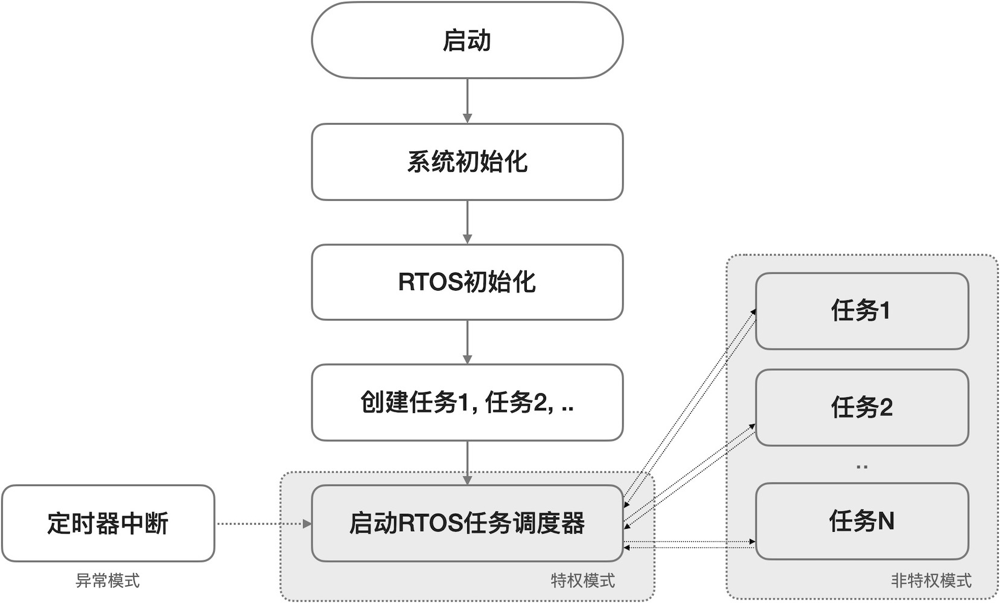

===========================
3.1 有OS的嵌入式系统软件
===========================

桌面计算机系统和PMD(个人移动设备)的软件开发统称为应用程序(或称作App)开发，在Windows、Linux、macOS、iOS、Android等标准OS环境运行的应用程序
开发的难点是算法和软件性能优化等，开发重点是API(应用程序接口)的应用，开发方法和开发环境非常成熟。但是，开发带有OS的嵌入式系统软件却完全不同。

嵌入式系统软件可以使用的OS通常被称作嵌入式OS(Embedded OS)或RTOS(RealTime Operating System)，在OS环境运行的软件绝大多数都采用事件驱动的
(Event Driven)风格，但使用RTOS的软件意味着某个事件发生所触发的任务必须在预定时间内完成(不是最快完成，而是在预定的截止时间之前完成)。

嵌入式OS都是多任务的(单任务的OS没有使用价值)，借助于OS的任务调度器(Task Scheduler)可以并行执行多个任务。带有RTOS的嵌入式系统软件模型如图3.1所示，
系统启动后执行必要的初始化操作(如Bootloader)、RTOS初始化，然后创建多个任务并启动调度器，这些操作都是一次性执行的代码，RTOS调度器本身是一个无穷循环，
他在定时器中断的辅助下控制多个任务并行执行。

图3.1  多任务RTOS的模型

任务调度器能够并行处理多任务的机制是，将CPU的时间分割为多个时间片并分配给已经创建的多个任务，每个任务占用CPU的一个时间片，当正在执行的任务的时间片
消耗完毕时，调度器实施任务切换(即将正在执行的任务挂起，继续执行下一个任务)，每一个任务按分配的时间片占用CPU一定时间后被挂起，如此无穷地循环，
让我们感觉多个任务被并行执行。其中，时间片的分割粒度由定时器的中断/溢出周期来决定，通过对定时器溢出周期的编程配置即可改变时间片粒度。

这是一种最简单的按时间片轮转的多任务调度器，当我们需要优先处理某些任务时，抢占型RTOS就很必要。抢占型RTOS的任务调度器相对复杂，每个任务不仅有自己的
时间片，还有自己的优先级，正在执行的低优先级任务的时间片可能会被高优先级的任务抢占。

嵌入式系统软件使用OS有什么益处呢？支持任务驱动和多任务的软件设计方法能够将复杂的嵌入式系统软件分割成多个易于实现的简单任务软件，不仅易维护还能确保实时性。
譬如无人机的飞控系统软件需要实时无线通讯、实时姿态控制、实时避障、实时定位、视频采集和视频流回传等功能，几乎所有功能都需要很高的执行频次，
如果没有RTOS的支持直接编写飞控系统软件将会耗费很长的开发时间。

使用OS的缺点是哪些？任何RTOS都需要额外占用嵌入式系统有限的ROM空间和RAM空间，如ucLinux需要2MB RAM；RTOS的任务调度器需要占用CPU的时间实现任务调度
和任务切换，尤其任务切换时需要将待挂起任务的寄存器等状态信息保存到该任务的控制块(TCB)并将待调度的下一个任务的寄存器等状态信息从其TCB中恢复，
这个过程需要耗费一定的CPU时间；每个任务的TCB肯定会额外的占用RAM空间。因此，简单的嵌入式系统软件完全没有使用RTOS的必要。

在嵌入式系统开发过程中使用RTOS还存在一些困难。其一是，RTOS种类繁多且无统一的标准API，甚至对开发环境和软件工具也有特殊要求(没有统一的开发环境)；
其二是，昂贵的商用RTOS授权费，虽然也有很多种免费的甚至开源的RTOS可以选择，但是没有技术支持也可能会增加软件开发时间和技术成本；其三是，RTOS的Bug，
虽然所有RTOS研发者都认为自己已经尽力做到最好，但复杂的RTOS内核软件和相关中间件本身就是庞大的软件系统，有Bug是在所难免的。

--------------------------

RTOS的实际使用情况咋样呢？图3.2是根据EETims杂志2020年初发布的全球操作系统市场调查结果，其中包含很多种RTOS。

图3.2  2019年操作系统市场全球调查(数据来自EETimes杂志)

去掉我们熟悉的桌面计算机系统的OS，其他的几乎都是RTOS，限内部使用的/订制的OS除外。免费且开源的eLinux [1]_ 和FreeRTOS [2]_ 的市场占有比例占绝对优势，
比例相近的TI RTOS [3]_ 和VxWorks [4]_ 分别是免费的和商业的RTOS，但相较于免费且开源的uC/OS-II和uC/OS-III [5]_ 的总体比例还是有差距，
半免费的(即个人免费但企业非免费)QNX [6]_ 和低授权费的MQX [7]_ 的比例也很接近。

很显然，完全免费且开源的RTOS非常受欢迎。注意，eLinux并不是实时的OS，适合PMD类计算机系统。FreeRTOS、TI-RTOS、uC/OS-x等属于免费完全开源的RTOS，
他们的市场占有比例与使用难易度和通用性有关：FreeRTOS和uC/OS-x都是通用型RTOS，但后者使用难度略大于前者；TI-RTOS仅支持TI自己的MCU和DSP。

前些年ARM公司为打造ARM Cortex-M系列MCU的生态系统而收购德国知名的IDE(集成开发环境)软件公司——Keil，并将RTX RTOS [8]_ 作为Keil IDE的一个独立扩展包，
虽然RTX RTOS未上榜，作为ARM Cortex-M生态系统的一部分必有一定的市场份额。RT-Thread [9]_ 是国内的免费且开源的RTOS，也未上榜。

图中的所有RTOS都支持基本的时间片轮转调度和按任务优先级抢占调度模式，在RTOS初始化阶段通过编程来配置或编译前使用配置文件来选择模式。

--------------------------

参考文献：
::

.. [1] (Embedded Linux : eLinux) https://www.elinux.org/Main_Page
.. [2] (FreeRTOS) https://www.freertos.org/index.html
.. [3] (TI-RTOS) https://www.ti.com.cn/tool/cn/TI-RTOS-MCU
.. [4] (VxWorks) https://www.windriver.com/products/vxworks/
.. [5] (uC/OS-x) https://www.micrium.com/
.. [6] (QNX) https://blackberry.qnx.com/en
.. [7] (MQX) https://www.nxp.com/design/software/embedded-software/mqx-software-solutions:MQX_HOME
.. [8] (RTX RTOS) https://www2.keil.com/mdk5/cmsis/rtx
.. [9] (RT-Thread) https://www.rt-thread.org/
