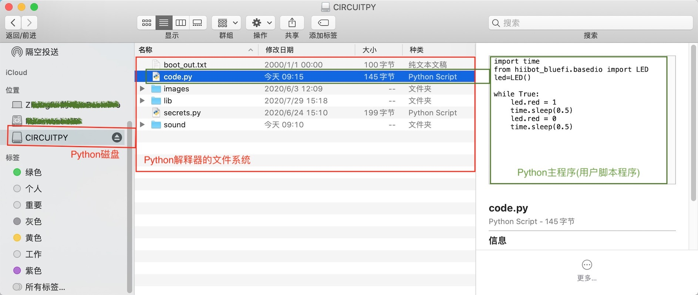
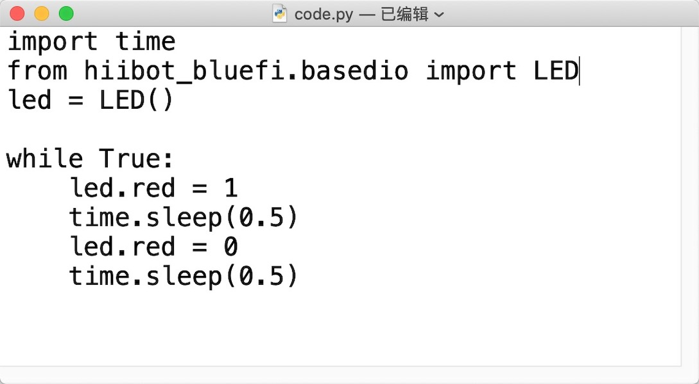
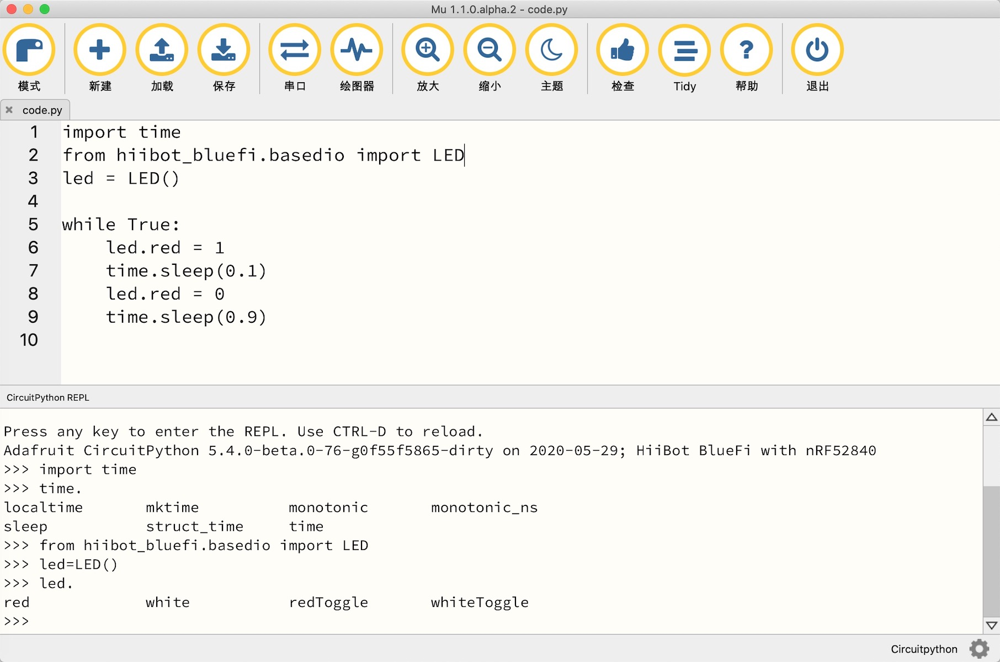
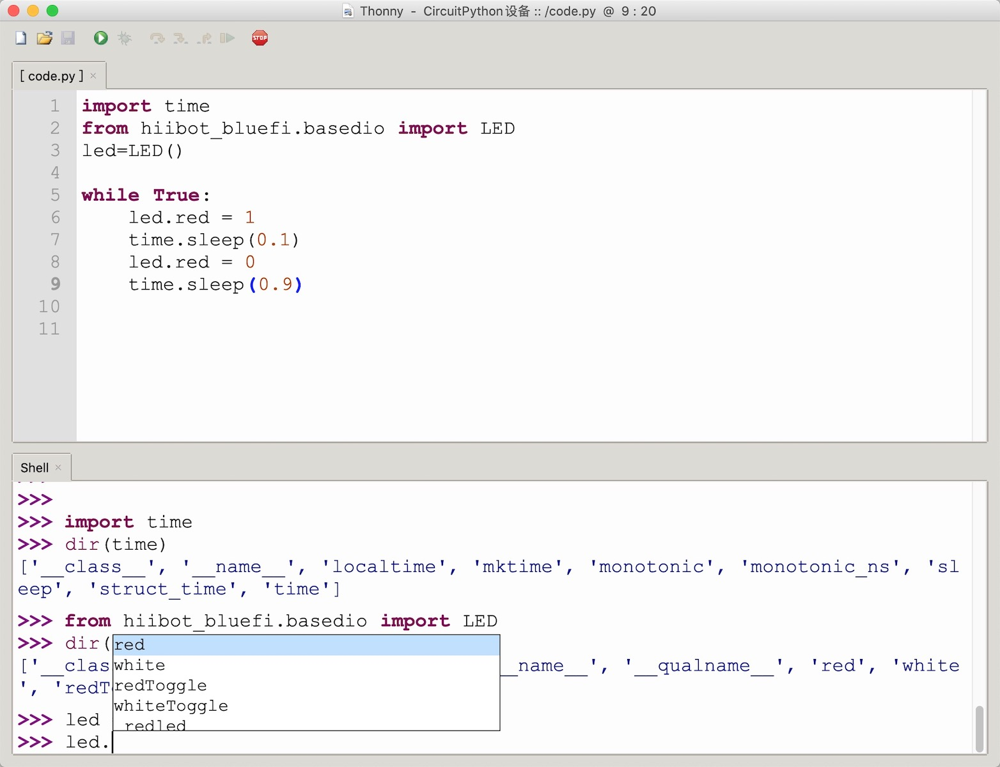

================================
3.3 Python解释器和Python脚本
================================

前面两节所讨论的内容中假设我们使用编译型语言开发嵌入式系统软件，过去的20年内这是非常常见的。近些年Python、JavaScript等脚本语言盛行，
不仅被广泛用于桌面计算机系统的应用程序开发，还用于服务器软件部署，以及各种网络应用程序开发，并逐步进入嵌入式系统软件开发领域。今天，
Python和JavaScript等都是嵌入式系统软件开发的语言。本节探讨Python脚本语言如何用于嵌入式系统软件开发以及相关的基本概念。

C/C++语言是典型的编译型编程语言，编程者必须将C/C++源码及其所用的第三方库的源码一起使用编译器(编译型语言的工具链之一)逐个地转换成目标计算机系统的
汇编语言程序，然后再把这些汇编语言程序和所用的第三方汇编语言库和二进制库一起使用链接器(编译型语言的工具链之一)转换成可被目标计算机系统执行的机器码文件，
然后借助于专用的下载器(如JTAG)将这个机器码文件下载到嵌入式系统板上的指定ROM空间(如片上FlashROM的Code区)，然后再给系统复位后才开始执行我们的程序。
这是我们再第一章中就提到的使用编译型语言开发嵌入式系统软件的部分常规流程。

然而，Python脚本语言程序的特殊运行环境——Python解释器彻底改变嵌入式系统软件开发的流程。Python解释器是一个独立的应用程序，可以从文件逐行读入Python
脚本程序，且逐行执行并立即给出执行结果。作为一个独立的应用程序，Python解释器本身与操作系统和硬件有关，即不同系统使用不同的Python解释器，
譬如到Python官网 [1]_ 下载一个最新版的Python解释器时被提醒根据自己的计算机系统所用的OS类型来选择下载源，换句话说，我们也不能让某个嵌入式系统
执行桌面计算机可用的Python解释器。因此，Python解释器有很多种版本，虽然他们支持的Python语言的语法并无区别，但支持的内部库存在一定区别。

软硬件运行环境的高度依赖性，意味着每一个嵌入式系统都有一个独立的Python解释器，虽然他们大多数的区别并不大。Python之所以得到广泛认可，原因有多个方面，
但是高效率地编程特点是最关键原因之一，Bruce Eckel使用“Life is short, you need Python(人生苦短，我用Python)”来描述Python的这一特点。
Python语法简洁，在Python解释器环境无需编译即可直接执行，仅仅这一特点就可以让编译型语言立现笨拙。

除了能从Python脚本程序文件中逐行地读入-执行-输出结果之外，Python解释器也支持从交互型控制台(一种命令行输入和输出的接口)接收输入的Python语句，
并立即执行且输出结果，这个过程被称作REPL，即“读取(Read)-运算(Eval)-输出(Print)-循环(Loop)”的首字母缩写。

Python解释器很像一台能够执行脚本语句的计算机，具有普通桌面计算机一样的文件系统(脚本程序文件和库文件等)和人机交互接口(接收脚本语句并输出执行结果)。
我们在第一章的图1.12中对比编译型语言程序和脚本语言程序是如何转换成机器码的过程。虽然Python解释器有很多种版本，无论是在桌面计算机或嵌入式系统上运行的Python解释器，
一个与硬件无关的算法型Python脚本程序都能直接执行，而且执行结果也都一样。为什么有这样的统一性为什么呢？需要了解Python解释器的工作机制。我们知道，
不同指令架构体系的CPU的指令集完全不同，任何编程语言所编写的计算机程序都必须被转换成机器码才能被目标计算机系统所执行。但是，“虚拟机(Virtual Machine)”
的定义表面上打破这个原则，使得同一功能软件能够跨平台使用，譬如Java虚拟机。Python解释器也是基于虚拟机的概念，建立在虚拟机之上的脚本解释器表面上是跨指令架构体系的，
使得硬件无关的Python脚本程序能够被所有Python解释器执行。Python解释器和虚拟机如何执行脚本程序参见图3.10所示。

.. image:: ../_static/images/c3/python_software_execute_procedure.jpg
  :scale: 40%
  :align: center

图3.10  Python解释器和虚拟机

表面上看，Python脚本程序不需要编译和链接即可被执行，但仍需要被转换为机器码才能被特定CPU执行。Python解释器将脚本程序逐行转换为Python虚拟机认识的中间代码——字节码，
虚拟机再将字节码转换为机器码交给硬件执行。Python解释器和虚拟机的软件架构不仅让Python脚本程序能够跨指令集体系执行，且无需编译和链接。这与Java虚拟机解决跨平台问题有着相似之处，
但Java源程序仍需要先编译后才能执行。

--------------------------

嵌入式系统使用的Python解释器的软件架构是什么样的呢？如图3.11所示。与桌面计算机系统所使用的Python解释器的软件架构相比，Bootloader是嵌入式系统特有的，
用于更新Python解释器固件，当然这是可选择的部分，独立于Python解释器之外的。当我们需要升级Python解释器固件时，借助于Bootloader将更容易且无需专用工具。
使用Boot引脚和复位引脚的配置可以让系统进入Bootloader。

.. image:: ../_static/images/c3/python_interpreter_structure.jpg
  :scale: 40%
  :align: center

图3.11  嵌入式系统使用的Python解释器的软件架构

Python解释器使用的文件系统兼容桌面计算机的文件系统。因此，在桌面计算机(宿主系统)上编写脚本程序并保存为特定扩展名称(如.py)的文本文件，将脚本程序文件传送到
Python解释器的文件系统中即实现用户程序下载。

Python解释器启动后首先从文件系统中打开并执行Python主程序，一般来说这个主程序的文件名是预设的，譬如code.py或main.py。执行Python主程序期间如果需要
使用某些Python库，对应的库文件必须已在文件系统中，否则会终止执行主程序并从字符控制台输出出错的文件、代码位置(行数)和可能的原因等信息，然后进入REPL状态。

Python解释器启动后如果未找到预设的Python主程序，解释器处于REPL状态，即能够从字符控制台接收Python脚本语句，当接收到“回车”字符(即0x13)时立即执行该语句。
当Python解释器执行Python主程序期间REPL自动关闭，Python主程序执行完毕后自动进入REPL状态。如果Python主程序进入无穷循环，我们可以通过字符控制台向Python
解释器发送组合键“Ctrol+c”字符(即0x03)以终止Python主程序强制进入REPL状态。

总而言之，嵌入式系统的Python解释器有两种状态：REPL状态和执行Python主程序状态。REPL状态常用于调试脚本程序，或诊断系统硬件单元。

--------------------------

如何为一个特定的嵌入式系统制作Python解释器呢？几乎所以Python解释器都是使用C/C++语言编写的，即Python解释器本身是一个特殊的应用程序，如著名的MicroPython
完全使用C/C++编写，在嵌入式系统中这样的应用程序的机器码被称作固件，最简单的制作Python解释器的方法是下载现成的固件，譬如链接 [2]_ 页面有数十种MicroPython
固件可用。如果你还记得“每一种嵌入式系统有一个独立的Python解释器”，如果你使用 [2]_ 页面的某个嵌入式系统硬件，那么这里的Python解释器就可以直接使用。

如果我们必须自定义嵌入式系统的硬件，且允许使用STM32F4xx、CC3x00、ESP32或ESP8266等作为系统MCU/SoC，制作自定义硬件系统可用的Python解释器也很容易，
因为绝大多数Python解释器是开源的且运行该解释器的嵌入式系统硬件也是开源的。具体过程包括：1) 参考相关的开源硬件定义自己的嵌入式系统硬件电路；2) 搭建
开源Python解释器的编译环境(含编译器等工具链)；3) 下载开源Python解释器的源码；4) 根据自定义的系统硬件资源修改/移植Python解释器源码；5) 编译并输出
Python解释器固件；6) 下载到自定义的嵌入式系统。其中的第4步是关键，主要涉及MCU片上外设和I/O引脚用法、片外扩展资源的接口等相关代码的修改，这些工作需要
C/C++编程经验。

如果你嫌弃开源的MicroPython解释器支持的MCU类型太少，作为MicroPython的后裔——CircuitPython [3]_ 支持更多种ARM Cortex-M0/M0+/M4/M7系列MCU。
虽然Python解释器目前支持的MCU仅限ARM Cortex-M和ESP两个系列的MCU/SoC，相信不久的将来在开源社区将会涌现更多种Python解释器。将开源Python解释器
移植到其他MCU很难吗？理论上将不难，但是工作量很大，尤其Python虚拟机部分代码必须针对目标MCU的指令集、存储器系统和中断系统等完全重构。当你体会到
Python的便捷性和高效率时，务必记得“你的轻松是因为有人替你负重前行”。

然而，除了自己编写的Python脚本程序之外，Python解释器并不能改进我们的嵌入式系统产品的功能，他仅仅是执行Python脚本程序的一种特殊软硬件环境。现在的问题是，
编写Python脚本程序的模式是什么样子？

Python是一种典型的面向对象编程(Object Oriented Programming)语言，Python支持封装、继承和多态等特性，而且Python还支持更灵活的动态库加载方法。
此外，Python语言本身不仅支持常用的基本数据类型(包括实数型和复数型、数组、字符串等)，还支持列表、元组、字典等复合数据类型。

--------------------------

百闻不如一试，接下来我们用BlueFi来体验Python的高效率。首先使用USB数据线(数据线与电源线完全不同)将BlueFi与我们的电脑连接好，打开电脑的文件系统或电脑资源管理器，
将会看到一个名称为“CIRCUITPY”的可卸载/移动磁盘。展开CIRCUITPY磁盘将看到磁盘上的全部文件和文件夹，这是BlueFi上预装的Python解释器的文件系统，
这个文件系统显然与桌面计算机的文件系统完全兼容，支持修改、保持、删除、复制-粘贴等文件操作。BlueFi的Python解释器文件系统如图3.12所示。

图3.12  BlueFi上的Python解释器的文件系统

请注意，上图中的文件和文件夹仅仅是一个示例，不必完全相同。BlueFi上的Python解释器的文件系统中，code.py文件是默认的Python主程序，你可以修改并保持这个脚本程序，
但不能修改他的文件名称！secrets.py是另一个Python脚本程序文件，该文件仅定义一个字典(dict)型数据列表(list)，这个列表定义BlueFi联网所需要的一些信息，
如WiFi热点名称和密码等。boot_out.txt是一个纯文本文件，“.txt”这种扩展名称是很多人都熟悉的，用文本编辑器打开这个文本文件可以查看到文件内详细信息。
CIRCUITPY磁盘上还有三个文件夹：lib、images、sound，他们分别保存Python库、图片资源和声音资源文件。其中lib文件是非常重要的，BlueFi上的Python解释器要求
code.py主程序使用的所有库文件必须保存在CIRCUITPY磁盘根目录的lib文件夹中。

如何修改code.py程序文件呢？这是一个纯文本格式的Python脚本程序文件，意味着桌面计算机系统的任意文本编辑器都可以用于修改、保存该文件。如图3.13所示。

图3.13  使用文本编辑器打开、修改、保存code.py文件

试一试用你电脑上的文本编辑器打开“CIRCUITPY/code.py”文件并修改、保存，把两个“time.sleep(0.5)”语句中的“0.5”分别修改为“0.1”和“0.9”，然后保存该文件，
只要重新保存code.py文件时BlueFi上的Python解释器就重新开始执行该文件，你会观察到不同的执行效果(BlueFi上的红色LED闪烁的效果发生明显变化)。
修改后的code.py脚本程序如下：

.. code-block::  python
  :linenos:

    import time
    from hiibot_bluefi.basedio import LED
    led=LED()

    while True:
        led.red = 1
        time.sleep(0.1)
        led.red = 0
        time.sleep(0.9)

这个code.py脚本程序与观察到的现象之间有什么关系呢？执行这个脚本程序的第1行时导入“time”模块(module，即一个Python库)，第7行和第9行程序代码
使用该模块的“sleep( value )”函数产生“让CPU等待若干时间的效果”(等待时间的长短由参数“value”指定，这个参数的单位是秒)；执行第2行语句是从“CIRCUITPY/lib/hiibot_bluefi”
库文件夹的“basedio.py”模块中导入“LED”类对象，并在第3行语句中将该对象实例化为名叫“led”的变量，然后在第6行和第8行分别将该对象的“red”属性值分别设为“1”和“0”；
第5行程序是一个无条件循环语句，与第6～9行四个语句一起组成一个无穷循环程序块。

这个简单的示例程序比较容易理解，首先导入(import)主程序需要用到的库模块，然后在一个无穷循环体内执行“让BlueFi的红色LED亮，延时若干时间，再让BlueFi的红色LED灭，
并延时若干时间”，我们看到BlueFi上的红色LED不断地闪烁的效果。

或许你已有编写Python脚本程序的经验，或者通过这个简单示例已经发现：Python脚本程序中的“程序块”是根据程序语句行首的空格个数/Tab键个数来界定，譬如示例中的无穷循环程序块。
当然前一行的“:”是必须的，这个符号是程序块的开始标志。Python编程语言的具体语法细节请参考相关书籍 [4]_ 

--------------------------

只需要一个文本编辑器就可以编写嵌入式系统的Python脚本程序，下载程序到目标系统也仅仅是文件保存或文件复制-粘贴等操作，这些便捷性和高效率应归功于Python解释器。
除了文本编辑器之外，是否有嵌入式系统专用的Python工具软件呢？有，如MU、Thonny等开源Python工具软件。在嵌入式系统专用的Python工具软件中编辑Python脚本程序更容易，
因为语法高亮、自动锁进行首以确保程序块对齐等功能，这是普通文本编辑器所不具备的。几乎所有嵌入式系统专用的Python工具软件都支持REPL，当我们想要了解某个模块支持
哪些接口函数时，除了翻阅帮助文档外，还可以直接使用REPL获取这些信息，而且用REPL调试程序也是Python脚本程序开发过程中最常用的。

开源的嵌入式系统专用的Python工具软件——MU编辑器 [5]_ 的界面如图3.14所示。用鼠标点击按钮栏的“模式”可以指定MU编辑器使用的Python解释器，或者将BlueFi连接到电脑后由MU编辑器自动识别并切换模式。
点击“串口”按钮将打开字符控制台，在新打开的窗口中使用“ctrl+c”和“ctrl+d”强制BlueFi上的Python解释器进入和退出REPL模式。在REPL模式，我们可以在“>>”提示符后输入脚本程序语句，
譬如“import time”和“dir(time)”等语句，BlueFi上的Python解释器会自动列出内置的“time”模块所支持的接口函数名或子类名。

图3.14  MU编辑器的界面

Thonny(托恩)编辑器 [6]_ 是爱沙尼亚塔尔图大学维护的一个Python开源项目，其界面如图3.15所示。表面上，MU和Thonny区别很大，但仅仅是界面风格的区别。

图3.15  Thonny编辑器的界面

MU和Thonny两种开源的嵌入式系统专用的Python工具软件都支持，可选择的多种Python解释器、REPL、Python解释器的文件操作(加载、保存)、绘图仪等基本功能，
Thonny编辑器拥有更多的Python解释器文件系统操作功能，以及代码树等扩展窗口。相较于普通文本编辑器，用这两种工具编写和调试Python脚本程序都非常方便，
具体选择那种工具软件根据自己的使用目的和喜好确定。总的来说，MU编辑器短小精悍且比较稳定，Thonny功能强大但部分功能不稳定。

--------------------------

最新的热门编程语言排行榜上，除了Python脚本编程语言之外，JavaScript脚本编程语言也十分流行，支持Python的大多数嵌入式系统都支持JavaScript语言。
执行JavaScript脚本程序必须使用JavaScript解释器，他与Python解释器的架构相似。

--------------------------

参考文献：
::

.. [1] https://www.python.org/
.. [2] http://micropython.org/download/all/ 
.. [3] https://circuitpython.org/ 
.. [4] Eric Matthes, 袁国忠 翻译, Python编程: 从入门到实践, 人民邮电出版社, 2016.7
.. [5] https://codewith.mu/
.. [6] https://thonny.org/