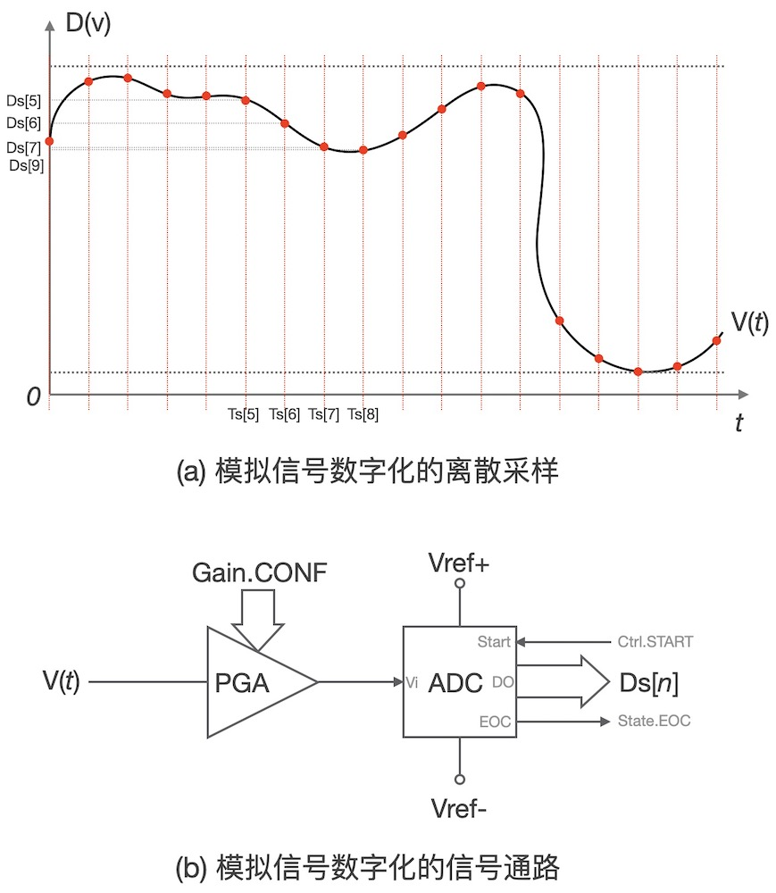
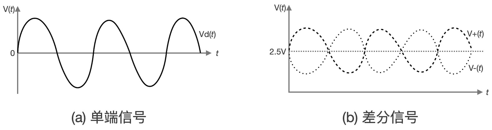
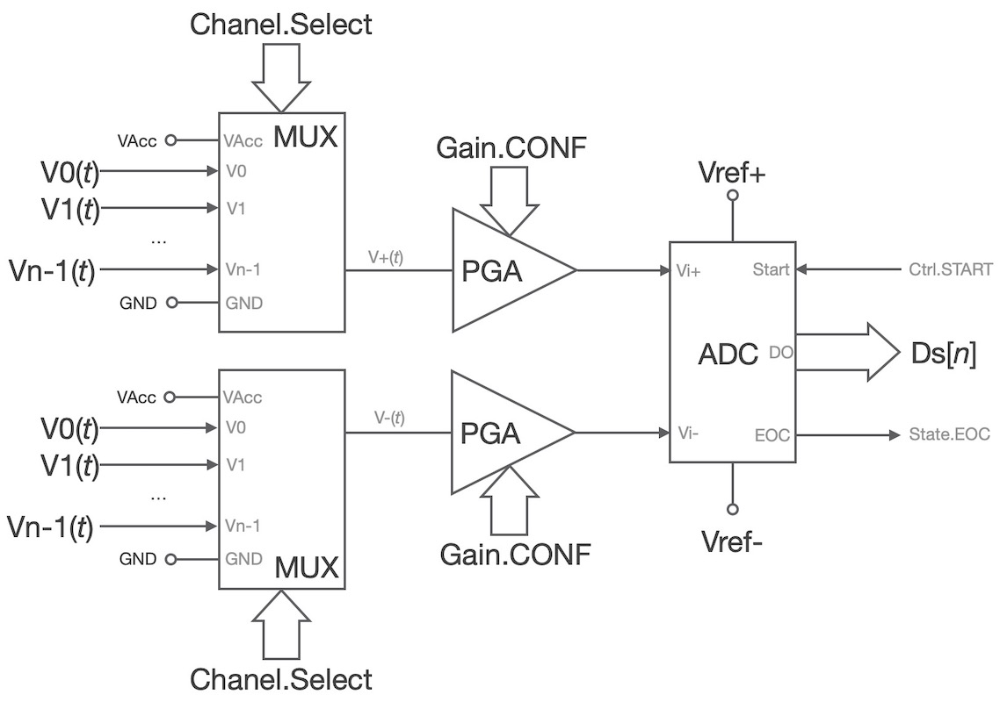
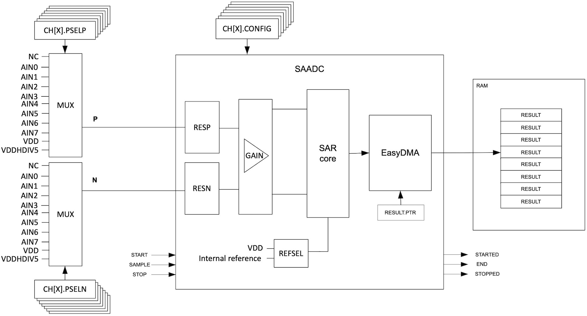
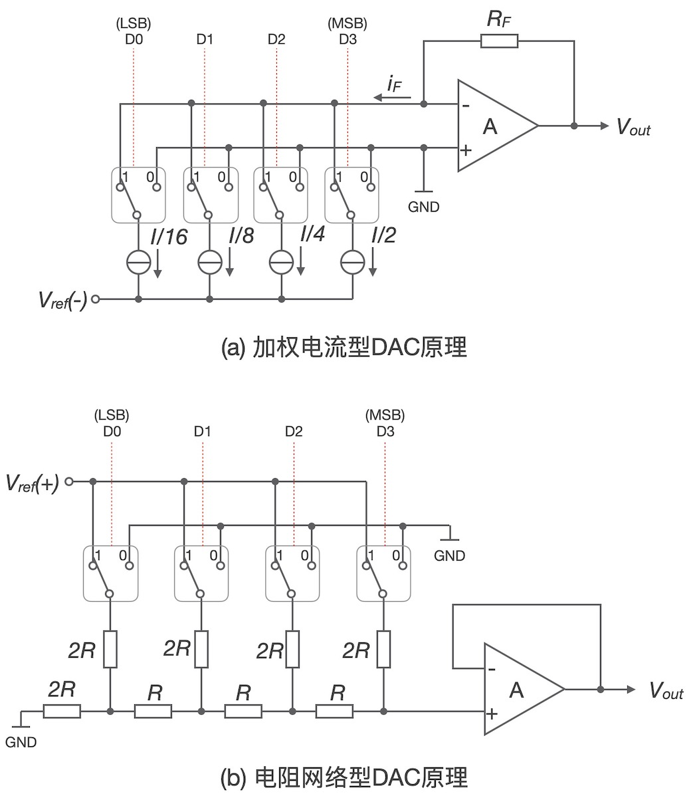
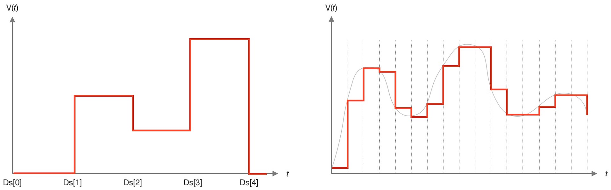

===========================
4.2 可编程模拟输入和输出
===========================

数字信号仅有“1”和“0”两种有效值，而模拟信号是连续变化的，譬如室温、气压等。模拟信号是有界的，即量程范围，一般使用最小值和最大值来描述。
由于计算机系统内部只能接受数字信号，模拟信号必须使用ADC等器件进行数字化，优良的ADC不仅具备高分辨率还有很高线性度，在有效量程范围内始终保持：

  Data =  2^(n-1) * (Ai-Amin) / (Amax-Amin) 

线性关系。其中Data是n个二进制位宽度的数值，Ai是[Amin, Amax]量程范围内的连续信号。很显然，Data的二进制位宽度越大，数字化信号的分辨率越高。
ADC等数字化器件的分辨率是指，引起输出数值Data向相邻数值变化的模拟信号的变化量，通常使用Data的二进制位宽度来度量分辨率。
一般来说，温度、气压、流量等物理量需要经过传感器和信号调理电路转换为连续的电压信号，然后再使用ADC等数字化器件转换为数字信号。
所以，上述的线性关系不仅受ADC等数字化器件的线性度影响，也会受到传感器和信号调理电路的线性度的影响。理论上的线性器件很难实现，
实际应用时常通过减小量程范围来确保线性度(即使用局部线性度)。

由于计算机系统内核和外设使用时钟信号按节奏地工作，且ADC等数字化器件实施信号量化转换的过程需要耗费一定时间(数微秒的量级)，
连续模拟信号按一定时间间隔(称采样周期)被采样、量化、转换为离散的数字信号。如图4.4所示。

图4.4 连续信号被采样、量化、转换为数字信号的过程

经过数字化的模拟信号仅仅保留采样时刻的信息，为了防止丢失连续信号的原始特征(如频率、幅值等)，采样周期(或频率)的选择非常重要。
程序指令通过控制ADC器件的“START”信号启动采样、量化和转换过程，当AD转换完毕后，通过切换“EOC”信号的电平状态通知系统读取转换结果。
这样结构的ADC器件很容易设计成中断驱动模式，根据采样周期配置MCU的定时器产生周期性中断启动AD转换，并使用ADC的“EOC”信号申请中断，
在“EOC”的中断服务程序内读取AD转换结果。

大多数嵌入式系统的ADC等数字化器件前端都带有PGA(可编程增益放大器)，以满足更宽量程范围的模拟信号，虽然ADC等数字化器件的输入量程范围是固定的。
如图4.4，ADC器件能够接受的模拟电压输入范围为[Vref-, Vref+]，通过调整PGA的增益可以把不同量程范围的V(t)信号调整到[Vref-, Vref+]范围。

常用的模拟信号有两种，单端信号和差分信号。本质上，所有模拟信号都是差分形式，单端信号是由信号本身和地信号组成的一种特殊差分信号对。
标准的差分信号对仅需要一对双绞线即可传输信号，无需地信号线，具有极好的抗共模干扰能力和高信噪比等特性。在差分信号处理单元的输入端，
差分电路单元能够将差分信号转换为单端信号。单端模拟信号和差分模拟信号的形式如图4.5所示。

图4.5 单端信号和差分信号

为了能够对单端的或差分的模拟信号数字化，ADC等数字化器件之前的模拟信号通路和处理单元被称作模拟信号前端。典型的模拟前端和ADC单元如图4.6所示。
使用多路模拟信号选择器和PGA可以让多个模拟输入信号共用一个ADC等数字化器件，这种模拟前端有利于降低成本。

图4.6 多路模拟信号的数字化处理单元

随着混合信号IC技术的发展，集成ADC等数字化器件的成本越来越低，现代大多数通用的MCU片上都带有可编程分辨率的ADC单元和模拟信号前端处理单元，
譬如nRF52840的片上带有一个可编程分辨率(8/10/12位)的ADC及其模拟前端单元，其内部结构如图4.7所示。

图4.7 nRF52840的片上ADC单元及其模拟前端

逐次逼近型(SAR)ADC是最常用的数字化器件，从采样到输出转换结果的整个过程所用的时间是固定的。一般来说，逐次逼近型ADC器件的内部都有一个DAC单元，
相较于积分型ADC器件，逐次逼近型ADC成本高转换速度快但分辨率较低。

-------------------------

借助于传感器、模拟前端和ADC等数字化器件，我们能够将现实世界各种连续变化的物理信号转换为计算机系统能够处理的数字信号。反过来，
我们依然可以将数字信号转换为连续变化的模拟信号，这需要DAC等数-模转换器件。在原理上，常用的DAC器件分为加权电流型和电阻网络型两种。
如图4.8所示，图中仅以4位分辨率的DAC来说明两种DAC的内部结构原理，实际可用的DAC具有多种分辨率，部分还具有可编程分辨率，包括8/10/12/16位等。

图4.8  两种DAC器件的内部结构原理

DAC器件的分辨率也可以使用其二进制位宽度来衡量。实际的DAC分辨率是指，DAC的数据输入变化一个相邻数字时输出的模拟信号变化量。
虽然既有输出连续变化的电压信号的DAC器件，也有输出电流信号的DAC器件，图4.8中仅以输出电压信号为例。根据运算放大器的工作原理，
加权电流型DAC输出的电压Vout = RF * iF，当反馈电阻RF不变时输出电压完全由iF决定，而iF正好等于4个电流源输出电流的加权和，
改变二进制数值[D3~D0]的值即可改变其权值，DAC输出的电压也随之变化。电阻网络型DAC由“R-2R电阻网络”、模拟电子开关和电压跟随器等组成，
DAC输入的数字位控制模拟开关的位置切换，进而改变电阻网络的串并联结构，使得电压跟随器输入端随之电压变化。虽然“R-2R电阻网络”的实现成本低，
缺点也十分地明显：电阻的一致性和电子开关的导通电阻等影响电流精度。

原理上，软件控制DAC器件输出的连续变化的电压或电流信号是籍由电子开关控制电阻网络的电压或加权电流来实现的，输出信号是有限分辨率的。譬如，
图4.8(a)中4位DAC输出的电压Vout = RF * iF = Data * RF * I/16，其中I是恒流源的电流，I与RF一样都是是固定不变的，4位宽的Data仅有16个取值，
Vout只能输出有限集合[0, RF*I/16, 2*RF*I/16, 3*RF*I/16, .., 15*RF*I/16]内的16个值的电压信号。

理论上，零阶保持器(ZOH)是使用DAC器件构建连续变化的模拟信号的数学模型，即每个采样点保持一个采样间隔。DAC器件使用零阶保持器将离散的采样点信号转换为连续信号的效果，
如图4.9所示。

图4.9  使用DAC器件构建的连续变化的模拟信号

在实际应用中，DAC器件并不能保持理论上的零阶保持器的特性，当输出电压信号变化期间还会叠加噪声信号，因此DAC输出的连续信号需要经过后端处理。
每一个模拟信号输出通道必须占用一个DAC器件，无法像模拟前端那样使用多路模拟开关让多路模拟信号共用一个ADC器件。

随着数字化系统的普及，DAC的应用场景越来越少，很多通用MCU器件内部并没有DAC器件，即使有，模拟输出通道也非常少，分辨率也较低。

-------------------------

现在来看看nRF52840的模拟输入和输出通道，前一节图4.2给出nRF52840的I/O引脚内部结构图，共有8个引脚支持模拟输入，片上带有一个可编程增益的、
可编程分辨率的逐次逼近型ADC，支持8路单端的或4路差分的模拟电压输入，但是片上没有DAC器件。BlueFi板上的网络协处理器——ESP32片上带有2个可编程分辨率的ADC，
最多支持12路单端模拟电压信号输入，片上带有2个8位分辨率的高速DAC单元。

ADC和DAC单元的编程控制非常简单，尤其DAC单元，需要改变输出电压时只需向控制DAC的寄存器写入相应数值即可，或将数据流写入RAM中再配置并启动片上定时器和数据指针，
在每一个周期性定时中断发生时启动DMA传输将RAM数据写入DAC寄存器并调整数据指针，这样可以快速构建指定采样间隔的模拟信号，譬如输出声音信号。
ADC的编程控制稍微复杂一些，首先控制多路模拟开关选择模拟信号输入通道(写通道选择寄存器)，然后设置“START”信号有效(写ADC的控制寄存器)，自动启动采样，
采样完毕后自动开始转换，期间我们的软件可以通过读取ADC的状态寄存器的某些位来查询转换状态，如果为转换完毕状态则读取转换结果到RAM。
大多数MCU的片上ADC单元都支持中断编程和DMA传输，尽可能少地占用CPU时间就可以实现模拟信号的采样、量化、转换和存储的过程。

在Arduino平台，我们不必直接访问ADC和DAC相关的控制、状态、数据等寄存器，直接使用下面两个内部函数即可：

  - **模拟输入**： uint16_t  adc_chx_value = ananlogRead(chx)
  - **模拟输出**： analogWrite(chx, value)

注意，第一个语句是读取ADC的单次转换结果到一个变量adc_chx_value中，该变量的类型(二进制位宽度)非常重要，必须根据当前ADC的分辨率来选择。
由于切换模拟通道、采样和AD转换的过程需要一定时间，第一个语句的执行时间长短取决于当前所用ADC的转换时间，理论上分辨率越低转换时间越短。
第二个语句的执行时间仅有几个机器周期，执行该语句期间需要切换模拟输出通道、配置模拟输出引脚的结构、写DAC寄存器等。

直接使用“ananlogRead(chx)”获取AD转换结果采用的是“查询-等待”过程，如果需要使用中断或DMA模式的AD转换，还是需要我们编程访问ADC及其模拟前端的控制、
状态和数据寄存器来实现。

BlueFi板上没有固定的模拟输入和输出外设，但40P的金手指拓展接口上的P0~P4、P14和P20等7个模拟输入通道。进入Python解释器的REPL模式，
使用“dir(board)”可以查询到这些引脚，REPL的命令行如下：

.. code-block::  python
  :linenos:

  >>> import board
  >>> dir(board)
  ['__class__', 'A0', 'A1', 'A2', 'A3', 'A4', 'A5', 'A6', 'ACCELEROMETER_INTERRUPT', 
  'AUDIO', 'BUTTON_A', 'BUTTON_B', 'D0', 'D1', 'D10', 'D11', 'D12', 'D13', 'D14', 
  'D15', 'D16', 'D17', 'D18', 'D19', 'D2', 'D20', 'D21', 'D22', 'D23', 'D24', 'D25', 
  'D26', 'D27', 'D3', 'D34', 'D35', 'D36', 'D37', 'D38', 'D39', 'D4', 'D40', 'D41', 
  'D42', 'D43', 'D44', 'D45', 'D46', 'D5', 'D6', 'D7', 'D8', 'D9', 'DISPLAY', 'I2C', 
  'IMU_IRQ', 'MICROPHONE_CLOCK', 'MICROPHONE_DATA', 'MISO', 'MOSI', 'NEOPIXEL', 'P0', 
  'P1', 'P10', 'P11', 'P12', 'P13', 'P14', 'P15', 'P16', 'P17', 'P18', 'P19', 'P2', 
  'P20', 'P21', 'P22', 'P23', 'P24', 'P25', 'P26', 'P27', 'P3', 'P34', 'P35', 'P36', 
  'P37', 'P38', 'P39', 'P4', 'P40', 'P41', 'P42', 'P43', 'P44', 'P45', 'P46', 'P5', 
  'P6', 'P7', 'P8', 'P9', 'REDLED', 'RX', 'SCK', 'SCL', 'SDA', 'SENSORS_SCL', 'SENSORS_SDA', 
  'SPEAKER', 'SPEAKER_ENABLE', 'SPI', 'TFT_BACKLIGHT', 'TFT_CS', 'TFT_DC', 'TFT_MOSI', 
  'TFT_RESET', 'TFT_SCK', 'TX', 'UART', 'WHITELED', 'WIFI_BUSY', 'WIFI_CS', 'WIFI_MISO', 
  'WIFI_MOSI', 'WIFI_PWR', 'WIFI_RESET', 'WIFI_SCK']
  >>> board.A6
  microcontroller.pin.P20
  >>> 

从导入“analogio”模块导入模拟输入类“AnalogIn”，并用他实例化某个支持模拟输入的引脚，然后通过实例化对象的“value”属性即可获取该引脚上的当前电压的AD转换结果，
REPL命令行如下：

.. code-block::  python
  :linenos:

  >>> import board
  >>> from analogio import AnalogIn
  >>> analog_in = AnalogIn(board.A0)
  >>> 
  >>> analog_in.value
  608
  >>>

注意，默认的模拟输入类“AnalogIn”的对象的ADC分辨率为12位，所以转换结果的最小值为0、最大值为4095。
通用的“analogio”模块也支持模拟输出类“AnalogOut”，我们同样可以先导入该类，并使用某个引脚实例化一个模拟输出类的对象，
然后用程序改变其“value”属性即可改变模拟输出。由于nRF52840没有片上DAC单元，所有引脚都不能当作模拟输出通道使用，
如果违例使用将会引起Python解释器的错误提示，并终止脚本程序。譬如，在REPL模式执行以下代码：

.. code-block::  python
  :linenos:

  >>> import board
  >>> from analogio import AnalogOut
  >>> analog_out = AnalogOut(board.A1)
  Traceback (most recent call last):
    File "<stdin>", line 1, in <module>
  RuntimeError: AnalogOut functionality not supported
  >>> 

当Python解释器执行实例化模拟输出类语句“analog_out = AnalogOut(board.A1)”时就立即给出“RuntimeError”型错误提示。

-------------------------

本节我们初步了解模拟信号如何与数字世界相连接，包括模拟输入信号如何被转换成数字信号，以及数字信号如何被转换成模拟信号，
其中ADC和DAC两种转换器件具有关键性作用。

-------------------------

参考文献：
::

.. [1] 
