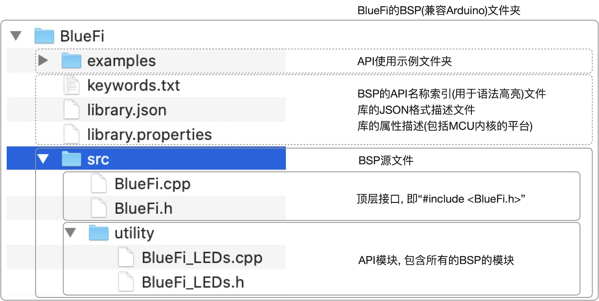

===========================
4.1 可编程数字输入和输出
===========================

数字型输入/输出外设仅有两种有效状态，习惯用On和Off、High和Low、打开和关闭、接通和断开等表示两种有效状态，譬如一个继电器触点的接通状态和断开状态、
一颗指示灯的on状态和off状态等。存储一个数字型输入/输出外设的状态信息仅需要一个二进制位。绝大多数MCU的可编程I/O引脚都可编程输出高电平和低电平，
这样的I/O引脚电平状态与相应接口电路即可控制数字型输出外设的状态，因此在MCU内部使用二进制位的“1”和“0”分别表示数字型输出外设的状态。
同时，通过读取MCU的I/O引脚的电平即可获取数字型输入外设的状态，并使用布尔型(Boolean)变量保存该状态。

很多编程语言都支持布尔型变量，尤其支持嵌入式系统的编程语言，譬如C/C++语言。虽然布尔型变量的有效值仅为“1”和“0”，如果目标计算机系统不支持位操作和位寻址，
布尔型变量仍占用一个字节或更多二进制位来存储一个二进制信息。现在的MCU绝大多数都支持位操作和位寻址，譬如ARM Cortex-M系列微内核支持“bit-band”操作，
允许存取指令访问单个数据位(详见 [1]_ 的6.7节)。

按钮和LED指示灯是最简单的数字型输入和输出外设，图4.1给出BlueFi上的按钮和LED指示灯的电路连接示意图。

.. image:: ../_static/images/c4/gpio_examples_reset_di_do.jpg
  :scale: 30%
  :align: center

图4.1 BlueFi上的按钮和LED指示灯的电路连接示意图

从上图中，我们不仅能够了解数字型输入/输出信号的电平电压、驱动电流、频率和复位期间的默认状态，还能了解如何读取数字型输入外设的状态到内部变量，
以及如何通过写外设存储区的地址单元来控制数字型输出状态。

BlueFi的主MCU(nRF52840)的外部复位信号的有效电平为低电平(详见nRF52840的产品说明文档 [2]_ )，且内部带有上电复位(即冷复位)电路(图中黄色的电阻和电容)，
图4.1给出最简单的外部复位电路：一个手动复位按钮，一端接地，另一端与“nRST”引脚连接。内部上电复位电路的电阻与MCU的工作电源连接，当外部手动复位按钮未被按下时保持复位引脚状态为高电平，
这个电平的电压显然与MCU的工作电压相等；当按下手动复位按钮时复位引脚的状态为低电平，这个电平的电压与电源地相同。当我们需要给nRF52840复位时，只需要按下复位按钮即可。
按下按钮时从“nRST”引脚强制施加低电平信号给MCU内核的内部复位电路单元将片上所有功能单元(含CPU)复位，当我们释放手动复位按钮后，片上的上电复位电路确保“nRST”引脚处于高电平，
CPU开始工作。我们在第2.7节已经了解到MCU的多种复位源，在复位期间，nRF52840内部的“RESETREAS”寄存器(0x4000 0400地址单元)将保存本次复位的信号源，
应用程序可以根据这个寄存器的内容来识别复位源。单按一次BlueFi的复位按钮是正常的系统复位，而连续双击BlueFi的复位按钮，你会发现BlueFi进入Bootloader状态。
这个功能是使用“RESETREAS”寄存器的内容。

BlueFi的A和B按钮是可编程的，两个按钮的电路连接完全相似(除了使用不同的I/O引脚)，图4.1中仅给出A按钮的电路连接。A按钮的接口电路不仅包含片外的按钮，
还包含片内的可配置上拉/下拉电阻，由于A按钮的一端与MCU工作电源连接、另一端与P1.7引脚连接，当A按钮按下时P1.7引脚被强制与电源连接；如果P1.7的内部配置为下拉电阻，
当A按钮释放时P1.7引脚被下拉到电源地。通过读取P1.7引脚的状态确定A按钮的状态，当A按钮按下时读取状态的结果为“1”(即高电平)，当A按钮释放时读取状态的结果为“0”(即低电平)。
当我们将A按钮的状态保存到一个布尔型变量时，如果不采用DMA(直接存储器访问)方式，nRF52840的CPU的工作过程为：将P1.IN寄存器(即0x5000 0810地址单元)读入CPU内部某个寄存器，
然后再将D7位的值(即P1.7引脚的状态)保存到布尔型变量(即“Bit_Band”区的某个地址单元)。

对于P1.7内部可配置的上拉/下拉电阻的使用，需要在BlueFi初始化期间根据A按钮的电路进行编程配置。按照图4.1，使用Arduino IDE平台，A按钮的初始化和使用代码参考如下：

.. code-block::  c
  :linenos:

  void setup() {
    // put your setup code here, to run once:
    pinMode(PIN_BUTTON1, INPUT_PULLDOWN); 
  }

  void loop() {
    // put your main code here, to run repeatedly:
    bool state_aBtn = digitalRead(PIN_BUTTON1);
    if (state_aBtn == HIGH) {
      // A button be pressed
    } else {
      // A button be released
    }
  }

第3行代码是调用Arduino内部函数“pinMode(PIN_BUTTON1, INPUT_PULLDOWN)”将P1.7引脚(即与A按钮连接的I/O引脚)配置为输入模式且使用内部下拉电阻。在Arduin IDE平台，
有三种输入配置：浮空输入(INPUT)、上拉输入(INPUT_PULLUP)和下拉输入(INPUT_PULLDOWN)。第8行调用Arduino内部函数“digitalRead(PIN_BUTTON1)”读取A按钮的状态，
由于按钮的状态为二进制型信息，所以将A按钮的当前状态暂存在布尔型变量“state_aBtn”中。根据图4.1的电路结构，当A按钮被按下时布尔型变量“state_aBtn”的值为“true”或“HIGH”。
注意，“HIGH”是Arduino平台的布尔型常量，“true”是C/C++编程语言的标准常量。

BlueFi有两颗亮起时颜色分别为红色和白色的LED指示灯，他们的连接电路如图4.1所示，两颗LED分别受P1.12和P1.14引脚控制。当程序将P1.OUT寄存器(即0x5000 0804地址单元)
的D12位置位时，P1.12引脚将输“1”(即高电平)，红色LED指示灯将亮起；当程序将P1.OUT寄存器的D12位清零时，P1.12引脚输入“0”(即低电平)，红色LED指示灯将熄灭。
BlueFi与其他数字电路采用相同的设计习惯，I/O引脚为高电平时对应的电压等于MCU的I/O工作电压，低电平对应的电压等于电源地，按照前一章的BlueFi电路原理介绍，
nRF52840使用3.3V作为I/O引脚电压。根据红色LED的正向压降、串联电阻的阻值和高电平的电压，我们可以计算出红色LED亮起时的电流(简称on电流)，这个电流的大小决定指示灯的亮度。

根据A按钮的状态控制红色LED指示灯亮和灭的代码如下：

.. code-block::  c
  :linenos:

  void setup() {
    // put your setup code here, to run once:
    pinMode(PIN_BUTTON1, INPUT_PULLDOWN);
    pinMode(LED_RED, OUTPUT);
  }

  void loop() {
    // put your main code here, to run repeatedly:
    bool state_aBtn = digitalRead(PIN_BUTTON1);
    if (state_aBtn == HIGH) {
      // A button be pressed
      digitalWrite(LED_RED, HIGH);
    } else {
      // A button be released
      digitalWrite(LED_RED, LOW);
    }
  }

按照“..\Arduino15\packages\adafruit\hardware\nrf52\0.20.5\variants\bluefi_nrf52840\variant.h“头文件中对BlueFi的I/O引脚用法的定义，
只需要将上述代码中的“LED_RED”引脚名称替换为“LED_WHITE”，然后编译并下载修改后的代码到BlueFi，可以使用A按钮控制白色LED的亮和灭。

与红色LED相比，你也许已经发现BlueFi的白色LED更亮一些。这说明，白色LED指示灯on电流大于红色LED。如果使用I/O引脚输出的高电平电压直接驱动LED，并不断地减小LED的串联电阻阻值，
LED的亮度将会不断地增加吗？如果假设I/O引脚输出的高电平电压是理想的(即内阻为0且功率足够大)，这个问题的答案是肯定的。事实上，所有MCU的I/O引脚的驱动能力都是有限的，
按拉电流和灌电流两种指标分别指定每一个I/O引脚的驱动能力。当I/O引脚的驱动能力无法满足LED指示灯on电流时，我们自然会想到外部驱动，如图4.1中使用外部NPN三极管驱动白色LED指示灯，
此时I/O引脚输出的拉电流被三极管放大数十倍(即三极管的放大倍数)作为白色LED指示灯on电流。当外部数字型输出外设需要更大的负载电流时，或许需要多级结构(如达林顿结构)的三极管提高放大倍数。

对于MCU的可编程I/O引脚，除了可配置的上拉/下拉电阻、可编程为输入/输出模式等，还有更多可配置的结构。以nRF52840为例，我们需要进一步了解其内部的结构，如图4.2所示。

.. image:: ../_static/images/c4/nrf52840_gpio_pin_details_pin0.jpg
  :scale: 20%
  :align: center

图4.2 nRF52840可编程I/O引脚的内部结构

在上图中，我们可以找到一个可编程输入/输出引脚的所有配置选项、输入通道、输出通道等。除了数字I/O功能之外，一个可编程输入/输出引脚也可以当作模拟I/O功能引脚使用，
图4.2中的“ANAEN”是编程配置一个引脚当作数字I/O或模拟I/O的控制位。关于模拟输入/输出的功能，详见下一节。在nRF52840的手册中，我们可以找到每一个可编程输入/输出引脚的
配置和控制相关的存储器地址和有效的控制位，“pinMode(pin,mode)”、“digitalRead(pin)”和“digitalWrite(pin,value)”等基本数字型I/O接口都是通过编程这些存储单元而实现的。

-------------------------

已经了解数字型I/O的电路和软件接口之后，我们可以接着第3章最后一节的任务：为BlueFi设计BSP，现在只涉及BlueFi的数字I/O相关的部分，即两个输入按钮和两个LED指示灯的BSP。
如果你是BlueFi的二次开发(编程应用)用户，你将会如何使用按钮和LED指示灯呢？BSP的目的是根据特定硬件电路封装API并加快二次用户开发的工作效率，譬如BlueFi的两个按钮的配置
(需根据按钮的电路结构)等，用户只需调用BSP封装的API即可得到“按钮被按下/释放/长按“，或直接控制“红色LED亮/灭/切换”等。

为了了解BSP的基本结构，我们首先来实现LED控制的API。

根据自己电脑上安装的Arduino IDE的首先项确定“项目文件夹的位置”，譬如“../Documents/Arduino”，在该文件夹中新建一个“libraries”子文件夹，
这个名称是固定的，这是自定义的Arduino库或第三方Arduino库文件夹，BlueFi的BSP显然属于此类。接着进入“libraries”子文件夹并新建一个名为“BlueFi”的子文件夹，
BlueFi的BSP都将放在该文件夹中。既然一个兼容Arduino的开源板的BSP是Arduino库文件，我们就可以找到一个Arduino开源库复制一个模版，点击下面链接可以下载模版文件：

. :download:`Arduino库模版文件 <../_static/dl_files/bluefi_ch4_1/BlueFi_ch4_1_1.zip>`

将下载到本地电脑上的压缩包文件解压到“../Documents/Arduino/libraries/BueFi/”文件夹中，该文件夹的文件树如图4.3所示。

图4.3  兼容Arduino的BSP的文件树

“../Documents/Arduino/libraries/BueFi/”文件夹中关键的BSP源文件都在“/src”子文件夹内。“/examples”文件夹是可选的，用来保持本API的示例程序。
“keyworks.txt”、“library.json”和“library.properties”等三个文件都是文本格式文件，虽然他们的扩展名不同，使用任意文本编辑器都可以修改其中的内容，
他们也是可选的。当然，你还可以在这个文件夹中增加其他文档，譬如read.me说明文档等。

“../Documents/Arduino/libraries/BueFi/src/utility/”文件夹中已经有2个源文件，“BlueFi_LEDs.h”和“BlueFi_LEDs.cpp”是一对标准的C/C++类API源文件，
一个是API声明文件(俗称头文件)，另一个是API实现的源码，两个文件的源码如下：

(BlueFi_LEDs.h文件)

.. code-block::  c
  :linenos:

  #ifndef ___BLUEFI_LEDS_H_
  #define ___BLUEFI_LEDS_H_

  #include <Arduino.h>

  class LED {
    public:
      LED(uint8_t pin);
      uint8_t getAttachPin(void);
      void on(void);
      void off(void);
      void toggle(void);
      bool state(void);

  private:
      bool __isInited;
      bool __state;
      uint8_t __pin;
  };

  #endif // ___BLUEFI_LEDS_H_

(BlueFi_LEDs.cpp文件)

.. code-block::  c
  :linenos:

  #include "BlueFi_LEDs.h"

  LED::LED(uint8_t pin) {
      __isInited = 1;
      __state = 0;
      __pin = pin;
      pinMode(__pin, OUTPUT);
      digitalWrite(__pin, __state);
  }

  uint8_t LED::getAttachPin(void) {
      return __pin;
  }

  void LED::on(void) {
      __state = 1;
      digitalWrite(__pin, __state);
  }

  void LED::off(void) {
      __state = 0;
      digitalWrite(__pin, __state);
  }

  void LED::toggle(void) {
      __state = (__state)?0:1;
      digitalWrite(__pin, __state);
  }

  bool LED::state(void) {
    return __state;
  }

这一对文件是LED输出控制类的API源文件，如何使用他们呢？打开“../Documents/Arduino/libraries/BueFi/src/BlueFi.h”文件：

.. code-block::  c
  :linenos:

  #ifndef ___BLUEFI_H_
  #define ___BLUEFI_H_

  #include "utility/BlueFi_LEDs.h"

  class BlueFi {

  public:
    BlueFi();
    void begin(bool LCDEnable=true, bool SerialEnable=true);
    LED redLED = LED(LED_RED);
    LED whiteLED = LED(LED_WHITE);

  private:
    bool __isInited;
  };

  extern BlueFi bluefi;

  #endif // ___BLUEFI_H_

第4行代码将"utility/BlueFi_LEDs.h"包含到BSP的顶层接口头文件中，并在第11行和第12行分别定义“redLED”和“whiteLED”两个LED类对象实体。
根据我们定义的LED类构造函数(见“BlueFi_LEDs.cpp”文件的第3行)，定义LED类对象实体时必须用输入参数指定LED的引脚。显然，
“redLED”和“whiteLED”都是BlueFi类(该BSP的总类)的成员变量，以后我们就可以像访问类成员变量一样地访问“redLED”和“whiteLED”，
以及此类API的接口方法。我们现在可以给出这个BSP的第一个API应用示例，代码如下：

.. code-block::  c
  :linenos:

  #include <BlueFi.h>
  void setup() {
    bluefi.begin();
    bluefi.whiteLED.off();
  }

  void loop() {
    bluefi.redLED.on();
    delay(100);
    bluefi.redLED.off();
    delay(900);
  }

这个示例源码见“../Documents/Arduino/libraries/BueFi/examples/blink_redled/blink_redled.ino”文件。第1行代码将“BlueFi.h”头文件包含进来，
第3行调用bluefi的成员函数“begin()”对BSP进行初始化，第4行调用成员变量“whiteLED”的成员函数(或方法)“off()”关闭白色LED指示灯。
在主循环程序中，调用成员变量“whiteLED”的成员函数(或方法)“on()”和“off()”，以及Arduino内部函数“delay(ms)”实现红色LED闪烁效果。

我们前面给的LED类源码中共有5个成员函数，分别控制LED亮、灭、切换，以及读取LED的当前状态和LED所连接的I/O引脚编号。以后我们还会再次维护这个LED类，
增加LED指示灯的亮度控制API等。对于BlueFi的两个按钮，如何实现他们的API呢？你可以参考LED类的源码自行设计，也可以在Arduino开源社区找一个现成的。
这次我们选择使用开源社区资源来创建BlueFi的按钮的API。使用链接“https://github.com/LennartHennigs/Button2”自行下载或直接点击下面链接下载按钮类的API源码文件：

. :download:`开源Button2类源文件 <../_static/dl_files/bluefi_ch4_1/bluefi_button2_ch4_1.zip>`

注意，github上下载的源码需要按照BlueFi的硬件稍作修改(也就是需要移植)，如果下载上面链接中的zip文件则可以直接解压后使用，如果需要了解修改的地方和为什么修改，
可以将两个链接的代码都下载下来进行对比分析。

将这个按钮类的API源码包中的“Button2.h”和“Button2.cpp”是源文件，其余都是示例代码和库说明文档，我们只需要将这两个源码文件复制到“../Documents/Arduino/libraries/BueFi/src/utility/”文件夹中，
为了不与其他的Arduino库混淆，建议将两个文件名分别修改为“BlueFi_Button2.h”和“BlueFi_Button2.cpp”，并分别修改两个源文件的部分内容(尤其#include "xx.h"等语句)，
然后将下面的三个语句添加到BSP的顶层接口文件“BlueFi.h”文件中：

.. code-block::  c
  :linenos:

  #include "utility/BlueFi_Button2.h"

  Button2 aButton = Button2(PIN_BUTTON1, INPUT_PULLDOWN, 50);
  Button2 bButton = Button2(PIN_BUTTON2, INPUT_PULLDOWN, 50);

显然，第1行语句应放在#include "utility/BlueFi_LEDs.h"的前后都可以；另外两行都必须放在“class BlueFi”的内部，建议放在“LED whiteLED = LED(LED_WHITE);”后面。

如此一来，我们就完成了BlueFi的按钮类API封装。如何使用他们呢？“aButton”和“bButton”也是BlueFi类的成员变量，访问方法与两个LED类成员变量一样；
但是LED类和Button2类的成员函数(或方法)却完全不同，现在需要打开“BlueFi_Button2.h”和“BlueFi_Button2.cpp”两个源文件并仔细查看所有成员函数。
为了帮助理解，我们给出一个简单的Button2类API应用示例程序，代码如下：

.. code-block::  c
  :linenos:

  #include <BlueFi.h>
  void setup() {
    bluefi.begin();
    bluefi.redLED.on();
    bluefi.whiteLED.off();
  }

  void loop() {
    bluefi.aButton.loop(); // update the state of A-button
    bluefi.bButton.loop(); // update the state of B-button
    if ( bluefi.aButton.isPressed() ) {
      bluefi.redLED.off();
    } else {
      bluefi.redLED.on();
    }
  }

初始化部分代码让红色LED指示灯亮、白色LED指示灯亮；在主循环程序中，调用Button2类成员函数“loop()”更新按钮的状态，并使用“isPressed()”成员函数判断按钮是否被按下。
这是一个非常简单的示例，用A按钮控制红色LED指示灯亮和灭，程序执行效果：按下A按钮时红色LED指示灯灭，释放A按钮时亮。

如果仔细查看Button2的两个源码会发现该类的大多数成员函数都是“setXxxHandler(CallbackFunction f)”类型，即设置按钮某种动作的回调函数(call-back function)，
譬如设置按钮被按下时的回调函数(setPressedHandler)等。回想前面讨论过的“中断驱动型编程模式”，回调函数可以模仿中断机制被执行(但与中断程序完全不同)。
下面的示例代码中演示如何使用Button2类的回调函数，代码如下：

.. code-block::  c
  :linenos:

  #include <BlueFi.h>
  void a_changed_cb(Button2& btn) {
    Serial.println(" A-Button be changed");
  }
  void b_pressed_cb(Button2& btn) {
    Serial.println(" B-Button be pressed");
  }
  void b_click_cb(Button2& btn) {
    Serial.println(" B-Button is click");
  }
  void b_2click_cb(Button2& btn) {
    Serial.println(" B-Button is double-click");
  }

  void setup() {
    Serial.begin(115200);
    bluefi.begin();
    bluefi.redLED.on();
    bluefi.whiteLED.off();
    bluefi.aButton.setChangedHandler(a_changed_cb); 
    bluefi.bButton.setPressedHandler(b_pressed_cb);
    bluefi.bButton.setClickHandler(b_click_cb);
    bluefi.bButton.setDoubleClickHandler(b_2click_cb);
  }

  void loop() {
    bluefi.aButton.loop(); // update the state of A-button
    bluefi.bButton.loop(); // update the state of B-button
    if ( bluefi.aButton.isPressed() ) {
      bluefi.redLED.off();
    } else {
      bluefi.redLED.on();
    }
  }

上面代码中，我们预先定义了4个回调函数，分别是当A按钮发生改变时(包括那些类型的改变呢?)、当B按钮被按下时、当B按钮被点击时、当B按钮被双击时需要执行的回调函数，
为了简化程序代码都仅仅向串口(字符)控制台发送一串字符信息来表示所执行的回调函数类别。并在初始化部分对串口(字符)控制台进行初始化(“setup()”代码库的第1行)，
以及回调函数的注册(“setup()”代码库的第5~8行)。主循环程序与前一个示例相同。该程序的执行效果：按下或释放A按钮时都会在串口控制台看到“A-Button be changed”提示信息；
B按钮按下或单击或双击时分别显示不同的信息。

如何看到控制台信息呢？在Arduino IDE菜单栏顺序点击“工具-->串口监视器”，在弹出的串口(字符)控制台窗口的右下角选择波特率(本示例应选择115200，与上面代码的参数一致)。

-------------------------

为了能快速搭建本节内容中所涉及的BlueFi的BSP源码和示例，你可以直接下载下面链接中的压缩文件，并解压到“../Documents/Arduino/libraries/BlueFi”文件夹中，

. :download:`本节内容所用到的BlueFi的BSP源文件 <../_static/dl_files/bluefi_ch4_1/BlueFi_bsp_ch4_1.zip>`

截止目前，我们已经为BlueFi的BSP添加了LED类和按钮类API接口，以及3个示例程序，这些源程序都已在这个压缩包中。如果有机会动手试一试，建议你参考示例代码自行设计其他示例程序，
譬如按下A按钮切换红色(或白色)LED指示灯的状态等。

-------------------------

上面使用C/C++编程语言封装BlueFi的兼容Arduino的BSP和示例程序，并使用“修改代码-编译和下载-测试”的流程来测试示例程序，每次的编译和下载都非常耗时。
如果使用Python脚本语言，能否更快速地实现上述示例程序的功能？答案是肯定的。当你拿到一个全新的BlueFi时都默认带有一个Pyton解释器固件，
当你将BlueFI插入电脑USB端口后，电脑的资源管理器中将出现名为“CIRCUITPY”的磁盘，你可以直接使用MU编辑器等工具软件打开默认的示例程序“/CIRCUITPY/code.py”,
模仿该示例程序即可开始使用Python开始编程。

实现红色LED闪烁的Python脚本程序如下：

.. code-block::  python
  :linenos:

  import time
  from hiibot_bluefi.basedio import LED
  led = LED()
  led.white = 0   # turn off White LED
  # main loop
  while True:
      led.red = 1     # turn on RED LED
      time.sleep(0.1) # delay 0.1 seconds
      led.red = 0     # turn off RED LED
      time.sleep(0.9) # delay 0.9 seconds

这个示例程序首先导入time模块和LED模块(从basedio.py中)，然后实例化一个LED类对象——led，再通过led的white和led属性值就可以控制白色LED和红色LED的亮/灭。
在主循环程序块中，通过循环切换red属性值并加以延时来实现红色LED指示灯的闪烁效果。

再看按钮的使用示例，代码如下：

.. code-block::  python
  :linenos:

  import time
  from hiibot_bluefi.basedio import LED, Button
  led = LED()
  button = Button()
  led.red = 1
  led.white = 0

  while True:
      button.Update()
      if button.A:
          led.red = 0
      else:
          led.red = 1
      if button.B_wasPressed:
          print("B-Button be pressed")
      if button.B_wasReleased:
          print("B-Button be released")
      time.sleep(0.1)

由于当前版本的BlueFi的Python解释器没有将Button类接口封装成回调函数模式，仅仅使用查询的方法实现按钮的状态更新。与前一个示例相比，
本示例不仅导入time和LED模块还导入Button模块，并定义Button类的实例化对象——button，在主循环程序块内调用“Update()”成员函数更新A和B按钮的状态，
然后通过查询“A”、“B”、“A_wasPressed”等属性值来判断两个按钮的状态和事件。或许你会问：button到底有多少种属性？

点击MU编辑器的“串口”按钮，打开串口(字符)控制台，在控制台窗口内按下“ctrl+c”组合键强制让BlueFi的Python解释器进入REPL模式，点击“Enter”键即可看到“>>>”提示符，
在该提示符后输入以下命令行并按“Enter”键，其中“dir(button)”和“dir(led)”命令行的执行结果就是分别给出button和led对象的属性列表。

.. code-block::  python
  :linenos:

  >>> from hiibot_bluefi.basedio import LED, Button
  >>> button = Button()
  >>> dir(button)
  ['__class__', '__dict__', '__init__', '__module__', '__qualname__', 'A', 'B', 'Update', 
  'A_wasPressed', 'B_wasPressed', 'A_wasReleased', 'B_wasReleased', 'A_pressedFor', 'B_pressedFor', 
  '_a', '_db_a', '_b', '_db_b']
  >>> led = LED()
  >>> dir(led)
  ['__class__', '__dict__', '__init__', '__module__', '__qualname__', 'red', 'white', 'redToggle', 'whiteToggle', 
  '_redled', '_whiteled']
  >>> 

经过实际对比，相信你一定体会到Python编程的高效率了。修改代码、保存，Python解释器立即软复位自动重新开始执行修改后的脚本文件。修改、测试程序的过程非常快捷。

-------------------------

值得注意的是，在Arduino IDE环境更新BlueFi的应用程序时，默认的Python解释器固件将会被覆盖!!! 

如何让BlueFi重新进入Python解释器呢？这很容易，首先点击以下链接下载BlueFi的解释器固件(BlueFi目前有两种硬件版本，V2的板边缘带有4个半圆缺口)：

. :download:`BlueFi(V1)的Python解释器固件 <../_static/dl_files/bluefi_ch4_1/bluefi_v1_python_firmware_v5.uf2>`
. :download:`BlueFi(V2)的Python解释器固件 <../_static/dl_files/bluefi_ch4_1/bluefi_v2_python_firmware_v5.uf2>`

根据自己的BlueFi版本下载固件文件(.uf2格式文件)；然后，用USB数据线将BlueFi与电脑连接好，并快速连续双击BlueFi的复位按钮，让BlueFi进入Bootloader状态，
此时所有彩灯都显示低亮度绿色，电脑资源管理器种出现名叫“BLUEFIBOOT”的磁盘；最后，将下载的.uf2格式的Python固件文件拖放至“BLUEFIBOOT”磁盘即可。
稍等片刻之后，你会发现电脑资源管理器中会出现名为“CIRCUITPY”的磁盘。

.. Tip:: 使用BlueFi Python解释器的小技巧

  - 单击复位按钮，重启系统和Python解释器，并开始执行已经保存的“/CIRCUITPY/code.py”脚本程序，出现“CIRCUITPY”磁盘。有些脚本程序会造成“CIRCUITPY”磁盘很久才会出现(忙着执行用户程序去了)
  - 连续双击复位按钮，重启系统并进入Bootloader模式，所有RGB彩灯显示低亮度绿色，红色LED呈“呼吸灯”状态，出现“BLUEFIBOOT”磁盘，可以更新Python固件或Arduino应用程序
  - 单击复位，当最左边的RGB彩灯显示低亮度黄色时再次按下复位按钮，重启系统并进入安全模式，此时最左边RGB彩灯呈黄色呼吸灯效果，出现“CIRCUITPY”磁盘，LCD屏幕上提示目前运行在“safe mode”

当你的某个脚本程序存在严重问题，将BlueFi插入电脑后无法出现“CIRCUITPY”磁盘，可以使用第三种操作强制让BlueFi进入安全模式，此时必出现该磁盘，即可修改“code.py”。

-------------------------

虽然可编程数字输入和输出是嵌入式系统种最简单的I/O接口，我们从硬件和软件(分别使用C/C++编译型语言和Python解释型语言)两个方面来说明这类简单的接口及其编程控制，
本节仅使用LED指示灯和按钮作为接口例子，实际的嵌入式系统种此类的接口还很多，譬如继电器、电磁铁、限位开关、门磁开关等等，软件方面几乎与LED和按钮没区别，
但驱动电路却各有不同。

-------------------------

参考文献：
::

.. [1] Joseph Yiu, The Definitive Guide to ARM Cortex-M0 and Cortex-M0+ Processors (2nd-Edition), Elsevier, 2015
.. [2] https://infocenter.nordicsemi.com/pdf/nRF52840_PS_v1.1.pdf

