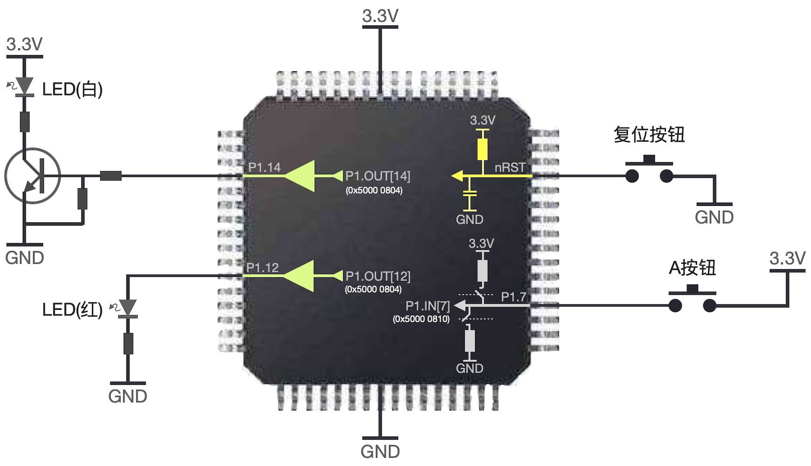
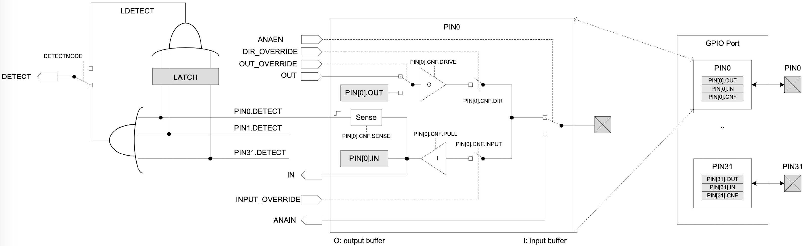

===========================
4.1 可编程数字输入和输出
===========================

数字型输入/输出外设仅有两种有效状态，习惯用On和Off、High和Low、打开和关闭、接通和断开等表示两种有效状态，譬如一个继电器触点的接通状态和断开状态、
一颗指示灯的on状态和off状态等。存储一个数字型输入/输出外设的状态信息仅需要一个二进制位。绝大多数MCU的可编程I/O引脚都可编程输出高电平和低电平，
这样的I/O引脚电平状态与相应接口电路即可控制数字型输出外设的状态，因此在MCU内部使用二进制位的“1”和“0”分别表示数字型输出外设的状态。
同时，通过读取MCU的I/O引脚的电平即可获取数字型输入外设的状态，并使用布尔型(Boolean)变量保存该状态。

很多编程语言都支持布尔型变量，尤其支持嵌入式系统的编程语言，譬如C/C++语言。虽然布尔型变量的有效值仅为“1”和“0”，如果目标计算机系统不支持位操作和位寻址，
布尔型变量仍占用一个字节或更多二进制位来存储一个二进制信息。现在的MCU绝大多数都支持位操作和位寻址，譬如ARM Cortex-M系列微内核支持“bit-band”操作，
允许存取指令访问单个数据位(详见 [1]_ 的6.7节)。

按钮和LED指示灯是最简单的数字型输入和输出外设，图4.1给出BlueFi上的按钮和LED指示灯的电路连接示意图。

图4.1 BlueFi上的按钮和LED指示灯的电路连接示意图

从上图中，我们不仅能够了解数字型输入/输出信号的电平电压、驱动电流、频率和复位期间的默认状态，还能了解如何读取数字型输入外设的状态到内部变量，
以及如何通过写外设存储区的地址单元来控制数字型输出状态。

BlueFi的主MCU(nRF52840)的外部复位信号的有效电平为低电平(详见nRF52840的产品说明文档 [2]_ )，且内部带有上电复位(即冷复位)电路(图中黄色的电阻和电容)，
图4.1给出最简单的外部复位电路：一个手动复位按钮，一端接地，另一端与“nRST”引脚连接。内部上电复位电路的电阻与MCU的工作电源连接，当外部手动复位按钮未被按下时保持复位引脚状态为高电平，
这个电平的电压显然与MCU的工作电压相等；当按下手动复位按钮时复位引脚的状态为低电平，这个电平的电压与电源地相同。当我们需要给nRF52840复位时，只需要按下复位按钮即可。
按下按钮时从“nRST”引脚强制施加低电平信号给MCU内核的内部复位电路单元将片上所有功能单元(含CPU)复位，当我们释放手动复位按钮后，片上的上电复位电路确保“nRST”引脚处于高电平，
CPU开始工作。我们在第2.7节已经了解到MCU的多种复位源，在复位期间，nRF52840内部的“RESETREAS”寄存器(0x4000 0400地址单元)将保存本次复位的信号源，
应用程序可以根据这个寄存器的内容来识别复位源。单按一次BlueFi的复位按钮是正常的系统复位，而连续双击BlueFi的复位按钮，你会发现BlueFi进入Bootloader状态。
这个功能是使用“RESETREAS”寄存器的内容。

BlueFi的A和B按钮是可编程的，两个按钮的电路连接完全相似(除了使用不同的I/O引脚)，图4.1中仅给出A按钮的电路连接。A按钮的接口电路不仅包含片外的按钮，
还包含片内的可配置上拉/下拉电阻，由于A按钮的一端与MCU工作电源连接、另一端与P1.7引脚连接，当A按钮按下时P1.7引脚被强制与电源连接；如果P1.7的内部配置为下拉电阻，
当A按钮释放时P1.7引脚被下拉到电源地。通过读取P1.7引脚的状态确定A按钮的状态，当A按钮按下时读取状态的结果为“1”(即高电平)，当A按钮释放时读取状态的结果为“0”(即低电平)。
当我们将A按钮的状态保存到一个布尔型变量时，如果不采用DMA(直接存储器访问)方式，nRF52840的CPU的工作过程为：将P1.IN寄存器(即0x5000 0810地址单元)读入CPU内部某个寄存器，
然后再将D7位的值(即P1.7引脚的状态)保存到布尔型变量(即“Bit_Band”区的某个地址单元)。

对于P1.7内部可配置的上拉/下拉电阻的使用，需要在BlueFi初始化期间根据A按钮的电路进行编程配置。按照图4.1，使用Arduino IDE平台，A按钮的初始化和使用代码参考如下：

.. code-block::  c
  :linenos:

  void setup() {
    // put your setup code here, to run once:
    pinMode(PIN_BUTTON1, INPUT_PULLDOWN); 
  }

  void loop() {
    // put your main code here, to run repeatedly:
    bool state_aBtn = digitalRead(PIN_BUTTON1);
    if (state_aBtn == HIGH) {
      // A button be pressed
    } else {
      // A button be released
    }
  }

第3行代码是调用Arduino内部函数“pinMode(pin, mode)”将P1.7引脚(即与A按钮连接的I/O引脚)配置为输入模式且使用内部下拉电阻。在Arduin IDE平台，
有三种输入配置：浮空输入(INPUT)、上拉输入(INPUT_PULLUP)和下拉输入(INPUT_PULLDOWN)。

BlueFi有两颗亮起时颜色分别为红色和白色的LED指示灯，他们的连接电路如图4.1所示，两颗LED分别受P1.12和P1.14引脚控制。当程序将P1.OUT寄存器(即0x5000 0804地址单元)
的D12位置位时，P1.12引脚将输“1”(即高电平)，红色LED指示灯将亮起；当程序将P1.OUT寄存器的D12位清零时，P1.12引脚输入“0”(即低电平)，红色LED指示灯将熄灭。
BlueFi与其他数字电路采用相同的设计习惯，I/O引脚为高电平时对应的电压等于MCU的I/O工作电压，低电平对应的电压等于电源地，按照前一章的BlueFi电路原理介绍，
nRF52840使用3.3V作为I/O引脚电压。根据红色LED的正向压降、串联电阻的阻值和高电平的电压，我们可以计算出红色LED亮起时的电流(简称on电流)，这个电流的大小决定指示灯的亮度。

根据A按钮的状态控制红色LED指示灯亮和灭的代码如下：

.. code-block::  c
  :linenos:

  void setup() {
    // put your setup code here, to run once:
    pinMode(PIN_BUTTON1, INPUT_PULLDOWN);
    pinMode(LED_RED, OUTPUT);
  }

  void loop() {
    // put your main code here, to run repeatedly:
    bool state_aBtn = digitalRead(PIN_BUTTON1);
    if (state_aBtn == HIGH) {
      // A button be pressed
      digitalWrite(LED_RED, HIGH);
    } else {
      // A button be released
      digitalWrite(LED_RED, LOW);
    }
  }

按照“..\Arduino15\packages\adafruit\hardware\nrf52\0.20.5\variants\bluefi_nrf52840\variant.h“头文件中对BlueFi的I/O引脚用法的定义，
只需要将上述代码中的“LED_RED”引脚名称替换为“LED_WHITE”，然后编译并下载修改后的代码到BlueFi，可以使用A按钮控制白色LED的亮和灭。

与红色LED相比，你也许已经发现BlueFi的白色LED更亮一些。这说明，白色LED指示灯on电流大于红色LED。如果使用I/O引脚输出的高电平电压直接驱动LED，并不断地减小LED的串联电阻阻值，
LED的亮度将会不断地增加吗？如果假设I/O引脚输出的高电平电压是理想的(即内阻为0且功率足够大)，这个问题的答案是肯定的。事实上，所有MCU的I/O引脚的驱动能力都是有限的，
按拉电流和灌电流两种指标分别指定每一个I/O引脚的驱动能力。当I/O引脚的驱动能力无法满足LED指示灯on电流时，我们自然会想到外部驱动，如图4.1中使用外部NPN三极管驱动白色LED指示灯，
此时I/O引脚输出的拉电流被三极管放大数十倍(即三极管的放大倍数)作为白色LED指示灯on电流。当外部数字型输出外设需要更大的负载电流时，或许需要多级结构(如达林顿结构)的三极管提高放大倍数。

对于MCU的可编程I/O引脚，除了可配置的上拉/下拉电阻、可编程为输入/输出模式等，还有更多可配置的结构。以nRF52840为例，我们需要进一步了解其内部的结构，如图4.2所示。

图4.2 nRF52840可编程I/O引脚的内部结构

-------------------------

参考文献：
::

.. [1] Joseph Yiu, The Definitive Guide to ARM Cortex-M0 and Cortex-M0+ Processors (2nd-Edition), Elsevier, 2015
.. [2] https://infocenter.nordicsemi.com/pdf/nRF52840_PS_v1.1.pdf

