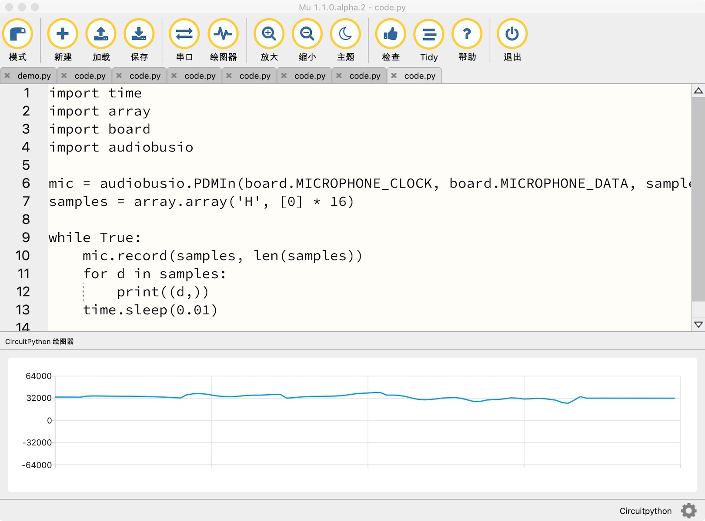
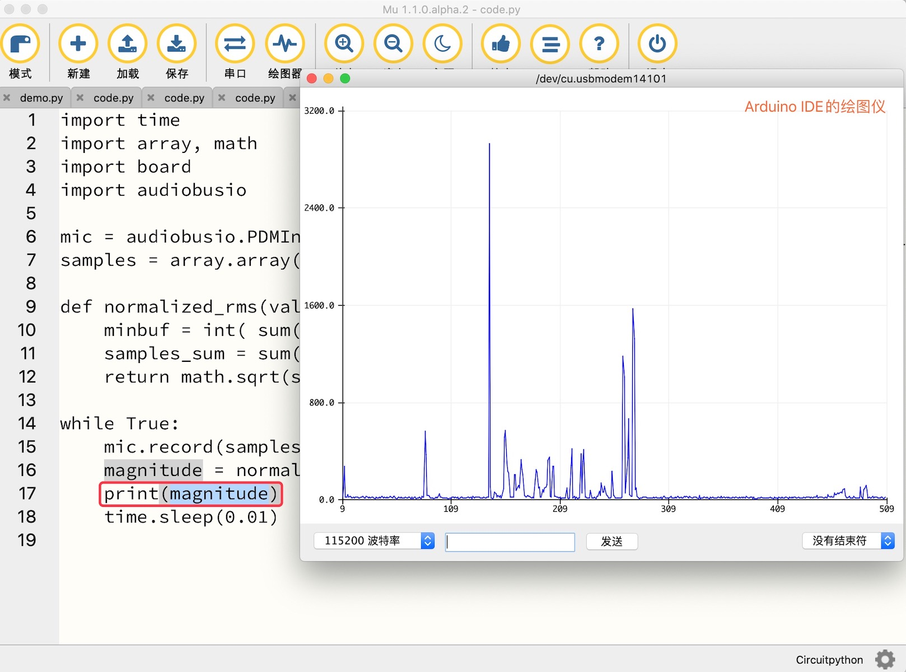
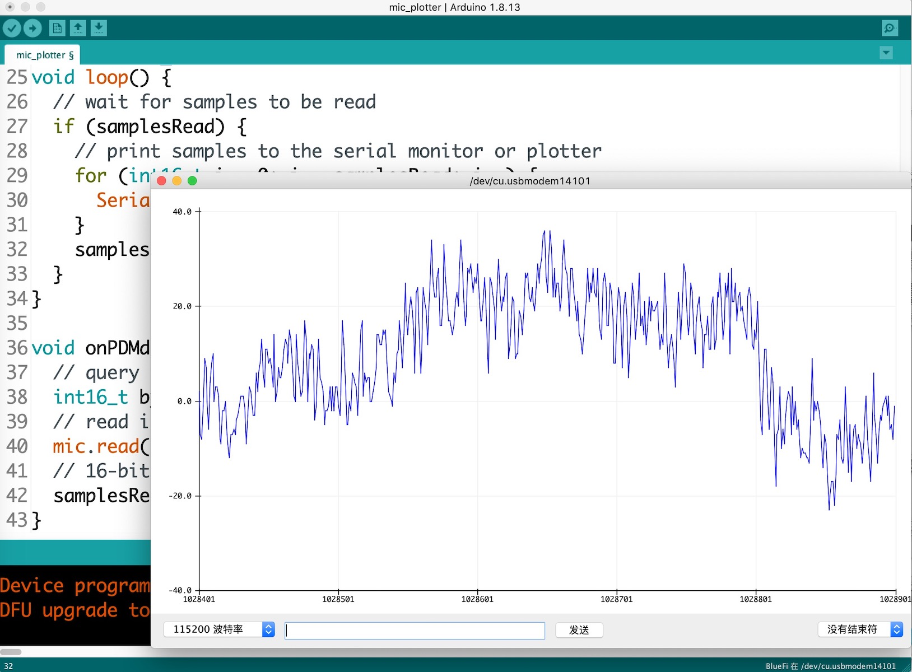

=============================
4.5 脉宽调制输入
=============================

前面两节内容中一直都在探讨嵌入式系统如何产生并输出脉冲宽度或频率调制信号，本节我们讨论脉冲宽度或频率调制信号的输入接口及其解调问题。
除了数字通讯接口之外，脉冲宽度和频率调制信号接口也常用于工业和汽车等领域的集成传感器，这种接口不仅成本低且具有较强的抗干扰能力。譬如，
反射式测距传感器(包括雷达、激光、红外光和超声波等类型)的输出接口多采用脉冲宽度调制信号，旋转/线位移编码器(包括电磁、光电和磁致伸缩等类型)
的输出接口多采用脉冲频率调制信号，如图4.15所示。

.. image:: ../_static/images/c4/pulse_in_application_distance_coder.jpg
  :scale: 36%
  :align: center

图4.15  传感器输出的脉冲调制接口示例

PDM(脉冲密度调制)使用脉冲区域的密度表示模拟信号的幅值大小。以PDM接口的数字MEMES(微机电系统)麦克风输出的数据流为例，如图4.16所示，高电平“1”的密度越大代表该区域模拟信号幅值越大，
反之“0”密度越大的区域对应的模拟信号幅值越小，右图(b)是连续正弦信号与对应的PDM信号的关系对比 [1]_ 。这种使用PDM接口的数字麦克风不仅体积小，
带有拾音、前置放大器、精密ADC等单元将模拟型音频信号转换为数字信号并以PDM格式输出所采集的数字音频流信息，仅占用2个接口信号(PDM输出和同步时钟)。

.. image:: ../_static/images/c4/pulse_in_pdm_microphone.jpg
  :scale: 25%
  :align: center

图4.16  PDM接口的MEMS麦克风(数字声音传感器)

本质上，PWM是一种固定频率的PDM特例，而且100%和0%占空比的PWM与PDM信号是完全相同的。PDM不仅适合传输数字音频流信息，也适合温度、振动加速度等信息。

对于各种脉冲调制信号接口的传感器、执行器、仪器仪表等来说，传感器的设计者和使用者之间无需传递复杂的通讯协议(下一章开始了解各种数字通讯接口的传感器和执行器)，
双方只需要遵循简单的脉冲调制信号编码规则。许多通用MCU的片上带有各种脉冲调制信号接口和调制信号的解调功能单元。譬如，适合工业电机控制领域的MCU片上带有正交解码单元，
允许图4.15(b)所示的旋转编码器的输出信号直接接入MCU的I/O引脚，简单配置编程后就可以获取旋转电机的转向、角位移、转速等信息；片上带有PDM解码单元和I/O接口的通用MCU，
我们直接将数字麦克风的两个接口信号连接到MCU的I/O引脚接口实现音频流采集。关键是，所有遵循同样的脉冲调制信号编码规则的传感器几乎是通用的。

-------------------------

为了更好地了解脉冲调制信号接口，我们首先使用BlueFi开源板的Python解释器自带的PDM传感器接口库编写两个示例的脚本程序，测试PDM接口的音频信号采集和处理。
使用USB数据线将BlueFi与电脑连接，并打开MU编辑器或其脚本编辑应用程序，将下面的第一个示例程序代码保存到“/CIRCUITPY/code.py”文件：

.. code-block::  python
  :linenos:

  import time
  import array
  import board
  import audiobusio

  mic = audiobusio.PDMIn(board.MICROPHONE_CLOCK, board.MICROPHONE_DATA, sample_rate=16000, bit_depth=16)
  samples = array.array('H', [0] * 16)

  while True:
      mic.record(samples, len(samples))
      for d in samples:
          print((d,))
      time.sleep(0.01)

这个示例的脚本程序用到4个BlueFi的Python解释器内建的库：time、array、board和audiobusio。time库已被用过多次，array库是数组型变量(数据集)及其操作接口，
board定义BlueFi的全部I/O引脚用法，audiobusio库包含PDMIn子类(PDM接口的麦克风)和I2SOut子类(I2S接口的音频输出)。
第5行语句实例化一个PDMIn子类，名称为“mic”，指定连接麦克风的两个引脚，以及采样率为16KHz、采样数据的位宽度为16位。
第6行声明一个16个数据的数组，用来保存音频采样数据。在主循环程序中，调用“mic”的“record()”接口函数完成16个采样点的数据，然后将每个采样点数值以元组形式发送到字符控制台，
延迟0.01s之后继续“采样-输出-暂停”的循环。

当BlueFi执行上面示例假的脚本代码期间，采样数据不仅发送到电脑端的字符控制台，也会同步地显示在BlueFi的LCD屏幕上，数据格式为元组形式，如“(32760,)”。
此时我们可以使用MU编辑器的绘图仪绘制音频数据的图线，如图4.17所示。

图4.17  使用BlueFi的PDM接口麦克风采集音频数据和图线绘制

对着BlueFi的数字MEMS麦克风(A按钮的上方)拍手、吹气等制造点声响，观察音频数据和图线的变化，完全安静时再观察数据和图线。安静时的数据大约是32000，
有声响时数据将会变大。记得16位宽的数据范围？0～65535，32000大约是中间。安静时的这个数据是麦克风拾音单元的固定直流成分(即直流分量)，
这个分量信息与环境声响没有关系，我们可以使用均方差等算法消除直流分量。一批数据的均方差计算分为3步：

  1. 计算平均值(mean)
  2. 计算均差(mean deviation)的平方和
  3. 计算均方差，即均差平方和的方根值

按照这个均方差算法，对前一个示例稍作修改，代码如下：

.. code-block::  python
  :linenos:

  import time
  import array, math
  import board
  import audiobusio

  mic = audiobusio.PDMIn(board.MICROPHONE_CLOCK, board.MICROPHONE_DATA, sample_rate=16000, bit_depth=16)
  samples = array.array('H', [0] * 16)

  def normalized_rms(values):
      minbuf = int( sum(values)/len(values) )
      samples_sum = sum( float(sample - minbuf) * (sample - minbuf) for sample in values )
      return math.sqrt(samples_sum/len(values))

  while True:
      mic.record(samples, len(samples))
      rms = normalized_rms(samples)
      print((rms,))
      time.sleep(0.01)

用第9～12行代码定义均方差算法函数，输入参数是一个数组，输出数组中所有数据的均方差值。并改进主循环程序，将均方差值输出到字符控制台。
将本示例代码保存到“/CIRCUITPY/code.py”文件，当BlueFi执行该示例代码时，再次使用MU编辑器的绘图仪观察处理后的音频数据和图线。
安静环境的数据几乎不大于20.0，有声响时的数据高达1000以上，直觉上这个RMS算法提升了灵敏度。

如果你觉得使用MU编辑器的绘图仪不够方便，也可以关闭MU编辑器的串口和绘图仪，直接使用Arduino IDE的绘图仪也可以，但是必须修改主循环中的“print()”语句，
如图4.18所示。

图4.18  使用Arduino IDE的绘图仪绘制Python脚本程序输出的数据图线

Arduino IDE的绘图仪是一个独立窗口，绘制图线时的纵向刻度更大，但MU的绘图仪仅仅是一个小窗口。为什么要修改“print()”语句呢？
MU编辑器自带的绘图仪能够识别Python语言支持的元组数据，多个数据项的元组的每一项都能绘制一一根单色图线，但Arduino IDE的绘图仪无法识别元组型数据。

通过上面两个Python脚本示例程序，我们已经了解PDM接口的用法，只需要指定PDM接口的采样频率、采样数据的二进制位宽度，并声明一个数组用来保存采样数据，
然后启动PDM接口采样，经历“数组长度/采样频率”的时间后，采样数据已经数组中。

-------------------------

Arduino平台如何使用脉冲调制信号接口呢？我们仍以BlueFi开源板上的PDM接口的数字麦克风为例，同时完善BlueFi的BSP使其支持音频采集和处理功能接口。
第3.5节安装的兼容Arduino开源平台的nrf52软件包中已经自带PDM类接口库，我们可以直接使用这个库或在开源社区搜索“nrf52 PDM”找到相关资源，
下载后修改代码即可使用。由于PDM接口的通用性，除了MCU片上的PDM接口功能单元的时钟、中断等需要使用MCU厂商提供的底层接口外，PDM信号传输和信号编码是统一的，
代码移植工作仅涉及底层接口。

为了与BlueFi开源板的其他BSP接口保持一致，我们将nrf52软件包中的PDM接口库移植到BSP中，并实例化一个名叫“mic”的PDM类对象，
在Arduino环境只需要访问该对象的API即可实现音频采集。具体的PDM接口类的实现代码请直接在本节末下载完整的BSP源文件压缩包即可，
此处仅了解我们定义的PDM类的接口名称和用法，如下：

(/PDM_mic/PDM_mic.h文件)

.. code-block::  C
  :linenos:

  #ifndef __PDM_MIC_H__
  #define __PDM_MIC_H__
  #include <Arduino.h>
  #include "dbuf/PDMDoubleBuffer.h"
  class PDMClass {
  public:
    PDMClass(int dinPin=22, int clkPin=21, int pwrPin=-1);
    virtual ~PDMClass();
    int begin(int channels=1, long sampleRate=16000);
    void end();
    virtual int available();
    virtual int read(void* buffer, size_t size);
    void onReceive(void(*)(void));
    void setGain(int gain=20);
    void setBufferSize(int bufferSize);
    void IrqHandler();
  private:
    int _dinPin;
    int _clkPin;
    int _pwrPin;
    int _channels;
    PDMDoubleBuffer _doubleBuffer;
    void (*_onReceive)(void);
  };
  extern PDMClass mic;
  #endif // __PDM_MIC_H__

关键的接口共7个，包括“begin()”用于初始化PDM接口的麦克风的模式(单声道/立体声)和采样率；“end()”用来停用PDM接口并释放已分配的资源；
“available()”可查询接口上十分有可读的数据以及具体的可读字节数；“read()”是将可读的数据读入指定的缓存；
“onReceive()”用来注册PDM接口的读数据流的回调函数；“setGain()”和“setBufferSize()”分别用于指定采样数据的放大倍数和采样数据缓存大小。
更详细的用法详见BSP文件夹的“../libraries/BlueFi/src/utility/PDM_mic/README.MD”文档，此处不再赘述。

我们用下面的示例程序来演示如何使用上述的PDM类麦克风的接口，示例代码如下：

(示例文件夹的mic_plotter.ino文件)

.. code-block::  C
  :linenos:

  #include <BlueFi.h>
  // buffer to read samples into, each sample is 16-bits
  int16_t sampleBuffer[256]; // bipolar value -32,768~32,767
  volatile int16_t samplesRead; // number of samples read

  void setup() {
    Serial.begin(115200);
    while (!Serial); // wait for serial monitor to be open
    bluefi.begin();  // initialize BlueFi (set default state)
    // configure the data receive callback
    mic.onReceive(onPDMdata);

    // optionally set the gain, defaults to 20
    // mic.setGain(30); // 10~80

    // initialize PDM Microphone with:
    // - 1 channel (mono mode) / 2 channels (stero mode)
    // - the 16 kHz sample rate
    if (!mic.begin(1, 16000)) {
      Serial.println("Failed to start PDM microphone!");
      while (1);
    }
  }

  void loop() {
    // wait for samples to be read
    if (samplesRead) {
      // print samples to the serial monitor or plotter
      for (int16_t i = 0; i < samplesRead; i++) {
        Serial.println(sampleBuffer[i]);
      }
      samplesRead = 0; // clear the read count after processing
    }
  }

  void onPDMdata() {
    // query the number of bytes available
    int16_t bytesAvailable = mic.available();
    // read into the sample buffer
    mic.read(sampleBuffer, bytesAvailable);
    // 16-bit, 2 bytes per sample
    samplesRead = bytesAvailable / 2;
  }

将这个示例的代码复制-粘贴到Arduino IDE，然后编译-下载到BlueFi开源板上，打开Arduino IDE的绘图仪(菜单栏的“工具”)，
我们将会看到如图4.19所示的音频图线，改变环境声响并观察图线变化趋势是否符合你的预期。

图4.19  使用PDM接口的麦克风采集音频数据

为了便于测试，请先删除“../Documents/Arduino/libraries/BlueFi”文件夹中的全部分局，然后下载下面的压缩文件包，
并解压到“../Documents/Arduino/libraries/BlueFi”文件夹中，

. :download:`本节内容所用到的BlueFi的BSP源文件 <../_static/dl_files/bluefi_ch4_5/BlueFi_bsp_ch4_5.zip>`

本节所增加的PDM类的实现代码和示例程序都已添加到该文件夹。

除了PDM接口之外，旋转编码器输出的正交信号解码、测距传感器输出的宽度调制信号解码等都十分常用，当我们使用MCU片上的对应功能单元实现脉冲调制信号解调的方法与PDM接口极为相似。
如果将这些接口进一步抽象，他们的共同之处是都能输出信息流数据，如音频数据流、角位移和速度数据流、目标物体的距离数据流等，所以接口的定义和用法也相似。

-------------------------

相较于数字I/O接口，脉冲调制信号I/O接口更加复杂。数字I/O接口仅传输一个二进制位信息，但脉冲调制接口所传输的信息更丰富，虽然他们都属于数字信号。
本节仅探讨脉冲调制信号输入型接口的工作原理和软件编程用法，并以BlueFi开源板上的PDM接口的数字麦克风为例来说明，我们也可以直接动手验证这类接口，
有利于掌握脉冲调节信号的解调和处理方法。

-------------------------

参考文献：
::

.. [1] https://en.wikipedia.org/wiki/Pulse-density_modulation#/media/File:Pulse_density_modulation.svg

