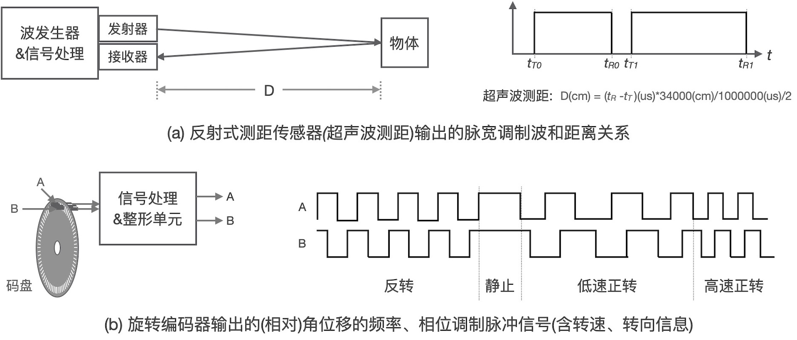
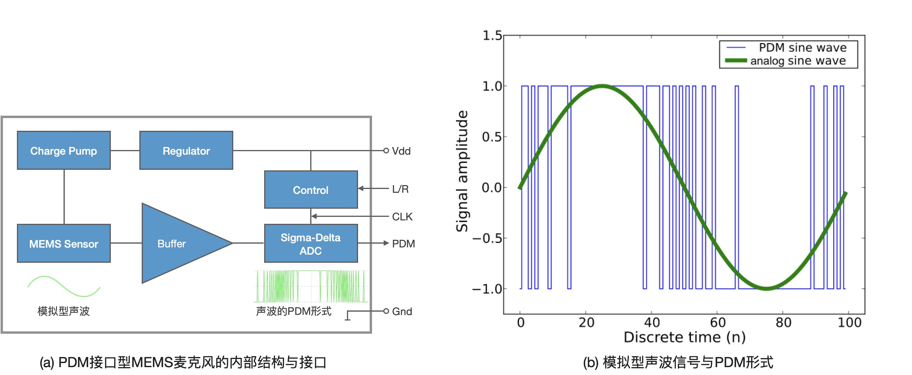

=============================
4.5 脉宽调制输入和脉宽解调
=============================

前面两节内容中一直都在探讨嵌入式系统如何产生并输出脉冲宽度或频率调制信号，本节我们讨论脉冲宽度或频率调制信号的输入接口及其解调问题。
除了数字接口之外，脉冲宽度和频率调制信号接口也常用于工业和汽车等领域的集成传感器，这种接口不仅成本低且具有较强的抗干扰能力。譬如，
反射式测距传感器(包括雷达、激光、红外光和超声波等类型)的输出接口多采用脉冲宽度调制信号，旋转/线位移编码器(包括电磁、光电和磁致伸缩等类型)
的输出接口多采用脉冲频率调制信号，如图4.15所示。

图4.15  传感器输出的脉冲调制接口示例

PDM(脉冲密度调制)是一种

图4.16  PDM接口的MEMS麦克风(数字声音传感器)

-------------------------

参考文献：
::

.. [1] https://en.wikipedia.org/wiki/Pulse-density_modulation#/media/File:Pulse_density_modulation.svg
.. [2] 
