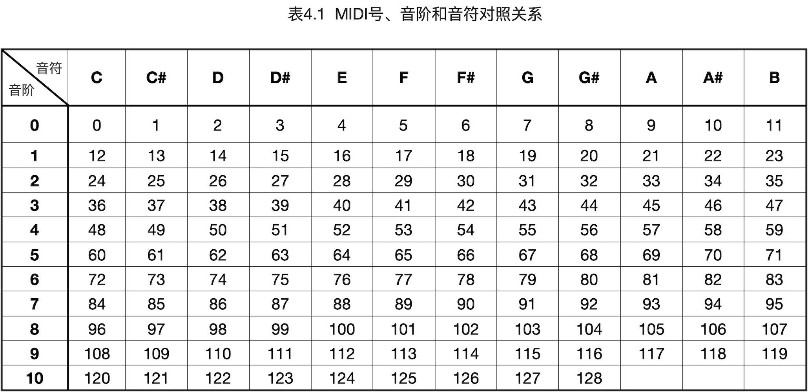

==============================
4.4 定时器和可编程频率信号输出
==============================

PWM信号是一种频率固定的脉冲宽度调制信号，脉冲宽度承载待传输的信息。脉冲频率承载传输信息的方法叫作“调频”，即频率调制，这种信息传输的形式广泛应用于通信、广播、电视等领域。
数字型频率调制信号是采用固定的1/2占空比，但载波的瞬时频率按待传输信息的变化而变。如图4.13所示。

图4.12  脉冲频率调制信号

除了传统的通信、广播等领域，具有强抗干扰特性的数字调频信号也常用于工业领域。譬如，使用数字脉冲频率调制信号控制步进电机，单个信号不仅承载位置/角度的步进信息，还承载有速度信息。
步进电机是一种最常用的直接数字控制型定位电机，能将脉冲信号转换成步进角位移/线位移的电能和磁能转换装置。与交流电机相比，步进电机的控制更容易实现，甚至有部分MCU片上带有专用步进电机控制单元。
步进电机控制单元包含相序励磁发生器、前置驱动、大电流H桥、相电流监测等，其中相序励磁发生器是数字控制部分的核心，能够将控制步进脉冲转换为H桥控制信号。一般的步进电机驱动单元如图4.13所示。

图4.13  步进电机驱动单元

“Dir”和“Step”两个信号分别是步进电机的方向信号和步进脉冲信号，他们是步进电机驱动单元的关键。驱动单元根据“Dir”信号的电平状态确定正转/反转的励磁相序，一个“Step”信号内实现一个步距角的转动。
实现一个步距角的旋转需要经历励磁和消磁两个阶段，励磁段是根据当前转向的相序步骤确定H桥开关状态给电机线圈接通电流以产生磁力推动转子运动，消磁阶段先关闭H桥上臂再接通双下臂以快速消除电机线圈上的反电势，
采用前沿对齐的、50%占空比的步进脉冲的高、低电平与励磁、消磁阶段正好对应，步进脉冲的频率直接反应为电机的角速度/线位移。

“低速时扭矩大，高速时扭矩小”是步进电机的关键特性，这从上述的驱动分析中不难发现。步进脉冲频率可以实现步进电机的转速控制，我们就可以设计软件算法实现步进电机的加速和减速控制，
通过合理的加减速控制即可避免机械冲击危害还可以保持精准的期望定位精度。

数字脉冲频率调制信号的另一种简单的用途是电子合成的声音，频率是声波的局部特征，反过来看发声装置就是将调频信号转换成机械振动从而产生声波。由于数字调频信号是方波形式，其幅度是固定的，
因此仅适合产生基本音调和简单音符，能够模拟人类声音的语音合成需要高速DAC输出频率和幅度同时调制的信号。

-------------------------

无论是步进电机控制还是声音合成，如何使用嵌入式系统的功能单元产生调频信号才是关键。可编程的定时器就是一种调频信号发生器，配置定时器产生指定频率方波信号的基本方法(程序伪码)如下。

已知递减的定时器模块的输入时钟频率F_in_clk，以及待产生的方波频率F_out，使用自动重装寄存器R_autoload和中断服务，程序伪码：

.. code-block::  C
  :linenos:

  void iniTimer(F_out) {
    T_overflow = 1000000UL/(2*F_out); // 计算定时器的溢出周期(us)
    F_clk = F_in_clk/dv;  // 确定分频数dv和定时器时钟频率
    T_clk = 1000000UL/F_clk; // 计算定时器时钟周期
    setDividerRegister(dv); // 设置分频器寄存器的分频数为dv
    R_autoload = T_overflow/T_clk; // 定时器溢出周期比定时器时钟周期的倍数
    setAutoloadRegister(R_autoload); // 设置重装寄存器的值
    setValueRegister(R_autoload); // 设置定时器的值寄存器
    enableTimerIRQ(); // 打开定时器溢出中断
    startTimer(); // 启动定时器
  }

  void Timer_Handler(void) {
    clearTimerIRQ(); // 清除中断请求标志
    digitalWrite( Pin_out, !digitalRead(Pin_out) ); // 将脉冲输出引脚状态反转
  }

使用普通定时器产生指定频率方波信号的关键是计算定时器的重装值，这个参数应是定时器时钟周期的整数倍，因此合适的分频器配置十分重要。定时器的初始化操作涉及的计算包括，
计算定时器溢出周期，配置分频器并计算定时器时钟周期，根据两者比值计算定时器重装值。为更好理解这些计算过程，图4.14给出定时器的结构。

图4.14  使用自动重装定时器产生周期中断

使用上述方法在某个指定的I/O引脚产生指定频率的脉冲信号需要用到中断服务程序，定时器只能产生周期中断并在中断服务程序中反转指定I/O引脚的电平状态，所产生的方波脉冲的周期为定时器周期的2倍。

根据前一节所掌握的PWM信号发生器的原理，我们还可以使用专用的PWM信号发生器产生指定频率的方波脉冲，而且无需中断服务程序。对照图4.11和图4.14，只需要配置分频器、计数器即可确定输出的PWM信号频率，
并将占空比寄存器的值设为计数器最大值的一半，这样就可以在指定的I/O引脚输出1/2占空比的脉冲信号。

-------------------------

在Arduino开源平台上，“tone(pin, frequency, duation)”和“noTone(pin)”两个函数用于在指定I/O引脚输出指定频率的方波信号 [1]_ ，这两个函数的实现优先选择使用MCU片上的专用PWM功能单元，
对于无专用PWM功能单元的MCU则选择片上通用定时器和中断程序的方法。这两个函数的实现代码在“../Arduino15/packages/hardware/mcu/version/cores/”文件夹的“Tone.h”和“Tone.cpp”中，
这个路径中的“/mcu”和“/version”分别指的是兼容Arduino平台软件包的MCU系列和软件版本号。对于第3.5节安装的nRF52系列软件包，该路径为“../Arduino15/packages/hardware/nRF52/0.20.0/cores/”。

将下面的示例代码复制-粘贴到Arduino IDE中，编译并下载到BlueFi，可以测试“tone(pin, frequency, duation)”和“noTone(pin)”两个函数：

.. code-block::  c
  :linenos:

  void setup() {
    Serial.begin(115200);
    pinMode(45, OUTPUT);
    digitalWrite(45, LOW);
    pinMode(5, INPUT_PULLDOWN);
    pinMode(11, INPUT_PULLDOWN);
  }

  void loop() {
    if ( digitalRead(5) ) {
      digitalWrite(45, HIGH);
      delay(100);
      tone(46, random(261, 1840));
    }
    if ( digitalRead(11) ) {
      noTone(46);
    }
  }

当BlueFi执行这个示例程序时，按下A按钮(位于BlueFi左侧)将会随机产生(262, 1840]范围内的某个频率的方波信号，按下B按钮将会停止输出方波信号。每按下A按钮后，
我们的耳朵能够清晰地分辨出喇叭所发出的不同声音，这是因为他们的频率完全不同。这个示例程序中，45号引脚是BlueFi开源板上的音频放大器的使能信号，高电平时允许放大器工作，
低电平时禁止放大器工作(喇叭被静音)；46号引脚与音频放大器的信号输入连接，从46号引脚输出的方波脉冲放大后推动喇叭发出声音。
示例中还用到Arduino的随机数发生器函数——“random(min, max)”，调用该函数将会返回(min, max]区间内的一个随机整数。

根据调用时的实参个数，“tone”函数有两种形态的接口：

  1. tone(pin, frequency)
  2. tone(pin, frequency, duration)

前面的示例中使用的是第1种形态，执行该函数将在指定的“pin”引脚输出频率为“frequency”的方波脉冲，直到执行“noTone(pin)”才会终止输出。
调用第2种形态的“tone”函数同样能在“pin”引脚输出频率为“frequency”的方波脉冲，并持续“duration”(ms)时间后自动终止输出。如果打开“Tone.cpp”查看两个函数的实现代码，
我们会发现第2种形态是使用PWM中断服务程序来实现持续时间的累计和输出终止，当PWM中断服务程序侦测到累计的持续时间不小于设定时间时，使用“noTone(pin)”终止输出。

对于基本音调或音符来说，上述示例中的“frequency”参数并不符合我们的习惯，譬如钢琴一个音高区的7个白色琴键(全音键)对应“do、re、mi、fa、sol、la、si”等7种唱法，
钢琴演奏家将这7个琴键分别与“C、D、E、F、G、A、B”等7个名称(音符)对应，或分别与五线谱的符号对应，从来不会与频率值关联(虽然本质上是这些琴键代表不同频率)。
如果我们想用BlueFi输出一段自定义的旋律，或许你首先“唱一段旋律”，再根据“唱出”的每一个音调确定其频率形成自定义旋律的频率列表和持续时间(拍数)列表，最后编程实现旋律播放。

此外，MIDI(乐器数字接口)号也是一种已读的基本音调的识别形式，每一个MIDI号对应一种频率的音调，譬如60号对应“中音C调(C5)”的频率为523Hz。

-------------------------

为了方便我们以后编写旋律播放程序，我们利用本节前面的知识为BlueFi定义一个名叫“Speaker”的类，将播放基本音调、MIDI号等方法，以及音频放大器的使能和禁止等封装在这个类中。
基本音调的名称(音符)和频率的对照表见页面 [2]_ ，MIDI号和基本音符对照表如下：

首先我们复制页面 [2]_ 中音符名称和频率的宏定义，并粘贴到名叫“PitchsFreqency.h”的文件中，并保存在我们为BlueFi定义的BSP源文件夹中，
即“../Documents/Arduino/libraries/BueFi/src/utility/”路径；然后将下面的“MIDI号”与“音符名称”对照表的语句添加到该文件中：

.. code-block::  c
  :linenos:

  const uint16_t tableMIDI2Tone[100] PROGMEM = {
  /* 0*/ 0,       0,        0,       0,        0,       0,       0,        0,       0,        0,       0,       31,
  /*12*/ NOTE_C1, NOTE_CS1, NOTE_D1, NOTE_DS1, NOTE_E1, NOTE_F1, NOTE_FS1, NOTE_G1, NOTE_GS1, NOTE_A1, NOTE_AS1, NOTE_B1, 
  /*24*/ NOTE_C2, NOTE_CS2, NOTE_D2, NOTE_DS2, NOTE_E2, NOTE_F2, NOTE_FS2, NOTE_G2, NOTE_GS2, NOTE_A2, NOTE_AS2, NOTE_B2, 
  /*36*/ NOTE_C3, NOTE_CS3, NOTE_D3, NOTE_DS3, NOTE_E3, NOTE_F3, NOTE_FS3, NOTE_G3, NOTE_GS3, NOTE_A3, NOTE_AS3, NOTE_B3, 
  /*48*/ NOTE_C4, NOTE_CS4, NOTE_D4, NOTE_DS4, NOTE_E4, NOTE_F4, NOTE_FS4, NOTE_G4, NOTE_GS4, NOTE_A4, NOTE_AS4, NOTE_B4, 
  /*60*/ NOTE_C5, NOTE_CS5, NOTE_D5, NOTE_DS5, NOTE_E5, NOTE_F5, NOTE_FS5, NOTE_G5, NOTE_GS5, NOTE_A5, NOTE_AS5, NOTE_B5, 
  /*72*/ NOTE_C6, NOTE_CS6, NOTE_D6, NOTE_DS6, NOTE_E6, NOTE_F6, NOTE_FS6, NOTE_G6, NOTE_GS6, NOTE_A6, NOTE_AS6, NOTE_B6, 
  /*84*/ NOTE_C7, NOTE_CS7, NOTE_D7, NOTE_DS7, NOTE_E7, NOTE_F7, NOTE_FS7, NOTE_G7, NOTE_GS7, NOTE_A7, NOTE_AS7, NOTE_B7, 
  /*96*/ NOTE_C8, NOTE_CS8, NOTE_D8, NOTE_DS8 
  };

最后，参考前面已经定义的LEDs类或Button2类的软件架构完成Speak类的设计。Speak类的两个源文件“BlueFi_Speak.h”和“BlueFi_Speak.cpp”代码如下：

(BlueFi_Speak.h文件)

.. code-block::  c
  :linenos:

  #ifndef ___BLUEFI_SPEAK_H_
  #define ___BLUEFI_SPEAK_H_

  #include <Arduino.h>
  #include "PitchsFrequency.h"  // the frequency of pitch

  class Speak {

    public:
      Speak(uint8_t audioOut=46, uint8_t enPower=45, uint8_t bpm=120);
      void begin(void);
      void playTone(uint16_t frequency, uint32_t duration=0);
      void stop(void);
      void playMIDI(uint8_t midi, uint8_t beat=0);
      uint8_t setBPM(uint8_t bpm);
      uint8_t changeBPMwith(int8_t bpm);
      void enableAudio(bool en=true);

    private:
      uint8_t __bpm;
      uint8_t __pinAPW;   // pin of Enable Power of Audio
      uint8_t __pinAudio; // pin of Audio signal output
  };

  #endif // ___BLUEFI_SPEAK_H_

(BlueFi_Speak.cpp文件)

.. code-block::  c
  :linenos:

  #include "BlueFi_Speak.h"

  Speak::Speak(uint8_t audioOut, uint8_t enPower, uint8_t bpm) {
      __bpm = bpm; // 120 (beats/minute), 500ms/beats
      __pinAudio = audioOut;  // pin of Audio signal output
      __pinAPW = enPower;  // pin of Enable Power of Audio
  }

  void Speak::begin(void){
      pinMode(__pinAudio, OUTPUT);
      digitalWrite(__pinAudio, LOW);
      pinMode(__pinAPW, OUTPUT);
      digitalWrite(__pinAPW, LOW);
  }

  void Speak::playTone(uint16_t frequency, uint32_t duration) {
      digitalWrite(__pinAPW, HIGH);
      tone(__pinAudio, frequency, duration);
  }

  void Speak::stop(void) {
      digitalWrite(__pinAPW, LOW);
      noTone(__pinAudio);
  }

  void Speak::playMIDI(uint8_t midi, uint8_t beat) {
      if ((midi == 0) && (beat == 0)) return;
      float t = 0.0F;
      if (beat != 0) {
          t = (60000.0F/(float)__bpm)/(float)beat;
      }
      if (midi >= 99) midi = 99;
      uint16_t f = tableMIDI2Tone[midi];
      digitalWrite(__pinAPW, HIGH);
      tone(__pinAudio, f, (uint32_t)t);
  }

  uint8_t Speak::setBPM(uint8_t bpm) {
      if (bpm <= 30) bpm = 30; // 30 beats per minute
      if (bpm >= 240) bpm = 240; // 240 beats per minute
      __bpm = bpm;
      return __bpm;
  }

  uint8_t Speak::changeBPMwith(int8_t bpm) {
      if (bpm > 0) __bpm += bpm;
      if (bpm < 0) __bpm -= abs(bpm);
      if (__bpm <= 30) __bpm = 30; 
      if (__bpm >= 240) __bpm = 240; 
      return __bpm;
  }

  void Speak::enableAudio(bool en) {
      digitalWrite(__pinAPW, en);
  }

这7个BSP接口中，构造函数“Speak()”是BlueFi的声音输出接口的初始化操作；“playTone()”和“stop()”两个接口的功能与原始的“tone()”和“noTone()”相似，
只是按照BlueFi固定的硬件接口隐藏I/O引脚参数；“playMIDI(midi, beat)”函数的两个参数分别是MIDI号和拍数，
这个接口使用前面定义的“MIDI号”与“音符名称”对照表确定频率，并根据“__bpm”(每分钟拍数)确定持续时间，调用“tone()”实现音符输出；
“setBPM(bpm)”和“changeBPMwith(bpm)”都可以用来改变“__bpm”参数，前者直接给定新的“__bpm”参数值，后者则是相对增加或减少当前值。

如何使用这些接口呢？我们在下面的示例程序中通过对比来演示“playTone()”和“playMIDI()”两种接口的用法，代码如下：

.. code-block::  c
  :linenos:

  #include <BlueFi.h>
  void setup() {
    bluefi.begin();  // initialize to BlueFi (redLED, whiteLED, speak, ..)
  }

  uint16_t notes[8] =    {NOTE_C4, NOTE_G3, NOTE_G3, NOTE_A3, NOTE_G3, 0,   NOTE_B3, NOTE_C4};
  uint32_t duration[8] = {125,     63,      63,      125,     125,     125, 125,     125};
  uint8_t midi[8] =   {48, 43, 43, 45, 43,  0, 47, 48};
  uint8_t beats[8] =  { 4,  8,  8,  4,  4,  4,  4,  4};

  void loop() {
    bluefi.aButton.loop(); // update the state of A-button
    bluefi.bButton.loop(); // update the state of B-button
    if ( bluefi.aButton.isPressed() ) {
      for (uint8_t i=0; i<8; i++) {
        bluefi.speak.playTone(notes[i], duration[i]);
        delay(1.2*duration[i]);
      }
    }
    if ( bluefi.bButton.isPressed() ) {
      for (uint8_t i=0; i<8; i++) {
        bluefi.speak.playMIDI(midi[i], beats[i]);
        delay(600/beats[i]);
      }
    }
  }

这个示例中，第6～7行分别定义旋律的8个音符和每个音符的持续时间(0音符代表休止符)；第8～9行分别定义旋律的8个MIDI号和分拍数(1拍、2分拍、4分拍、..)；
在主循环程序中，侦测A按钮和B按钮的状态，当A按钮按下时播放音符和持续时间格式定义的旋律，当B按钮按下时播放MIDI号和分拍数格式定义的旋律。
适当保持音符的播放间隔可以让我们更清晰地识别组成旋律的音符，我们在播放每一个音符之后插入一个1.2倍音符播放时间的延迟(可以理解为休止符)。

现在你可以模仿上面的示例自定义一些旋律并使用BlueFi播放出来。

为了便于测试，请先删除“../Documents/Arduino/libraries/BlueFi”文件夹中的全部分局，然后下载下面的压缩文件包，
并解压到“../Documents/Arduino/libraries/BlueFi”文件夹中，

. :download:`本节内容所用到的BlueFi的BSP源文件 <../_static/dl_files/bluefi_ch4_4/BlueFi_bsp_ch4_4.zip>`

本节所增加的Speak类的实现代码和示例程序都已添加到该文件夹。

-------------------------

现在可以再来了解BlueFi的Python解释器中的音频信号输出接口的用法。如果前面已经在Arduino IDE平台更新过BlueFi的固件，必须双击BlueFi的复位按钮，
强制BlueFi进入Bootloader状态(BlueFi的所以彩灯呈低亮度绿色并出现BLUEFIBOOT磁盘)，然后将Python解释器固件(见第4.1节)拖放到BLUEFIBOOT磁盘。

任何时候，只要BlueFi启动Python解释器都会自动执行前一次保存在“CIRCUITPY”磁盘上的“code.py”脚本程序，这个脚本程序不会被Arduino IDE平台下载的固件所覆盖，
如果不希望执行原来的脚本程序，可以通过连续复位让BlueFi的Python解释器进入安全模式(safe mode)：单击复位，当最左侧彩灯变为黄色时再次按下复位按钮，
BlueFi的Python解释器将会自动进入安全模式，不再执行已经保存的“code.py”。

BlueFi的Python解释器本身并没有声音输出接口，我们使用上述封装C/C++的BSP一样的思路设计一个名叫“SoundOut”类接口，这个模块位于
“/CIRCUITPY/lib/hiibot_bluefi/soundio.py”文件中(注意，或许你看到的文件名称为“soundio.mpy”，这是一种去掉注释的Python脚本程序的二进制格式)。

在REPL模式，我们可以使用以下命令行查看“SoundOut”类接口，命令行及其输出结果如下：

.. code-block::  python
  :linenos:

  >>> from hiibot_bluefi.soundio import SoundOut
  >>> dir(SoundOut)
  ['__class__', '__init__', '__module__', '__name__', '__qualname__', 
  'enable', 'Table_MIDI2Tone', 'volume', 'bpm', 'play_tone', 'play_midi', 
  '_sine_sample', '_generate_sample', 'start_tone', 'stop_tone', 'play_wavfile']
  >>> 

用法与其他类接口相似，首先将“SoundOut”类接口实例化为一个对象，然后用这个对象的名称即可访问该类的接口。从上面的“dir(SoundOut)”命令行的输出可以看出，
“SoundOut”类接口与我们在前面使用C/C++语言实现的“Speak”类极为相似。由于Python解释器天生就支持文件系统，这里增加一个播放“wave”格式的音频文件的接口——“play_wavfile(wavFile)”。

我们用下面的示例程序来演示这些接口的用法。

(示例程序1：唱出7个基本音符)

.. code-block::  python
  :linenos:

  import time
  # import SoundOut class from soundio.py
  from hiibot_bluefi.soundio import SoundOut
  # instantiate SoundOut as a speaker
  spk = SoundOut()
  spk.enable = 1
  spk.volume = 0.6
  tones = [523, 587, 659, 698, 784, 880, 988]

  while True:
      for i in tones:
          spk.play_tone(i, 0.25, 0.025)
      time.sleep(2)

第5行将“SoundOut”类实例化为一个名叫“spk”的对象；第6行代码设置“spk”对象的“enable”属性为1的目的是使能音频放大器；第7行设置“volume”属性可调制音量大小；
第8行定义7个基本音符的频率列表，并在主循环中遍历该列表顺序地唱出这些音符。注意，“play_tone(fre, duration, spacetl)”接口的前两个参数与C/C++版本的参数一致，
第三个参数是音符间隔的休止符时长(默认为0)。

(示例程序2：播放wave格式音频文件)

.. code-block::  python
  :linenos:

  import time
  from hiibot_bluefi.basedio import Button
  from hiibot_bluefi.soundio import SoundOut
  spk = SoundOut()
  spk.volume = 1.0
  button=Button()
  #the following wave files on the folder "/CIRCUITPY/sound/"
  while True:
      button.Update()
      if button.A_wasPressed:
          spk.play_wavfile("/sound/Boing.wav")
      if button.B_wasPressed:
          spk.play_wavfile("/sound/Coin.wav")

这个示例程序的执行效果：分别点击A和B按钮将播放超级玛丽游戏中的提示音。执行这个示例代码前，必须将这两个wave格式音频文件保存在“/CIRCUITPY/sound/”文件夹中。
点击下面链接可以下载这两个音频文件：

. :download:`Boing.wav文件 <../_static/dl_files/bluefi_ch4_4/Boing.wav>`
. :download:`Coin.wav文件 <../_static/dl_files/bluefi_ch4_4/Coin.wav>`

下载后保存到“/CIRCUITPY/sound/”文件夹。

这个示例程序的“play_wavfile(wavFile)”接口参数为wave格式音频文件的路径和名称，如果该参数不正确将会导致“OSError: [Error 21] No such file/directory ..”错误提示，
根据提示修改出现错误的参数位置。

-------------------------

我们通过步进电机的定位和转速控制、基本音符播放等初步了解脉冲频率调制信号的应用，并了解如何使用递减计数器的周期中断和PWM信号发生器产生调频脉冲，
最后以BlueFi开源板上的音频输出为对象掌握Speak类封装和用法，以及Python脚本编程控制产生调频脉冲的方法。

-------------------------

参考文献：
::

.. [1] https://www.arduino.cc/reference/en/language/functions/advanced-io/tone/
.. [2] https://www.arduino.cc/en/Tutorial/ToneMelody?from=Tutorial.Tone
