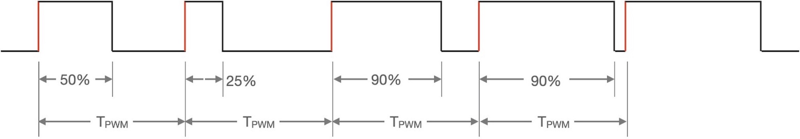

===========================
4.3 计数器和PWM输出
===========================

PWM(脉冲宽度调制)信号是一种可实现模拟控制效果的数字信号，由于其实现电路单元全部由数字电路组成，易于集成且成本低，现在的绝大多数MCU都支持可编程PWM信号输出。
相较于DA转换输出的模拟信号，PWM信号具有极强的抗干扰特性，这使得PWM的应用场景非常多，譬如开关电源、电池充电、显示器亮度控制、伺服控制、通信等。

我们首先使用BlueFi的白色LED指示灯来测试PWM信号的使用效果。用USB数据线将BlueFi连接到电脑，使用Python脚本编程和Python解释器可以快速修改、测试程序，
将下面的示例代码保存到“/CIRCUITPY/code.py”文件，覆盖之前的“code.py”文件。

.. code-block::  python
  :linenos:

  import time
  import board
  from pulseio import PWMOut
  led = PWMOut(board.WHITELED, frequency=1000, duty_cycle=0)

  while True:
    for i in range(100):
      if i < 50:
        led.duty_cycle = int(i * 2 * 65535 / 100)  # Up
      else:
        led.duty_cycle = 65535 - int((i - 50) * 2 * 65535 / 100)  # Down
      time.sleep(0.01)

当BlueFi执行这个示例脚本程序时，将会观察到白色LED指示灯的亮度“渐灭-渐亮-渐灭-..”循环变化。然后将第4行的“frequency”选项的值分别修改为50、
500、5000、10000等并观察每次修改-保存后的亮度变化。修改“frequency”选项的值实际就是改变PWM信号的频率，使用不同频率时你发现了什么不同吗？
无论PWM信号的频率如何修改，肉眼观察看不出白色LED指示灯亮度变化规律有何不同。

通过简单的测试我们了解到，1)使用PWM信号可以调节LED指示灯的亮度；2)PWM信号的频率变化不影响LED亮度控制效果；3)改变PWM输出类的实体对象“led”的
“duty_cycle”属性值可以改变LED的亮度。

PWM信号到底是什么样的呢？如果使用示波器观察BlueFi主MCU(nRF52840)的P1.14引脚的信号，我们将会看到如图4.10所示的PWM信号。

图4.10  PWM信号的形状

示例程序的第4行在实例化PWMOut类时，指定PWM信号输出引脚为P1.14(即控制白色LED的引脚)，PWM信号频率(frequency)为1KHz，初始占空比(duty_cycle)为0，
实例化对象的名称为“led”。实质上，这行脚本程序是在配置PWM信号发生器参数和信号输出通道。在主循环程序块内，第9行语句是根据循环变量i计算“led”的“duty_cycle”属性值，
从表达式可以看出这个属性值与i呈正比关系，随着i的增加输出的PWM信号的占空比也随之增加，我们观察到的效果：白色LED的亮度渐大；第11行也是根据i计算“duty_cycle”属性值，
但是他与i呈反比关系，随着i的增加输出的占空比也随之减小，我们观察到的效果：白色LED的亮度渐小。

当我们反复修改这个PWM信号的frequency属性时，只要保持不低于40Hz，可以断定输出控制LED亮度的PWM信号频率肯定发生变化，但是我们的肉眼并不能观察到不同频率引起的特殊变化。
如果你知道普通的交流电灯也是以50Hz在变化，肉眼并不能观察到电灯的明暗变化，由此可知上述的测试过程中观察到的现象是为什么。如果你把frequency属性改为10甚至更低小时，
再观察白色LED的亮度变化，你将会发现明显不同。

并不是所有PWM信号的频率都是可以任意修改的，实际的频率选择应根据被控对象(如LED)的开关频率特性(这是电子元件的一种重要电气特性)来选择，
譬如伺服系统电机的响应速度较低仅适合100Hz以下的PWM信号频率。PWM信号是如何产生的呢？

PWM信号发生器由时钟预分频器(Prescaler)、波计数器(Wave Cpunter)或通用计数器(General Counter)、数值比较器(Comparator)等组成，如图4.11所示。

.. image:: ../_static/images/c4/pwm_generator_structure.jpg
  :scale: 32%
  :align: center

图4.11  PWM信号发生器的结构组成

设置时钟预分频器寄存器的值可调整PWM信号的频率，向占空比寄存器写入不同值可调整PWM信号的占空比，计数器的模式包括递增、递减、先递增-再递减等三种，
计数器的模式选择可以改变PWM信号的对齐方式(前沿对齐、后沿对齐、中心对齐)，如图4.12所示。

.. image:: ../_static/images/c4/pwm_signal_align_mode.jpg
  :scale: 36%
  :align: center

图4.12  PWM信号对齐模式和计数器模式

考虑PWM信号不同的应用目的，大多数PWM信号发生器的输出极性都支持可编程的反转特性。从上面两图可以看出，计数器是PWM信号发生器单元的核心部件。
定时/计数器(Timer/Counter)是现代MCU片上必备的基础功能单元，编程控制定时/计数器不仅能产生单次的(One-short)定时中断请求、周期性中断请求，
还能捕获外部输入的脉冲信号进行计数，借助于数值比较器也能产生PWM信号。很多MCU的片上并没有专用的PWM信号发生器单元，通过对定时/计数器编程控制产生PWM信号。
当然，专用的PWM信号信号发生器仍具有定时器的功能。譬如，根据图4.11的结构，很容易让这个PWM信号发生器产生周期性中断请求。
由于定时/计数器的结构和原理相对简单，相关的概念大多数都属于数字电路的范畴，本书中不对其深入讨论。

-------------------------

本节开始的时候，我们已经使用Python解释器和“pulseio”模块中的“PWMOut”类编写脚本程序控制nRF52840的P1.14引脚输出PWM信号，
在Arduino开源平台如何编程控制I/O引脚输出PWM信号呢？Arduino的内部函数“analogWrite(pin，value)”是一个特殊的接口，将自动根据输出参数“pin”的I/O属性确定具体的执行效果。
我们已经知道，编译和下载Arduino程序之前必须使用“开发板管理器”指定开源板名称、编译和下载相关的参数，每一种开源板的MCU的每一个引脚的用法都是确定的，
这在前一章中已经遇到过。如果传递给函数“analogWrite(pin, value)”的参数“pin”对应的I/O引脚是支持DAC型模拟输出的，则将参数“value”写入DAC寄存器即执行完毕；
如果该引脚不支持DAC型模拟输出但支持PWM输出，则将参数“value”写入PWM的占空比寄存器即执行完毕；如果“pin”既不支持DAC型模拟输出也不支持PWM输出，
则该语句被忽略，不执行任何动作 [1]_ 。

对于MCU的PWM输出引脚来说，Arduino的函数“analogWrite(pin, value)”仅改变PWM的占空比，占空比的分辨率决定参数“value”的范围。如果对照Python脚本程序，
我们如何确定PWM占空比的分辨率？如何改变PWM信号的频率呢？

Arduino的函数“analogWriteResolution(bits)”用于指定“analogWrite(pin, value)”的参数“value”的分辨率，参数“bits”是二进制位宽度，默认值是8。
那么默认的参数“value”的有效范围是多少呢？根据前面所掌握的PWM信号发生器的结构，PWM信号占空比的取值范围必须与计数器的范围保持一致。

Arduino没有改变PWM信号频率的接口函数！如何知道某个开源板的PWM信号频率是多少呢？在Arduino官网的页面 [1]_ 已经列出官方开源板默认的PWM信号的频率，
Arduino平台的软件架构上已经将每一种开源板的PWM信号频率进行预设。当我们了解PWM信号发生器的基本结构，开源板所用的MCU片上PWM资源及其用法，以及Arduino的PWM接口，
我们可以通过修改Arduino的PWM接口初始化参数配置PWM信号频率。事实上，使用“analogWriteResolution(bits)”设置占空比(或计数器)范围也可以改变PWM信号频率。
PWM信号的频率受PWM模块的时钟频率、分频器和计数器的范围等三个参数约束。譬如，nRF52840的PWM模块时钟频率为16MHz，分频器可选择1/2/4/8/16/32/64/128-分频，
计数器的范围3～32767(即可设置最大的二进制位宽度是15)。如果选择1分频，即16MHz时钟为计数器工作时钟(即时钟周期为62.5ns)，使用8位的计数器分辨率时
的PWM信号周期为16微秒(=256*62.5ns)，12位时的PWM信号周期为256微秒，15位时的PWM信号周期为2.048ms。这些参数可在nRF52840数据页的PWM相关的寄存器说明部分查询到。
按第3.5节所搭建的兼容Arduino开源平台的软件开发环境中，PWM信号发生器相关的接口在“../Arduino15/packages/adafruit/hardware/nrf52/0.20.5/cores/nRF5”文件夹中，
设计“wiring_analog.h”、“wiring_analog.cpp”、“HardwarePWM.h”和“HardwarePWM.cpp”四个文件，PWM初始化部分在“HardwarePWM.cpp”的“begin()”中。

下面我们来修改第4.1节所创建的LED类的实现代码，增加LED亮度控制接口，使用PWM信号发生器控制LED亮度，从而了解Arduino开源平台上的PWM编程控制。
BlueFi的LED类的实现代码在“../Documents/Arduino/libraries/BueFi/src/utility/”文件夹的“BlueFi_LEDs.h”和“BlueFi_LEDs.cpp”两个源文件中，
现在只需要为LED类添加一个名叫“bright(bv)”的单输入参数的成员函数，具体的代码实现极其简单，修改后的两个源文件的代码如下：

(BlueFi_LEDs.h文件，第14行代码是新增的)

.. code-block::  c
  :linenos:

  #ifndef ___BLUEFI_LEDS_H_
  #define ___BLUEFI_LEDS_H_

  #include <Arduino.h>

  class LED {
    public:
      LED(uint8_t pin);
      uint8_t getAttachPin(void);
      void on(void);
      void off(void);
      void toggle(void);
      bool state(void);
      void bright(uint16_t bv); 

  private:
      bool __isInited;
      bool __state;
      uint8_t __pin;
  };

  #endif // ___BLUEFI_LEDS_H_

(BlueFi_LEDs.cpp文件，第34～36行代码是新增的)

.. code-block::  c
  :linenos:

  #include "BlueFi_LEDs.h"

  LED::LED(uint8_t pin) {
      __isInited = 1;
      __state = 0;
      __pin = pin;
      pinMode(__pin, OUTPUT);
      digitalWrite(__pin, __state);
  }

  uint8_t LED::getAttachPin(void) {
      return __pin;
  }

  void LED::on(void) {
      __state = 1;
      digitalWrite(__pin, __state);
  }

  void LED::off(void) {
      __state = 0;
      digitalWrite(__pin, __state);
  }

  void LED::toggle(void) {
      __state = (__state)?0:1;
      digitalWrite(__pin, __state);
  }

  bool LED::state(void) {
    return __state;
  }

  void LED::bright(uint16_t bv) {
      analogWrite(__pin, bv);
  }

仅为演示的目的，我们仍使用默认的PWM信号参数，即8位分辨率的PWM占空比、62.5KHz的频率，如果需要改变分辨率和频率则可以使用“analogWriteResolution(bits)”接口。
考虑到分辨率可配置为最大宽度是15位，因此亮度控制接口函数“bright(bv)”的参数“bv”采用16位宽的无符号整型。然后，编写这个接口的用法示例程序，代码如下：

.. code-block::  c
  :linenos:

  #include <BlueFi.h>
  void setup() {
    bluefi.begin();
    bluefi.whiteLED.off();
  }

  void loop() {
    static uint8_t bv=0, dir=1;
    if (dir) { // fade up
      bv += 5;
      if (bv > 250) dir=0;
    } else {   // fade down
      if (bv >= 5) bv -= 5;
      else dir=1;
    }
    bluefi.redLED.bright(bv);
    delay(10);
  }

如果使用示波器观察BlueFi红色LED的阳极引脚处的波形，将会清晰地看到一个周期/频率固定的PWM波形，而且高电平的宽度会“渐大-渐小”地周期性变化，
大多数示波器还能测量这个PWM波的频率，可以验证是否与理论的62.5KHz保持一致。

然后，我们也可以尝试改变这个PWM波的频率，按照前面所掌握的PWM信号发生器原理，改变占空比(即计数器)的范围也可以改变PWM信号频率。
这需要在初始化BlueFi时(“setup()”函数内)使用“analogWriteResolution(14)”接口设置分辨率为14位宽，再修改“loop()”函数内的亮度最大值和亮度增量步长。
注意，14位宽的无符号整型数范围是0～16383。修改后的代码如下：

.. code-block::  c
  :linenos:

  #include <BlueFi.h>
  void setup() {
    bluefi.begin();
    analogWriteResolution(14); // 14-bit resolution: 0~16,383
    bluefi.whiteLED.off();
  }

  void loop() {
    static uint16_t bv=0, dir=1;
    if (dir) {   // fade up
      bv += 328; // step length
      if (bv > 16383) dir=0;
    } else {     // fade down
      if (bv >= 328) bv -= 328;
      else dir=1;
    }
    bluefi.redLED.bright(bv);
    delay(10);
  }

修改的代码包括，新增第4行(改变占空比分辨率)，修改第11、12、14行中的亮度变量值。将修改后的示例程序编译并下载到BlueFi开源板上后，
执行程序期间再用示波器观察和测量红色LED指示灯阳极引脚处的波形频率，验证是否与理论的1KHz频率一致。

为了便于测试，请先删除“../Documents/Arduino/libraries/BlueFi”文件夹中的全部分局，然后下载下面的压缩文件包，
并解压到“../Documents/Arduino/libraries/BlueFi”文件夹中，

. :download:`本节内容所用到的BlueFi的BSP源文件 <../_static/dl_files/bluefi_ch4_3/BlueFi_bsp_ch4_3.zip>`

本节所修改的LED类的实现代码和示例程序都已添加到该文件夹。将示例程序编译并下载到BlueFi开源板，执行这个示例程序时将会看到红色LED指示灯呈“呼吸”效果。

-------------------------

参考文献：
::

.. [1] https://www.arduino.cc/reference/en/language/functions/analog-io/analogwrite/
