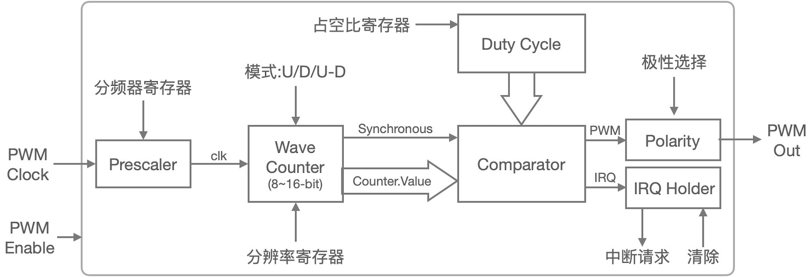
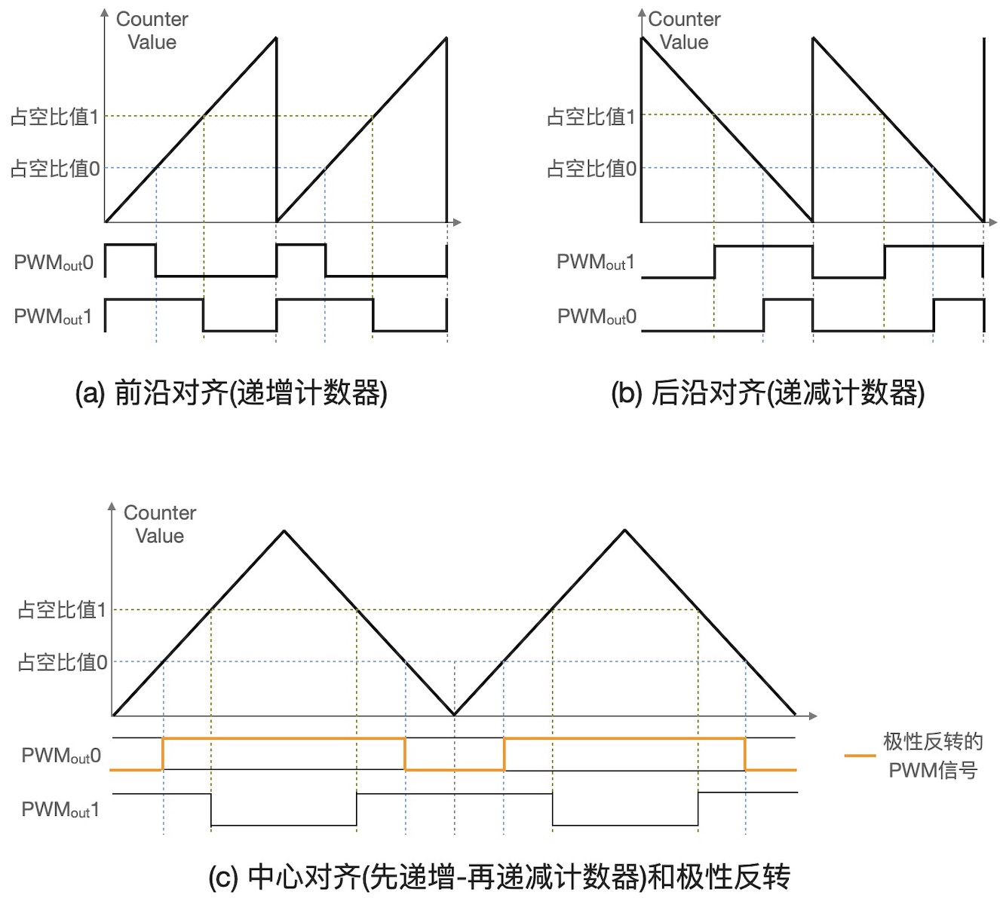

===========================
4.3 计数器和PWM输出
===========================

PWM(脉冲宽度调制)信号是一种可实现模拟控制效果的数字信号，由于其实现电路单元全部由数字电路组成，易于集成且成本低，现在的绝大多数MCU都支持可编程PWM信号输出。
相较于DA转换输出的模拟信号，PWM信号具有极强的抗干扰特性，这使得PWM的应用场景非常多，譬如开关电源、电池充电、显示器亮度控制、伺服控制、通信等。

我们首先使用BlueFi的白色LED指示灯来测试PWM信号的使用效果。用USB数据线将BlueFi连接到电脑，使用Python脚本编程和Python解释器可以快速修改、测试程序，
将下面的示例代码保存到“/CIRCUITPY/code.py”文件，覆盖之前的“code.py”文件。

.. code-block::  python
  :linenos:

  import time
  import board
  from pulseio import PWMOut
  led = PWMOut(board.WHITELED, frequency=1000, duty_cycle=0)

  while True:
    for i in range(100):
      if i < 50:
        led.duty_cycle = int(i * 2 * 65535 / 100)  # Up
      else:
        led.duty_cycle = 65535 - int((i - 50) * 2 * 65535 / 100)  # Down
      time.sleep(0.01)

当BlueFi执行这个示例脚本程序时，将会观察到白色LED指示灯的亮度“渐灭-渐亮-渐灭-..”循环变化。然后将第4行的“frequency”选项的值分别修改为50、
500、5000、10000等并观察每次修改-保存后的亮度变化。修改“frequency”选项的值实际就是改变PWM信号的频率，使用不同频率时你发现了什么不同吗？
无论PWM信号的频率如何修改，肉眼观察看不出白色LED指示灯亮度变化规律有何不同。

通过简单的测试我们了解到，1)使用PWM信号可以调节LED指示灯的亮度；2)PWM信号的频率变化不影响LED亮度控制效果；3)改变PWM输出类的实体对象“led”的
“duty_cycle”属性值可以改变LED的亮度。

PWM信号到底是什么样的呢？如果使用示波器观察BlueFi主MCU(nRF52840)的P1.14引脚的信号，我们将会看到如图4.10所示的PWM信号。

图4.10  PWM信号的形状

示例程序的第4行在实例化PWMOut类时，指定PWM信号输出引脚为P1.14(即控制白色LED的引脚)，PWM信号频率(frequency)为1KHz，初始占空比(duty_cycle)为0，
实例化对象的名称为“led”。实质上，这行脚本程序是在配置PWM信号发生器参数和信号输出通道。在主循环程序块内，第9行语句是根据循环变量i计算“led”的“duty_cycle”属性值，
从表达式可以看出这个属性值与i呈正比关系，随着i的增加输出的PWM信号的占空比也随之增加，我们观察到的效果：白色LED的亮度渐大；第11行也是根据i计算“duty_cycle”属性值，
但是他与i呈反比关系，随着i的增加输出的占空比也随之减小，我们观察到的效果：白色LED的亮度渐小。

当我们反复修改这个PWM信号的frequency属性时，只要保持不低于40Hz，可以断定输出控制LED亮度的PWM信号频率肯定发生变化，但是我们的肉眼并不能观察到不同频率引起的特殊变化。
如果你知道普通的交流电灯也是以50Hz在变化，肉眼并不能观察到电灯的明暗变化，由此可知上述的测试过程中观察到的现象是为什么。如果你把frequency属性改为10甚至更低小时，
再观察白色LED的亮度变化，你将会发现明显不同。

并不是所有PWM信号的频率都是可以任意修改的，实际的频率选择应根据被控对象(如LED)的开关频率特性(这是电子元件的一种重要电气特性)来选择，
譬如伺服系统电机的响应速度较低仅适合100Hz以下的PWM信号频率。PWM信号是如何产生的呢？

PWM信号发生器由时钟预分频器(Prescaler)、波计数器(Wave Cpunter)或通用计数器(General Counter)、数值比较器(Comparator)等组成，如图4.11所示。

图4.11  PWM信号发生器的结构组成

设置时钟预分频器寄存器的值可调整PWM信号的频率，向占空比寄存器写入不同值可调整PWM信号的占空比，计数器的模式包括递增、递减、先递增-再递减等三种，
计数器的模式选择可以改变PWM信号的对齐方式(前沿对齐、后沿对齐、中心对齐)，如图4.12所示。

图4.12  PWM信号对齐模式和计数器模式

考虑PWM信号不同的应用目的，大多数PWM信号发生器的输出极性都支持可编程的反转特性。从上面两图可以看出，计数器是PWM信号发生器单元的核心部件。
定时/计数器(Timer/Counter)是现代MCU片上必备的基础功能单元，编程控制定时/计数器不仅能产生单次的(One-short)定时中断请求、周期性中断请求，
还能捕获外部输入的脉冲信号进行计数，借助于数值比较器也能产生PWM信号。很多MCU的片上并没有专用的PWM信号发生器单元，通过对定时/计数器编程控制产生PWM信号。
当然，专用的PWM信号信号发生器仍具有定时器的功能。譬如，根据图4.11的结构，很容易让这个PWM信号发生器产生周期性中断请求。
由于定时/计数器的结构和原理相对简单，相关的概念大多数都属于数字电路的范畴，本书中不对其深入讨论。

-------------------------

本节开始时，我们已经使用Python解释器和“pulseio”模块中的“PWMOut”类编写脚本程序控制nRF52840的P1.14引脚输出PWM信号，
在Arduino开源平台如何编程控制I/O引脚输出PWM信号呢？

-------------------------

参考文献：
::

.. [1] 
