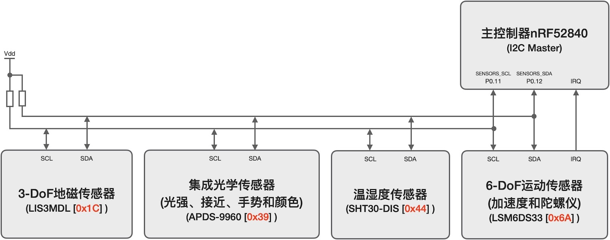
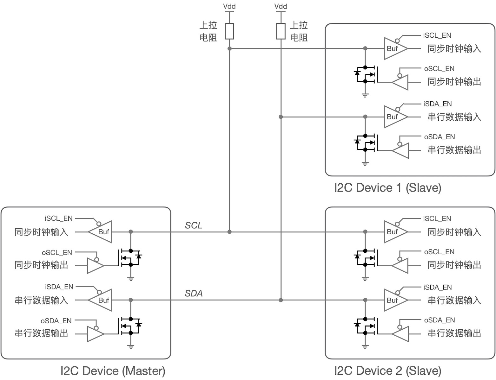
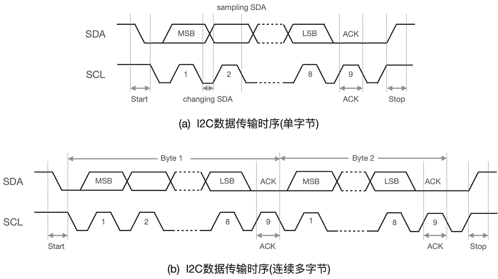
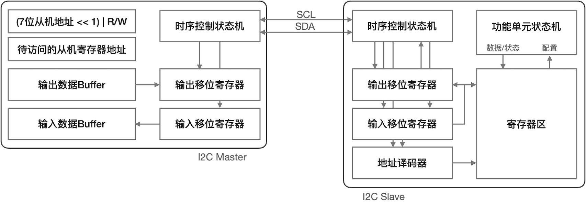
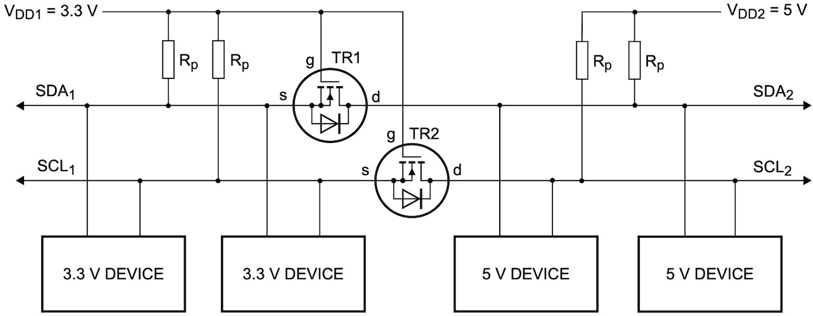
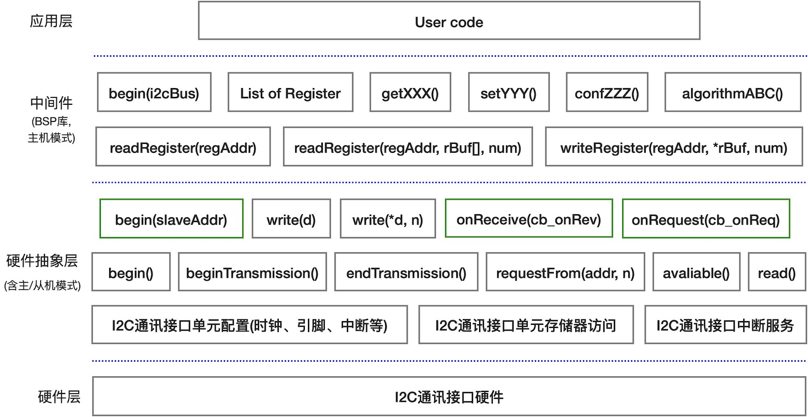

===========================
5.1 I2C通讯接口
===========================

I2C是一种典型的同步串行通讯接口，单个接口支持单主多从、多主多从(但任何时刻仅有一个主机)等模态的多组件间半双工通讯。虽然I2C协议支持多主多从的模态，
但实际应用中绝大多数几乎都是单主多从模态，本章仅限这种常见的I2C模态。

上世纪80年代Philips电子部门定义I2C(Inter-Integrated Circuit的缩写)通讯总线的主要目的是用于连接计算机周边的音频和视频等低速设备，
最初定义的通讯时钟速度是100KHz(那个时候的音视频数据流极地)，I2C发展到今天已经支持100KHz、400KHz、1MHz、3.4MHz和5MHz等多种时钟速度。
现存很多种派生型I2C接口，最著名的是Intel提出的SMBus(系统管理总线)，目前仍用于计算机周边设备接口的配置等领域，
譬如现在所开发的音视频设备、视觉传感器和点阵图形显示器接口中常用I2C或SMBus作为这些设备的参数配置通讯接口。

随着嵌入式计算机系统和物联网的飞速发展，I2C逐步成为系统内各功能组件之间最常见的互联总线之一，仅占用MCU的2个I/O引脚就可以将系统内的最高达128个组件连接起来。
I2C是真正的多组件共享总线，不仅占用极少的MCU资源，嵌入式系统PCB板的布局和走线也非常简单。图5.1是BlueFi开源板上的4种传感器与主控制器之间的连接示意图。

图5.1  BlueFi开源板上4种传感器的接口电路

理论上，单个I2C接口能够连接高达128个组件。这需要每一个组件拥有一个惟一的7位地址码，称之为I2C从地址，图5.1中的每种I2C接口传感器拥有惟一的从地址。
这意味着，同一个型号的I2C接口组件不能同时连接到单个I2C接口上，除非他的I2C从地址是可配置的。譬如，NXP的16通道PWM控制器——PCA9685采用I2C接口且具有3个从地址配置输入引脚，
意味着他可以配置为8种不同从地址，单个I2C接口总线上允许最多连接8个PCA9685器件(其基地址为0x40，可配置的从地址为0x40~0x47)。也有很多I2C器件的从地址是不可配置的，
譬如抗疫期间常用的一种24x32阵列红外温度传感器(IR array thermal sensors)——Melexis的MLX90640，其惟一的从地址为0x33，单个I2C接口上只能连接一个这种传感器，
如果想要在一个热成像系统内同时使用多个这种阵列传感器以成倍地提升成像的像素数，如何设计传感器接口才能满足需求呢？本章的学习将会帮助我们实现这一目标。

I2C接口的两个信号分别称作SCL和SDA，SCL是主设备输出的同步时钟信号，SDA是双向的串行数据信号。虽然SCL是单方向的信号，只能从主设备输出，
但为支持多主多从模态，实际的I2C接口单元的SCL信号仍被定义成双向的。I2C能够实现真正的多组件共享总线应归功于独特的“线与(wire-AND)”接口设计，
如图5.1所示。

图5.2  共享总线的“线与”接口电路

上图中两个“线与”接口信号的外部上拉电阻是必须的，上拉电阻的阻值选择与该接口的互联设备数量、传输线长度、分布电容和通讯速度等有关，一般在2K~47K欧之间。图中使用MOS仅是原理性示意的目的，
实际I2C接口组件的硬件实现又多种选择，譬如使用三态门电路。当主机发送-从机接收数据位流时，数据位流的“1”/“0”被转换为“高”/“低”电平随着同步时钟信号SCL而顺序地出现在SDA上，
SCL和SDA两个信号都由I2C主机驱动，I2C从机根据SCL信号同步地逐位锁存数据位流信号并形成字节数据。当从机发送-主机接收数据位流时，
I2C主机输出同步时钟信号SCL给工作中的从机，I2C从机根据SCL信号同步地将待传输的数据位流逐位地发送到SDA上，同时I2C主机同步地接收数据位流。

虽然同步发送和接收数据位流的描述有点拗口，但具体的实现却非常简单，如果你能记起数字电路课程所掌握的“移位寄存器”的概念。I2C接口的移位寄存器仅有8位宽度，
这是因为I2C接口采用单字节的数据帧格式。I2C支持多字节连续读或写操作，但始终保持单字节帧，相邻的字节帧之间必须有一个接收者的应答位(ACK)。按通讯领域的规则，
这个接收者的ACK位是帧同步的目的。

为了更好地理解通讯协议中的“同步”，需要对I2C接口传输数据帧(字节)的时序稍作了解，如图5.3所示，(a)给出单帧/单字节的数据传输时序，(b)给出2(或更多)帧/字节的数据传输时序。

图5.3  I2C接口传输数据的时序(/协议)

对于I2C通讯接口的数据帧传输，不必刻意区分时序和通讯协议，虽然时序仅规定总线上信号之间时空关系，通讯协议却是更宽泛的概念。
I2C接口的每一次数据传输必须以“START”时序开始并以“STOP”时序终止，由于I2C接口仅支持单字节的数据帧，每帧/字节数据必须以数据接收者的“ACK”为结束。
“START”、“STOP”、“ACK”的作用都是为了“同步”目的，对比单字节和两字节传输时序时会发现“ACK”尤为重要，完全可以把“ACK”理解为字节同步位。
正是这些特殊的同步状态才让I2C通讯接口更加可靠、稳定。

值得注意的是，I2C通讯接口传输数据位的顺序按最高位(MSB)先发送、最低位(LSB)最后发送。这在上图中已明确标示。

I2C通讯接口的连续读/写操作是指，从I2C从机上读取某些连续地址的寄存器内容时，或者向I2C从机上某些连续地址的寄存器顺序地写入内容时，I2C主机首先传输给从机一个待读/待写的寄存器起始地址(仍可以是8/16/32位地址信息)，
然后读取/写入第一个字节，接收者给出“ACK”，接着继续读取/写入下一个字节，接收者给出“ACK”，如此重复直到连续读/写操作完毕，期间不必再指定读取/写入的寄存器地址，
因为每读/写一个字节之后，下一个寄存器地址默认是前一个操作的地址自增1。

高效率的批量读/写操作的支持，源于I2C通讯接口组件的RAM型寄存器映射机制。从图5.3可以看出，单字节或连续多字节的数据传输期间，要求主机和从机都是“Ready”状态，
不允许任何“Wating”状态迫使暂停传输，这就要求主机读操作期间从机上的待读数据是全部“Ready”状态，主机写操作期间从机上的待写入寄存器也全部“Ready”状态。
显然，这就要求主机和从机上所有的I2C通讯接口的寄存器具有RAM的操作特性。现今的半导体技术，满足这一要求是非常容易的。对于I2C通讯接口单元的硬件实现，
目前普遍采用有限状态机(FSM)和RAM型寄存器的组合，这样设计不仅将传输控制和数据流分离(更容易实现)，允许I2C接口的功能组件内部单元也采用存储器映射机制(在第2章已探讨过)。
譬如，一个I2C接口的数字湿度传感器，湿度信号转换(成电信号)、采集(ADC)和滤波等过程由湿度采样控制的状态机按照设定的采样周期自治地工作，并将每次采样结果自动保存在特定地址的寄存器内，
当I2C主机需要读取湿度信息时，湿度传感器直接输出最新更新的湿度值，I2C主机无需启动再等待数百毫秒后读取湿度结果。

如图5.4，I2C通讯接口的主机，通常可以理解为MCU的片上I2C接口功能单元；I2C通讯接口从机的片内功能单元的配置、数据/状态等都被映射到寄存器区；
主机通过读/写寄存器实现对从机的控制和数据/状态的获取。

图5.4  I2C通讯接口的主机和从机的结构组成

现在我们可以来回答“I2C从地址为什么是7位？” 当主机需要访问某个从机的某个/某些寄存器时，首先发出7位从地址和1位“R/W”组成的“读/写指定从地址”的指令帧，
当“R/W=1”时为读，反之为写。与从地址匹配的从机被选择，即被选中的从机的传输控制状态机被激活。

接着主机发出寄存器地址信息帧，根据从机上寄存器资源(和从机的功能)的多少，或许超过1个字节就需要使用批量传输模式，被选中的从机将会把接收到的地址信息传入地址译码器，
于是对应地址的寄存器被选择。现在我们的I2C接口主机已经选择指定的从机及其内部的寄存器。

最后，主机和从机的传输控制状态机将会根据第一帧的“R/W”位信息完成进一步操作。如果“R/W=1”，主机驱动SCL输出同步时钟信号，从机上被选择的寄存器内容自动填入输出移位寄存器，
并随着SCL同步时钟逐位顺序地输出到SDA线上，主机驱动SCL的同时会在SCL下降沿出采样SDA线并移入输出移位寄存器。如果“R/W=0”，主机驱动SCL输出同步时钟信号，
同时在SCL低电平期间将输出移位寄存器的内容逐位顺序地输出到SDA线上，同时从机随着SCL同步时钟信号采样SDA线并移入输入移位寄存器，一个字节传输完毕后，
将输入移位寄存器的字节内容保存到被选择寄存器中。

简而言之，一次I2C通讯接口操作包括三步，主机使用7位从机地址和读/写控制位选中I2C总线上的从机，然后指定从机的寄存器(起始)地址，最后读/写从机的寄存器。
使用从机惟一地址编码的寻址方法，与传统三总线接口、SPI接口等伪共享总线相比，I2C接口没有专用的从机选择信号线，既节约MCU的I/O引脚又能简化PCB布板。
当我们认识到真正的共享总线型I2C通讯接口带来的方便时，或许也会遇到另外一些困难(好坏总是相伴而来)，譬如一个系统内I2C组件的电平电压、时钟速度等不一致。

遇到接口两端的电平电压不一致时，通常会想到使用电平转换逻辑门(Level shifter)来解决，但在I2C通讯接口的总线上使用的电平转换必须支持双向传输!
一种简易的支持双向传输的电平转换接口可用于I2C总线 [2]_ ，如图5.5所示。

图5.5  使用电平转换电路让I2C通讯接口支持不同电平电压

如果设计系统时遇到多个从机的时钟速度不一致的问题，留给你来解决。
前面我们已经初步了解I2C通讯接口的硬件和时序，包括总线架构、线与和移位寄存器结构、时序/协议、RAM型存储器映射及访问、电平匹配等。
I2C通讯接口软件如何实现呢？尤其面对一个系统或单个I2C接口上连接着很多个I2C接口的功能组件时，合理封装接口软件是非常重要的。
我们仍然使用分层抽象的思想来封装I2C接口软件，如图5.6所示。

图5.6  I2C通讯接口软件分层封装

I2C接口的硬件层，除了硬件电路设计前需查阅具体的MCU那些I/O引脚可用于I2C接口，以及系统所用的I2C组件的电平电压是否一致外，其他工作几乎都是软件接口设计，
根据MCU片上功能单元的存储器映射机制，可以想象这些软件的工作就是访问存储器单元配置I2C接口(包括时钟速度、引脚、数据发送和接收中断等)、
使能和禁止I2C接口，以及中断服务程序等底层操作。凡涉及存储器访问的操作都是很繁琐的，而且几乎都是没有可移植性代码。幸运的是，
我们无须编写这些代码，源文件都由半导体厂商提供。

I2C接口的硬件抽象层具有承上启下的作用，封装合理的I2C接口硬件抽象层是系统内所有I2C功能组件的共享代码。向下访问MCU硬件层接口(那些具体的MCU的存储器资源访问)实现I2C接口的基本协议，
包括启动时序“beginTransmission”、停止时序“endTransmission”、字节帧批量输出“write()”、输入“requestFrom()”和“read()”等，以及数据接收中断“onReceive()”(仅从机模式)、
主机请求中断“onRequest()”(仅从机模式)等中断服务程序。向上提供I2C通讯协议的实现接口。

对于任意的I2C组件的操作，我们只需要访问其寄存器即可实现目标功能，譬如读数字湿度传感器的湿度寄存器到变量(根据湿度的分辨率或许需要连续地读多个寄存器)。
一个系统内使用的每一种I2C组件的从地址、寄存器列表等都是固定的(常量)，调用硬件抽象层的接口访问寄存器实现I2C组件的功能封装，这部分工作属于BSP的一部分。
我们已经在前一章中多次实施BSP代码，本章后续内容将会实施I2C组件的BSP。I2C接口软件的BSP部分的基本实施规则就是，隐藏寄存器及其访问操作，
按照I2C组件的功能封装参数配置和功能操作接口，譬如设置温湿度传感器分辨率、获取当前的环境湿度或当前温度、配置加速度传感器的量程、读取当加速度的3分量等。

用户层调用特定开源板的BSP接口实现传感器应用，如环境温度或湿度测量及处理(滤波、显示、存储到本地或云端)、根据加速度和陀螺仪的分量值估算姿态、
根据当前姿态角调整飞控系统驱动马达转速等。

以BlueFi开源板和兼容Arduino的nrf52开源软件包为例，硬件层源码位于“../Hardware/nrf52/版本号/cores/nordic/hal/”文件夹，
硬件抽象层源码位于“../Hardware/nrf52/版本号/libraries/Wire/”，I2C通讯接口的BSP与其他接口的BSP都在一个文件夹中，
下一节开始实施I2C接口部分的BSP编码。

-------------------------

I2C接口协议的规范和实现方法 [3]_ 并不复杂，接口硬件方面仅仅是数字电路领域的基础知识(线与、同步时钟和锁存、移位寄存器等)，
接口协议方面只涉及通讯领域的字节同步基本概念，接口软件方面我们仍采用分层抽象的思想来封装。

下一节将以主机的角色深入了解MCU片上的I2C功能单元的结构和数据传输操作流程，硬件层和硬件抽象层的接口，以及BSP层软件封装。
如何使用I2C通讯接口连接两个MCU实现双向通讯，这是再下一节的核心内容。

-------------------------

参考文献：
::

  [1] https://learn.adafruit.com/i2c-addresses/the-list
  [2] https://www.nxp.com/docs/en/application-note/AN10441.pdf
  [3] http://www.i2c-bus.org/
