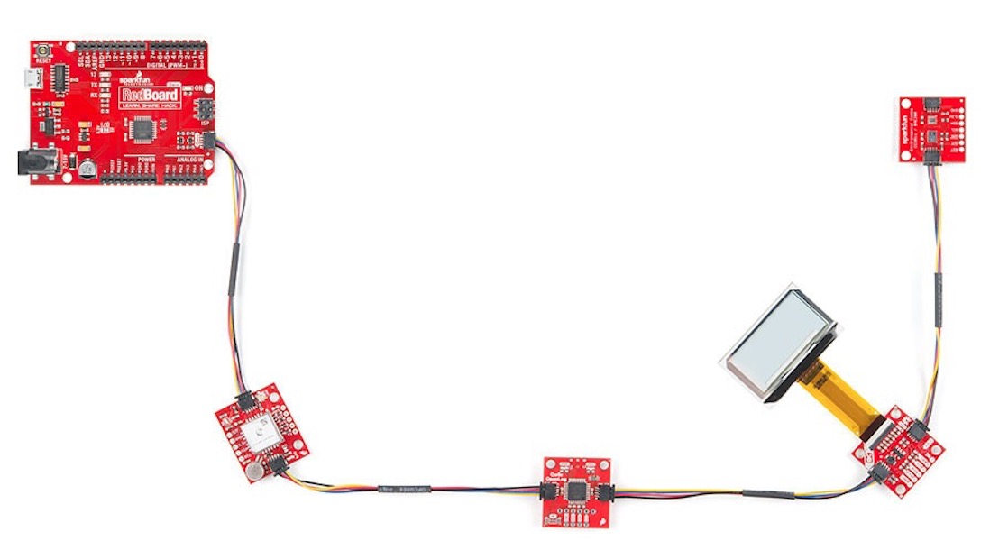
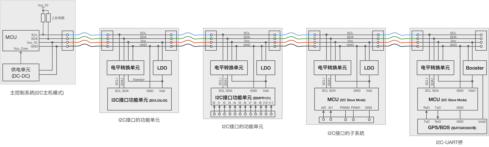
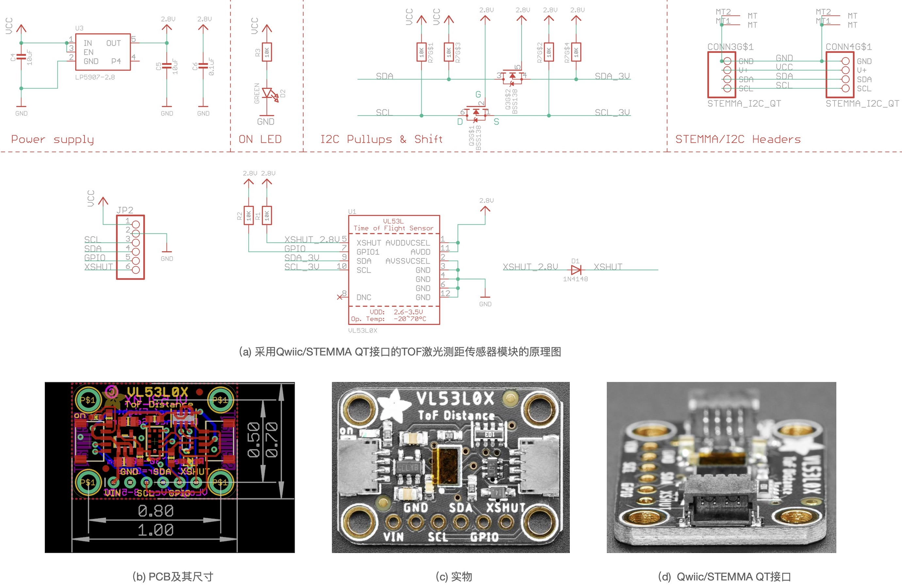
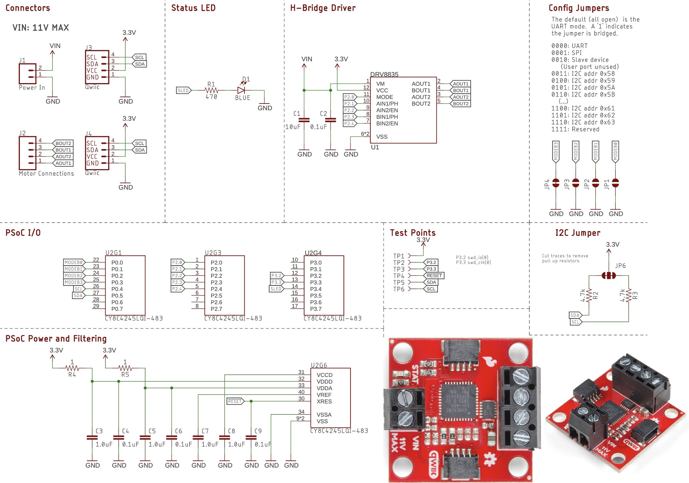

===========================
5.4 I2C接口应用设计
===========================

I2C通讯接口作为一种真正的多个外设共享的总线，且只需要2根信号线(SCL和SDA)即可实现上百种外设连接，本节进一步探讨如何使用I2C总线拓展嵌入式系统的功能。
图5.11是知名开源硬件供应商——SparkFun推出的Qwiic类开源硬件产品应用示例图 [1]_ ，该产品的主控制器带有I2C通讯接口且工作在主机模式，
所有扩展功能模块都采用统一的Qwiic接口，并支持顺序串联联或菊花链等多种连接拓扑。目前SparkFun已推出数百种Qwiic接口的主控制器、传感器、显示器、
执行器、I/O扩展等模块，几乎可以满足大多数产品原型开发阶段的功能验证和软件开发测试。

图5.11  Qwiic接口产品应用示例(SprakFun)

Qwiic采用4根连接线和4脚的1.0mm间距的连接器，推荐使用的连接器内部带有键槽以防插错，4根连接线的信号分别为SCL、SDA、Vcc和GND，即2根电源线和2根I2C接口信号线。
本质上，Qwiic接口就是带有电源线的I2C通讯接口。Qwiic接口与传统的4线USB、PS2等接口相似，不仅具有数据接口信号线还具有电源线，使用这样的接口时从机无需额外供电。

此外，另一家知名开源硬件供应商——Adafruit推出的STEMMA QT接口 [2]_ 与Qwiic几乎完全相同，两种接口的所用连接器的机械标准和电气标准完全兼容。这种接口为什么备受欢迎呢？
主要原因是I2C接口的共享总线方便嵌入式系统扩展更多种(上百种)功能，以及扩展功能单元的模块化等。图5.12是Qwiic接口或STEMMA QT接口的电路模型。

图5.12  Qwiic/STEMMA QT接口的电路模型

上图中，我们给出4种典型的I2C接口的功能扩展模块的电路模型，左侧两种扩展单元都具有标准I2C通讯接口(从机)，右侧两种都是采用MCU(I2C从机模式)转换为标准I2C通讯接口。

许多集成型I2C接口的传感器，譬如SHT30-DIS、LSM6DS3、VL53L0X(TOF型激光测距传感器)等，以及显示器和RTC，譬如OLED点阵屏等，除了I2C接口和供电之外无需额外的元件和接口，
这类传感器和显示器的I2C接口模块非常适合采用Qwiic/STEMMA QT接口，4芯连线就可以将这些模块串联起来并与主控制器的MCU连接起来。还有一些I2C接口的传感器、ADC和DAC，
如MPR121(12通道人体触摸感知)、MCP9600(热电偶传感器)、ADS1115(8路ADC)、MCP4728(4路DAC)等，以及I2C接口的电机驱动和I/O扩展单元，譬如PCA9685、
MCP23017等，除了I2C接口和供电之外还需要一些特殊连接器与目标传感器、电机等连接。

基于I2C通讯接口也可以实现分布式系统，这样的分布式系统不仅容易开发和维护，而且采用连接子系统的总线拓扑也十分灵活。仅有UART接口的GPS(全球定位系统)/BDS(北斗系统)等模块，
可以使用MCU单独设计“I2C-UART”桥接单元将非I2C接口的功能单元连接到I2C总线。

下面用两种具体的设计示例来帮助我们了解上述的电路模型。第一个示例是Adafruit的TOF(Time-Of-Flight)激光测距模块 [3]_ ，该模块的采用ST公司的集成型TOF传感器VL53L0X，
具体的电路原理图、PCB和实物参见图5.13。

图5.13  采用Qwiic/STEMMA QT接口的TOF激光测距传感器模块(Adafruit)

这个I2C接口的激光测距模块的有效量程和编程控制API请参阅页面 [4]_ ，该传感器非常适合于机器人避障、抗疫自动测温控制等应用场景。

第二个示例来自SparkFun [5]_ ，这是一种步进电机(或双直流电机)控制模块。该模块使用一颗小型ARM Cortex-M0系列MCU——CY8C4245控制一个步进电机驱动器，
并使用I2C从机模式接入I2C总线。

图5.14  采用Qwiic/STEMMA QT接口的步进电机驱动模块(SparkFun)

很显然，上述两种示例都采用Qwiic/STEMMA QT接口，主控制器端用于控制这两种扩展模块的软件几乎相同，主控制器的I2C接口工作在主机模式，两种扩展模块都是I2C从机，
他们都具有相同内惟一的I2C从机地址，主机使用惟一的从机地址分别寻址其中某个扩展模块并实现测控功能。请参考第5.2节编写这些扩展功能单元的软件实现，此处不在赘述。

-------------------------

本节使用知名开源硬件供应商推出的Qwiic/STEMMA QT接口类产品为例，详细地探讨基于I2C通讯接口的嵌入式系统原型设计方法和硬件模型。

在前几节的内容中我们已经了解MCU片上I2C功能单元的主机模式和从机模式及其接口和编程控制，现在你可以花一些时间完善BlueFi开源板上I2C接口传感器的BSP，
完成这些工作需要参考第5.2节的温湿度传感器(SHT30-DIS)、加速度和陀螺仪传感器(LSM6DS33)的BSP实现，并查阅LSM3MDL和APDS-9960两种传感器的手册，
以及github等开源代码库中搜索相关开源代码。

-------------------------

参考文献：
::

  [1] https://www.sparkfun.com/qwiic
  [2] https://learn.adafruit.com/introducing-adafruit-stemma-qt?view=all 
  [3] https://learn.adafruit.com/adafruit-vl53l0x-micro-lidar-distance-sensor-breakout?view=all
  [4] https://www.st.com/resource/en/datasheet/vl53l0x.pdf
  [5] https://www.sparkfun.com/products/15451

