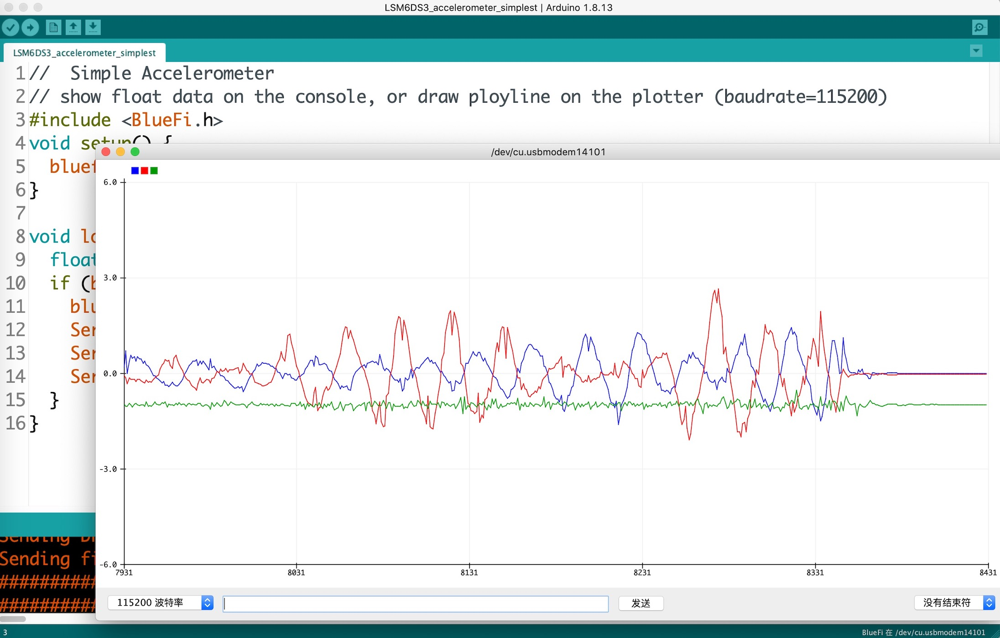
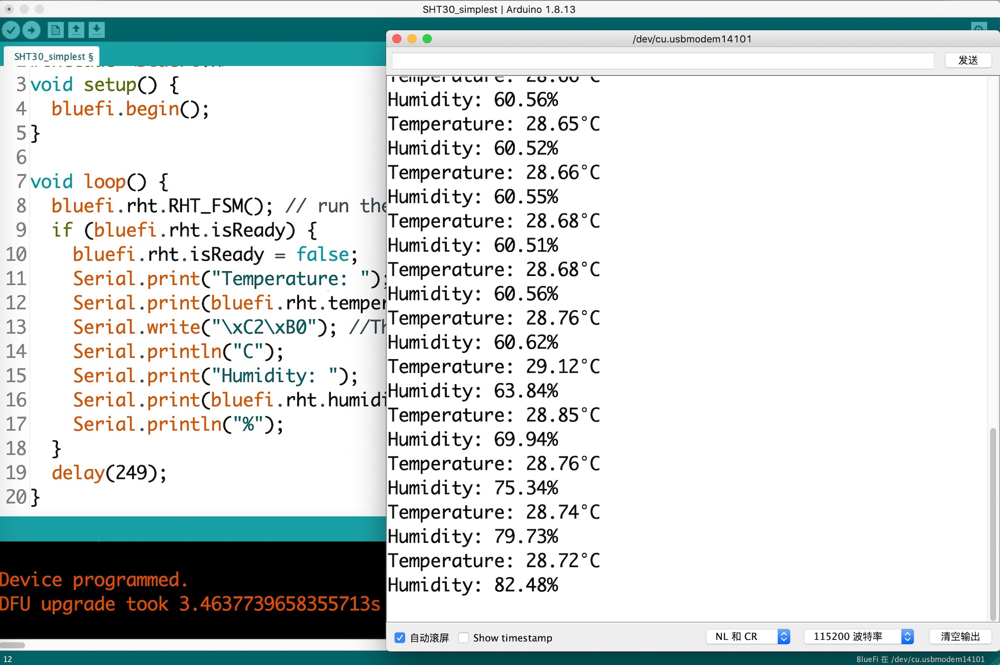

===========================
5.2 I2C主机模式
===========================

主机(Master)模式是MCU片上I2C功能单元的缺省工作模式，MCU仅使用2个I/O引脚就可以通过从机（Slave)寻址方式与上百个I2C从机通讯(或称作会话)。
按照I2C协议规范，SCL信号由主机驱动(主机输出的同步时钟信号)，SDA信号是双向驱动的。主机与任一从机之间的通讯都必须以“Start时序”作为开始，
然后主机发送的第一帧数据必须是由“(7位从地址<<1) | R/W位”组成的寻址帧，被寻址的从机被选中并给向主机发送“ACK时序”确认，
后续两者之间的通讯始终以主机发出的同步时钟信号为节拍，并以8位数据和1位接收者“ACK时序”为一个数据帧，当主机发出“Stop时序”后结束本次通讯，
主机和从机双方都暂时释放I2C总线。很显然，I2C总线的主从机之间的每次会话都以“Start时序”和“Stop时序”为界定，即使与同一个从机之间的多次会话也都遵循这一原则。

当MCU片上I2C功能单元工作在主机模式时，I2C接口的存储器(譬如小容量EEPROM非易失性数据存储器)、传感器、执行器和显示器等功能组件为从机，
我们编程控制MCU片上I2C功能单元访问这些片外I2C组件上的寄存器以实现他们的功能，前一节我们已经给出分层的I2C通讯接口软件的框架，参见图5.6。
绝大多数嵌入式系统软件开发平台都包含有硬件层和硬件抽象层的接口库，硬件层是通过访问I2C功能单元映射的存储器实现I2C通讯接口的硬件控制，
硬件抽象层是I2C协议的实现。在Arduino开源平台上，这两个层次的接口库都是以源码形式提供给系统开发者，其中硬件层由半导体厂商提供，
软件抽象层则是由开源社区的贡献者按照Arduino开源平台的“Wire”库的接口规范所编写的特定系列MCU的I2C接口的兼容库，Arduino标准的“Wire”库共有10种接口(包含主机模式的和从机模式的接口)，
详见页面 [1]_ ，对应的源代码见“../Hardware/nrf52/版本号/libraries/Wire/Wire.h”文件，使用该I2C通讯接口前必须用“#include <Wire.h>”语句来引用这些接口。

值得注意的是，Arduino的I2C通讯接口的硬件抽象层不仅支持主机模式，同时还支持从机模式。关于MCU片上I2C工作在从机模式的情形，将在下一节探讨。

.. Note::  I2C硬件抽象层接口(仅主机模式的接口)

  1. **begin()**，将I2C通讯接口配置为主机模式，并配置SCL和SDA的I/O引脚、SCL时钟速度(使用默认的设置)、中断等。注意，只能在初始化时调用一次
  2. **Wire.setClock(clockFrequency)**，重置I2C通讯接口的SCL时钟速度，参数clockFrequency以Hz为单位，譬如400,000
  3. **beginTransmission(slave_addr)**，产生“Start时序”，并将后续会话的从地址参数配置为slave_addr(7位地址!!)，直到“endTransmission()”执行后
  4. **endTransmission()**，(如果发送缓冲区不为空)将发送缓冲区中的数据传送给指定的从机，并产生“Stop时序”释放I2C总线
  5. **write(val)/**，向从机写数据，必须在“beginTransmission(slave_addr)”和“endTransmission()”之间调用该接口。这个接口还有另外两种形式：write(val[], len)和write(string)
  6. **requestFrom(slave_addr, quantity)**，向指定地址(slave_addr)的从机请求(读取)指定个数(quantity)的数据，然后使用“available()”和“read()”检查并读取数据
  7. **available()**，返回接收缓冲区中有效的/可读取的字节数据个数，在调用“requestFrom(slave_addr, quantity)”后使用该接口检查请求回来的有效数据
  8. **read()**，从接收缓冲区读取请求到的有效数据

基于这些I2C通讯协议的实现(即I2C硬件抽象层)接口，对于给定的嵌入式系统的I2C硬件层，我们可以就可以定义系统内I2C接口的功能组件的BSP接口。
按照图5.6所示的软件架构，每一个I2C功能组件的BSP层有4个基本接口：begin(i2cBus)、readRegister(regAddr)、readRegisters(regAddr, rBuf[], num)、
writeRegisters(regAddr, wBuf[], num)。其中“begin(i2cBus)”是IC通讯接口初始化，另外3个接口的功能与名称一致。
使用这些基本接口，我们就可以直接访问I2C功能组件上的寄存器实现其特设的功能，譬如获取温湿度或加速度值、配置采样率等。

此外，每一个I2C功能组件的BSP层接口最好的封装形式是类(class)的形式，这样就可以把该组件的从地址、寄存器列表及其4个基本接口等定义为私有的变量和(内部)接口以避免与其他I2C功能组件的接口混淆。

-------------------------

现在我们以BlueFi开源板上的6DoF惯性测量单元(IMU)——LSM6DS33为例，使用Arduino开源平台的(nRF52)I2C硬件层和硬件抽象层接口实现加速度传感器的用户接口，
即BlueFi开源板的BSP层的加速度传感器的代码实现。具体的实现代码由以下两个文件组成：

(BlueFi_LSM6DS3.h)

.. code-block::  C
  :linenos:

  #ifndef __BLUEFI_LSM6DS3_H_
  #define __BLUEFI_LSM6DS3_H_

  #include <Arduino.h>
  #include <Wire.h>

  #define DefaultSlaveAddress_LSM6DS3 0x6A
  //#define DefaultSlaveAddress_LSM6DS3 0x6B
  #define LSM6DS3_WHO_AM_I_REG       0X0F
  #define LSM6DS3_CTRL1_XL           0X10
  #define LSM6DS3_CTRL2_G            0X11
  #define LSM6DS3_CTRL6_C            0X15
  #define LSM6DS3_CTRL7_G            0X16
  #define LSM6DS3_CTRL8_XL           0X17
  #define LSM6DS3_STATUS_REG         0X1E
  #define LSM6DS3_OUTX_L_G           0X22
  #define LSM6DS3_OUTX_H_G           0X23
  #define LSM6DS3_OUTY_L_G           0X24
  #define LSM6DS3_OUTY_H_G           0X25
  #define LSM6DS3_OUTZ_L_G           0X26
  #define LSM6DS3_OUTZ_H_G           0X27
  #define LSM6DS3_OUTX_L_XL          0X28
  #define LSM6DS3_OUTX_H_XL          0X29
  #define LSM6DS3_OUTY_L_XL          0X2A
  #define LSM6DS3_OUTY_H_XL          0X2B
  #define LSM6DS3_OUTZ_L_XL          0X2C
  #define LSM6DS3_OUTZ_H_XL          0X2D

  class LSM6DS3 {

    public:
      LSM6DS3(TwoWire& wire, uint8_t slaveAddress=DefaultSlaveAddress_LSM6DS3);
      virtual ~LSM6DS3(){ };
      bool begin(void);
      void end(void);
      // Accelerometer
      virtual bool readAcceleration(float& x, float& y, float& z); // Results are in G (earth gravity).
      virtual float accelerationSampleRate(); // Sampling rate of the sensor.
      virtual bool accelerationAvailable(); // Check for available data from accerometer
      // Gyroscope
      virtual bool readGyroscope(float& x, float& y, float& z); // Results are in degrees/second.
      virtual float gyroscopeSampleRate(); // Sampling rate of the sensor.
      virtual bool gyroscopeAvailable(); // Check for available data from gyroscopeAvailable

    private:
      int readRegister(uint8_t address);
      int readRegisters(uint8_t address, uint8_t* data, size_t length);
      int writeRegister(uint8_t address, uint8_t value);
      int writeRegisters(uint8_t regAddr, uint8_t* data, size_t length);

      TwoWire* __wire;
      uint8_t __Address;
  };

  #endif // __BLUEFI_LSM6DS3_H_

注意，这个版本仅是I2C通讯接口的示例目的，并不是完整的IMU功能接口。所有外部接口都在LSM6DS3类的“public”域，私有的/内部的接口在“private”域。
读单个/多个寄存器、写单个/多个寄存器等操作是每一种I2C功能组件的最基本的4种内部接口实现。此外，连接该组件所用的硬件抽象层的I2C类接口，
使用指针型的内部私有变量“__wire”来保存。

(BlueFi_LSM6DS3.cpp)

.. code-block::  C
  :linenos:

  #include "BlueFi_LSM6DS3.h"

  LSM6DS3::LSM6DS3(TwoWire& wire, uint8_t slaveAddress) :
    __wire(&wire),
    __Address(slaveAddress) {
  }

  bool LSM6DS3::begin(void) {
      __wire->begin();
    if (readRegister(LSM6DS3_WHO_AM_I_REG) != 0x69) {
      end();
      return false;
    }
    //set the gyroscope control register to work at 104 Hz, 2000 dps and in bypass mode
    writeRegister(LSM6DS3_CTRL2_G, 0x4C);
    // Set the Accelerometer control register to work at 104 Hz, 4G,and in bypass mode and enable ODR/4
    // low pass filter(check figure9 of LSM6DS3's datasheet)
    writeRegister(LSM6DS3_CTRL1_XL, 0x4A);
    // set gyroscope power mode to high performance and bandwidth to 16 MHz
    writeRegister(LSM6DS3_CTRL7_G, 0x00);
    // Set the ODR config register to ODR/4
    writeRegister(LSM6DS3_CTRL8_XL, 0x09);
    return true;
  }

  void LSM6DS3::end() {
      writeRegister(LSM6DS3_CTRL2_G, 0x00);
      writeRegister(LSM6DS3_CTRL1_XL, 0x00);
      __wire->end();
  }

  bool LSM6DS3::readAcceleration(float& x, float& y, float& z) {
    int16_t data[3];
    if (!readRegisters(LSM6DS3_OUTX_L_XL, (uint8_t*)data, sizeof(data))) {
      x = NAN, y = NAN, z = NAN;
      return false;
    }
    x = data[0] * 4.0 / 32768.0;
    y = data[1] * 4.0 / 32768.0;
    z = data[2] * 4.0 / 32768.0;
    return true;
  }

  bool LSM6DS3::accelerationAvailable() {
    if (readRegister(LSM6DS3_STATUS_REG) & 0x01) {
      return true;
    }
    return false;
  }

  float LSM6DS3::accelerationSampleRate() {
    return 104.0F; // 104Hz
  }

  bool LSM6DS3::readGyroscope(float& x, float& y, float& z) {
    int16_t data[3];
    if (!readRegisters(LSM6DS3_OUTX_L_G, (uint8_t*)data, sizeof(data))) {
      x = NAN, y = NAN, z = NAN;
      return false;
    }
    x = data[0] * 2000.0 / 32768.0;
    y = data[1] * 2000.0 / 32768.0;
    z = data[2] * 2000.0 / 32768.0;
    return true;
  }

  bool LSM6DS3::gyroscopeAvailable() {
    if (readRegister(LSM6DS3_STATUS_REG) & 0x02) {
      return true;
    }
    return false;
  }

  float LSM6DS3::gyroscopeSampleRate() {
    return 104.0F;
  }

  int LSM6DS3::readRegister(uint8_t regAddr) {
    uint8_t value;
    if (readRegisters(regAddr, &value, sizeof(value)) != 1) {
      return -1;
    }
    
    return value;
  }

  int LSM6DS3::readRegisters(uint8_t regAddr, uint8_t* data, size_t length)
  {
    __wire->beginTransmission(__Address);
    __wire->write(regAddr);
    if (__wire->endTransmission(false) != 0) {
      return -1;
    }
    if (__wire->requestFrom(__Address, length) != length) {
      return 0;
    }
    for (size_t i=0; i<length; i++) {
      *data++ = __wire->read();
    }
    return 1;
  }

  int LSM6DS3::writeRegister(uint8_t regAddr, uint8_t value) {
    __wire->beginTransmission(__Address);
    __wire->write(regAddr);
    __wire->write(value);
    if (__wire->endTransmission() != 0) {
      return 0;
    }
    return 1;
  }

  int LSM6DS3::writeRegisters(uint8_t regAddr, uint8_t* data, size_t length) {
    __wire->beginTransmission(__Address);
    __wire->write(regAddr);
    for (size_t i=0; i<length; i++) {
      __wire->write(*data++);
    }
    if (__wire->endTransmission() != 0) {
      return 0;
    }
    return 1;
  }

上面的LSM6DS3类接口主要包括，初始化(begin)、读取3-DoF加速度(/陀螺仪)的三坐标分量值、检查LSM6DS3内部状态寄存器(LSM6DS3_STATUS_REG)确定是否有数据可读等。
完成这个LSM6DS3类接口的代码编写后，将两个源文件(BlueFi_LSM6DS3.h和BlueFi_LSM6DS3.cpp)保存到“../Documents/Arduino/libraries/BlueFi/src/utility/”文件夹，
然后打开“../Documents/Arduino/libraries/BlueFi/src/”文件夹中的BlueFi.h文件，并在BlueFi类的“public”域增加“LSM6DS3 imu = LSM6DS3(Wire1, 0x6A);”语句，
定义一个名叫“imu”的LSM6DS3类接口；打开该文件夹中的“BlueFi.cpp”文件，为begin()接口函数增加“imu.begin();”语句，当BlueFi开源板初始化时调用LSM6DS3类接口——begin()对“imu”对象初始化。
现在，我们的BlueFi开源板的BSP已具有读取加速度/陀螺仪原始数据的接口。注意，初始化LSM6DS3类对象“imu”时，将加速度/陀螺仪的采样率设置为104Hz。

为了更好地了解LSM6DS3的用法，详见 [2]_ 。

下面的简单示例代码可能演示LSM6DS3类接口的用法：

(LSM6DS3_accelerometer_simplest.ino)

.. code-block::  C
  :linenos:

  // show float data on the console, or draw ployline on the plotter (baudrate=115200)
  #include <BlueFi.h>
  void setup() {
    bluefi.begin(); // 初始化BlueFi开源板(含imu初始化)
  }

  void loop() {
    float x=0.0F, y=0.0F, z=0.0F; 
    if (bluefi.imu.accelerationAvailable()) { // 检查加速度原始数据的可读性
      bluefi.imu.readAcceleration(x, y, z); // 读取加速度传感器的三分量
      Serial.print(x); Serial.print(",");
      Serial.print(y); Serial.print(",");
      Serial.println(z);
    }
  }

现在你可以使用Arduino IDE编译并下载上面这个简单示例，当程序下载到BlueFi开源板上之后，打开串口监视器(或串口绘图器)就可以看到加速度传感器三分量的原始数据(或三色折线图)，
保持USB数据线完好连接到电脑，再通过摇晃、移动、旋转BlueFi开源板，观察加速度三分量的值与你的操作之间存在什么样的关联关系。在这个示例代码运行期间，
我们使用Arduino IDE的串口绘图器绘制的加速度三分量的折线图，参考图5.7所示。

图5.7  使用加速度传感器原始数据绘制的图形

将上面示例代码稍作修改就可以使用LSM6DS3类接口读取3DoF陀螺仪三分量的原始数据，示例代码如下：

(LSM6DS3_gyroscope_simplest.ino)

.. code-block::  C
  :linenos:

  // show float data on the console, or draw ployline on the plotter (baudrate=115200)
  #include <BlueFi.h>
  void setup() {
    bluefi.begin();  // 初始化BlueFi开源板(含imu初始化)
  }

  void loop() {
    float x=0.0F, y=0.0F, z=0.0F; 
    if (bluefi.imu.gyroscopeAvailable()) { // 检查陀螺仪原始数据的可读性
      bluefi.imu.readGyroscope(x, y, z); // 读取陀螺仪的三分量
      Serial.print(x); Serial.print(",");
      Serial.print(y); Serial.print(",");
      Serial.println(z);
    }
  }

IMU用于运动物体的姿态和位置估算，譬如飞行器和汽车等姿态稳定和导航定位(无GPS信号期间的短距离定位)。加速度、陀螺仪和地磁传感器(电子罗盘)是IMU的基本测量传感器，
基于这些传感器的原始数据(9个分量)并使用姿态和位置估算算法即可确定飞行器和汽车等运动物体的当前姿态和位置。我们将在后续的内容中给出完整的IMU接口及其算法，
本节仅仅是作为I2C通讯接口的示例使用。

-------------------------

接着，我们以BlueFi开源板上的数字环境温湿度传感器——SHT30-DIS为例，使用Arduino开源平台的(nRF52)I2C硬件层和硬件抽象层接口实现温湿度传感器的用户接口，
即BlueFi开源板的BSP层的温湿度传感器的代码实现。具体的实现代码由以下两个文件组成：

(BlueFi_SHT30.h)

.. code-block::  C
  :linenos:

  #ifndef __BLUEFI_SHT30_H_
  #define __BLUEFI_SHT30_H_

  #include <Arduino.h>
  #include <Wire.h>
  #include <math.h> 

  #define DefaultSlaveAddress_SHT30 0x44
  //#define DefaultSlaveAddress_SHT30 0x45
  #define SHT31_MEAS_HIGHREP_STRETCH  0x2C06 /**< Measurement High Repeatability with Clock Stretch Enabled */
  #define SHT31_MEAS_MEDREP_STRETCH   0x2C0D /**< Measurement Medium Repeatability with Clock Stretch Enabled */
  #define SHT31_MEAS_LOWREP_STRETCH   0x2C10 /**< Measurement Low Repeatability with Clock Stretch Enabled*/
  #define SHT31_MEAS_HIGHREP    0x2400 /**< Measurement High Repeatability with Clock Stretch Disabled */
  #define SHT31_MEAS_MEDREP     0x240B /**< Measurement Medium Repeatability with Clock Stretch Disabled */
  #define SHT31_MEAS_LOWREP     0x2416 /**< Measurement Low Repeatability with Clock Stretch Disabled */
  #define SHT31_READSTATUS      0xF32D   /**< Read Out of Status Register */
  #define SHT31_CLEARSTATUS     0x3041  /**< Clear Status */
  #define SHT31_SOFTRESET       0x30A2    /**< Soft Reset */
  #define SHT31_HEATEREN        0x306D     /**< Heater Enable */
  #define SHT31_HEATERDIS       0x3066    /**< Heater Disable */
  #define SHT31_REG_HEATER_BIT  0x0d /**< Status Register Heater Bit */
  #define msONGOING  50  /* >=20ms */

  class SHT30 {

    public:
      SHT30(TwoWire& wire, uint8_t slaveAddress=DefaultSlaveAddress_SHT30);
      virtual ~SHT30(){};
      bool begin(void);
      uint16_t readStatus(void);
      void reset(void);
      void heater(bool on); // true: on, false: off
      bool isHeaterEnabled(void); 
      void RHT_FSM(void);
      bool isReady;
      float temperature, humidity;

    private:
      bool writeCommand(uint16_t command);
      bool readRegisters(uint8_t *buf, size_t len);
      bool writeRegisters(uint8_t *buf, size_t len);

      TwoWire* __wire;
      uint8_t __Address;
      uint32_t __startMillis;

      enum rht_FSM
      {
        IDLE = 0,
        ONGOING,
        READY
      } __rht_FSM;

  };

  #endif // __BLUEFI_SHT30_H_

这个SHT30类温湿度传感器接口主要包括，初始化(begin)和温湿度测量和数据处理的状态机(RHT_FSM)，以及3个成员变量：状态机的温湿度结果是否可用(isReady)、
当前温度(temperature，摄氏度为单位)、当前相对湿度(humidity)。此外，SHT30类还有一些辅助功能接口，包括传感器状态读回(readStatus)、
传感器复位(reset)、传感器内部加热器的控制(heater)和状态查询(isHeaterEnabled)。SHT30类的内部/私有接口包括写命令字(writeCommand)、
读多个寄存器(readRegisters)和写多个寄存器(writeRegisters)，私有成员变量包括硬件抽象层的I2C类接口指针、从机地址等。

(BlueFi_SHT30.cpp)

.. code-block::  C
  :linenos:

  #include "BlueFi_SHT30.h"

  SHT30::SHT30(TwoWire& wire, uint8_t slaveAddress):
    __wire(&wire),
    __Address(slaveAddress) {
    humidity = NAN;
    temperature = NAN;
    isReady = false;
    __rht_FSM = IDLE;
  }

  bool SHT30::begin(void) {
    __wire->begin();
    reset();
    return readStatus() != 0xFFFF; // check read-back operation
  }

  static uint8_t crc8(const uint8_t *data, int len) {
    /*
    * CRC-8 formula from page 14 of SHT3x spec pdf
    * Test data 0xBE, 0xEF should yield 0x92
    * Initialization data 0xFF
    * Polynomial 0x31 (x8 + x5 +x4 +1)
    * Final XOR 0x00
    */
    const uint8_t  POLYNOMIAL(0x31);
    uint8_t crc(0xFF);
    for (int j=len; j; --j) {
      crc ^= *data++;
      for (int i=8; i; --i)
        crc = (crc&0x80) ? (crc<<1)^POLYNOMIAL : (crc<<1);
    }
    return crc;
  }

  uint16_t SHT30::readStatus(void) {
    uint8_t data[3];
    writeCommand(SHT31_READSTATUS);
    readRegisters(data, 3);
    uint16_t stat = data[0];
    stat <<= 8;
    stat |= data[1];
    return stat; 
  }

  void SHT30::reset(void) {
    writeCommand(SHT31_SOFTRESET);
    delay(10);
  }

  void SHT30::heater(bool on) {
    if (on)
      writeCommand(SHT31_HEATEREN);
    else
      writeCommand(SHT31_HEATERDIS);
    delay(1);
  }

  bool SHT30::isHeaterEnabled(void) {
    uint16_t regValue = readStatus();
    return (regValue&SHT31_REG_HEATER_BIT);
  }

  /*  the Finite State Machine for starting measure and readout data
  *                    |---------------------------------|
  *  initialize  -->  IDLE  -->  ONGOING  -->  READY  --->
  *                    -->  start   -->   delay  -->  readout ->
  */
  void SHT30::RHT_FSM(void) {
    uint8_t _readbuffer[6]; // TTCHHC
    int32_t _stemp;
    uint32_t _shum;
    switch (__rht_FSM) {
      case IDLE:
        writeCommand(SHT31_MEAS_HIGHREP); // start
        __startMillis = millis();
        __rht_FSM = ONGOING;
        break;
      case ONGOING:
        if ( (millis()-__startMillis) >= msONGOING ){  // check delay
          __rht_FSM = READY;
        }
        break;
      case READY:
        readRegisters(_readbuffer, sizeof(_readbuffer));
        if ( (_readbuffer[2]==crc8(_readbuffer, 2)) && (_readbuffer[5] == crc8(_readbuffer + 3, 2)) ) {
          _stemp = (int32_t)(((uint32_t)_readbuffer[0] << 8) | _readbuffer[1]);
          // simplified (65536 instead of 65535) integer version of:
          // temperature = (_stemp * 175.0f) / 65535.0f - 45.0f;
          _stemp = ((4375 * _stemp) >> 14) - 4500;
          temperature = (float)_stemp / 100.0f;
          _shum = ((uint32_t)_readbuffer[3] << 8) | _readbuffer[4];
          // simplified (65536 instead of 65535) integer version of:
          // humidity = (_shum * 100.0f) / 65535.0f;
          _shum = (625 * _shum) >> 12;
          humidity = (float)_shum / 100.0f;        
        }
        isReady = true;
        __rht_FSM = IDLE;
        break;
      default:
        __rht_FSM = IDLE;
        break;
    }
  }

  bool SHT30::writeCommand(uint16_t command) {
    uint8_t cmd[2];
    cmd[0] = command >> 8;
    cmd[1] = command & 0xFF;
    return writeRegisters(cmd, 2);
  }

  bool SHT30::readRegisters(uint8_t *buf, size_t len)
  {
    if (__wire->requestFrom(__Address, len) != len)
      return 0;
    for (size_t i=0; i<len; i++)
      buf[i] = __wire->read();
    return 1;
  }

  bool SHT30::writeRegisters(uint8_t *buf, size_t len) {
    __wire->beginTransmission(__Address);
    if (__wire->write(buf, len) != len) 
      return 0;
    if (__wire->endTransmission() != 0)
      return 0;
    return 1;
  }

可以从以下几个方面对比LSM6DS3和SHT30-DIS两种I2C传感器的接口：

  - 接口封装的结构
  - 寄存器的读写

两种传感器接口的封装都是采用C/C++的类结构。“public”域是外部接口，“private”域是内部接口。接口类型不仅有类成员函数，也有成员变量。
因此，C/C++的类相关的概念和用法在这里完全通用。

两种传感器的寄存器读写接口虽然都是私有的，但区别较大。这是因为，LSM6DS3内部功能单元采用RAM型存储器映射的模式，但SHT30-DIS采用写入不同命令字来控制内部功能单元。
SHT30-DIS没有存储器映射机制，对传感器内部功能单元的每一次操作都必须先写入命令字(16位无符号型)，譬如启动温湿度测量、启动/停止内部加热器等，
然后再执行多字节读操作获取传感器的测量结果、查询内部状态等。此外，从SHT30-DIS读回的数据(温湿度和状态)也都是固定3字节格式：2字节数据和1字节CRC(循环冗余校验)。
SHT30-DIS使用8位CRC算法，算法所使用的多项式、初始值都在其数据页 [3]_ 第14页给出描述。

我们用一个示例来演示如何使用SHT30类温湿度传感器接口。本示例首先初始化BlueFi开源板上所以资源(含温湿度传感器及其接口)，在主循环中调用bluefi.rht.RHT_FSM()
执行温湿度测量的状态机更新温湿度数据到变量bluefi.rht.temperature和bluefi.rht.humidity，当状态机完成一次温湿度数据更新时bluefi.rht.isReady被置位为true，
主循环测试该状态并将当前温湿度结果打印到串口控制台。示例代码如下：

(SHT30_simplest.ino)

.. code-block::  C
  :linenos:

  // The simplest operation using SHT3x sensor
  #include <BlueFi.h>
  void setup() {  
    bluefi.begin(); // initialize all resource on the BlueFi
  }

  void loop() {
    bluefi.rht.RHT_FSM(); // run the Finite State Machine to update RHT
    if (bluefi.rht.isReady) {
      bluefi.rht.isReady = false;
      Serial.print("Temperature: ");
      Serial.print(bluefi.rht.temperature); 
      Serial.write("\xC2\xB0"); //The Degree symbol
      Serial.println("C");
      Serial.print("Humidity: ");
      Serial.print(bluefi.rht.humidity);
      Serial.println("%");  
    }
    delay(249);
  }

将上面示例代码复制-粘贴到Arduino IDE并编译-下载到BlueFi开源板上，当BlueFi执行示例程序期间，打开Arduin IDE的串口监视器，
我们将会看到主循环程序输出到串口控制台(print)的文本格式的当前温湿度信息，参考图5.8所示。

图5.8  使用SHT30类接口读取当前温湿度并输出到字符控制台的效果

现在你可以使用SHT30类接口来监测本地的环境温湿度，确定本地区最舒适的温湿度是什么季节？对应的具体环境温湿度是多少呢？
标定是正确使用传感器的基本要求。如何标定温湿度传感器呢？

-------------------------

在Python解释器环境如何使用I2C通讯接口的主机模式进行编程呢？请参考第4.1节末尾的步骤，下载BlueFi的Python解释器固件，并双击BlueFi的复位按钮，
并将固件拖放到BLUEFIBOOT磁盘，将BlueFi恢复到执行Python解释器模式，我们的电脑资源管理器中将会出现名为“CIRCUITPY”磁盘。

.. Note:: Python解释器的安全模式

  - 单击BlueFi的复位按钮，当第1颗彩灯(靠近复位按钮)显示黄色状态时，再次按下复位按钮，迫使BlueFi终止执行用户脚本程序，并进入安全模式，此时第一颗彩灯呈黄色呼吸灯效果
  - 当Python解释器在执行某些脚本程序时，可能会导致不出现“CIRCUITPY”磁盘，可以通过强制进入Python解释器的安全模式来终止脚本执行
  - 在Python解释器的安全模式，仍可以修改“CIRCUITPY”磁盘上任一文件，但Python解释器不会立即执行更新后的code.py程序
  - 只能通过按复位按钮才能退出Python解释器的安全模式

“CIRCUITPY/hiibot_bluefi/sensors.py”是BlueFi板上所有传感器的Python接口库模块，在我们的Python脚本程序中直接导入(import)这个模块就可以访问BlueFi的传感器。
将下面的示例代码保存到“/CIRCUITPY/code.py”文件，在BlueFi执行程序期间，我们可以使用任意串口字符控制台(MU编辑器的串口、Arduino IDE的串口监视器等)查看输出，
Python解释器的所有字符输出也都会同步地显示在BlueFi的LCD显示屏上。

.. code-block::  Python
  :linenos:

  import time
  from hiibot_bluefi.sensors import Sensors
  sensor = Sensors()
  while True:
      print("T: {}°C, RH: {}%".format(sensor.temperature, sensor.humidity))
      time.sleep(1)

这个示例输出的文本字符的参考效果，如“T: 30.9388°C, RH: 52.6817%”，这显然由第5行“print()”函数中的“format”的作用。
示例程序的第2行脚本语句的执行效果是，从“CIRCUITPY/hiibot_bluefi/sensors.py”文件中导入“Sensors类”模块。第3行将“Sensors类”实例化一个名叫“sensor”的对象，
并在第5行将该对象的temperature和humidity属性值按指定的字符格式输出到字符控制台。

加速度和陀螺仪传感器——LSM6DS3也有相似的用法，示例代码如下：

.. code-block::  Python
  :linenos:

  import time
  from hiibot_bluefi.sensors import Sensors
  sensor = Sensors()
  while True:
      ax, ay, az = sensor.acceleration
      gx, gy, gz = sensor.gyro
      print("Acce X:{:.2f}, Y:{:.2f}, Z:{:.2f}".format(ax, ay, az))
      print("Gyro X:{:.2f}, Y:{:.2f}, Z:{:.2f}".format(gx, gy, gz))
      time.sleep(0.1)

这个示例代码的初始化部分与前一个示例完全相同。主循环程序中，首先将加速度和陀螺仪的三分量分别赋给6个变量，然后使用“format”转换成指定格式的字符串输出到字符控制台。
其中“{:.2f}”.format(var)是将变量var以浮点数输出且只保留小数点后两位。

事实上，BlueFi开源板上共有4种I2C接口的传感器组件，即温湿度传感器(SHT30-DIS)、加速度和陀螺仪(LSM6DS3)、地磁传感器(LIS3MDL)和集成光学传感器(APDS-9960，含颜色感知、接近感知、手势感知和光强度感知等)。
其中加速度、陀螺仪和地磁传感器能组合实现9-DoF惯性测量单元的传感器。这些传感器的Python库模块在“CIRCUITPY/hiibot_bluefi/sensors.py”文件中，
你可以直接打开这个Python脚本源文件了解具体的Python接口。

-------------------------

为了便于测试，请先删除“../Documents/Arduino/libraries/BlueFi”文件夹中的全部文件，然后下载下面的压缩文件包，
并解压到“../Documents/Arduino/libraries/BlueFi”文件夹中，

. :download:`本节内容所用到的BlueFi的BSP源文件 <../_static/dl_files/bluefi_ch5_2/BlueFi_bsp_ch5_2.zip>`

本节所增加的加速度和陀螺仪传感器、温湿度传感器的接口代码实现和示例程序都已在这个压缩包中。解压到指定文件夹后，直接用Arduino IDE打开对应示例程序即可编译-下载到BlueFi开源板。

在I2C总线上，每一从机都有惟一的7位地址，主机通过寻址从机实现一对一的半双工通讯，包括读写从机上的寄存器或者控制/查询从机上的功能单元。
本节以MCU片上功能单元工作在主机模式时，如何通过编程访问各种从机，譬如加速度和陀螺仪传感器、温湿度传感器等。为了能够掌握I2C主机端软件的设计和实现思路，
我们采用分层抽象的思想将I2C功能组件相关的接口分层封装，并以加速度和陀螺仪、温湿度传感器为例分别给出软件的实现，方便我们通过对比和总结。
虽然我们仅仅是C/C++类封装为例，Python语言的类封装和接口设计并无本质区别，查看“CIRCUITPY/hiibot_bluefi/sensors.py”文件并与上面的C/C++语言的类封装进行对比，
有利于理解I2C主机接口的编程和实现。

-------------------------

参考文献：
::

  [1] https://www.arduino.cc/en/Reference/Wire
  [2] https://www.st.com/resource/en/datasheet/lsm6ds33.pdf
  [3] https://www.sensirion.com/fileadmin/user_upload/customers/sensirion/Dokumente/2_Humidity_Sensors/Datasheets/Sensirion_Humidity_Sensors_SHT3x_Datasheet_digital.pdf
