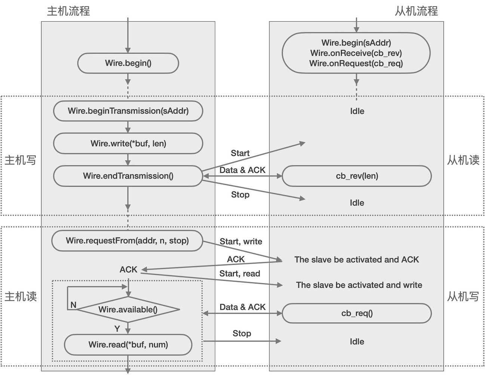

===========================
5.3 I2C从机模式
===========================

绝大多数情况，嵌入式系统的MCU都是系统的主控制器，MCU片上I2C功能单元都工作在主机模式与系统内的I2C接口的传感器、执行器或显示器等外设互联。
但也有少数情况MCU片上I2C功能单元工作在从机模式，譬如通过I2C接口升级MCU固件，或者通过I2C接口协同工作的两个MCU组成的系统中一个MCU做主机另一个做从机。
本节主要了解MCU片上I2C功能单元工作在从机模式下的编程控制。注意，并不是所有MCU片上I2C功能单元都支持主机模式和从机模式，有些MCU仅支持主机模式的I2C接口。

当我们把MCU片上I2C功能单元配置为从机模式时，其内部结构组成如图5.7所示。

.. image:: ../_static/images/c5/i2c_slave_mcu_structure.jpg
  :scale: 40%
  :align: center

图5.7  从机模式的MCU片上I2C功能单元的结构组成

在从机模式下，MCU的I2C接口所使用的I/O引脚中，连接SCL信号的是输入引脚，SDA信号的是双向引脚。根据I2C通讯接口的要求，任一从机都必须有惟一的从机地址，
当我们将MCU片上I2C功能单元配置为从机模式时，必须指定本机的7位惟一地址。相对于主机，从机始终是被动的，主机何时寻址本机、读或写操作均有主机发起。
因此，从机模式需要配置一定RAM空间用于缓存接收数据，并开启中断，当从模式的I2C接口识别到本机被寻址，并接收到主机的数据时，向CPU发起中断请求并响应主机请求。

Arduino的I2C通讯接口的硬件抽象层不仅支持主机模式，也支持从机模式。从机模式的I2C硬件抽象层接口共有7各，具体接口如下：

.. Note::  I2C硬件抽象层接口(仅从机模式的接口)

  1. **begin(slave_addr)**，将I2C通讯接口配置为从机模式，并配置惟一的7位从机地址、SCL和SDA的I/O引脚、SCL时钟速度(使用默认的设置)、中断等。注意，只能在初始化时调用一次
  2. **onReceive(cb_rev)**，注册“onReceive”事件的回调函数，当“onReceive”事件发生后需要执行的代码，譬如调用“available()”检查可读数据个数、调用“read()”读取接收缓冲区的数据并处理
  3. **onRequest(cb_req)**，注册“OnRequest”事件的回调函数，当“OnRequest”事件发生后需要执行的代码，譬如调用“write()”发送数据给主机
  4. **write(val)/**，向主机写/发送数据(当主机请求数据时，即“OnRequest”事件发生后)。这个接口还有另外两种形式：write(val[], len)和write(string)
  5. **available()**，返回接收缓冲区中有效的/可读取的字节数据个数，即“onReceive”事件发生后使用该接口检查接收缓冲区的有效数据字节数
  6. **read()**，从接收缓冲区读取有效数据

注意，Arduino平台的I2C硬件抽象层的主机模式和从机模式的接口都被封装在“TwoWire类”中，详见页面 [1]_ ，从机模式的接口仅有这6种(具体种类还与Arduino内核的版本有关)，
主机模式共8种接口(见前一节)，其中部分接口是主机模式和从机模式共用的，如“write()”、“read()”、“available()”等，部分接口是各自专用的，
譬如注册事件的回调函数是从机模式专用的接口，而“beginTransmission()”、“endTransmission()”和“setClock()”是主机模式专用的接口。

使用I2C硬件抽象层的主机模式接口和从机模式接口，两个MCU之间的通讯流程参见图5.8所示。

图5.8  两个MCU之间使用I2C通讯的工作流程(使用硬件抽象层接口)

图中的实线框内的操作是软件部分，实线框外的操作由I2C功能单元的硬件自动完成。除了图中的“主机写-从机读”和“主机读(请求)-从机写”的I2C接口数据传输流程外，
还有“主机写-从机读-主机请求-从机写”(简单理解为“主机写后读”)的数据传输流程，这个流程要求主机“write(val)”后调用“endTransmission(false)”执行数据发送且发送完毕后不发起“STOP时序”，
即不释放I2C总线，继续向从机请求数据，当从机数据发送完毕后，主机才发起“STOP时序”释放I2C总线。请参照图5.8的流程自行设计“主机写后读”的操作流程。

下面我们找来两个BlueFi，并使用一根型号为“SH1.0mm-4P”双头同向的信号线将他们连接起来。BlueFi开源板带有一个专用的4脚I2C扩展插座，在复位按钮旁边，
该插座的4各信号分别为3.3V、GND、SDA、SCL，并顺序排列。使用I2C接口连接两个BlueFi的方法如图5.9所示。

图5.9  使用I2C接口连接两个BlueFi的方法

请注意4芯连接线的型号、脚间距，并确保引脚是同向一一对应的，即两个BlueFi开源板的i2C专用插座的4个脚分别一一对应连接。

现在我们可以参考图5.8所示的流程，分别编写“主机写”和“从机接收”的程序对儿，并分别编译下载到一个BlueFi上执行，使用USB数据线将工作在从机模式的BlueFi连接到电脑，
打开Arduino IDE串口监视器可以看到主机写给从机的数据。程序代码如下：

(**master_write.ino文件**，编译并下载到一个BlueFi开源板，他是I2C接口的Master设备)

.. code-block::  C
  :linenos:

  #include <Wire.h>
  TwoWire* __wire;  // define a pointer "__wire" to TwoWire type

  void setup() {
    delay(500);
    __wire = &Wire;  // the pointer __wire point to Wire
    __wire->begin(); // join i2c bus (address optional for master)
  }

  void loop() {
    static uint8_t x=0;
    __wire->beginTransmission(0x72); // transmit to device #114
    __wire->write("x is ");       // sends five bytes
    __wire->write(x);             // sends one byte  
    __wire->endTransmission();    // stop transmitting
    x++;
    delay(998);
  }

在这个“主机写”的程序中，首先声明一个TwoWire型指针“__wire”，并在初始化时将这个指针指向BlueFi的I2C接口0，即“Wire”，并使用指针访问这个I2C接口，
在初始化阶段将这个I2C接口初始化为主机模式(使用无参数的“begin()”初始化接口)。在主循环中每隔1秒从这个I2C接口写出写字符串“x is 12”，其中字符串中的数值是可变的，
根据“static uint8_t x=0;”语句，以及每写出一次后执行“x++;”语句，这个字符串的变化规律是怎么样的呢？

(**slaver_receive.ino文件**，编译并下载到一个BlueFi开源板，他是I2C接口的Slave设备)

.. code-block::  C
  :linenos:

  #include <Wire.h>
  TwoWire* __wire;  // define a pointer "__wire" to TwoWire type

  void setup() {
    __wire = &Wire;            // the pointer __wire point to Wire
    __wire->begin(0x72);       // join i2c bus with address #114
    __wire->onReceive(cb_rev); // register a callback function on Receive event 
    Serial.begin(115200);      // start serial for output
  }

  void loop() {
    //delay(500);
  }

  // callback function that executes whenever data is received from master
  // this function is registered as an event, see setup()
  void cb_rev(int num) {
    while( 1 < __wire->available() ) { // loop through all but the last
      char c = __wire->read();         // receive byte as a character
      Serial.print(c);                 // print the character
    }
    uint8_t x = __wire->read(); // the last received byte as an integer
    Serial.println(x);          // print the integer
  }

“从机接收”程序中，同样使用指针“__wire”指向I2C接口0，即Wire。初始化时使用“__wire->begin(0x72)”将I2C接口0配置为从机模式，且从地址为114，
并使用“__wire->onReceive(cb_rev);”语句注册“当接收到主机发送的数据”事件的回调函数——“cb_rev(int num)”。定义这个回调函数时，监测I2C接口0是否有数据可读，
如果有效数据个数大于1个则读出1个数据并打印到串口字符控制台，最后一个数据作为整数打印到控制台。

注意，从机的程序中使用的回调函数“void cb_rev(int num)”带有的输入参数“int num”是“onReceive”接口指定的，用于传递发生“onReceive”事件时接收缓冲区内有效的数据个数，
此示例中未使用这个参数。

最后，根据图5.8的流程，实现“主机请求读”和“从机写”的程序对儿。示例代码如下：

(**master_request.ino文件**，编译并下载到一个BlueFi开源板，他是I2C接口的Master设备)

.. code-block::  C
  :linenos:

  #include <Wire.h>
  TwoWire* __wire;  // define a pointer "__wire" to TwoWire type

  void setup() {
    __wire = &Wire;       // the pointer __wire point to Wire
    __wire->begin();      // join i2c bus (address optional for master)
    Serial.begin(115200); // start serial for output
  }

  void loop()
  {
    __wire->requestFrom(0x72, 6);// request 6 bytes from slave device #114
    while(__wire->available()) { // slave may send less than requested
      char c = __wire->read();   // receive a byte as character
      Serial.print(c);           // print the character
    }
    delay(998);
  }

在这个主机程序中，初始化部分与前一个“主机写”程序完全一样，但是主循环中的程序完全不同。主主循环程序中，每秒从I2C接口0向地址为114的从机请求6字节数据，
然后监测接收缓冲区是否有数据可读，如果有则逐个读出并打印到串口字符控制台。

(**slaver_send.ino文件**，编译并下载到一个BlueFi开源板，他是I2C接口的Slave设备)

.. code-block::  C
  :linenos:

  #include <Wire.h>
  TwoWire* __wire;  // define a pointer "__wire" to TwoWire type

  void setup() {
    __wire = &Wire;            // the pointer __wire point to Wire
    __wire->begin(0x72);       // join i2c bus with address #114
    __wire->onRequest(cb_req); // register the callback function of OnRequest event
  }

  void loop() {
    delay(100);
  }

  // callback function that executes whenever data is requested by master
  // this function is registered as an event, see setup()
  void cb_req(void) {
    __wire->write("hello "); // respond with message of 6 bytes as expected by master
  }

在这个“从机写”的程序中，首先初始化I2C接口0，并注册“当主机请求读数据”事件的回调函数“cb_req”。在回调函数“cb_req”中仅发生6个字符给主机。

-------------------------

上面的两对示例程序中，我们仅仅使用I2C硬件抽象层的接口实现两个BlueFi之间通讯，虽然表面上看两对程序各自实现的数据传输都是单工的，
即“主机写”和“从机读”、“主机请求”和“从机发送”，实际的输出协议都是双向的。

两个MCU如何使用I2C接口实现双向数据通讯呢？我们可以采用“存储器映射”方案。从机端的数据信息按特定的数据结构(如数组)顺序地存储，
主机端首先向从机“写”数据的顺序号来指定数据单元，然后通过请求读取该数据单元，该方法的主机和从机的具体流程参见图5.10所示。

图5.10  使用I2C接口实现两个MCU双向通讯的主机和从机流程(存储器映射)

请根据上图的流程并参考前面的示例程序，分别编写对应的主机端和从机端的程序对儿，并使用两个BlueFi测试程序是否达到目标。

当然，图5.10中的主机流程仅仅是请求从机端指定的静态数据项，因为从机端并没有改变任何数据项。事实上，如果我们允许从机端程序改变图5.10中的数据项，
这种改变必须十分的谨慎，因为正在修改数据项时或许会发生回调函数正好读取该数据项，这将引起“竞争”。避免这种竞争的方法之一就是使用“锁(lock)”，
数据项操作方在操作前首先检查“锁”的状态，如果被上锁则等待解锁后方可操作，如果未被上锁则先上锁再操作数据项。

-------------------------

本节探讨如何使用I2C硬件抽象层的接口实现两个MCU之间通讯，对于主机端的软件操作和实现方法，与前一节所用的方法并无区别。由于I2C从机始终处于被动状态，
I2C硬件抽象层为从机端提供专用的接口，包括“OnReceive”和“OnRequest”两种事件的回调函数，使用回调函数确保从机实时地响应主机的写和请求读操作，
当然MCU片上I2C接口功能单元的硬件自动处理主机的寻址，以及事件触发，无需从机端软件干预。

-------------------------

参考文献：
::

  [1] https://www.arduino.cc/en/Reference/Wire
