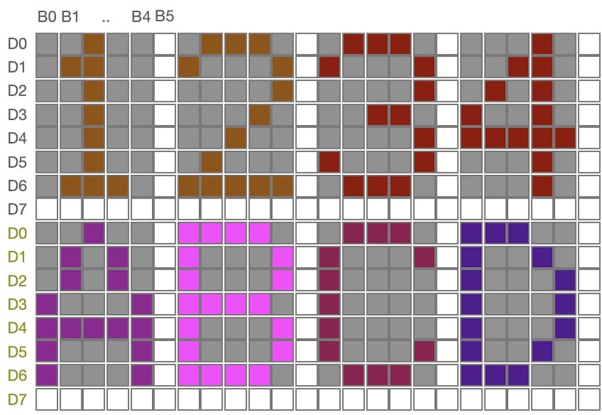

===========================
 思考题
===========================

1. 根据图6.1和图6.4，简述SPI通讯接口的主机向从机的0x1234地址单元写入数据0x5678的传输过程。
2. 根据图6.3所示的两种SPI总线拓扑，分别简述两种总线拓扑的主机访问其中某个从机的过程。
3. BlueFi的彩色LCD显示器由240*240个像素组成的点阵显示器，每个像素大小和像素间距大小是固定的，像素和间距越小则显示效果越细腻。
   下图是5(列)*7(行)点阵字符的示意图，请给出“0”～“9”十个数字字符的字模数据(含字符间隔)；当我们需要将这些字符放大2倍(10列*14行)、4倍或2n倍显示时，
   请给出字模放大算法。

4. 图形LCD显示器不仅可以显示几何图形、字符，也可以显示汉字等象形文字。假设使用16*16点阵(含字间距)显示单个汉字，请给出自己名字的汉字字模数据，
   并使用BlueFi将这些汉字显示在LCD屏幕上。
5. 请列举多处理器系统的优缺点。
6. 使用搜索引擎查阅FRAM存储器MB85RS16的Datasheet，并列举其他半导体公司的同类存储器。如果BlueFi需要使用此类存储器保存关键数据，
   请以BlueFi金手指拓展接口设计该存储器的软硬件接口。

