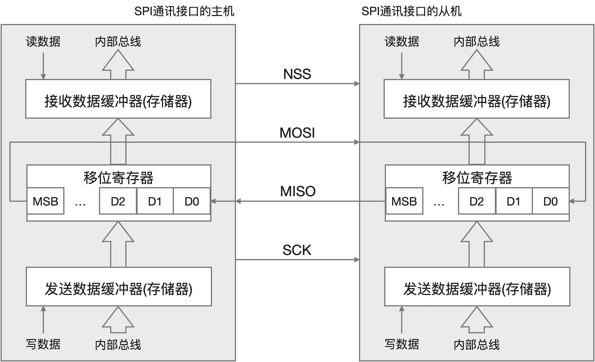
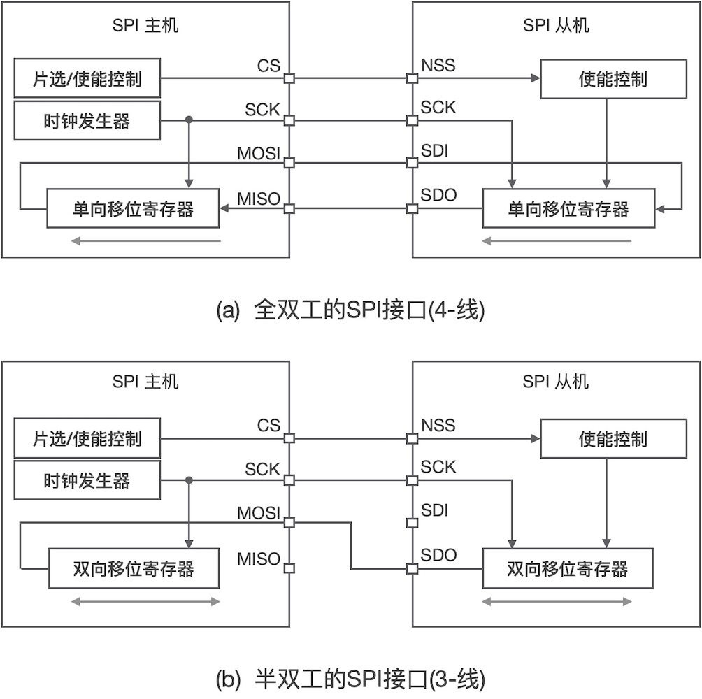
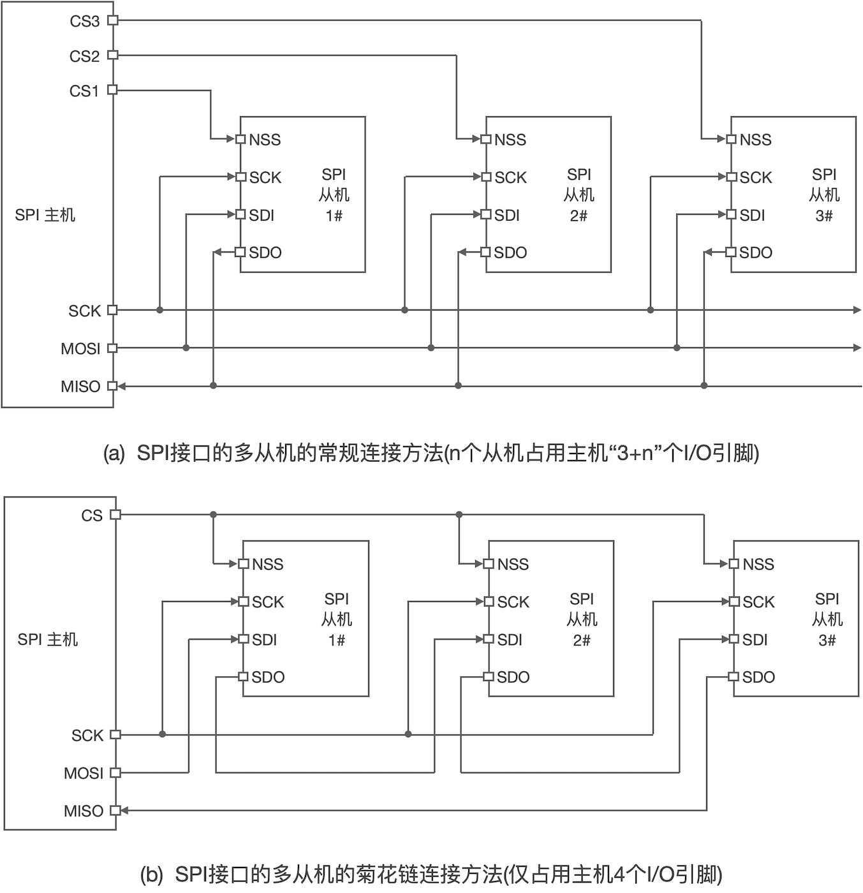
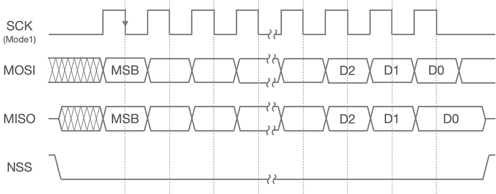
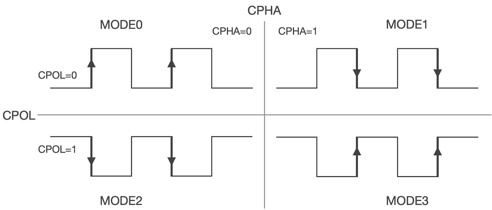
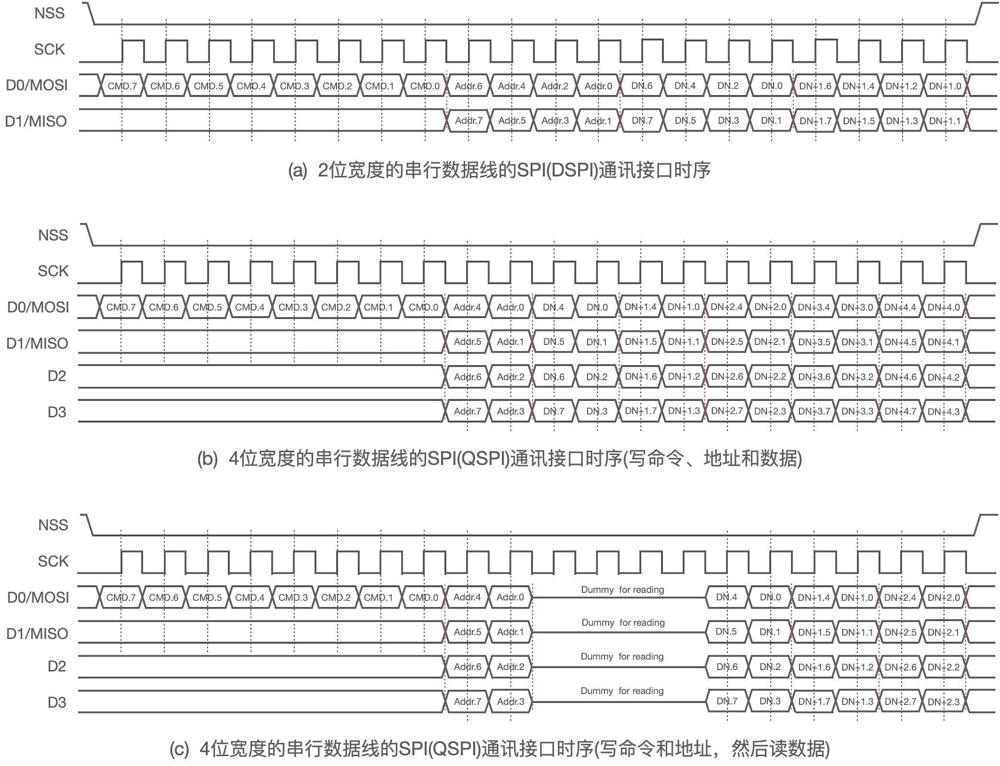
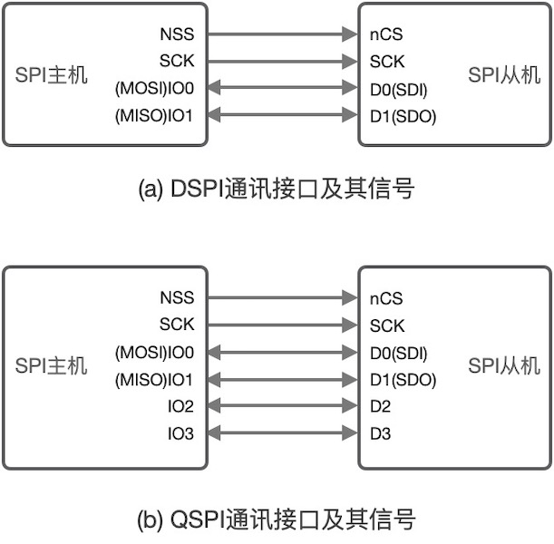
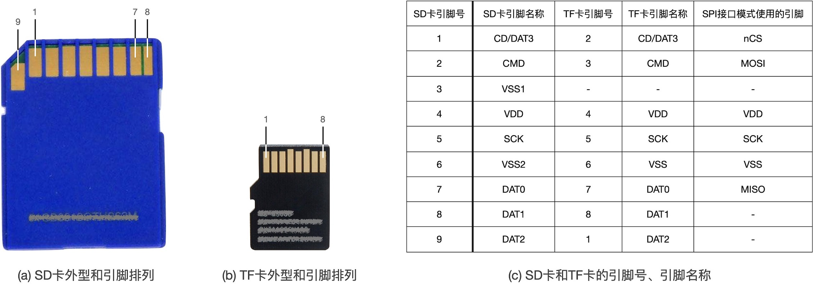
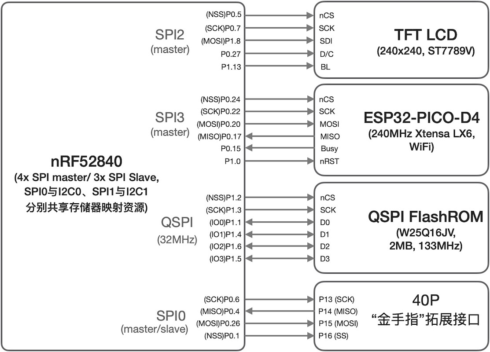

===========================
6.1 SPI通讯接口
===========================

SPI通讯接口采用主从模式的结构，仅支持一个主机和一个或多个从机。标准的SPI通讯接口是4线的，包括同步时钟信号SCK、主输出从输入信号MOSI、主输入从输出信号MISO、
片选信号NSS(Slave Select)。一对SPI通讯接口的主机和从机的内部结构如图6.1所示。

图6.1  SPI通讯接口的主机和从机内部结构

这里再次看到移位寄存器，他是SPI通讯接口的核心部组件。根据现代MCU的存储器映射规则，SPI通讯接口的接收和发送数据缓冲器都是MCU内部存储单元。
当SPI通讯接口软件将待发送的数据写入发送数据缓冲器并启动数据发送过程(片选信号NSS被主机置为有效电平)，该数据将被自动装载到移位寄存器，
并以最高位(MSB)先发送的规则随着同步时钟SCK顺序地将数据逐位从MOSI发出，同时从机SPI接口将随着同步时钟SCK逐位地将数据位移入移位寄存器。
当主机需要从从机读取数据时，从机首先将待发送的数据写入发送数据缓冲器，当主机将片选信号NSS置为有效电平时自动将数据加载到从机的移位寄存器，
随着同步时钟信号SCK仍遵循MSB先发送的规则将数据顺序地逐位从MISO发出，同时主机SPI接口将随着同步时钟SCK逐位地将数据移入移位寄存器，
所有数据位移入完毕后，主机移位寄存器的数据自动被加载到接收数据缓冲器。

这两个方向的移位过程是可以同时进行，而且不会有接收和发送数据位重叠，两个移位寄存器被两个独立的串行数据线首尾串联成环形，
譬如一个字节(8位)数据从主机移入从机的同时从机上的一个字节数据也正好移入主机。
很显然，标准的SPI通讯接口支持全双工数据传输，即主机向从机写入数据的同时可以读取从机上的数据。
事实上，为了提高数据传输效率，绝大多数现代SPI通讯接口的接收和发送数据缓冲器都采用FIFO(先进先出)结构、接收和发送完毕的中断机制。

有些SPI通讯接口的应用场景无需全双工的数据传输，譬如只需要半双工或单工，我们可以简化接口以减少信号线。图6.2给出全双工的和半双工的SPI通讯接口的对比。

图6.2  全双工的和半双工的SPI通讯接口

很多资料中提到4线的和3线的SPI接口正是上图所示的两种情况，4线的是标准SPI通讯接口，3线的是半双工的SPI通讯接口。在半双工的数据传输模式，
主机的MOSI和从机的MISO相连，而且主从双方的这个接口信号都是双向的。为了防止信号名称的混淆，在上图中的主机侧仍使用NSS、SCK、MOSI和MISO等4个名称，
而从机侧则使用SDI(从机数据输入信号)代替MOSI，SDO(从机数据输出信号或数据输入信号)代替MISO。其中，半双工模式，从机的SDO信号是双向的，
主机的MOSI信号也是双向的。

半双工的SPI通讯接口节约一个接口信号连线，但并不是所有的SPI接口都支持半双工的模式。单工的SPI接口也可以节约一个接口信号，
根据数据传输的方向需要确定去掉MOSI或MISO。譬如显示器是一种典型的输出外设，显示器的SPI接口可以采用单工的，仅需要NSS、SCK和MOSI三个信号即可。

前面讨论的都是一主一从的SPI通讯接口，多从机时的SPI接口是什么样的结构呢？如图6.3所示。

图6.3  一主多从的SPI通讯接口

上图中给出两种拓扑结构的一主多从的SPI通讯接口。图中(a)是常规的拓扑结构，SCK、MOSI和MISO等三个信号是SPI通讯接口的共享总线信号，
所有的主机和从机使用这些共享总线连接在一起，但是每一个从机必须独占一个片选信号NSS，随着从机个数的增加，主机将开销更多的I/O引脚用作片选信号。
很显然，图中(b)的菊花链拓扑结构中所需要主机的I/O引脚始终是4个，不受从机个数影响。对比两种拓扑，虽然菊花链结构节约I/O引脚但数据传输需要经过更多次移位，
即消耗更多个同步时钟周期，意味着更低的数据通讯速率。此外，两种拓扑结构的接口软件区别较大，菊花链结构的某个从机与主机之间传输数据所耗费的时钟个数必须根据从机个数和顺序号来确定。

后面所用的SPI通讯接口都默认为常规的拓扑，除非特别说明。与I2C通讯接口使用的惟一从机地址的寻址方法完全不同，任一SPI从机是否被选中与SPI主机通讯，
仅由其片选信号NSS的状态所决定。通常，SPI主机需要访问某个从机时，只需要将该从机的片选信号NSS置为有效电平，同时其他从机的片选信号都被置为无效电平，
仅有一个从机被选中与主机通讯。这种通过惟一的片选信号选中某个从机的方法与传统的三总线(数据总线、地址总线和控制总线)的片选信号选中某个外设的方法几乎完全一致，
传统的三总线是并行总线，现在仅适合MCU或MPU片上组件之间互联，主CPU通过控制地址译码器将某个组件的片选信号置为有效电平，此时主CPU与被选中的组件之间独占完整总线进行数据传输，
期间其他组件(即未被选中的组件)处于空闲状态。当某个SPI从机的片选信号被主机置为有效电平时，SPI主机与被选中的从机之间独占SPI接口总线进行数据传输，
其他未被选中的SPI从机处于空闲状态，忽略SPI总线的输入信号(SCK和MOSI)并释放输出信号(MISO)。

从SPI通讯接口的选中和非选中的访问方法看，任何时候仅有被选中的SPI从机与主机之间一对一通讯，因此SPI通讯接口的时序比I2C简单很多。如图6.4所示，
SPI通讯接口仅以8位(字节)及其整数倍的二进制位对齐的移位操作，没有I2C通讯接口的START和STOP等特殊时序。

图6.4  SPI通讯接口的时序

上图中，SPI通讯接口的同步时钟信号SCK在总线空闲时的状态是低电平，并在SCK的第偶数次跳变沿对MOSI和MISO信号采样。事实上，标准的SPI接口规范中，
总线空闲时SCK信号的状态CPOL(Clock POLarity)、数据线的采样时刻CPHA(Clock PHAse)、位序MSBFIRST(先发送MSB)和SCK信号频率等都是可配置的。
这些配置也都是SPI软件接口的基本参数，详见第6.2节。关于CPOL和CPHA两个参数之间的关系如图6.5所示。

图6.5  SPI通讯接口时序的4种配置

根据CPOL和CPHA两个参数，SPI通讯接口时序共有4种不同的配置模式。MODE0，SPI总线空闲时SCK保持低电平，当NSS信号有效期间，
SCK信号的第奇数次跳变沿采样MOSI和MISO信号，即SCK的上升沿时刻采样数据线。MODE2，SPI总线空闲时SCK保持高电平，当NSS信号有效期间，
SCK信号的第奇数次跳变沿采样MOSI和MISO信号，即SCK的下降沿时刻采样数据线。根据上图所示，MODE1和MODE3的两种配置无须赘述。

必须注意，数据线被采样的时刻必须确保数据线状态是稳定的，即不允许信号驱动端改变数据线状态，SPI通讯接口的每一种时序配置的数据线切换时刻也是确定的，
对于MODE0和MODE3的配置，允许SCK位低电平时改变MOSI和MISO的状态。

同步时钟信号SCK的频率是SPI通讯接口的波特率(Baudrate)，即二进制位的传输频率(或传输一个二进制位所消耗的时间)。当我们在配置SPI通讯接口的参数时，
必须考虑SPI从机的能力，包括SCK信号支持的/允许的最大频率、模式、位序等。换个角度来看待这些可配置参数，他们都是为了适应SPI从机的目的，
尤其是SPI从机是不可配置或不可编程的情况。

本质上，SPI通讯接口仅仅是一种同步串行数据移位操作的物理层接口，可配置接口参数的高灵活性和开源性使得SPI接口拥有很多种变化版本(Variant)。譬如，
当前被广泛使用于FlashROM(主要是NOR结构闪存)接口的2位(Dual)/4位(Quad)宽度的串行数据线版本分别称作DSPI和QSPI，接口时序的读写操作示例如图6.6所示。

图6.6  DSPI和QSPI通讯接口的读写时序

上图中的SPI通讯接口配置参数采用MODE0。可以看出，为兼容标准4线SPI通讯接口，传输命令期间仍使用标准4线SPI接口时序，其后的地址和数据传输采用2位或4位宽度的串行数据线发送数据。
很显然，DSPI和QSPI的波特率分别是标准SPI通讯接口波特率的2倍和4倍。

上图(c)是先写命令和地址信息然后再顺序地连续读取若干地址单元的数据的时序，该时序的写入和读出操作之间有4个SCK周期的Dummy(占位)，
允许SPI从机在这个期间加载数据到发送缓冲区。DSPI和QSPI通讯接口的主机和从机信号如图6.7所示。

图6.7  DSPI和QSPI通讯接口的主从信号

SD卡是一种NAND结构的大容量闪存，TF卡是外型尺寸更小的SD卡(即micro SD)。SD卡接口不仅兼容标准SPI接口，也有专用的SD卡接口规范。
当SD卡的读写速度要求较低的场合，尤其嵌入式系统中可以使用标准SPI接口访问SD卡。即使SD卡的高速读写系统，SD卡上电后的初始化阶段，
主机使用标准SPI接口向SD卡发送配置命令，然后SD卡根据配置命令进入SD卡接口模式实现高带宽的数据读写操作。有关SD卡的SPI模式详见文档 [1]_ 
的第7章。SD卡、TF卡接口信号与SPI接口信号之间的关系如图6.8所示。

图6.8  SD卡、TF卡接口信号与SPI接口信号之间关系

SD卡模式使用6个信号，分别为CMD、SCK、DAT0~3。4位宽度的串行数据线DAT0~3是双向的，与QSPI相同。CMD是传输主机命令和SD卡应答信息的专用信号线，
SD卡操作总是以命令帧(由1个字节命令、4个字节命令参数和1个字节CRC7校验和组成)开始，譬如CMD17和CMD24分别是单个数据块的读和写命令。

SDIO(Secure Digital Input and Output)接口是从SD接口衍生出来的一种高吞吐量的外设接口，向下兼容SD卡接口规范和标准SPI接口。
SDIO接口不仅用于可插拔的存储卡，还用于WiFi无线网卡、蓝牙卡、摄像头、GPS等外设接口。SDIO的具体应用和规范可在页面 [2]_ 找到。

前面已初步了解半双工SPI接口(3线)、全双工的标准SPI接口(4线)、DSPI(4线)、QSPI(6线)、SD(6线)及其衍生的SDIO等通讯接口，
这些接口常用于嵌入式系统主控制器与内部组件之间的总线接口，与I2C相比SPI接口的时序更简单、更容易实现、允许更高的波特率。

-----------------------

BlueFi开源板的主控制器与彩色LCD显示器、WiFi协处理器等都使用SPI通讯接口，并使用QSPI接口扩展片外的2MB闪存用于保存Python库、
Python脚本程序、声音和图片等资源文件。此外，BlueFi开源板的40P金手指扩展接口的P13~P16可作为标准SPI接口。
BlueFi开源板的SPI接口如图6.9所示。

图6.9  BlueFi开源板上的SPI接口外设

nRF52840具有1个QSPI接口和4个标准SPI接口(分别称作SPI0~3)，其中SPI0和SPI1分别与I2C0和I2C1共享存储器映射资源，即使用I2C0时SPI0将无法使用，
使用I2C1时将无法使用SPI1。nRF52840的4个标准SPI接口都可编程作为SPI主机模式，其中3个还可编程作为SPI从机模式。
此外，nRF52840的QSPI接口和4个标准SPI接口的最大波特率都高达32MHz。

根据上图可以看出，BlueFi开源板的彩色LCD显示器使用的是变种的SPI通讯接口，WiFi网络协处理器使用标准SPI接口，我们并未使用SPI支持的共享总线。
考虑到I2C0、I2C1和SPI0、SPI1共享存储器资源的局限性，我们在后续的BlueFi开源板的BSP代码中使用SPI2和SPI3分别连接彩色LCD显示器和WiFi网络协处理器，
前一章中我们已经使用I2C1作为BlueFi板上的温湿度、光学和运动传感器，BlueFi板的40P金手指扩展接口上的I2C和SPI接口分别使用I2C0和SPI0，
意味着任何时候只能选择使用其中的一种接口。

BlueFi开源板的QSPI接口固定用于片外2MB闪存的扩展接口，按照nRF52840的QSPI接口协议，最大支持24位地址宽度，即支持最大16MB片外扩展的QSPI闪存。
当然，根据QSPI接口规范，向下兼容DSPI和标准SPI等低速接口。BlueFi的片外2MB闪存主要用于Python文件系统，我们不再详细赘述

下一节将以BlueFi开源板的彩色LCD显示器的BSP实现为实例来了解SPI主机模式接口及其编程控制。

-------------------------

参考文献：
::

  [1] https://www.sdcard.org/downloads/pls/click.php?p=Part1_Physical_Layer_Simplified_Specification_Ver8.00.jpg&f=Part1_Physical_Layer_Simplified_Specification_Ver8.00.pdf&e=EN_SS1_8
  [2] https://www.sdcard.org/chs/index.html