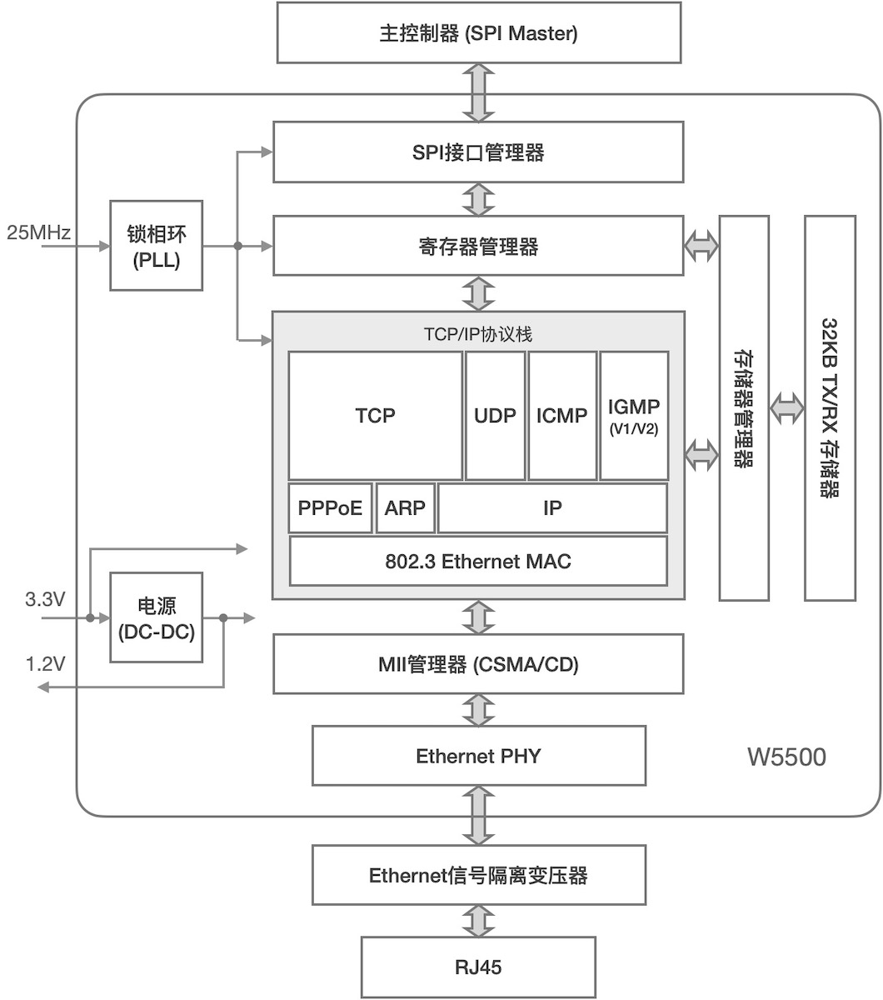
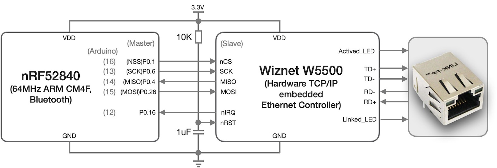
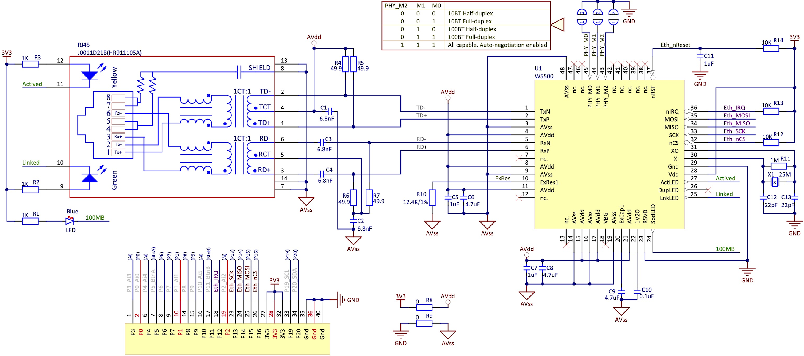
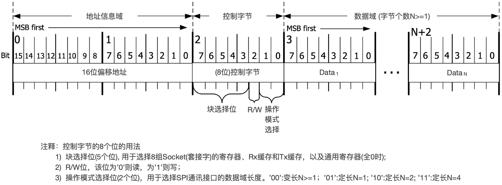

===========================
6.4  SPI接口应用设计
===========================

SPI通讯接口的扩展常用于高速的或大数据容量的功能外设拓展，譬如WiFi、Ethernet、SD/TF卡、大容量高速数据存储器等。与I2C通讯接口相比，
虽然SPI通讯接口的拓扑需要占用更多个I/O引脚用于片选或握手信号，但SPI接口的时钟频率远高于I2C。此外，SPI通讯接口支持全双工通讯，但I2C是半双工的。
我们直到SD/TF卡的存储器容量可以按千兆字节(即GB)来计量，而NOR结构型FlashROM的存储容量仅以MB计量，两者的存取速度相差很大(后者速度更快)，
而且这两类存储器都采用SPI或QSPI等接口。大容量存储器不使用I2C通讯接口的另一个原因是，I2C的总线寻址和大容量存储器的地址管理会造成数据存取过程中地址信息的传输将占用大量时间，
数据的存取效率极地。

某些小容量的存储器既有I2C接口的也有SPI的，譬如MRFRAM(Magnetic Relaxor Ferroelectric RAM, 磁性弛豫铁电RAM)，FRAM的容量仅有128B~512KB范围。
这种存储器既有普通SRAM一样的存取速度和读写寿命(达万亿次)，又有普通FlashROM一样的不挥发性(即断电后数据仍能保持数十年不丢失)。FRAM常用于记录系统运行时的关键数据信息，
即使没有后备电池系统突然断电也不必担心这些数据会丢失，而且在系统运行期间将数据写入FRAM操作的时间与RAM一样地快。譬如航空航天器控制系统内的数据采集和记录单元，
当数据采集和记录的频次较高时(如每秒1K次)，使用普通FlashROM记录数据的写入速度无法满足要求，使用普通RAM记录数据如果突遇断电会丢失(未转移的)部分数据，
FRAM能更好地满足此类需求。绝大多数FRAM产品都支持I2C或SPI通讯接口，I2C接口的时钟频率最高可达1MHz，而SPI接口的时钟频率达20MHz。
我们该选择那种接口，需要根据使用FRAM类小容量存储器的目的和数据存取速度、频率来确定。

除了同步时钟频率外，基于SPI通讯接口的功能能外设扩展设计还需要考虑其他一些因素，如外设工作电压、逻辑电平转换、握手信号的有效电平和默认状态等。
当SPI接口的外设工作电压、接口逻辑电平电压与主控制器I/O引脚的逻辑电平向匹配时，这些问题都非常简单，标准SPI通讯接口的SCK、MOSI和MISO都采用推挽型驱动电路，
SPI外设的这些信号引脚直接与总线对应连接即可。当逻辑电平电压不匹配时，电平转换电路单元是接口设计中不可缺的，由于SPI总线的信号方向都是单向的，
单向的和三态的电平转换IC非常多，OnSemi(安森美)、TI、NXP(或安世)等都有电平转换产品系列可选用。接口功能方面，握手信号与SPI接口的片选信号相似，
使用主控制器的低速I/O引脚即可，当然逻辑电平电压的匹配也是需要考虑的，外设的片选信号的默认状态应该设为无效电平，握手信号也应按功能选择合适的默认电平状态，
即系统复位后或接口未激活时的电平状态，一般使用上拉或下拉电阻来设置。

-------------------------

现在我们以硬件TCP/IP协议栈单元的扩展为例来说明SPI接口的通用扩展方法。硬件协议栈，顾名思义就是使用纯数字电路硬件实现TCP/IP协议。对于存储容量小、
计算能力弱的MCU来说，硬件协议栈是实现IoT应用的最佳方案。前一节的双处理器系统的网络协处理器也有相似的作用，WiFi网络协处理器需要单独编程，
使用软件结合WiFi MAC和PHY等硬件单元实现TCP/IP全栈功能。本节使用WIZnet的W5500硬件TCP/IP协议栈 [1]_ ，采用标准SPI通讯接口与BlueFi金手指拓展接口的P13~P16引脚连接，
进而与BlueFi的主控制器——nRF52840实现主从通讯，为BlueFi拓展有线的Ethernet(以太网)功能接口。我们将在后续的内容中使用Ethernet接口，
本节使用SPI通讯接口拓展的硬件TCP/IP协议栈不仅是一种SPI接口设计示例，也是一种Ethernet功能接口拓展方法。

硬件TCP/IP协议栈W5500的内部结构如图6.15所示。

图6.15  硬件TCP/IP协议栈——W5500的内部结构(来自WIZnet)

TCP/IP协议栈的实现是W5500的核心，包含一个100BT的Ethernet PHY单元，外围只需一个网络隔离变压器和RJ45插座(或者使用内置网络隔离变压器的RJ45插座)即可让系统接入Ethernet网络；
PHY通过标准的MII(介质无关的接口)与MAC层(数据链路层的关键协议，确保数据报文的可靠性和完整性)连接，网络层(包含IP、ARP和PPPoE等)、传输层(TCP和UDP等)等通过内部总线与下层协议单元相连接。
W5500内部有一个32KB的Ethernet接收/发送缓存，主控制器可通过SPI通讯接口发送偏移地址访问这些缓存(即读写TCP/IP协议报文)。
使用W5500扩展Ethernet功能接口的信号连接如图6.16所示。

图6.16  BlueFi拓展Ethernet功能接口的信号连接

具体的电路原理图如图6.17所示。

图6.17  使用BlueFi金手指拓展W5500的电路原理图

上图的左半部分是RJ45(内置网络隔离变压器)插座、BlueFi金手指拓展接口插座的电路原理，右半部分则是W5500及其外围的基本电路，
W5500共有5个信号连接到BlueFi金手指拓展接口上，包括4个标准SPI通讯接口信号和一个中断请求信号。根据W5500的数据页(Datasheet)所列的电气接口信息，
建议其工作电压和I/O接口逻辑电压为3.3V，正好与BlueFi的主控制器I/O逻辑电压一致，所以W5500的这些接口信号可以与BlueFi金手指拓展接口信号直连，
并使用BlueFi金手指的3.3V电源输出为其供电，注意W5500的最大消耗电流约150mA。

W5500需要外置的25MHz晶体振荡器为其内部PLL单元提供低频时钟信号，其内部PHY单元的工作模式是通过3个引脚PHY_M2/M1/M0的逻辑电平的组合配置，
上图中使用一个简表列举常用配置，这3个配置引脚内部带有上拉电阻，即默认为自动协商模式。W5500的片选信号和中断请求信号都设置有上拉电阻，
当这个Ethernet功能接口未与主控制器连接时，即使接口信号都为悬空状态，W5500默认是未被选择的状态，即空闲状态。

W5500支持的SPI通讯接口协议如图6.18所示。完全兼容标准SPI通讯接口以字节整数倍来传输数据，且每一次传输数据至少4个字节，包含2字节的地址信息、
1字节的控制字和至少1字节的数据。数据域的传输方向和模式由控制字的低3位来指定。W5500的数据传输模式分为4种，数据域个数可变的模式，或固定为1/2/4个字节的模式。

图6.18  W5500支持的SPI通讯接口协议

根据这个Ethernet功能接口电路原理图，以及WIZnet提供的接口库，我们可以实现其软件接口和Ethernet应用，如Web(HTTP)、e-mail(SMTP和POP3)、FTP等。
Arduino开源平台的Ethernet库 [2]_ 支持W5500，或者使用其改进版的库 [3]_ ，基于这些开源库代码在Arduino开源平台上使用这里拓展的Ethernet功能接口是非常容易的。

Arduino开源平台的Ethernet库的接口及其应用示例参见 [4]_ 。
参考Arduino官网的编写自定义开源库的向导 [5]_ 可自行实现Ethernet接口库，或者参考 [6]_ 页面的操作向导安装第三方的开源库。

-------------------------

上面基于BlueFi金手指拓展的Ethernet功能接口仍可以使用Python脚本编程来实现网络连接。首先将BlueFi插入电脑USB端口，双击BlueFi复位按钮，
将BlueFi的Python解释器固件拖放到BLUEFIBOOT磁盘，即可使用Python脚本程序控制BlueFi。

使用标准Ethernet网线将BlueFi开源板及其Ethernet功能接口连接到可用的以太网内，打开电源，并将下面的示例程序代码保存到“/CIRCUITPY/code.py”文件，
给BlueFi开源板通电。示例代码如下：

.. code-block::  Python
  :linenos:

  import board
  import busio
  import digitalio
  import adafruit_requests as requests
  from adafruit_wiznet5k.adafruit_wiznet5k import WIZNET5K
  import adafruit_wiznet5k.adafruit_wiznet5k_socket as socket

  print("Wiznet5k WebClient Test")

  TEXT_URL = "http://wifitest.adafruit.com/testwifi/index.html"
  JSON_URL = "http://api.coindesk.com/v1/bpi/currentprice/USD.json"

  cs = digitalio.DigitalInOut(board.P16)
  spi_bus = busio.SPI(board.P13, MISO=board.P14, MOSI=board.P15)

  # Initialize ethernet interface with DHCP
  eth = WIZNET5K(spi_bus, cs)

  # Initialize a requests object with a socket and ethernet interface
  requests.set_socket(socket, eth)

  print("Chip Version:", eth.chip)
  print("MAC Address:", [hex(i) for i in eth.mac_address])
  print("My IP address is:", eth.pretty_ip(eth.ip_address))
  print(
      "IP lookup adafruit.com: %s" % eth.pretty_ip(eth.get_host_by_name("adafruit.com"))
  )

  # eth._debug = True
  print("Fetching text from", TEXT_URL)
  r = requests.get(TEXT_URL)
  print("-" * 40)
  print(r.text)
  print("-" * 40)
  r.close()

  print()
  print("Fetching json from", JSON_URL)
  r = requests.get(JSON_URL)
  print("-" * 40)
  print(r.json())
  print("-" * 40)
  r.close()

  print("Program Done!")

如果接入的以太网端口与广域网是连通的，我们将会看到从测试网页抓取到的文本信息。
这个示例程序用到3种开源库：requests、WIZNET5K和socket，分别是HTTP请求、W5500的SPI通讯接口和网络套接字，
运行该示例程序前请从BlueFi的Python库软件包中复制这三个库文件到“/CIRCUITPY/lib/”文件夹，否则Python解释器会提示错误。

与WiFi接口不同，Ethernet接口无须特殊配置即可连接到广域网，只要求所连接的网络设备(如路由器)能够连接到广域网。

-------------------------

参考文献：
::

  [1] https://www.wiznet.io/product-item/w5500/
  [2] https://github.com/arduino-libraries/Ethernet
  [3] https://github.com/sstaub/Ethernet3
  [4] https://www.arduino.cc/en/Reference/Ethernet
  [5] https://www.arduino.cc/en/Hacking/LibraryTutorial
  [6] https://www.arduino.cc/en/Guide/Libraries 
