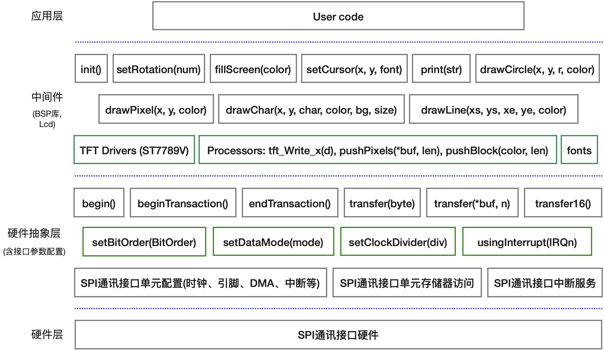

===========================
6.2  SPI主机模式
===========================

BlueFi开源板的彩色LCD显示器使用SPI通讯接口与nRF52840主控制器连接，显示器作为一种输出外设，我们将这个接口设计为半双工模式，
仅使用NSS、SCK、MOSI等三个信号，同时引入第4个信号——数据/命令信号D/C，当MOSI输出命令信息时D/C信号为低电平，输出数据时则为高电平。
引入D/C信号的SPI通讯接口的时序示例如图6.10所示。nRF52840的SPI通讯接口的主机模式支持D/C信号，每次发起SPI数据帧传输之前，
通过配置数据帧中的命令字节数和数据字节数，SPI接口自动产生D/C信号的有效电平向SPI从机发送数据/指令标示信号。

图6.10  带有D/C信号的SPI通讯接口时序示例

BlueFi使用的彩色LCD显示器的驱动器为台湾矽创电子股份公司的ST7789V，支持262K(18位RGB颜色编码)种像素颜色，最大像素数达240x320。
ST7789支持可配置的多种并行与同步串行通讯接口，包括8-/9-/16-/18-位并行接口、3线(无D/C信号)和4线(有D/C信号)SPI接口。
我们使用的彩色LCD显示器由屏幕生产厂商将驱动IC、LCD玻璃屏、背光板等集成在一起，使用COG(Chip On Glass)工艺将驱动IC直接绑定在玻璃上，
同时驱动IC的接口配置也被设定。

BlueFi开源板使用的彩色LCD显示器及其接口电路如图6.11所示。

图6.11  BlueFi开源板使用的彩色显示器及其接口电路

上图(a)的彩色LCD显示器示意图中浅灰色方形区是有效显示区域，右侧较宽的区域是COG工艺区和外部软排线接口区，实际使用时我们将软排线弯曲后焊在玻璃屏背面。
上图(b)的接口电路采用4线(含D/C信号)的半双工SPI接口，MOSI信号是双向的，这个接口电路中nRF52840的SPI通讯接口是主机模式，SCK和D/C两个信号的方向是输出。
此外，彩色LCD显示器作为一种非主动光源型显示器必须借助外界光源我们才能看到显示内容，背光板是此类显示器的必备组件，上图(b)的接口电路使用一个N型三极管控制背光板，
主控制器不仅能够控制背光板的亮、灭和亮度，还能提高背光板所需的大电流(约10mA)。

简要分析BlueFi开源板的彩色显示器接口电路后，接着开始了解该显示器的软件接口的实现。SPI接口软件也可以使用前一章所掌握的I2C的分层抽象方法，
硬件层仍使用Nordic半导体提供的SPI硬件驱动库，硬件抽象层则是Arduino开源平台的SPI类接口库，BlueFi的彩色LCD显示器接口软件(BSP)是基于硬件抽象层的实现(中间层)，
这部分BSP为用户层提供显示器初始化、文本和图形等显示接口。整个显示器接口软件的架构如图6.12所示。

图6.12  基于SPI接口的彩色LCD显示器的软件架构(兼容Arduino平台)

在Arduino开源平台，对于任一种Arduino官方或第三方开源板系列，SPI通讯接口的硬件层和硬件抽象层的软件实现都是开源软件包的一部分。譬如，
基于Nordic的nRF52系列MCU的开源板，我们在第3.5节安装的nRF52系列MCU的开源软件包中，SPI通讯接口的硬件抽象层的软件实现位于
“../Arduino15/packages/adafruit/hardware/nrf52/版本号/libraries/SPI/”文件夹，硬件层的软件实现由Nordic半导体提供，
位于“../Arduino15/packages/adafruit/hardware/nrf52/版本号/cores/nRF5/nordic/nrfx/”文件夹。

Arduino官网列出SPI通讯接口的硬件抽象层的软件接口 [2]_ ，可以看出这个硬件抽象层仅支持SPI主机模式！主要接口包括：

  - SPISettings(clock, borOrder, dataMode)，SPI通讯接口的SCK频率、位序和数据线采样模式等参数配置接口
  - setBitOrder(MSBFIRST)，SPI通讯接口的位序单独地配置接口：MSBFIRST和LSBFIRST等2种参数
  - setClockDivider(diver)，SPI通讯接口的时钟分频器配置接口。该配置将影响SCK时钟频率，CPU内核时钟频率被分频后作为SCK的时钟
  - setDataMode(mode)，SPI通讯接口的数据线采样模式单独地配置接口：SPI_MODE0、SPI_MODE1、SPI_MODE2、SPI_MODE3等4种参数
  - begin()，初始化SPI通讯接口，并配置为主机模式，并配置SPI通讯接口的引脚、时钟速度、位序、数据线采样模式等
  - end()，取消SPI通讯接口的初始化，禁用该SPI接口
  - beginTransaction(SPISettings)，使用SPISettings接口的参数初始化SPI通讯接口
  - endTransaction()，停用SPI通讯接口
  - transfer(txBuf[], rxBuf[], len)，SPI通讯接口的(全双工)数据传输接口。该接口有另外三种形式：transfer(val)、transfer(val16)、transfer(buf[], len)
  - usingInterrupt(numIRQ)，指定SPI通讯接口的中断号

除了参数配置和初始化接口之外，全双工数据传输接口“transfer(txBuf[], rxBuf[], len)”是最基本的接口，另外三种形式的“transfer()”(半双工)接口也是基于该接口。
BlueFi开源板的彩色LCD显示器的BSP几乎仅仅使用Arduino开源平台SPI抽象层的“transfer()”接口，并根据该LCD的驱动器IC——ST7789V的接口规范(含命令和数据格式)，
首先定义“tft_Write_x(d)”、“pushPixels(colors[], len)”、“pushBlock(color, len)”等3个LCD基本的中间层接口，
分别实现8/16/24/32位数据写操作、连续写入若干个像素点的颜色值、连续填充(写入)若干像素位指定的颜色；基于这些基本的写入操作，接着定义单个像素(指定(x,y)坐标)颜色、
绘制直线、绘制圆弧和圆等基本图形图案的显示操作，以及彩色文本显示(指定位置和字体)等。

基于BSP(中间层)的LCD接口，我们很容易将文本信息显示在BlueFi的彩色LCD显示器上，或者基于直线、圆弧和圆等基本图形的绘制接口实现复杂图案设计与显示。
现在看起来LCD接口的功能较多，编写代码的工作量比较大。实施这些编码工作，我们无须从零开始，从“github”等开源社区的代码托管平台搜索“Arduino SPI ST7789”等关键词，
或许会找到数十甚至上百个相关的开源项目代码，直接将合适的项目代码移植到我们的项目中即可。

我们已经修改“Adafruit TFT eSPI”开源项目的代码用于BlueFi开源板，点击下面链接下载这部分代码的独立压缩包：

. :download:`BlueFi_TFT_eSPI开源库 <../_static/dl_files/bluefi_ch6_2/BlueFi_TFT_eSPI.zip>`

请将下载后的压缩包文件解压到“../Documents/Arduino/libraries/”文件夹，你将会看到“BlueFi_TFT_eSPI”子文件夹中的LCD显示器的全部接口。
面向用户层的接口都在“../Documents/Arduino/libraries/BlueFi_TFT_eSPI/BlueFi_TFT_eSPI.h”文件中，只需要将该文件“include”到BlueFi开源板BSP的“BlueFi.h”文件并添加少许代码即可使用这些接口。
打开“../Documents/Arduino/libraries/BlueFi/src/”文件夹中的“BlueFi.h”和“BlueFi.cpp”两个文件，将

.. code-block::  C
  :linenos:

  #include <BlueFi_TFT_eSPI.h> 
  TFT_eSPI Lcd = TFT_eSPI();

两个语句添加到“BlueFi.h”文件中，并将下面的程序语句添加到“BlueFi.cpp”文件中的“void BlueFi::begin(bool LCDEnable, bool SerialEnable)”接口函数中：

.. code-block::  C
  :linenos:

  if (LCDEnable) {
    Lcd.init();
    Lcd.setRotation(1);
    Lcd.fillScreen(TFT_BLACK); // clear screen
    Lcd.setCursor(6, 108, 4);
    Lcd.setTextColor(TFT_RED, TFT_BLACK);
    Lcd.print("BlueFi "); // red
    Lcd.setTextColor(TFT_GREEN, TFT_BLACK);
    Lcd.print(" with "); // green
    Lcd.setTextColor(TFT_BLUE, TFT_BLACK);
    Lcd.print(" Arduino\n"); // blue, "\n", to skip a line
    Lcd.setTextColor(TFT_WHITE, TFT_BLACK);
  }

这些代码是对BlueFi开源板的彩色LCD显示器初始化的操作，包括屏幕旋转、清屏和默认的内容显示等。

为了便于测试，请先删除“../Documents/Arduino/libraries/BlueFi”文件夹中的全部文件，然后下载下面的压缩文件包，
并解压到“../Documents/Arduino/libraries/BlueFi”文件夹中，

. :download:`本节内容所用到的BlueFi的BSP源文件 <../_static/dl_files/bluefi_ch6_2/BlueFi_bsp_ch6_2.zip>`

在这个BSP文件压缩包中已包含BlueFi开源板的彩色LCD显示器的BSP(中间层)接口，下面我们使用这些接口使用BlueFi的显示器。
示例1的源程序如下：

(../examples/TFT_LCD/hello_world.ino)

.. code-block::  C
  :linenos:

  #include <BlueFi.h>

  void setup() {
    bluefi.begin();  // 包含LCD显示器的初始化操作
    bluefi.Lcd.fillScreen(TFT_BLACK); // 清屏，清除默认的显示内容
    
    // Set "cursor" at top left corner of display (0,0) and select font 4
    bluefi.Lcd.setCursor(0, 0, 4);

    // Set the font colour to be white with a black background
    bluefi.Lcd.setTextColor(TFT_WHITE, TFT_BLACK);
    // We can now plot text on screen using the "print" class
    bluefi.Lcd.println("Hello, I am BlueFi\n"); // "\n", to skip a line

    bluefi.Lcd.setTextColor(TFT_WHITE, TFT_BLACK);
    bluefi.Lcd.println("this is White text");
    bluefi.Lcd.setTextColor(TFT_RED, TFT_BLACK);
    bluefi.Lcd.println("this is Red text");
    bluefi.Lcd.setTextColor(TFT_GREEN, TFT_BLACK);
    bluefi.Lcd.println("this is Green text");
    bluefi.Lcd.setTextColor(TFT_BLUE, TFT_BLACK);
    bluefi.Lcd.println("this is Blue text");
  }

  void loop() {
    bluefi.redLED.on();
    delay(100);
    bluefi.redLED.off();
    delay(900);
  }

这个示例中，首先调用“bluefi.begin()”对BlueFi开源板的相关硬件进行初始化，包括LCD显示器的初始化在内；然后调整显示器的光标位置和所用字体大小，
之后的显示将从当前光标位置开始；接着在屏幕上显示4行彩色文本信息，每一行文字的颜色分别位白色、红色、绿色和蓝色，用这些文本内容和颜色验证显示器的基本配置是否正确。
在主循环中不再更新显示内容，仅仅保持BlueFi开源板的红色LED闪烁，表示我们的程序已经正确地执行。

显然，借助于BlueFi开源板的中间层LCD接口让BlueFi的LCD显示彩色文本，我们并不需要直接访问SPI接口相关的寄存器，也无须直接面对LCD驱动IC——ST7789V的SPI通讯协议。
现在你可以打开“../Documents/Arduino/libraries/BlueFi_TFT_eSPI/BlueFi_TFT_eSPI.h”文件了解我们的彩色LCD显示器接口的名称、参数等，
基于这些接口，我们可以实现各种显示效果。

下面我们来探索另外一个有趣的示例——康威生命游戏的模拟效果(取消gif格式动画)，如图6.13所示。

图6.13  康威(Conway)生命游戏的模拟

该游戏由英国数学家康威(Conway)于1970年设计的，使用2D网格模拟生物群落的生与死，每一个网格代表一个生命体(或元胞)，其生存法则为：

  1. 如果当前网格的元胞是活体，且周围活着的邻居数目(至多8个)为2个或3个时，保持原状态
  2. 如果当前网格的元胞是活体，且周围活着的邻居数目小于2个时，生物群落太小，该元胞死亡
  3. 如果当前网格的元胞是活体，且周围活着的邻居数目大于3个时，生物群落太大，该元胞死亡
  4. 如果当前网格的元胞是死亡的，且周围活着的邻居数目是3个，该元胞变为活体
  5. 如果当前网格的元胞是死亡的，且周围活着的邻居数目不是3个，保持原状态

这些生存法则是经过我们重新编辑的描述，目的是更容易演变成生命游戏的程序算法。
该示例程序主要使用BlueFi的绘制填充颜色的方形图案的接口“fillRect(x, y, w, h, color)”绘制每个“细胞”的生与死状态，
如果某个网格的“细胞”为死亡状态则保持该方形图案的颜色与背景的黑色相同，否则随机选择一种非黑的颜色显示该“细胞”。示例程序的源码如下：

(../examples/TFT_LCD/game_life.ino)

.. code-block::  C
  :linenos:

  // //The Game of Life, also known simply as Life, is a Cellular Automaton
  #include <BlueFi.h> 
  // 2 x 2 pixel cells, array size = 28800 bytes per array, runs fast
  #define GRIDX 120
  #define GRIDY 120
  #define CELLXY 2
  // 1 x 1 pixel cells, array size = 20480 bytes per array
  //#define GRIDX 240
  //#define GRIDY 240
  //#define CELLXY 1

  #define GEN_DELAY 10 // Set a delay between each generation to slow things down
  //Current grid and newgrid arrays are needed
  uint8_t grid[GRIDX][GRIDY];
  //The new grid for the next generation
  uint8_t newgrid[GRIDX][GRIDY];

  void setup()   {
    bluefi.begin();
    bluefi.Lcd.fillScreen(TFT_BLACK); 
    initGrid();
    drawGrid();
    //Compute generations then show
    uint16_t generations = 0;
    while ( computeCA() ) {
      generations++;
      Serial.print("Generations: "); Serial.println(generations);
      drawGrid(); // show
      for (int16_t x = 1; x < GRIDX-1; x++) {
        for (int16_t y = 1; y < GRIDY-1; y++) {
          grid[x][y] = newgrid[x][y];
        }
      }
      delay(GEN_DELAY);
    }
    bluefi.Lcd.setCursor(0, 120, 4);
    bluefi.Lcd.setTextColor(TFT_WHITE, TFT_BLACK);
    bluefi.Lcd.println("Game over!"); // "\n", to skip a line
  }

  void loop() {
  }

  //Draws the grid on the display
  void drawGrid(void) {
    uint16_t color = TFT_RED;
    for (int16_t x = 1; x < GRIDX - 1; x++) {
      for (int16_t y = 1; y < GRIDY - 1; y++) {
        if ((grid[x][y]) != (newgrid[x][y])) {
          if (newgrid[x][y] == 1)
            color = random(0xFFFF);
          else
            color = 0;
          bluefi.Lcd.fillRect(CELLXY * x, CELLXY * y, CELLXY, CELLXY, color);
        }
      }
    }
  }

  //Initialise Grid
  void initGrid(void) {
    for (int16_t x = 0; x < GRIDX; x++) {
      for (int16_t y = 0; y < GRIDY; y++) {
        newgrid[x][y] = 0;
        if (x == 0 || x == GRIDX - 1 || y == 0 || y == GRIDY - 1) {
          grid[x][y] = 0;
        } else {
          if (random(3) == 1)
            grid[x][y] = 1;
          else
            grid[x][y] = 0;
        }
      }
    }
  }

  //Compute the CA. Basically everything related to CA starts here
  bool computeCA() {
    bool changed = false;
    for (int16_t x = 1; x < GRIDX; x++) {
      for (int16_t y = 1; y < GRIDY; y++) {
        uint8_t neighbors = getNumberOfNeighbors(x, y);
        if ( grid[x][y] == 1 ) {
          if (neighbors != 2 && neighbors != 3 ) {
            newgrid[x][y] = 0; // 
            changed |= true;
          }
        } else {
          if ( neighbors == 3 ) {
            newgrid[x][y] = 1; // Invert it (to live)
            changed |= true;
          }
        }
      }
    }
    return changed;
  }

  // Check the Moore neighborhood
  uint8_t getNumberOfNeighbors(int16_t x, int16_t y) {
    return grid[x-1][y] + grid[x-1][y-1] + \
          grid[x][y-1] + grid[x+1][y-1] + \
          grid[x+1][y] + grid[x+1][y+1] + \
          grid[x][y+1] + grid[x-1][y+1];
  }

这个示例程序仅初始化“setup()”的代码，主循环“loop()”部分无代码(仅仅是一个死循环)。
初始化“setup()”的代码包括，BlueFi相关的接口和硬件初始化，并清除LCD屏幕、调用“initGrid()”和“drawGrid()”两个函数在显示屏上输出第一代“细胞”的模拟效果；
然后设置代表生存代数的变量generations为0，调用函数“computeCA()”根据生存法则计算每一个网格中“细胞”的生与死的状态，如果没有任何“细胞”的状态变化该函数返回false，
否则返回true；如果函数“computeCA()”的返回值为true则将当前的生存代数变量generations增加1并发送到串口控制台，调用函数“drawGrid()”绘制新一代的“细胞”状态，
并将保存此代的状态，延迟若干ms后再次调用函数“computeCA()”；如果函数“computeCA()”的返回值为false则在显示屏上显示“Game Over!”并终止程序。

在BlueFi执行该示例程序前，能猜测出执行效果吗？我们能看到屏幕上显示“Game Over!”? 

现在将示例程序编译并下载到BlueFi开源板上，观察该示例程序的运行效果与你所猜测的效果一样？

-------------------------

我们为BlueFi设计的Python解释器默认使用彩色LCD作为字符控制台，用于输出Python解释器的状态，以及执行脚本语句“print()”时的信息输出。
现在双击BlueFi开源板的复位按钮，然后将Python解释器拖放到“BLUEFIBOOT”磁盘，将BlueFi恢复到运行Python脚本的状态。每次BlueFi上电或复位时，
你首先在LCD屏幕上左上角看到CIRCUITPYTHON的Logo——蟒蛇图案，当解释器开始执行“code.py”脚本程序前会在屏幕上显示“code.py output:”提示信息。

换句话说，在Python解释器的状态允许我们直接使用“print(info)”输出数值或文本信息到BlueFi的LCD显示器。如果我们需要在LCD上显示基本图形或其他形式的信息，
那就需要相关的Python库或自建Python代码来实现。我们先让BlueFi的Python解释器运行下面的示例代码：

.. code-block::  Python
  :linenos:

  import time
  from hiibot_bluefi.screen import Screen
  from hiibot_bluefi.sensors import Sensors
  # import Circle, and Circle classes from adafruit_display_shapes
  from adafruit_display_shapes.circle import Circle
  from adafruit_display_shapes.line import Line
  import displayio

  # instantiate Screen, and Sensors classes
  screen = Screen()
  sensors = Sensors()

  # define a group of graphic element to draw a backgroud pattern, include 9 elements
  bluefi_group = displayio.Group(max_size=9)
  # define 9 graphic elements
  x_line = Line(0, 120, 240, 120, color=screen.WHITE)
  y_line = Line(120, 0, 120, 240, color=screen.WHITE)
  outer1_circle = Circle(120, 120, 119, outline=screen.RED)
  outer2_circle = Circle(120, 120, 90, outline=screen.YELLOW)
  middle_circle = Circle(120, 120, 70, outline=screen.GREEN)
  inner2_circle = Circle(120, 120, 50, outline=screen.CYAN)
  inner1_circle = Circle(120, 120, 30, outline=screen.BLUE)
  inner0_circle = Circle(120, 120, 12, outline=screen.VIOLET)
  # append 9 graphic elements into the group of graphic element
  bluefi_group.append(x_line)
  bluefi_group.append(y_line)
  bluefi_group.append(outer1_circle)
  bluefi_group.append(outer2_circle)
  bluefi_group.append(middle_circle)
  bluefi_group.append(inner2_circle)
  bluefi_group.append(inner1_circle)
  bluefi_group.append(inner0_circle)

  # define a group of graphic element to draw a foregroud pattern, a bubble
  bubble_group = displayio.Group(max_size=1)
  # define this bubble, its x-, and y- coordinate equal to x, and y of sensors.acceleration
  x, y, _ = sensors.acceleration
  level_bubble = Circle(int(x + 120), int(y + 120), 9, fill=screen.WHITE, outline=screen.WHITE)
  # append this bubble into graphic element
  bubble_group.append(level_bubble)
  # append this graphic element into the group 
  bluefi_group.append(bubble_group)
  # show this group of graphic element on the screen
  screen.show(bluefi_group)
  
  while True:
      # update the bubble position on the screen according to sensors.acceleration
      x, y, _ = sensors.acceleration
      bubble_group.y = int(x * 12)
      bubble_group.x = int(y * -12)
      time.sleep(0.05)

用文本编辑器或MU编辑器，复制上述代码覆盖“/CIRCUITPY/code.py”文件中的全部代码，你将会看到一种水平仪的模拟效果，
显示屏上有多个彩色圆代表水平仪刻度，并用一个白色填充圆代表“气泡”。
倾斜BlueFi板时BlueFi的LCD显示屏上的“气泡”的位置会随之改变，晃动BlueFi板时“气泡”也会随之晃动。

为什么会有这样显示效果呢？尤其是，为什么气泡位置的改变时不会影响其他元素的完整显示呢？
该示例程序的前6行分别导入Screen、Sensors、displayio类模块，以及绘制圆和直线的Circle和Line类模块，
并将Screen和Sensors分别实例化为screen和sensors，使用screen和sensors可以访问BlueFi的显示屏和传感器。
在第14行语句中定义名叫bluefi_group的图形元素组(displayio.Group)且包含9个元素，其后的几行语句分别定义2条白色直线和6个彩色的圆形，
调用“bluefi_group.append(element)”将定义好的这8个图形元素添加到bluefi_group的图形元素组中；然后再绘制一个白色填充圆
代表气泡，这个圆的中心坐标由BlueFi的加速度传感器的x和y分量来确定，最后将图形元素组显示到LCD屏幕上。
主循环程序中，读取加速度传感器的x和y分量，然后更新“气泡”的中心坐标。

这个示例程序中用到的Python库，displayio是BlueFi的Python解释器内建的模块，只需要导入即可使用，使用这个Python模块的接口，
将我们需要在LCD屏幕上显示的若干文本信息、几何图形等分层设计和控制，甚至可以在BlueFi的LCD屏幕上实现动画效果，改变某个显示元素的位置时不会影响其他元素的完整性。譬如，
冒泡排序算法的可视化 [4]_ ，程序代码如下：

.. code-block::  Python
  :linenos:

  import time
  import random
  import displayio
  from adafruit_display_shapes.rect import Rect
  from adafruit_display_shapes.circle import Circle
  from hiibot_bluefi.screen import Screen
  screen = Screen()
  speed = 0.1 # seconds for changing animation
  height = [random.randint(10 , 100)  for _ in range(7)]
  gol = [0, 1, 2, 3, 4, 5, 6]          # list of the index of group elements
  x = [26, 58, 90, 122, 154, 186, 218] # list of x-coordinate for each sprite
  #  creat a group of sprites (5x rects)
  group = displayio.Group(max_size=9)
  #  draw each sprite (5x rects)
  s0 = {'x':x[0] , 'y':150-height[0] , 'x2':20 , 'y2':height[0] , 'ot':(0, 52, 255) , 'fl':(0, 26, 255)}
  S0 = Rect(s0['x'] , s0['y'] , s0['x2'] , s0['y2'] , outline = s0['ot'] , fill = s0['fl'])
  group.append(S0)
  s1 = {'x':x[1] , 'y':150-height[1] , 'x2':20 , 'y2':height[1] , 'ot':(255, 0, 0) , 'fl':(255, 0, 0)}
  S1 = Rect(s1['x'] , s1['y'] , s1['x2'] , s1['y2'] , outline = s1['ot'] , fill = s1['fl'])
  group.append(S1)
  s2 = {'x':x[2] , 'y':150-height[2] , 'x2':20 , 'y2':height[2] , 'ot':(212, 255, 0) , 'fl':(212, 255, 0)}
  S2 = Rect(s2['x'] , s2['y'] , s2['x2'] , s2['y2'] , outline = s2['ot'] , fill = s2['fl'])
  group.append(S2)
  s3 = {'x':x[3] , 'y':150-height[3] , 'x2':20 , 'y2':height[3] , 'ot':(63, 255, 0) , 'fl':(63, 255, 0)}
  S3 = Rect(s3['x'] , s3['y'] , s3['x2'] , s3['y2'] , outline = s3['ot'] , fill = s3['fl'])
  group.append(S3)
  s4 = {'x':x[4] , 'y':150-height[4] , 'x2':20 , 'y2':height[4] , 'ot':(0, 216, 255) , 'fl':(0, 216, 255)}
  S4 = Rect(s4['x'] , s4['y'] , s4['x2'] , s4['y2'] , outline = s4['ot'] , fill = s4['fl'])
  group.append(S4)
  s5 = {'x':x[5] , 'y':150-height[5] , 'x2':20 , 'y2':height[5] , 'ot':(255, 0, 255) , 'fl':(255, 0, 255)}
  S5 = Rect(s5['x'] , s5['y'] , s5['x2'] , s5['y2'] , outline = s5['ot'] , fill = s5['fl'])
  group.append(S5)
  s6 = {'x':x[6] , 'y':150-height[6] , 'x2':20 , 'y2':height[6] , 'ot':(255, 216, 0) , 'fl':(255, 216, 0)}
  S6 = Rect(s6['x'] , s6['y'] , s6['x2'] , s6['y2'] , outline = s6['ot'] , fill = s6['fl'])
  group.append(S6)
  #  draw a red dot to mark the current minimum
  red_dot = Circle( 36, 170, 5, outline=(255,0,0), fill=(255,0,0) )
  group.append(red_dot)
  white_dot = Circle( 66, 170, 5, outline=(127,127,127), fill=(127,127,127) )
  group.append(white_dot)
  #  show thoese sprites onto BlueFi LCD screen
  screen.show(group)

  #  changing animation
  def animation_chg(l, r, steps):
      global group
      for _ in range( 8 ):
          time.sleep(speed)
          group[l].x += 4*steps
          group[r].x -= 4*steps
          #time.sleep(speed)

  #  no-change animation
  def animation_nochg(l, r):
      global group
      tf = group[l].fill
      for _ in range(2):
          time.sleep(speed)
          group[l].y -= 40
          time.sleep(speed)
          group[l].y += 40
          #time.sleep(speed/4)
      group[l].fill = tf

  # sort and its animation
  for i in range(7):
      red_dot.x = x[i]+4
      time.sleep(0.1)
      for j in range(i+1, 7):
          time.sleep(0.1)
          white_dot.x = x[j]+4
          time.sleep(0.1)
          if height[i] > height[j]:
              # Exchange their positions, and exchange the index of group elements
              c1, c2 = height[j], gol[j]
              height[j], gol[j] = height[i], gol[i]
              height[i], gol[i] = c1, c2
              animation_chg(gol[j], gol[i], j-i)
          else:
              animation_nochg(gol[j], gol[i])

  while True:
      pass

这个冒泡排序算法的动画效果显示，将7个彩色方块根据高度升序排列到屏幕上。程序仍使用displayio模块的接口将7个随机高度的方块和2个原点看作是图形元素组中的基本图形元素，
初始状态7个方块的颜色和高度都是随机生成的，高度是无序的，然后使用冒泡算法按他们的高度进行升序排列，当前正在比较和交换的两个方块的下方各用一个圆点来指示，
交换过程的动画由方块的x坐标分量逐渐增加/减小来实现。

通过这个示例，我们不仅掌握如何使用Python语言控制BlueFi的显示屏显示图案和动画，还能帮助我们理解冒泡排序算法本身。你能修改上面代码来改变动画的速度吗？

-------------------------

虽然SPI通讯接口的数据传输速度远高于I2C，而且接口的硬件实现较简单，但SPI通讯接口规范中并没有指定具体的通讯协议，反而允许主机端配置SCK的时钟频率、位序(MSBFIRST/LSBFIRST)、数据线采样模式等，
因此SPI通讯接口协议存在较大差异，每一种SPI接口外设几乎都需要根据其接口协议订制接口软件，本节仅以SPI接口的彩色LCD显示器为例演示SPI主机模式的接口实现和应用示例。

-------------------------

参考文献：
::

  [1] https://pdf1.alldatasheetcn.com/datasheet-pdf/view/1132511/SITRONIX/ST7789V.html
  [2] https://www.arduino.cc/en/Reference/SPI 
  [3] https://en.wikipedia.org/wiki/Conway's_Game_of_Life 
  [4] https://python4bluefi.readthedocs.io/zh_CN/latest/bluefi_tutorials/advance/bubble_sort_algorithm.html