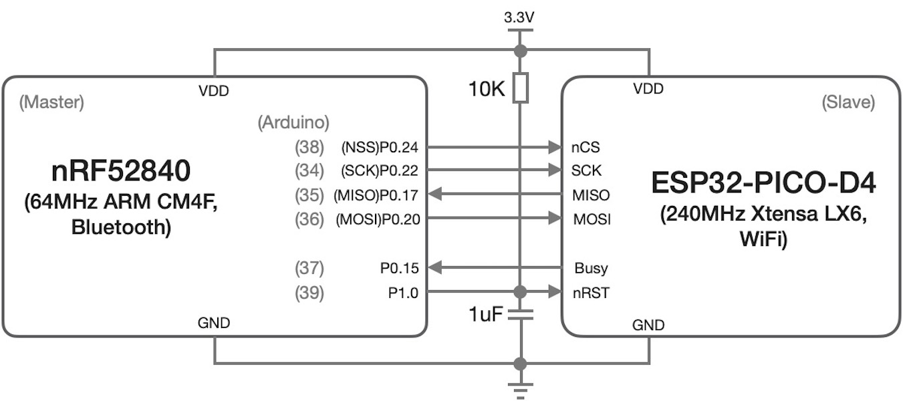

===========================
6.3  SPI从机模式
===========================

MCU片上SPI通讯接口单元工作在从机模式的应用场景往往是双MCU或多MCU系统中，与普通的双核或多核处理器(Multi-Core Processor)组成的系统完全不同。
多核处理器一般是指一颗CPU IC由多个内核组成，多核处理器的内核一般采用对等结构，使用片上高速总线互联，多个对等的内核都是总线的Master，由总线仲裁器管理他们对总线的访问，
多核并行处理同一个任务的指令序列，仅仅是加速事务处理的速度。多MCU系统中，允许多种体系架构CPU内核(或许是多核的结构)，不同体系架构的多MCU系统是异构系统，
每一个CPU内核需要单独编程(异构系统内的CPU指令集不同)。

.. Note:: 多核处理器和多处理器系统

  - **多核处理器** (Multi-Core Processor)，A multi-core processor is a computer processor integrated circuit with two or more separate processing units, called cores, each of which reads and executes program instructions, as if the computer had several processors
  - **多处理器系统** (Multi-Processor system)，It is the use of two or more central processing units (CPUs) within a single computer system. The term also refers to the ability of a system to support more than one processor or the ability to allocate tasks between them

主从多处理器系统(Master/Slave Multi-Processor system)是高性能嵌入式系统常用的架构，主MCU作为系统的主控制器，从MCU仅负责系统的特定任务，
譬如网络访问或视频信号处理等任务，允许主从MCU完全不同(包括时钟速度、指令架构等)，两个MCU通过共享总线或私有总线、共享内存等方式建立通讯通路。
BlueFi开源板是一种典型的主从多处理器系统，主控制器采用nRF52840，从控制器采用ESP32，主从控制器之间采用SPI通讯接口互联，如图6.14所示。

图6.14  BlueFi的双MCU结构

两个MCU之间使用标准4线的SPI通讯接口之外还增加2个额外的控制信号(或称握手信号)，一个是从MCU的复位控制信号，另一个从MCU的忙/空闲状态信号。
BlueFi开源板使用这种双处理器协作系统，可以将WiFi联网、TCP/IP协议栈等网络事务与其他事务分开，主处理器只需要通过SPI通讯接口向网络协处理器发送网络处理指令，
譬如扫描周围热点(Scan AP)、连接指定热点、连接指定域名的Web服务器等，网络协处理器根据指令及指令参数执行网络事务并通过SPI通讯接口返回执行结果。
这就好比我们使用手机/电脑WiFi访问某个网站的过程，首先打开WiFi配置窗口查看周围热点，连接指定的热点，当WiFi连接到某个AP之后，打开浏览器并输入网址，
即可查看该网页信息。当我们在手机/电脑上使用浏览器打开指定网址的过程中，虽然浏览器首先使用DNS(域名解析系统)获取指定网址的IP地址，
然后使用TCP连接这个IP地址的服务器(还包含默认的TCP端口80)，发送HTTP请求，最后接收HTTP报文格式的网页信息并显示在浏览器上，我们所感知的只是打开一个网页，
并不关心DNS、TCP连接和HTTP传输等细节。

下面先用一个示例来演示BlueFi开源板的这种双处理器系统架构的益处。运行示例之前，需要做些准备工作，首先点击下面链接下载本节内容用到的BlueFi的WiFi BSP源文件：

. :download:`BlueFi_WiFi_eSPI开源库 <../_static/dl_files/bluefi_ch6_3/Bluefi_WiFi_eSPI.zip>`

下载后将压缩文件解压到“../Documents/Arduino/libraries/”文件夹中，子文件夹“BlueFi_WiFi_eSPI”是主控制器nRF52840通过SPI通讯接口访问网络协处理器的BSP源文件。
本节内容所更新的BlueFi开源板的BSP源文件包的链接如下，请先删除“../Documents/Arduino/libraries/BlueFi”文件夹中的全部文件，然后下载下面的压缩文件包，
并解压到“../Documents/Arduino/libraries/”文件夹中，

. :download:`本节内容所用到的BlueFi的BSP源文件 <../_static/dl_files/bluefi_ch6_3/BlueFi_bsp_ch6_3.zip>`

准备工作并未完毕！以我们使用WiFi联网的经验，必须配置网络协处理器能够连接到某个可用的WiFi热点(AP)。我们的BSP源文件使用一个独立的仅有两行代码的.h文件保存AP名称和密码。
使用文本编辑器修改并保存“../Documents/Arduino/libraries/BlueFi_WiFi_eSPI/scr/secrets_wifi.h”文件：

.. code-block::  C
  :linenos:

  #define SECRET_SSID "your_AP_name"
  #define SECRET_PASS "your_AP_password"

第1行双引号内输入你可用的WiFi AP名称代替原来的字符串，第2行双引号内输出这个WiFi AP的密码代替原来的字符串。

然后使用Arduino IDE编辑下面的示例代码，编译并下载到已与你电脑USB相连接BlueFi开源板上。

.. code-block::  C
  :linenos:

  #include <BlueFi.h>
  String hostName = "www.zjut.edu.cn"; // Specify IP address or hostname

  void setup() {
    bluefi.begin();
    while (!Serial) {
      ; // wait for serial port to connect. Needed for native USB port only
    }
    connectWiFi(true); // see BlueFi_WiFi.h
  }

  void loop() {
    Serial.print("Pinging "); Serial.print(hostName); Serial.print(": ");
    int16_t pingResult = WiFi.ping(hostName);
    if (pingResult >= 0) {
      Serial.print("SUCCESS! RTT = "); Serial.print(pingResult); Serial.println(" ms");
    } else {
      Serial.print("FAILED! Error code: "); Serial.println(pingResult);
    }
    delay(5000);
  }

当BlueFi执行上面示例期间，点击Arduino IDE菜单栏的“工具-->串口监视器”，打开窗口控制台，将在控制台窗口看到以下信息：

.. code-block::  

  Check WiFi Coprocessor
  WiFi Coprocessor firmware: 1.3.0
  Attempting to connect to AP with SSID: your_AP_name
  .. 
  Connected to wifi
  SSID: your_AP_name
  IP Address: 192.168.4.120
  signal strength (RSSI):-46 dBm
  Pinging www.zjut.edu.cn: SUCCESS! RTT = 10 ms
  Pinging www.zjut.edu.cn: SUCCESS! RTT = 0 ms
  Pinging www.zjut.edu.cn: SUCCESS! RTT = 10 ms
  Pinging www.zjut.edu.cn: SUCCESS! RTT = 10 ms

你或许在其他地方使用过“ping”命令来测试某个网址或网络设备的物理连通性和网络可达性，控制台输出的最后几行信息正是我们的示例程序执行“ping www.zjut.edu.cn”网址的结果，
控制台的前几行提示信息分别是检查网络协处理器及其版本、连接到指定WiFi AP的信息、连接成功后本机IP地址的信息等。

在上面示例程序中，第9行语句“connectWiFi(true)”将“../Documents/Arduino/libraries/BlueFi_WiFi_eSPI/scr/secrets_wifi.h”文件中的AP名称和密码发送给网络协处理器，
协处理器自动连接指定的AP，并通过控制台给出提示(即前4行的提示信息)，一旦连接上之后就给出已连接的AP名称和AP为BlueFi分配的IP地址。
第14行语句“ WiFi.ping(hostName)”将目标网址字符串“hostName”(即“www.zjut.edu.cn”)通过SPI通讯接口发送给网络协处理器，
网络协处理器立即执行“ping www.zjut.edu.cn”命令并返回结果。

“ping”命令是常用的一种网路测试工具，他是基于TCP/IP协议栈的网络层ICMP(Internet Control Message Protocol)协议来实现的。很显然，
上述示例的程序中，主控制器仅仅通过SPI通讯接口将字符串“hostName”和“ping”命令发送给网络协处理器，具体的“ping”命令执行过程则有网络协处理器独立完成，
查看“../Documents/Arduino/libraries/BlueFi_WiFi_eSPI/scr/”文件夹中的WiFi接口，你会发现这个WiFi的接口源文件中并没有涉及TCP/IP协议栈等。
这里的主控制器所使用的WiFi接口完全兼容Arduino开源平台的WiFi接口库，页面 [1]_ 有这个WiFi接口库的详细说明和参考示例。

当你把前面的的BSP源文件下载并解压到指定文件夹后，我们已经为BlueFi主控制器准备好完整的WiFi联网接口，包括网络配置、TCP/IP应用层的客户端(client)、
服务器端(server)、HTTP和UDP报文收发等接口。基于这些接口，我们只需要通过对主控制器编程即可实现Web访问和应用程序等。

那么，网络协处理器的固件是如何实现的呢？我们的协处理器采用上海乐鑫的Xtensa体系架构的WiFi SoC——ESP32，其固件是从“Arduino NINA-W102 firmware”移植过来的，
固件的源码、编译工具、编译过程等详见 [2]_ 链接及其说明。

在网络协处理器的固件源码中，你将会发现“lwIP”(开源TCP/IP协议栈)和“freeRTOS”(开源RTOS)等被使用。当然这个ESP32的SPI通讯接口工作在从机模式，
我们也能找到该接口的源码实现，即“../nina-fw/arduino/libraries/SPIS/src/”文件夹的“SPIS.h”和“SPIS.cpp”两个源文件。
在“SPIS.h”和“SPIS.cpp”两个源文件中有该SPI通讯接口所使用的SPI端口号、I/O引脚及其配置等初始化接口“begin()”，
“transfer(uint8_t out[], uint8_t in[], size_t len)”是SPI从模式关键接口，即双向数据传输的实现。
除了第三方开源库(TCP/IP协议栈、RTOS等)、SPI通讯接口(从机模式数据传输接口)之外，协处理器固件的核心工作是SPI通讯接口的命令解析和处理，
即接收、解析主控制器发送过来的命令和参数，然后执行该命令并给以应答。

-------------------------

在Python环境如何使用网络协处理器呢？这需要使用主控制器的WiFi接口的Python模块，包含“/CIRCUITPY/lib/hiibot_bluefi/wifi.py”主接口模块文件，
以及“/CIRCUITPY/lib/adafruit_esp32spi/adafruit_esp32spi.py”模块，请打开页面链接 [3]_ 并根据页面说明下载最新版的BlueFi开源板的Python库文件，
下载并解压后将“../lib/hiibot_bluefi/”和“../lib/adafruit_esp32spi/”两个文件夹复制到CIRCUITPY磁盘的“/lib/”文件夹中，
我们就可以正常使用BlueFi开源板的WiFi接口编写Python代码实现网络处理。譬如，下面示例使用WiFi的“scan_networks()”接口扫描周围WiFi热点。
该功能的示例代码如下：

.. code-block::  Python
  :linenos:

  from hiibot_bluefi.wifi import WIFI
  wifi = WIFI()

  if wifi.esp.status != 0xFF:
      print("ESP32 be found and in idle mode")

  print("MAC addr:", [hex(i) for i in wifi.esp.MAC_address])

  for ap in wifi.esp.scan_networks():
      print("\t%s  RSSI: %d" % (str(ap["ssid"], "utf-8"), ap["rssi"]))

  # turn the power of WIFI to save power! this is very importent
  wifi.esp.reset()
  print("Program Done!")

复制这些代码并覆盖“/CIRCUITPY/code.py”文件，或者将上述代码复制-粘贴到MU编辑器的代码编辑区，并保存到“/CIRCUITPY/code.py”文件即可，
打开MU编辑器的串口控制台，将会看到以下提示信息：

.. code-block:: 

  code.py output:
  ESP32 be found and in idle mode
  MAC addr: ['0x10', '0x7a', '0x83', '0x91', '0x2', '0x50']
    myTestAP1  RSSI: -46
    1402  RSSI: -64
    myTestAP2  RSSI: -65
    myPrinter  RSSI: -67
    AP_40BFE4_4G  RSSI: -68
    wlKeJiYuan  RSSI: -70
    alldone1  RSSI: -75
    TP-LINK_505F  RSSI: -76
  Program Done!

具体的WiFi热点名称和信号强度(RSSI)与周边的WiFi环境有关，上述提示仅作参考。
在上面的示例程序中，前两行代码分别是导入WIFI模块及其实例化；第4行和第5行代码分别检查网络协处理器的有效性及错误提示；
第7行代码将网络协处理器WiFi接口的MAC地址打印出来；第9行和第10行首先执行热点扫描(wifi.esp.scan_networks()接口将返回一个AP列表)，
然后将AP的名称和信号强度打印到屏幕(或串口控制台)；最后两行程序分别将网络协处理器复位(降低系统功耗)和程序终止提示。

接下来我们编写Python代码控制网络协处理器联网，并使用NTP(Network Time Protocol)获取当地的网络时间，然后用BlueFi设计一个简易的电子表功能。
具体的实现代码如下：

.. code-block::  Python
  :linenos:

  import time, rtc
  from hiibot_bluefi.wifi import WIFI
  wifi = WIFI()
  ######### 1. connect to a AP #########
  while not wifi.esp.is_connected:
      try:
          wifi.wifi.connect()
          #wifi.esp.connect_AP(b"your_ap_name", b"your_ap_password")
      except RuntimeError as e:
          print("could not connect to AP, retrying: ", e)
          continue
  print("Connected to", str(wifi.wifi.ssid, "utf-8"), "\tRSSI: {}".format(wifi.wifi.signal_strength) )
  print("My IP address is {}".format(wifi.wifi.ip_address()))
  ######### 2. Get Local Date&Time with NTP #########
  weekDayAbbr = ['Mon', 'Tue', 'Wed', 'Thu', 'Fri', 'Sat', 'Sun']
  TIME_API = "http://worldtimeapi.org/api/ip"
  print("get local time from NTP (", TIME_API, ") through WiFi device on the BlueFi")
  the_rtc = rtc.RTC()
  response = None
  while True:
      try:
          print("Fetching json from", TIME_API)
          response = wifi.wifi.get(TIME_API)
          break
      except (ValueError, RuntimeError) as e:
          print("Failed to get data, retrying\n", e)
          continue
  ######### 3. Close WiFi Co-Processor #########
  if wifi.esp.is_connected:
      wifi.esp.reset()
  ######### 4. Parse Date&Time from JSON #########
  json = response.json()
  print(json)  # print all message
  current_time = json["datetime"]
  the_date, the_time = current_time.split("T")
  print(the_date)
  year, month, mday = [int(x) for x in the_date.split("-")]
  the_time = the_time.split(".")[0]
  print(the_time)
  hours, minutes, seconds = [int(x) for x in the_time.split(":")]
  # We can also fill in these extra nice things
  year_day = json["day_of_year"]
  week_day = json["day_of_week"]
  # Daylight Saving Time (夏令时)?
  is_dst = json["dst"] 
  now = time.struct_time(
      (year, month, mday, hours, minutes, seconds+1, week_day, year_day, is_dst) )
  the_rtc.datetime = now
  ######### 5. Show Date&Time on the LCD Screen #########
  from hiibot_bluefi.screen import Screen
  screen = Screen.simple_text_display( 
                      title_scale=3, title_color=Screen.RED, title="bluefi", 
                      text_scale=3, colors=(Screen.WHITE,) )
  screen[1].text = "Time"
  screen[1].color = Screen.MAGENTA
  screen[2].text = "Week"
  screen[2].color = Screen.GREEN
  screen[3].text = "Date"
  screen[3].color = Screen.BLUE
  screen.show()
  ######### 6. Update Date&Time on the LCD Screen #########
  while True:
      the_date="  {}-{}-{}".format(
        the_rtc.datetime.tm_year,  the_rtc.datetime.tm_mon,  the_rtc.datetime.tm_mday, )
      screen[3].text = the_date
      the_week=weekDayAbbr[the_rtc.datetime.tm_wday]
      screen[2].text = "     " +the_week
      the_time="  {}:{}:{}".format(
        the_rtc.datetime.tm_hour, the_rtc.datetime.tm_min, the_rtc.datetime.tm_sec, )
      screen[1].text = the_time

在执行这个示例程序之前，仍需要配置连接指定WiFi热点的名称和密码，与Arduino开源平台的思路一致，这些配置信息保存在一个文本文件中，
即“/CIRCUITPY/secrets.py”，将该文件的“ssid”和“password”两项的值分别修改为你可用的WiFi热点名称和密码并保存。
然后将上面的示例代码保存到“/CIRCUITPY/code.py”文件，BlueFi执行该程序时会提示是否正确地连接到WiFi热点，是否正确滴获取网络时间，
最后在BlueFi的LCD屏幕上显示出日期、时间等信息。

根据注释语句，我们可以清晰地看到整个示例程序分为6个步骤：控制网络协处理器连接到WiFi热点；使用NTP服务获取本地日期和时间信息；
关闭WiFi以节约功耗；解析NTP服务返回的JSON格式信息获取当前的年月日和时分秒信息，并使用这些信息更新本地RTC(日历时钟)单元；
将当前日期和时间信息显示在LCD屏幕指定位置；在主循环中读取本地RTC单元获取最新的日期和时间并更新屏幕显示。

前面的4步仅是为了联网获取本地日期时间并校准本地RTC单元，最后两步才是电子表的设计和实现。这样示例程序在没有使用备用电池的情况下，
每次开机首先联网获取当前时间校准RTC，然后在进入电子表模式。

-------------------------

本节给出一种双处理器系统设计，两个处理器使用SPI通讯接口实现协作事务处理。本节的协处理器是用于处理WiFi联网和网络处理，
网络协处理器的固件需要单独编程，与主机通讯接口的SP单元工作在从机模式，负责从SPI端口接收并解析主控制器发出的命令及其参数，
网络协处理器执行完毕后仍通过SPI通讯接口向主控制器发出应答信息。

SPI通讯接口支持多从机共享通讯总线，根据本节的示例我们很容易实现多处理器系统，只是主控制器需要开销更多个I/O引脚用于从机片选信号、
主从握手信号等。异构型多处理器系统(不同体系架构的MCU组成的系统)能够以较低的成本实现多种事务协作处理，而且具有极高的灵活性，
源于协处理器的可编程特性。

-------------------------

参考文献：
::

  [1] https://www.arduino.cc/en/Reference/WiFiNINA
  [2] https://github.com/adafruit/nina-fw 
  [3] https://python4bluefi.readthedocs.io/zh_CN/latest/bluefi_lib/index_lib.html 