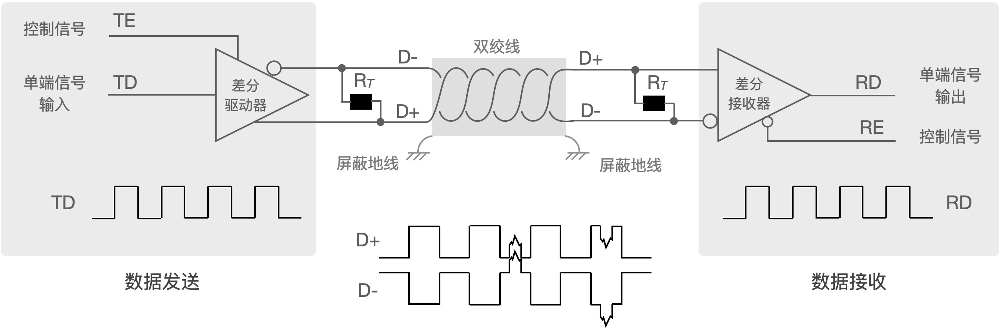

===========================
7.4 工业现场的串口通讯
===========================

我们在前一节中详细地了解了工业领域知名的Modbus协议，他属于OSI的应用层协议，同时还提到了其他的一些异步串行通讯协议，以及面向字节编码的主从网络、面向位编码的对等网络。
本节主要讨论这些网络的物理层和数据链路层相关的知识，尤其面向工业现场的网络所涉及的抗干扰、容错等。

工业现场需要多个设备之间通讯，即若干个设备组成的网络，如各种传感器、执行器类设备，这些设备都是典型的嵌入式系统，硬件的资源较少，软件多数使用RTOS确保实时性。
此外，从系统安全性角度考虑，大多数工业现场的设备网络是独立的，不与其他网络连接。基于UART功能单元如何实现多设备之间互联呢？

标准的RS-232通讯接口仅支持两个设备之间连接，而且传输距离较短。由于差分信号具有极强的抗共模干扰的能力，而且信号的收发双方无需共地，因此差分传输被广泛应用于通讯领域，
譬如我们熟悉的USB通讯接口就是采用差分传输。严格说，电路中传输的所有电压信号都是差分的，以“系统地”作为基准电压来测量信号的电压，为了不引起混淆通常把此类信号称作单端的信号。
差分传输则使用一对信号线传输电压信号，使用两个信号的相对电压差值表示所传输的信号电压，在传输逻辑信号时“1”和“0”电压保持反转关系。有人把这一对信号线的状态比喻成跷跷板上的两个人A和B，
当A被翘起来时两人的高度差是正值(如代表逻辑“1”)，当B被翘起来时高度差为负值(如代表逻辑“0”)，任何时候在跷跷板的两边加上相同大小的力不会改变跷跷板的状态(即两人的高度差不会被改变)。
即使一对差分信号的电压差仅有数十个毫伏，外界干扰引起的几个伏特同时加在差分信号对上不会影响电压差，这就是差分信号的共模干扰抑制能力。为什么需要针对共模干扰呢？
绝大多数干扰信号都是以共模形式存在。

将单端信号转换成差分信号的电路单元称作差分驱动器，将差分信号转换成单端信号的电路单元称作差分接收器，他们都是工业现场的通讯领域常用的。如图7.16所示，
使用一对差分驱动器和差分接收器将单端的异步串行数据信号转换成差分信号，在低波特率条件下，两个设备之间的通讯距离可达1.2Km以上。

图7.16  单端信号和差分信号之间转换

上图中的120欧电阻称作终端电阻，他们在差分传输网络中很常见，其作用是消除差分信号线上的反射信号以避免反射信号与原信号叠加造成的干扰。
图7.16中的电路仅将单端信号和差分信号实现远距离的异步串行通讯，如果需要实现多设备之间互联，我们有两种选择：全双工的和半双工的差分传输网络。
全双工的差分传输网络拓扑如图7.17所示，根据差分信号的驱动器和接收器的关系，不难发现这种网络是主从结构的，主机(Master)通过TxD发送的数据被转换为差分信号传输到所有从机的差分接收器，
主机的差分接收器能够接收所有从机发送的数据。这种网络中设备所用的“单端-差分信号收发器”被称作全双工差分收发器或RS-422接口。

.. image:: ../_static/images/c7/rs422_master_slave_network_topology.jpg
  :scale: 25%
  :align: center

图7.17  全双工的差分传输网络拓扑

在全双工的差分传输网络中使用的差分驱动器都必须具有三态功能，即某个从机不发送数据时其差分驱动器的两个差分输出信号保持高阻态，其他从机才能使用所有从机共享的差分信号对发送数据。
因此，上图中的所有差分驱动器都带有发送使能控制信号“TE”，使用从机MCU的可编程I/O引脚来控制“TE”。当“TE=1”时允许发送，当“TE=0”时该差分驱动器的输出处于高阻态，即禁止发送数据。
那么这种全双工的差分传输网络是如何工作的呢？任何从机都不能主动向主机发送数据，整个网络内仅有一个主机，只有主机可以主动发起数据传输，譬如主机发出一个Modbus数据帧(见前一节)，
所有从机都能收到该数据帧并根据数据帧中的从机地址信息确定是否需要给予应答。换句话说，这种网络内的每一个从机必须有一个惟一的地址，与主机发出的数据帧中地址字节向匹配的从机是被允许给主机一个应答帧，
这样的网络借助于主从轮询方法主机可以访问任何一个从机，并与之进行“请求-应答”型通讯。因此，全双工的差分传输网络是主从结构的。

你能根据图7.17所示的网络拓扑完整第描述主机和某个从机之间的一次通讯过程吗？建议仍使用Modbus协议。

半双工的差分传输网络拓扑如图7.18所示。为什么说是半双工的网络呢？仅使用一对双绞线连接网络上所有设备，任何时候只能有一个设备发送信息，其他设备都是接收者。
这种网络中每个设备所用的“单端-差分信号收发器”称作半双工差分收发器或RS485接口。

.. image:: ../_static/images/c7/rs485_multimaster_network_topology.jpg
  :scale: 23%
  :align: center

图7.18  半双工的差分传输网络拓扑

对比图7.17和图7.18，全双工差分传输网络的任一从机发送数据时只有一个接收者——主机，而半双工差分传输网络上任一节点发送的数据其他节点都可以接收到。
显然，图7.18中的半双工差分传输网络可以实现多主网络或对等网络，从数据传输的源设备和目的设备看，图7.17所示的全双工差分传输网络只能实现单主从网络。
采用异步串行通讯且支持多主的工业网络的物理层都是采用RS485接口，面向字节编码的多主机网络一般采用令牌传递机制来协调多主机。

为了更好地了解工业现场的异步串行通讯应用，下面给出一个设计示例。该示例的目的是了解如何使用UART功能单元实现工业现场网络接口，硬件结构和实物如图7.19所示。

图7.19  BlueFi拓展板——以太网和双RS485接口模块

这是BlueFi的一种网络接口功能拓展板，带有一个100MBase以太网接口(该接口的电路和软件参见第6.5节)，两个RS-485通讯端口(或一个RS422通讯端口)。
RS-485接口部分的电路原理图参见图7.20。

图7.20  双RS485接口模块的电路原理图

上面的原理图中使用2个标准的半双工差分信号收发器实现2个标准RS-485端口，使用任何一个端口都可以连接到一个半双工差分传输的网络上，
或者同时使用两个端口连接到全双工差分传输网路上。每个RS485接口收发器占用BlueFi的3个拓展引脚，分别用作RxD、TxD和EN(收/发使能控制信号)。
其中，RS-485收发器的EN信号为逻辑“0”时处于接收状态，为逻辑“1”时处于发送状态，我们使用10K下拉电阻确保EN信号默认为低电平，即RS485收发器处于接收数据状态，
仅当需要发送数据时才将EN置为高电平。

我们打算使用两个BlueFi和通讯扩展板，并使用2根信号线将两个扩展板的0号RS-485端口连接起来，请注意正确的接线：两个板RS-485端口的A与A对接，B与B对接。
两个BlueFi的角色分别为主机和从机，并采用主从结构网络，每次通讯总是由主机发送一个数据帧，第2个和第3个字符为从机地址，每个从机由一个惟一的地址，
当从机收到主机数据帧中的地址字符与自身地址匹配时则发出一个应答帧，从机发出的应答帧的第2个和第3个字符也是从机地址。

为了调试方便，我们使用Python脚本方法来设计示例程序，请参考第4.1节最后一部分内容中描述的方法将更新自己的BlueFi开源板的Python解释器固件，
并将BlueFi与电脑USB端口正确地连接，确保电脑的资源管理器中能看到名为“CIRCUITPY”磁盘。

我们首先给出从机的示例程序，代码如下：

.. code-block::  Python
  :linenos:

  # RS485 slave: addr = ?
  myAddr = '28'
  import time, random
  import digitalio, board, busio
  from hiibot_bluefi.basedio import LED
  led = LED()  # LED on whlie sending data
  en0 = digitalio.DigitalInOut(board.P8)
  en0.direction = digitalio.Direction.OUTPUT
  en0.value = 0  # enable receive
  uart0 = busio.UART( board.P1, board.P0, baudrate=9600, timeout=0.5, receiver_buffer_size=32)
  outBuf = bytearray(32)  # out buffer
  led.red = 0  
  ### generate a random strin
  def generateStr():
      sstr = 's' + myAddr 
      for i in range(7):
          ch = chr(random.randint(48, 57)) # '0'~'9'
          sstr += ch
      #print(sstr)
      return sstr
  ### send a response
  def uart0Send(sstr) :
      global outBuf
      outBuf = bytearray(sstr)
      led.red = 1   # LED On
      en0.value = 1 # enable transmit
      time.sleep(0.005)
      outBuf[9] = 0x0A  # terminator  
      uart0.write(outBuf, 10) # send 10 bytes data
      time.sleep(0.005)
      en0.value = 0 # enable receive
      led.red = 0   # LED Off
  ### receiving message and response
  uart0.reset_input_buffer() # clear buffer
  while True:
      if uart0.in_waiting > 3:  # the number of bytes in receive buffer 
          #in0Buf = uart0.read(10) # read those data 
          in0Buf = uart0.readline()
          if len(in0Buf) > 2 :
              in0Str = ''.join([chr(b) for b in in0Buf])
              print("No." + myAddr + " Slave got: " + in0Str)
              uart0.reset_input_buffer()
              if in0Str[1:3]==myAddr : # [s][addr.h][addr.l][..]
                  uart0Send( generateStr() )
                  print("Response ok")

该示例程序中，第2行“myAddr='28'”是指定从机的地址(字符串形式)，当发送应答帧时会使用这个信息(第15行)，收到数据帧时也将使用该信息判断是否需要发送应答帧(第43行)。
程序启动时首先导入必要的库模块，包括digitalio、board、busio，然后在第7～9行代码中对0号RS485端口的收/发使能信号进行初始化，
第10行实例化一个UART子类并对其初始化(指定引脚、波特率、等待的超时时间等)。我们还打算使用BlueFi的红色LED指示灯亮和灭来指示发送状态：发送时让红色LED亮，发送完毕则灭掉。

我们定义了两个子程序分别生成发送字符串和发送字符串的功能。从机发送的字符串是从机应答帧，总长度为10个字节，格式为：

  1. 首字符固定为‘s’
  2. 第2个和第3个字符固定为本从地址
  3. 第4～9个位置是6个随机字符
  4. 最后一个字符固定为换行符，即0x0A

两个子程序首先按上述的信息结构组织应答帧，发送应答帧前先将0号端口的收/发使能信号置位，即“en0.value=1”，然后在发送应答帧“uart0.write(outBuf, 10)”，
方完毕后使用“en0.value=0”将收/发使能信号清零，即进入接收状态。

事实上，从机始终处于接收状态，主机或其他从机发送的数据帧都会被接收下来，然后根据数据帧中的地址信息判断是否需要应答，否则丢弃收到的数据帧。
从机的主循环中，始终检查串行接收缓冲区是否有数据，如果有则读取数据直到遇见换行符才结束(或超时结束)，然后将接收到的字符串打印到LCD屏幕上，
并判断接收到的数据帧中第2个和第3个字符是否与本机地址相匹配，如果匹配则调用子程序发送应答帧。

主机的示例程序稍显复杂些，虽然功能也十分简单：按下BlueFi的A按钮时发送一个数据帧给指定的从机，数据帧的总长度也是10个字节，格式为：

  1. 首字符固定为‘s’
  2. 第2个和第3个字符是从机的地址字符串
  3. 第4～9个位置是6个随机字符
  4. 最后一个字符固定为换行符，即0x0A

然后主机进入等待应答帧的状态，如果在预定的时时间内收到应答帧则等待下次按A按钮再次发送。正常的主机程序的就是如此简单，
然而如何应对不正常的情况呢？譬如预定时间内没有收到从机的应答帧，怎么办？我们采用再次发送同样数据帧的方案，也就是重试。重试多少次呢？
下面示例程序重试2次。主机的示例程序如下：

.. code-block::  Python
  :linenos:

  # RS485 master
  import time, random
  import digitalio, board, busio
  from hiibot_bluefi.basedio import  LED,Button
  led = LED()  # LED on whlie sending data
  btn = Button()
  en0 = digitalio.DigitalInOut(board.P8)
  en0.direction = digitalio.Direction.OUTPUT
  en0.value = 0  # enable receive
  uart0 = busio.UART( board.P1, board.P0, baudrate=9600, timeout=0.5, receiver_buffer_size=32)
  outBuf = bytearray(32)  # out buffer
  led.red = 0   
  slaveAddr = '28'
  ###### generate a random string
  def generateStr():
      sstr = 's'+slaveAddr
      for i in range(7):
          ch = chr(random.randint(48, 57)) # '0'~'9'
          sstr += ch
      #print(sstr)
      return sstr
  ###### the 1st send
  def uart0Send(sstr) :
      global outBuf
      outBuf = bytearray(sstr)
      led.red = 1   # LED On
      en0.value = 1 # enable transmit
      time.sleep(0.005)
      outBuf[9] = 0x0A  # terminator
      #sendStr = ''.join([chr(b) for b in outBuf])
      #print(sendStr)
      uart0.write(outBuf, 10) # send 10 bytes data
      time.sleep(0.005)
      en0.value = 0 # enable receive
      led.red = 0   # LED Off
  ###### resend, the 2nd, 3rd send
  def tryAgainSend():
      global outBuf
      print("timeout of response, I'll try again")
      led.red = 1   # LED On
      en0.value = 1 # enable transmit
      time.sleep(0.005)
      #sendStr = ''.join([chr(b) for b in outBuf])
      #print(sendStr)
      uart0.write(outBuf, 10) # send 10 bytes data
      time.sleep(0.005)
      en0.value = 0 # enable receive
      led.red = 0   # LED Off
  ###### read data from in buffer and print
  def revProcess() :
      #in0Buf = uart0.read(10) # read those data
      in0Buf = uart0.readline()
      in0Str = ''.join([chr(b) for b in in0Buf])
      print("master got:" + in0Str)
      #uart0.reset_input_buffer() # discard any unread characters 
      print("we got a response")    

  # a finite state machine be used to control communication
  fsm_State = 0 # 0:idle, 1:revWaiting, 2:tryAgain_a, 3:tryAgain_b
  stPoint = time.monotonic()
  waitSeconds = 1.0
  while True:
      btn.Update()
      # idle state
      if fsm_State==0 :  
          if btn.A_wasPressed :
              uart0.reset_input_buffer()  
              uart0Send( generateStr() )
              stPoint = time.monotonic()
              print("send ok") 
              fsm_State = 1  # shift to next state
      # wait response state
      elif fsm_State==1 :
          if uart0.in_waiting >= 3:
              revProcess()
              fsm_State = 0  # shift to idle state 
          if (time.monotonic() - stPoint) >= waitSeconds :
              tryAgainSend()
              stPoint = time.monotonic()
              fsm_State = 2  # shift to next state
      # wait response state after resend (the 2nd send)
      elif fsm_State==2 :
          if uart0.in_waiting >= 3:
              revProcess()
              fsm_State = 0  # shift to idle state 
          if (time.monotonic() - stPoint) >= waitSeconds :
              tryAgainSend()
              stPoint = time.monotonic()
              fsm_State = 3  # shift to next state
      # wait response state after resend (the 3rd send)
      elif fsm_State==3 :
          if uart0.in_waiting >= 3:
              revProcess()
              fsm_State = 0  # shift to idle state 
          if (time.monotonic() - stPoint) >= waitSeconds :
              print("timeout of response, I'll give up")
              fsm_State = 0  # shift to idle state

现在你可以将上面主机程序保存到一个BlueFi上(即保存到作为主机使用的BlueFi的“CIRCUITPY/code.py”文件)，并将从机程序保存到另一个BlueFi上。
然后将两个BlueFi开源板分别插入两个通讯接口拓展板，标记以下那个是主机，并用两根电线将0号RS-485端口连接好。准备妥当之后，可以试一试按下作主机角色使用的BlueFi的A按钮，
并观察两个BlueFi的LCD屏幕上显示的内容，根据屏幕上显示的信息，我们很容易判断通讯是否成功。

试用上面的示例程序后，我们再来了解主机的程序代码。主机的初始化代码与从机的相似，只是需要增加按钮类模块。第13行代码“slaveAddr = '28'”是指定待访问的从机地址。
主机程序中声明类4个子程序，前两个与从机的两个子程序完全相同，不再赘述。另外两个子程序，一个是重新发送前次发送的数据帧(重试操作需要用到)，另一个是接收数据和处理。

主机的主循环程序显得明显复杂！我们使用一个有限状态机(Finite State Machine)来控制主机的“等待A按钮被按下，首次发送数据帧，等待应答超时后重试，
等待应答超时后再重试”通讯流程。事实上，实现这样的通讯流程有很多种方法，有限状态机的实现方法在逻辑上更简单一些。由于Python语言不支持“switch-case”语法，
上面示例程序中使用“if..elif..”，熟悉C语言或其他支持“switch-case”的编程语言的你肯定能给出更高效的有限状态机。

主机的示例程序中使用的有限状态机的流程图如图7.21所示。根据下图对照主机的示例代码，我们就很容易理解这些代码的目的。

.. image:: ../_static/images/c7/x.jpg
  :scale: 30%
  :align: center

图7.21  主机的有限状态机

-------------------------

参考文献：
::

  [1] 