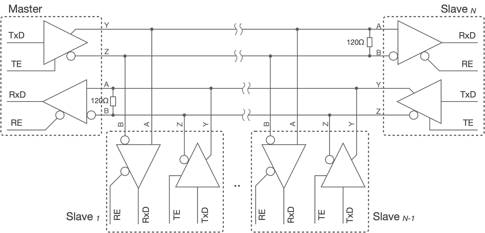

===========================
7.4 工业现场的串口通讯
===========================

我们在前一节中详细地了解了工业领域知名的Modbus协议，他属于OSI的应用层协议，同时还提到了其他的一些异步串行通讯协议，以及面向字节编码的主从网络、面向位编码的对等网络。
本节主要讨论这些网络的物理层和数据链路层相关的知识，尤其面向工业现场的网络所涉及的抗干扰、容错等。

工业现场需要多个设备之间通讯，即若干个设备组成的网络，如各种传感器、执行器类设备，这些设备都是典型的嵌入式系统，硬件的资源较少，软件多数使用RTOS确保实时性。
此外，从系统安全性角度考虑，大多数工业现场的设备网络是独立的，不与其他网络连接。基于UART功能单元如何实现多设备之间互联呢？

标准的RS-232通讯接口仅支持两个设备之间连接，而且传输距离较短。由于差分信号具有极强的抗共模干扰的能力，而且信号的收发双方无需共地，因此差分传输被广泛应用于通讯领域，
譬如我们熟悉的USB通讯接口就是采用差分传输。严格说，电路中传输的所有电压信号都是差分的，以“系统地”作为基准电压来测量信号的电压，为了不引起混淆通常把此类信号称作单端的信号。
差分传输则使用一对信号线传输电压信号，使用两个信号的相对电压差值表示所传输的信号电压，在传输逻辑信号时“1”和“0”电压保持反转关系。有人把这一对信号线的状态比喻成跷跷板上的两个人A和B，
当A被翘起来时两人的高度差是正值(如代表逻辑“1”)，当B被翘起来时高度差为负值(如代表逻辑“0”)，任何时候在跷跷板的两边加上相同大小的力不会改变跷跷板的状态(即两人的高度差不会被改变)。
即使一对差分信号的电压差仅有数十个毫伏，外界干扰引起的几个伏特同时加在差分信号对上不会影响电压差，这就是差分信号的共模干扰抑制能力。为什么需要针对共模干扰呢？
绝大多数干扰信号都是以共模形式存在。

将单端信号转换成差分信号的电路单元称作差分驱动器，将差分信号转换成单端信号的电路单元称作差分接收器，他们都是工业现场的通讯领域常用的。如图7.16所示，
使用一对差分驱动器和差分接收器将单端的异步串行数据信号转换成差分信号，在低波特率条件下，两个设备之间的通讯距离可达1.2Km以上。

.. image:: ../_static/images/c7/rs422_physical_layer_difference_signals.jpg
  :scale: 25%
  :align: center

图7.16  单端信号和差分信号之间转换

上图中的120欧电阻是终端电阻，他们在差分传输网络中很常见，其作用是消除差分信号线上的反射信号以避免反射信号与原信号叠加造成的干扰。
图7.16中的电路仅将单端信号和差分信号实现远距离的异步串行通讯，如果需要实现多设备之间互联，我们有两种选择：全双工的和半双工的差分传输网络。
全双工的差分传输网络拓扑如图7.17所示，根据差分信号的驱动器和接收器的关系，不难发现这种网络是主从结构的，主机(Master)通过TxD发送的数据被转换为差分信号传输到所有从机的差分接收器，
主机的差分接收器能够接收所有从机发送的数据。

图7.17  全双工的差分传输网络拓扑

在全双工的差分传输网络中使用的差分驱动器都必须具有三态功能，即某个从机不发送数据时其差分驱动器的两个差分输出信号保持高阻态，其他从机才能使用所有从机共享的差分信号对发送数据。
因此，上图中的所有差分驱动器都带有发送使能控制信号“TE”，使用从机MCU的可编程I/O引脚来控制“TE”。当“TE=1”时允许发送，当“TE=0”时该差分驱动器的输出处于高阻态，即禁止发送数据。
那么这种全双工的差分传输网络是如何工作的呢？任何从机都不能主动向主机发送数据，整个网络内仅有一个主机，只有主机可以主动发起数据传输，譬如主机发出一个Modbus数据帧(见前一节)，
所有从机都能收到该数据帧并根据数据帧中的从机地址信息确定是否需要给予应答。换句话说，这种网络内的每一个从机必须有一个惟一的地址，与主机发出的数据帧中地址字节向匹配的从机是被允许给主机一个应答帧，
这样的网络借助于主从轮询方法主机可以访问任何一个从机，并与之进行“请求-应答”型通讯。因此，全双工的差分传输网络是主从结构的。

你能根据图7.17所示的网络拓扑完整第描述主机和某个从机之间的一次通讯过程吗？建议仍使用Modbus协议。

半双工的差分传输网络拓扑如图7.18所示。

图7.18  半双工的差分传输网络拓扑

-------------------------

参考文献：
::

  [1] https://modbus.org/docs/Modbus_Application_Protocol_V1_1b3.pdf
  [2] 