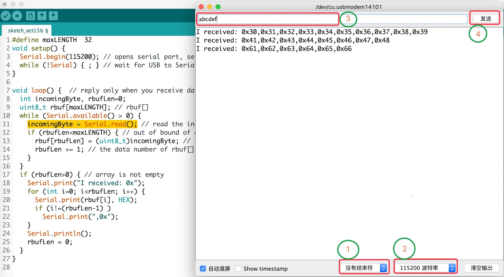
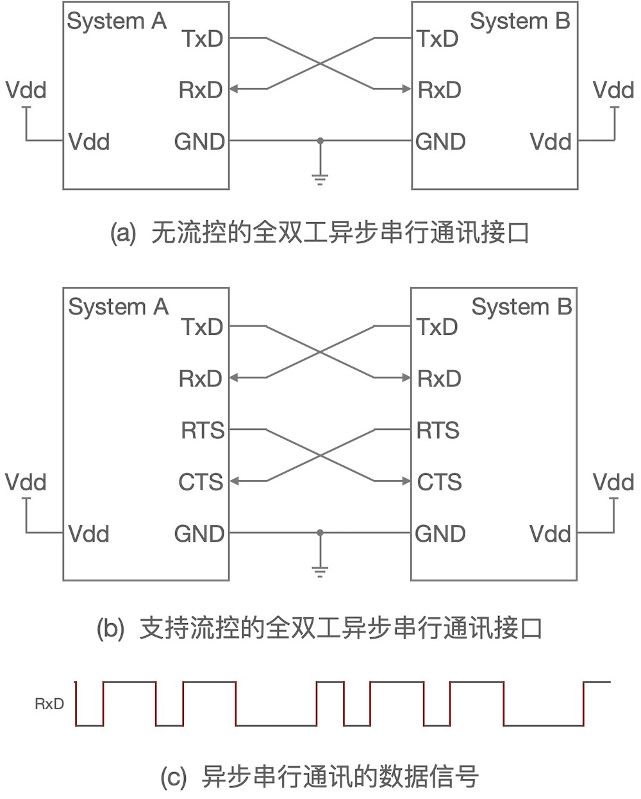
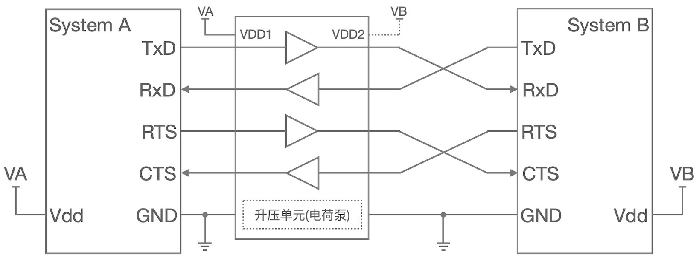
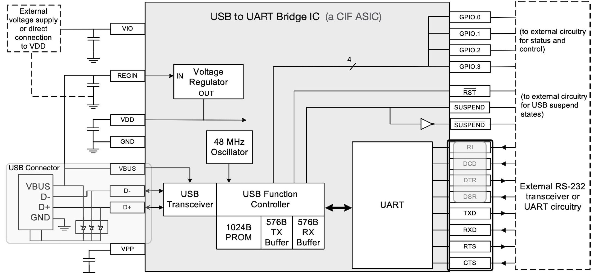
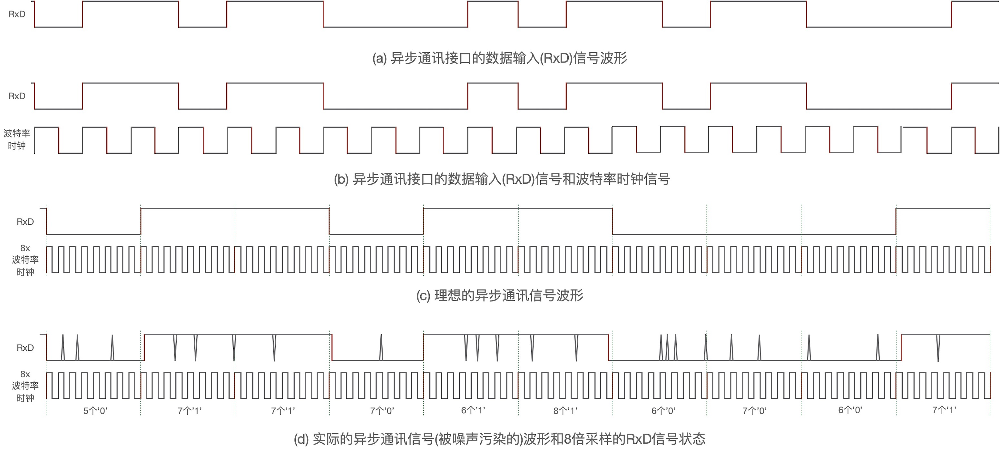
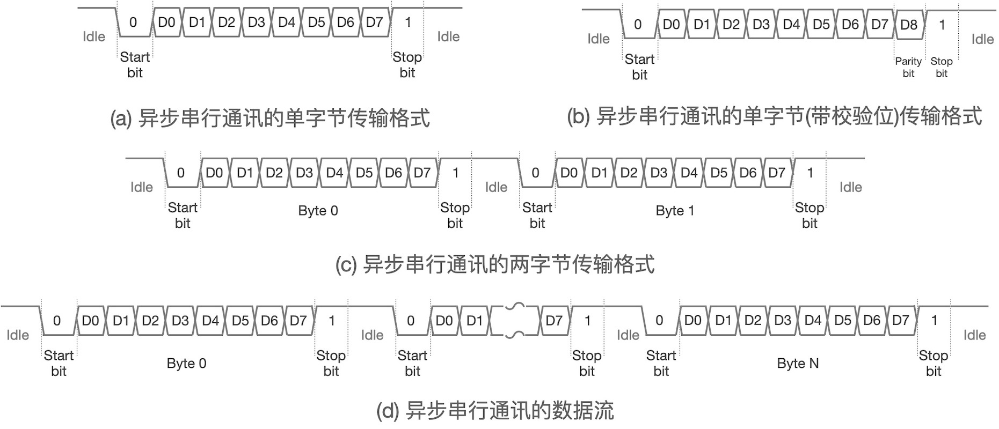
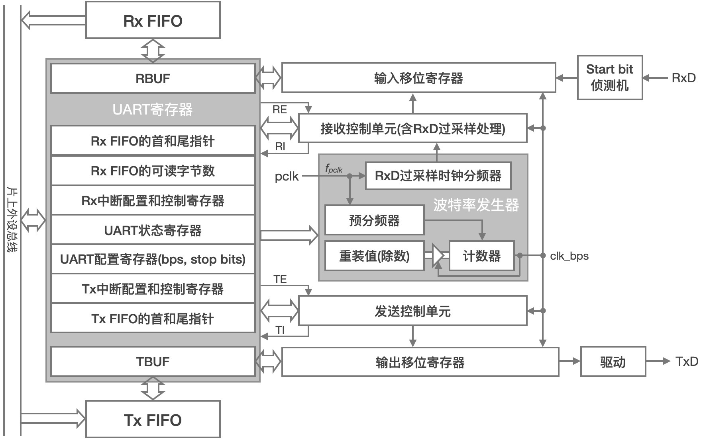
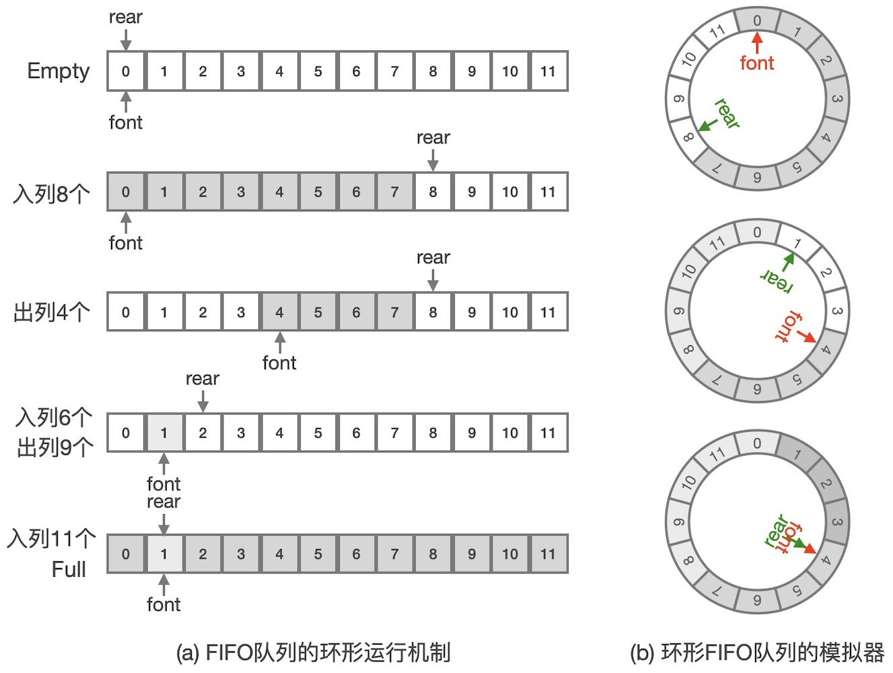

===========================
7.1 异步串行通讯和UART
===========================

事实上，我们一直在使用异步串行通讯接口，如在Arduino开源平台上语句“Serial.print(var)”可以将变量var的值输出的电脑上，
我们使用Arduino IDE的串口监视器即可看到这个变量的值。绝大多数嵌入式系统的软件接口“print()”都是基于异步串行通讯接口。
我们首先使用BlueFi来感受异步串行通讯的基本用法，示例程序代码如下：

.. code-block::  C
  :linenos:

  #define maxLENGTH  32
  void setup() {
    Serial.begin(115200); // opens serial port, sets data rate to 115200 bps
    while (!Serial) { ; } // wait for USB to Serial bridge to connect
  }

  void loop() {  // reply only when you receive data
    int incomingByte, rbufLen=0;
    uint8_t rbuf[maxLENGTH]; // rbuf[]
    while (Serial.available() > 0) {
      incomingByte = Serial.read(); // read the incoming byte
      if (rbufLen<maxLENGTH) { // out of bound of array?
        rbuf[rbufLen] = (uint8_t)incomingByte; // save it into rbuf[]
        rbufLen += 1; // the data number of rbuf[] plus one
      }
    }
    if (rbufLen>0) { // array is not empty
      Serial.print("I received: 0x"); 
      for (int i=0; i<rbufLen; i++) { 
        Serial.print(rbuf[i], HEX); 
        if (i!=(rbufLen-1) )
          Serial.print(",0x");
      }
      Serial.println();
      rbufLen = 0;
    }
  }

除了第10行和第11行之外，其他程序语句都很好理解，尤其“Serial.print()”和“Serial.println()”两个接口，前面的内容中我们时常用来输出程序状态到串口控制台。
第10行语句使用“Serial.available()”接口返回值是否大于零作为循环的条件，该接口返回值大于零表示“异步串行通讯接口的接收数据缓冲区有可读的数据”。
如果该条件成立，第11行语句则调用“Serial.read()”接口从接收缓冲区读取一个字节数据。

将这个示例程序编译并下载到BlueFi上，然后打开Arduino IDE的串口监视器，并按图7.1所示配置参数。

图7.1  使用Arduino IDE串口监视器与BlueFi双向通讯

上图中串口监视器窗口的发送控制符参数(图中第(1)处)请选择“没有结束控制符”；波特率(图中第(2)处)选择115200，这个参数必须与示例代码的第3行“Serial.begin(115200)”保持一致，
其原因我们后续内容会进一步解释；然后在串口监视器顶部的输入框(图中第(3)处)输入“0123456789”并按回车键或点击“发送”按钮(图中第(4)处)，
只要键盘上能够输入的字符或符号都可以输入到该输入框，但是字符个数限于32个以内。当你每次按下回车键后，窗口监视器的输出列表中就会增加一行以“I received:”为开头的字符串，
如果仔细观察规律，你输入的字符或符号的个数与新增到串口监视器输出列表的字符串中“,”个数有关。

事实上，上面BlueFi执行的示例程序的主循环中，首先检查异步串行接口是否有可读的数据，如果有则逐个读出并保存到数组rbuf[maxLENGTH]中，每读出一个字节时rbufLen变量增加1，
直到全部读出(此时“Serial.available()”接口返回值为0)，然后将数组rbuf[maxLENGTH]中前rbufLen项输出到异步串行接口，并始终以“I received:”为开头。

这个示例中，使用BlueFi开源板的串口与电脑实现双向通讯。或许你会问，明明使用的是USB数据线与电脑连接的，为什么说使用的是串口呢？
这个示例中使用的的确是串口，电脑端打开的明明是Arduino IDE的串口监视器，而且也选择的是“COMx”串行端口。这是因为现在的桌面计算机几乎找不到标准的串口，
但USB端口确是标配的，BlueFi使用“USB-串口桥接”的方法将USB虚拟为串口，但嵌入式系统这一端则是串口。关于“USB-串口桥接”的基本方法，稍后再了解。

从上面示例中可以看出，嵌入式系统之间、嵌入式系统与电脑之间使用串口连接并实现数据传输是很容易的，成本也仅仅是一段信号线而已。
对于嵌入式系统之间的串口通讯，严格说是使用异步串行通讯接口传输数据，如图7.2所示。

图7.2 使用异步串行通讯接口连接两个嵌入式系统

如图7.2(a)，如果不考虑硬件流控信号，只需要2根数据线即可实现两个嵌入式系统之间的全双工的数据传输，其中TxD信号是发送者的串行数据输出信号，
该信号必须与接收者的串行数据输入信号RxD连接。为两个系统的全双工数据传输则必须将两者的收发信号线交叉连接，即A系统的TxD与B系统的RxD连接，
A系统的RxD与B系统的TxD连接。全双工的数据传输，意味着A系统向B系统传输数据的同时还可以接收B系统发送来的数据。

异步串行通讯接口的硬件流控信号包括2对：RTS-CTS和DTR-DSR。在异步串行通讯接口中，这些信号被称作硬件流控(Hardware Flow Control)信号，
本质上这些都属于握手信号，异步串行通讯的数据传输期间，使用这些握手信号无须软件干涉即可实现暂停、继续数据传输等控制，因此得名。
RTS(Request To Send)是数据接收者向对方发送的“请求发送”信号，当接收者已收到大批数据来不及处理时，可以让RTS变为无效电平(低电平)通知发送者暂停数据发送，
当接收者腾出接收空间时再置RTS信号为有效电平(高电平)通知发送者继续发送数据。RTS和CTS是一对流控(握手)信号，两个系统使用串口互联时需要将这一对信号交叉连接，如图7.2(b)。
随着现代CPU时钟速度的提示、存储器容量的增加，串口的流控信号已很少有使用的机会。

与I2C、SPI通讯接口相比，异步串行通讯接口并没有专用的同步时钟信号，发送者从TxD信号发送的、接收者从RxD信号接收到的是串行的二进制数据位，
如图7.2(c)所示，在电路上这些数据被转换成高低电平对应的电压信号，他们是“1”和“0”组成的有序的二进制序列。

当两个嵌入式系统的I/O工作电压不相同时，如图7.3所示，两个系统的I/O引脚的逻辑电平电压或许不匹配，系统之间必须使用电平转换单元确保电平电压相匹配。

图7.3  使用电平转换单元的异步串行通讯接口

历史上异步串行通讯接口有多种标准，譬如RS-232标准的电平电压：“1”对应-15~-3V，“0”对应+3~+15V，他们与普通数字CMOS元件的逻辑电平电压(0~9V最大)相差较大，
RS232标准的电平信号、CMOS信号、TTL信号等之间的电平转换电路需要谨慎设计，在半导体行业这种通讯接口类的电平转换电路有很多种产品可选择。

前面的示例中USB接口如何被转换为异步串行通讯接口的呢？BlueFi开源板的主控制器——nRF52840片上带有一个USB2.0接口和一个标准的异步串行通讯接口单元，
并使用开源的USB协议栈——“TinyUSB” [1]_ 使这个MCU的USB接口用作串口设备通讯类(CDC)、大容量存储设备类(MSC)、人机接口设备类(HID，即鼠标和键盘)等。
用作CDC时，nRF52840的USB功能单元为片上串口功能单元建立一种数据信息转发通道，在电脑端该通道被称作虚拟串口，因此我们称这样的转换接口为“USB-串口”桥接。
目前，专用的“USB-串口”芯片是常用的ASIC，常用于将嵌入式系统串口与电脑的USB端口连接。专用“USB-串口”桥接芯片的内部结构如图7.4所示。

图7.4  “USB-串口”桥接芯片内部结构(参考Silicon Labs的CP2104)

与nRF52840的USB和串口的桥接方法相比，上图是硬件方式实现的“USB-串口”桥接，而nRF52840则使用软硬件相结合的形式来实现的。硬件实现的“USB-串口”桥接没有灵活性，
一般来说只能实现虚拟串口的功能，而软硬件结合的方法更灵活，尤其可以通过软件编程的方式支持更多种桥接。

无论是采用“USB-串口”桥接的虚拟串口，还是项老旧电脑一样带有RS-232标准接口的u里串口，仅仅是嵌入式系统与电脑之间实现异步串行通讯的一种形式，
异步串行数据信号线上所传输的仍是有序的二进制序列且没有专用的同步时钟信号。在没有同步时钟信号的情况下如何从数据信号线上恢复正确的二进制序列呢？
异步串行通讯接口的TxD(或RxD)所传输的电压信号如图7.5(a)所示。

图7.5  使用电平转换单元的异步串行通讯接口

你能给出图7.5(a)所示的电压信号所代表的二进制序列吗？仅依靠这个时序图所给出的信息很难回答这个问题。如果我们已经知道这个二进制序列的发送方所使用的波特率，
即已知传输每一个二进制位的时间跨度，确定图中电压信号所代表的序列就不再困难了。如图7.5(b)所示，根据发送者的波特率信息我们可以假象一个波特率时钟信号，
现在完全可以确定这个二进制序列。

同步时钟信号有多么重要！事实上，在数字通讯领域，同步是最基础的、最宽泛的概念，使用波特率信息假象的波特率时钟仅仅是异步串行通讯的位同步机制，
以后我们还会遇到字节同步、帧同步等机制。

接收方使用已知的波特率时钟来确定从异步串行通讯输入端进来的二进制序列，即要求通讯双方必须按相同的波特率收发数据，发送方根据约定的波特率时钟逐位将二进制序列发送到TxD数据信号线上。
异步串行通讯使用波特率信息保持收发双方同步，这样就无需专用的同步时钟信号，节约电缆成本。虽然同步时钟信号是片上(或系统内)功能单元之间数据传输的关键信号(保持主从同步)，
在MCU芯片和PCB布局的设计阶段，同步时钟信号仅仅是一根极短的信号线，成本几乎为零。然而系统之间的通讯电缆(每个信号一根电缆)成本将随着系统间距离增加而增加，
异步串行通讯不仅让通讯电缆达到极致地少，还具有较好的抗干扰能力。

如何确保两个系统的波特率时钟完全相同呢？如果两个系统的波特率时钟频率存在偏差会造成什么问题？当然，两个系统的波特率时钟频率绝对不可能完全相同！
振荡器的原材料、制造工艺、工作环境的温湿度等因素都会影响两个系统波特率时钟的一致性。当通讯双方的波特率时钟频率存在偏差时，引入过采样处理来解决这一偏差造成的误码。
如图7.5(c)所示，如果我们使用8倍频率的波特率时钟信号对异步串行通讯的数据信号线进行采样，即便是数据信号被噪声所污染，如图7.5(d)，接收方仍可以确定二进制序列。

所谓过采样处理，就是以数倍或数十倍于波特率时钟的高频时钟信号对异步串行通讯的数据信号线进行采样，譬如8倍，每个二进制位将被采样8次，
然后从统计学上根据8次采样结果来确定这个二进制位更可能是“1”或“0”。很显然，过采样的时钟信号频率越高所确定的结果的可信度越高，
但实现成本也随之增加。

此外，异步串行通讯的数据传输时序方面也有专用的同步位，包括起始位和停止位，使用这些同步位来确保字节同步。如图7.6(a)所示。异步串行通讯接口的数据参数以字节为基本单元，
每个字节的二进制位数是可配置的，包括5、6、7、8位等4种，最常用的是8位宽度。起始位固定为“0”；停止位固定为“1”，而且停止位的个数是可配置的，
包括0.5、1、1.5、2位等4种，默认采用1个停止位。

图7.6  异步串行通讯的数据格式(时序)

校验位包括偶校验和奇校验两种类型。一个字节数据的偶校验位指的是，如果组成这个字节的8个二进制中有偶数个“1”，则偶校验位为“1”；反之为”0“。
奇校验位的定义与之相似。异步串行通讯的数据传输格式可配置使用偶校验位或奇校验位，如图7.6(b)，校验位放在停止位之前发送。譬如，
如果采用8位宽的字节，校验位将作为第9个位来传输。接收方将根据校验位类型、校验位的值对接收到的二进制序列的可信度进行评价，
如果校验失败则表示接收到的数据是错误的。

异步串行通讯的起始位和停止位是非常非常巧妙的设计。前一个字节的传输以停止位结束，数据信号线的状态保持逻辑高电平，开始传输下一个字节的起始位是逻辑低电平。
虽然停止位的个数是可配置的，如果传输的两个字节之间预留数据处理(如准备下一个待发送的数据、保存前一个接收的数据)的时间间隔，停止位的多少已不重要，如图7.6(c)。
目前仅有智能卡(Smart Card)应用(ISO7816-3)的异步串行通讯接口需要使用半个或1.5个停止位，这些应用对时序要求较为严格。

从图7.6(d)可以看出，使用异步串行通讯接口传输多字节数据时，起始位和停止位保持数据流中相邻字节有明显的界线，接收方使用过采样处理能够准确地从噪声环境中恢复数据流，
甚至自动侦测发送方的波特率信息。

执行异步串行通讯接口的功能单元被称作通用异步收发器(UART)，其内部结构如图7.7所示。

图7.7  通用异步收发器的结构组成

UART主要由四个部分组成：发送和接收控制单元(含移位寄存器)、接收和发送FIFO(先进先出队列)、UART的控制和状态寄存器、波特率发生器。
波特率发生器是将UART模块的输入时钟信号进行分频产生波特率时钟信号，UART的发送控制单元和输出移位寄存器使用该时钟同步地将数据字节逐位从TxD输出，
接收控制单元和输入移位寄存器使用波特率时钟同步地将RxD输入的二进制序列转换成字节数据，接收控制单元使用可配置的过采样时钟信号对RxD信号进行过采样确定移入移位寄存器的每一个二进制位信息。
通过编程访问UART的控制和状态寄存器能够对UART进行配置，包括波特率、每字节的二进制位数(如5或8等)、停止位的个数、是否有校验位等，
也可以查询接收器是否发现错误(包括帧错误等)，以及发送完毕和接收到数据是否允许向CPU发出中断请求信号、清除中断请求信号等。

对于波特率的计算，上图可以看出，波特率等于自动重装计数器的溢出率，计数器的时钟信号的周期记为T_clk__prescaler，即预分频器输出的时钟信号的周期。
假设自动重装计数器是递减工作模式的，那么

  计数器的溢出率 = 1 / ((AL_Value+1) * T_clk_prescaler)

其中AL_Value是计数器的重装值，递减计数器从这个值开始，每一个时钟周期计数器减1，(AL_Value+1)个时钟周期后计数器将溢出，计数器溢出后从重装寄存器重新加载到计数器。
因此，AL_Value*T_clk_prescaler是波特率的周期，即发送一个二进制位的时间。

很显然，波特率发生器产生的波特率时钟信号频率由因此，AL_Value、预分频数(Prescaler)和UART模块输入的时钟信号频率f_clk共同确定。下面使用一个具体的示例来说明波特率的具体计算过程。

假设UART模块输入的时钟信号频率f_clk=64MHz，与之通讯的另一个系统的波特率为115,200，我们可以确定一对最合适的预分频数(Prescaler)和计数器重装值(AL_Value)。
如果使用的自动重装计数器是递减的，根据给定的条件，已知：

  计数器的输入时钟信号周期 T_clk_prescaler = Prescaler / f_clk (us)
  计数器的溢出周期 T_overflow = (AL_Value+1) * T_clk_prescaler = (AL_Value+1) * Prescaler / f_clk (us)

得到关系式：

  (1,000,000 / 115,200) = (AL_Value+1) * Prescaler / 64

考虑预分频器的结构，预分频数只能取2的幂，即1、2、4、8等。也就是说，上面算式中Prescaler只能取数据集{1, 2, 4, 8, 16, 32, 64}中的某个数。
同时，计数器的重装值AL_Value必须取整数。很显然，上面等式中的两个数值可以取多个值，首先确定Prescaler为某个值，譬如4，即可确定AL_Value的值，
譬如Prescaler=4时AL_Value=(16,000,000/115,200)=138.8889。很遗憾，这个AL_Value不是整数！只能取一个最接近的整数，即Prescaler=4时AL_Value=139。
同样方法可以确定其他合适的值，或许你会发现AL_Value都只能取近似的值。这就是系统之间波特率时钟偏差的因素之一。

如果波特率发生器所使用的自动重装计数器是递增的工作模式，对于给定的波特率又该如何计算这一对值呢？计算方法几乎没有区别，但递增计数器的溢出率于自动重装值之间关系不同，

  递增的自动重装计数器的溢出率 =  1 / ( ((2^bw) - AL_Value) * T_clk_prescaler )

其中bw是计数器的二进制位宽度，譬如8位计数器bw=8，(2^bw)是计数器的最大值+1。
即，溢出周期T_overflow = ((2^bw) - AL_Value) * T_clk_prescaler = ((2^bw) - AL_Value) * Prescaler / f_clk (us)。

图7.7中的发送和接收FIFO也是现代MCU片上UART功能单元必备的部分，使用这些缓存可以提高CPU的利用率，譬如当接收FIFO达到3/4用量时向CPU发出中断请求，
CPU在该中断服务程序中将接收FIFO中的数据转移到RAM中。FIFO并不是特殊的存储器，仅仅是一片普通存储空间的访问方法和存取机制采用“先进先出”规则。
对于UART这样的字节流型输入和输出功能外设，使用FIFO机制管理接收或发送缓存是非常合适的。待发送的字节数据顺序地写入发送FIFO，然后启动发送(置TE有效)，
UART的发送控制单元将根据波特率发生器时钟将这些字节流转换位二进制位流逐位发送除去，并自动地在每个字节前和后插入起始位和停止位。
接收控制单元根据起始位和停止位将二进制位流还原为字节流，并逐个写入接收FIFO，CPU从接收FIFO读取的字节流顺序与发送者完全保持一致。
注意，异步串行通讯的位流是最低位(LSB)先发送。

关于FIFO机制，借此机会稍作了解，FIFO存储器是已广泛应用在嵌入式系统的诸多功能单元。FIFO存储器的访问和存取方法如图7.8所示。

图7.8  FIFO存储器的环形管理机制

将FIFO称为队列，主要目的是从名字上与“先进后出”的堆栈型存储器区分开。队列，就像排队领餐的人群队伍一样，最先来的人排在队首，后来的人续在队尾，
队首的人领到餐食后出列，其后面的(原来的第二个)人变为队首，这样可以保证先来的人先领餐食先走。堆栈，则像装羽毛球的筒，最先放入筒中的羽毛球在最底部，
最后放入筒中的羽毛球在顶部，从装羽毛球的筒中取羽毛球时总是先从顶部取走，即后放入筒中的羽毛球先被取走。本质上，
堆栈存储器和队列存储器都属于RAM型存储器，但访问方法和存取机制不同。

上图中，假设FIFO队列的深度为12，即允许最多保存12个数据项。初始时，队列为空，向队列中顺序地写入8个数据项时，队尾(rear)自动移到第9个位置，
意味着下一个写入的数据项在第9个位置；当我们从队列中顺序地读出4个数据项后，队首(front)自动地移动第5个，那么下一个读出的数据项是第5个位置。
这个写入(存)和读出(取)数据项的过程是“先进先出”的规则。保持队列现在的状态(队尾在第9个位置，队首在第5个位置)，如果需要顺序地写入6个数据项，
前4项分别写入第9～12位置，后面2项则需要顺序地写到第1和2位置，现在队尾是第3个位置；此时队列中共有4+6项(即10项)数，我们现在再顺序地读出9项，其中的前8项分别是第5～第12项，
从第1个位置读出最后一项，现在队首是第2个位置。显然，这样的存取过程仍保持“先进先出”，而且存储器访问必须从最后一个位置回滚到第一个位置。

为了更好地理解上面所述的FIFO队列的存取过程，如果我们把12个存储单元按环形排列，再来执行这些数据项的存取过程，或许更好理解。
事实上，所有计算机系统的存储器单元都是按线性地址排列，将FIFO队列的存储器单元按环形排列是我们的一种想象。因此，上图所示的存取机制的FIFO队列称作环形FIFO队列。

环形FIFO队列的控制算法如下：

.. code-block::  C
  :linenos:

  const uint8_t sizeFIFO = 12;
  typedef uint8_t typeElement;
  typedef struct {
    uint8_t front, rear, count;
    typeElement elements[sizeFIFO];
  } typeFIFO;

  void fifiInit(typeFIFO* fifo) {
    fifo->front=0; fifo->rear=0; fifo->count=0;
  }
  bool fifoIn(typeFIFO* fifo, typeElement dat) { 
    if ( (fifo->front==fifo->rear) && (fifo->count==sizeFIFO) )
      return false; // FIFO queue is full!
    else {
      fifo->elements[fifo->rear] = dat; // push it to queue
      fifo->rear = (fifo->rear + 1) % sizeFIFO; // move the pointer
      fifo->count += 1; // queue number plus one
      return true;
    }
  }
  bool fifoOut(typeFIFO* fifo, typeElement* dat) { 
    if ( (fifo->front==fifo->rear) && (fifo->count==0) )
      return false; // FIFO queue is empty!
    else {
      *dat = fifo->elements[fifo->front]; // pop it from queue
      fifo->front = (fifo->front + 1) % sizeFIFO; // move the pointer
      fifo->count -= 1; // queue number minus one
      return true;
    }
  }

在UART等使用FIFO队列的外设功能单元中，使用硬件实现上述算法。这个算法由三个子程序组成，分别用于初始化队列(fifiInit)、数据项入列(fifoIn)和数据项出列(fifoOut)。
并将一片FIFO队列存储空间设计成结构体，称作typeFIFO，包含队首指针(front)、队尾指针(rear)、队列内可读数据项的个数(count)、保存队列数据项的数组。
队列数据项的数据类型typeElement是首先指定的，上述算法中使用“uint8_t”型数据项。

在本节的第一个示例程序中，调用“Serial.available()”接口获取串口接收缓存中有多少个可读的字节数，其实就是接收FIFO中可读的数据项个数。
使用“Serial.read()”接口从接收FIFO中读取一个字节数据，实际上就是读取接收FIFO队首的数据项，每次调用该接口始终返回队首的数据项。
当所有数据项被读出后，队列为空，调用“Serial.available()”接口将返回0。

FIFO队列的深度指定一次能够写入的数据项的最大个数，当队列被写满之后后来的数据项将被遗弃。大多数用于数据流缓存的FIFO队列，总是希望队列深度越大越好，
但存储器成本也将越来越高。为了确保通讯数据流的完整性(不被丢弃)，折衷的方案是，使用成本可接受的N项深度的FIFO队列，并用中断请求或DMA传输请求，
当队列中可读数据项达到3/4时即发出中断请求或DMA传输请求，CPU或DMA控制器将FIFO队列中的数据项转移到更大容量的通用存储器区，
但必须综合考虑中断请求和DMA传输请求的响应延迟，以及数据传输速度(波特率)，这些延迟时间内确保FIFO队列不会被写满。

-------------------------

参考文献：
::

  [1] https://github.com/hathach/tinyusb
  [2] 