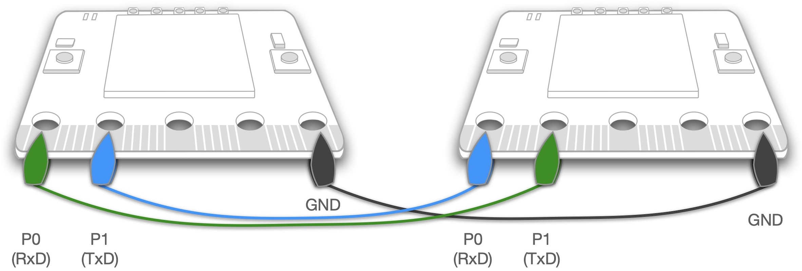
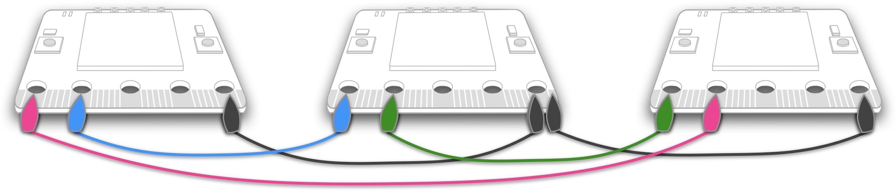

===========================
7.2 使用UART实现系统间通讯
===========================

我们在前一节中已深入了解异步串行通讯接口及UART等细节，本节将了解如何使用通讯端口实现嵌入式系统之间的通讯。仍从一个示例开始，
该示例的目标是使用多个BlueFi开源板玩一种“数字接龙游戏”。多人玩这种数字游戏时，某个人首先说一个数字，与他相邻的人说加一后的数字，如此加一传递数字，
一轮又一轮地将数字传递下去。实现这个有趣的游戏之前，我们需要稍微了解其背后的原理。

BlueFi开源板40脚金手指拓展接口的P0和P1引脚分别可作为异步串行通讯的RxD(串行数据输入)和TxD(串行数据输出)，
使用鳄鱼夹电线将这两个引脚交叉连接可以实现两个BlueFi之间的串口通讯，如图7.9所示。

图7.9  两个BlueFi使用串口通讯的连接方法

注意，两个嵌入式系统之间使用串口通讯，两个系统必须共地，即两个BlueFi的GND信号必须连接在一起。此外，所谓交叉连接指的是，
一个BlueFi的TxD引脚与另一个BlueFi的RxD引脚连接。

我们想要实现的数字接龙游戏的准备工作包括，首先使用多根鳄鱼夹电线将所有BlueFi开源板的金手指拓展接口GND引脚连接起来，
然后再使用鳄鱼夹电线将第1个BlueFi的P1引脚与第2个BlueFi的P0引脚连接，第2个BlueFi的P1引脚与第3个BlueFi的P0引脚连接，..，
最后一个BlueFi的P1引脚与第1个BlueFi的P0引脚连接，即多个BlueFi的P0和P1引脚环形级联起来。如图7.10所示。

图7.10  多个BlueFi使用串口通讯的连接方法

虽然上图仅有3个BlueFi开源板的级联，事实上任意多个BlueFi都是可以用这种方法呈环形级联的。根据这个连接方法，或许你已经明白多个BlueFi实现数字接龙的“数字传递”过程了。
第1个BlueFi将数字(通过TxD引脚)传递给第2个BlueFi(从RxD引脚接收到该数字)，第2个BlueFi将收到的数字加一后(通过TxD引脚)传递给第3个BlueFi(从RxD引脚接收到该数字)，
..，最后一个BlueFi将收到的数字加一后(通过TxD引脚)传递给第1个BlueFi(从RxD引脚接收到该数字)，第1个BlueFi将收到的数字加一后再传递给第2个，如此循环传递即可实现这个游戏。

实现该游戏的程序代码如下：

(uart_digit_chain_game.ino)

.. code-block::  C
  :linenos:

  #include <BlueFi.h>
  const String hintStr = "press Button A to send";
  const String recStr = "Received:";
  bool startSend = false;

  void a_pressed_cb(Button2& btn) {  // callback function to A-Button be pressed
    Serial.println(" A-Button be pressed");
    startSend = true; // send a message to main-loop
  }

  void setup() {
    bluefi.begin(); // include Serial.begin(115200) 
    initialScreen(); // show initial content on the screen
    bluefi.aButton.setPressedHandler(a_pressed_cb); // register a callback function
    Serial1.begin(9600); // P0(RxD) and P1(TxD) are Serial1 signals
  }

  void loop() {
    bluefi.aButton.loop(); // update the state of A-button
    if (Serial1.available() > 0) { // if a digit be received
      int comingIn = Serial1.read(); 
      uint8_t val = (uint8_t)comingIn;
      updateScreen(val);     // update LCD screen 
      Serial1.write(val+1);  // increment this digit and send to next BlueFi
      delay(200);
    } 
    if ( startSend ) { // if A-Button be pressed, then start send 
      startSend = false;
      uint8_t startDigit = 0;
      Serial1.write(startDigit); // send the initial digit
    }
    delay(50);
  }

  void initialScreen(void) {
    bluefi.Lcd.fillScreen(TFT_BLACK); // clear screen
    bluefi.Lcd.setTextColor(TFT_WHITE, TFT_BLACK);
    bluefi.Lcd.setCursor(20, 0, 4);
    bluefi.Lcd.println( "Digit Chain Game"); 
    bluefi.Lcd.setCursor(4, 40, 4);
    bluefi.Lcd.println("with UART (P1-->P0)"); 
    bluefi.Lcd.setCursor(0, 150, 2);
    bluefi.Lcd.println(hintStr); // show hint
  }

  void updateScreen(uint8_t val) {
    static bool first = true; // a static variable is equal to a global variable
    static String digitStr = ""; 
    if (first) { 
      bluefi.Lcd.setTextColor(TFT_BLACK, TFT_BLACK);
      bluefi.Lcd.setCursor(0, 150, 2);
      bluefi.Lcd.println(hintStr); // erase hint
      bluefi.Lcd.setTextColor(TFT_RED, TFT_BLACK);
      bluefi.Lcd.setCursor(20, 100, 4);
      bluefi.Lcd.println(recStr);  // show "Received:"
      first = false; // this code block to execute only once!
    }
    bluefi.Lcd.setTextColor(TFT_BLACK, TFT_BLACK);
    bluefi.Lcd.setCursor(140, 100, 4);
    bluefi.Lcd.println(digitStr); // erase the last digit string 
    bluefi.Lcd.setTextColor(TFT_YELLOW, TFT_BLACK);
    digitStr = String(val);
    bluefi.Lcd.setCursor(140, 100, 4);
    bluefi.Lcd.println(digitStr); // show this digit string
  }

上面示例程序看起来代码行较多，如果暂时不考虑最后的两个函数initialScreen()和updateScreen()，实现数字接龙游戏的关键代码是初始化函数setup()中的最后一行代码，
即Serial1.begin(9600)，以及主循环函数loop()中的代码。其中Serial1.begin(9600)用来初始化BlueFi金手指拓展接口的P0和P1两引脚分别为Serial1的RxD和TxD信号，
波特率为9600；主循环中的第一个if程序块以Serial1.available()接口的返回值是否大于0为条件，该接口返回值大于0则意味着Serial1接收到数据，
在这个if程序块中首先从接收缓冲区读取一个接收到的数据并转换为8位无符号整数，然后调用子程序updateScreen()更新LCD显示器，然后将该数值加一后再发送出去。

该示例程序的大多数代码都是用于控制LCD显示器。在initialScreen()函数中将LCD显示器清屏，然后显示初始的文本内容。在updateScreen()函数中，
如果首次执行LCD屏幕刷新则需要将初始化时屏幕上的提示信息擦掉，更新接收到的数值到LCD显示屏上(仍然是先擦掉再显示新的数值)。

此外，示例程序还用到按钮A来启动游戏。BlueFi的按钮控制软件的接口详见第4.1节。本示例的初始化期间为按钮A注册一个“A按钮被按下时”的回调函数，
当A按钮按下时向主循环发送一个消息(一个全局变量startSend=true)。在主循环程序中，调用bluefi.aButton.loop()接口检查按钮A的事件，
并检查是否收到A按钮被按下的回调函数发出的消息，如果收到则通过Serial1发出一个数字。

将上面的程序代码复制-粘贴到Arduino IDE中，编译并逐个地下载到已经连接好的所有BlueFi开源板上。注意，这个示例程序并不依赖电脑USB端口，当程序下载到BlueFi之后，
可以使用任何USB电源给BlueFi开源板供电。当所有BlueFi开源板通上电且按图7.10的示例环形级联好之后，并没有启动游戏，当你按下任一BlueFi开源板的按钮A之后才能启动游戏。

如果你觉得使用Arduino IDE编译和下载程序所耗费的时间太长，可以使用Python脚本程序来实现该游戏。使用Python之前，你必须使用USB数据线将BlueFi与电脑连接好，
并双击复位按钮让BlueFi进入Bootloader状态，将BlueFi的最新版Python解释器固件拖放到BLUEFIBOOT磁盘，等待CIRCUITPY磁盘出现在电脑资源管理器中，
再将下面的Python脚本程序保存到/CIRCUITPY/code.py文件，即可。

.. code-block::  Python
  :linenos:

  import time               # time moudle
  import board, busio       # board and busio modules
  from hiibot_bluefi.basedio import  Button     # Button module
  btn = Button()
  # Initialize UART port: 
  uart = busio.UART(
          board.P1, board.P0, baudrate=9600,    # two Pins(TxD, RxD)         
          timeout=0.01, receiver_buffer_size=1) # waiting time(s), size of buffer
  outBuf = bytearray(1)     # out buffer, uart.write(bytearray,num)
  print("Press A button to start game")
  while True:
      btn.Update()
      if btn.A_wasPressed : # start our game, send a digit
          outBuf[0] = 0     # any digit: 0~255
          uart.write(outBuf, 1)
          print("Go it!")
      inBuf = uart.read(1)  # return a bytearray type
      if inBuf != b'' :     # is not None
          print(int(inBuf[0]))
          if int(inBuf[0]) < 255:
              outBuf[0] = inBuf[0]+1  # increment and send this digit
          else:
              outBuf[0] = 0           # .., 254, 255, next 0
          uart.write(outBuf, 1)
          time.sleep(0.3)

为啥这个游戏的Python脚本程序很短呢？少了刷新LCD显示屏的代码，因为Python解释器将BlueFi的LCD显示当作字符控制台，
我们需要显示的信息直接用print(info)即可输出到屏幕上，而且自动滚屏显示。

现在可以仔细地测试本示例，观察数字接龙的效果。

-------------------------

如果没有观察到连续的数字接龙效果，请首先检查环形级联的连线、共地连线、供电等硬件连接是否可靠牢固；然后检查鳄鱼夹是否与P0、P1、GND附近的引脚连接上。

如果你的硬件连线很牢固，上面的数字接龙游戏几乎可以无穷无尽地执行！我们观察到的接龙数字应该是“.., 254, 255, 0, 1, .., 127, 128, .., 255, 0, 1, ..”，
为什么接龙数字被限制在0~255范围呢？Python脚本程序的第20～23行语句回答这个问题。虽然C程序中并没有明显的判断接收到的数据是否小于255等语句，
但我们使用8位无符号整数作为接收和发送的数据类型，这种类型数据的有效值是多少呢？

现在可以将波特率参数修改为1200、4800、115200或921600等，再试一试。随着波特率的增加，或许我们的数字接龙会失败，包括数字不连续、游戏停止等现象。
为什么提高波特率会产生这样的效果呢？根据前一节的内容即可回答这个问题。

或许你在改变波特率的过程中还遇到过很低级的错误：某个BlueFi的程序中的波特率与其他不一致(忘记修改或输入错误等)。这种低级错误必会造成游戏无法进行，
按环形级联到本游戏中的所有BlueFi的串口波特率必须始终保持一致，这个规则毋庸置疑。

-------------------------

参考文献：
::

  [1] https://www.arduino.cc/reference/en/language/functions/communication/serial/
  [2] 