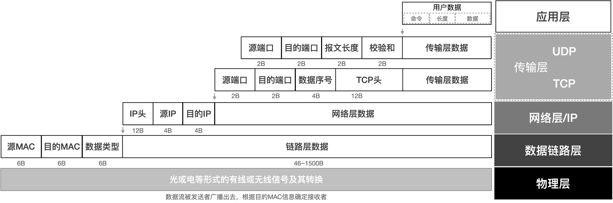

===========================
7.3 串口通讯协议
===========================

前一节中我们已经知道结构化的数据帧是异步串行通讯协议的基本特征之一。事实上，以字节为传输单位的异步串行通讯接口的每一个字节都是结构化的，
必须以起始位开始并以停止位终止一个字节的传输。结构化的数据帧是所有通讯协议的基本特征，无论是面向字节传输或是面向位传输的串行通讯，
结构化的信息不仅能保证收发双发同步，还能实现检错等。

当今最知名的通讯协议是TCP/IP协议，我们每天都在各种计算系统上使用该协议浏览网页、收发邮件、阅读新闻、与朋友交流等。如图7.12所示，
TCP/IP协议将用户层数据流逐层地结构化封装(每一个位都有特定作用)并经由物理层传输到另一个网络设备，TCP/IP网络接收设备将物理层接收到的数据包逐层地剥出用户数据。

图7.12  TCP/IP协议的数据报文分层封装(IPv4)

上图可以看出，用户层的最短TCP数据流是6个字节、最短UDP数据流是18个字节，然而物理层所传输的字节数至少是64字节。
结构化的数据帧使得TCP/IP网络设备的发送者和接收者都能准确地封装和剥离前一层的特定信息，用户层的软件实现完全不关心物理层的数据到底有多少个字节，
但不影响用户层数据流的传输。

-------------------------

参考文献：
::

  [1]
