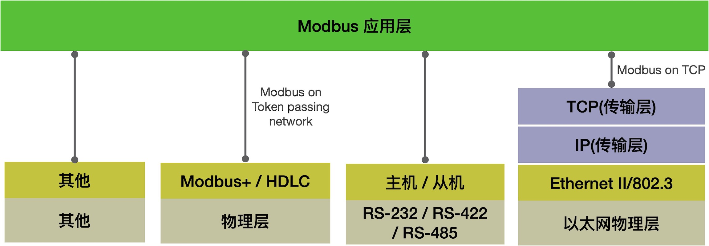
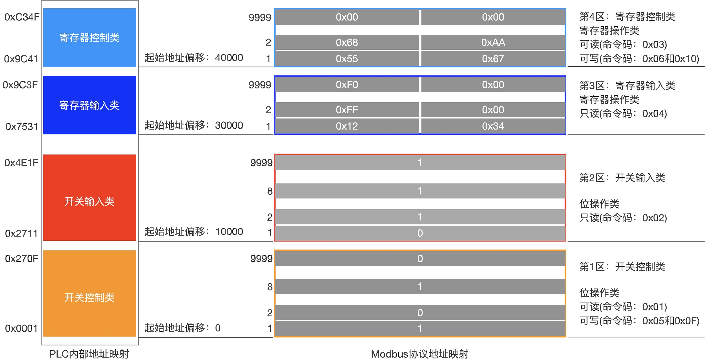
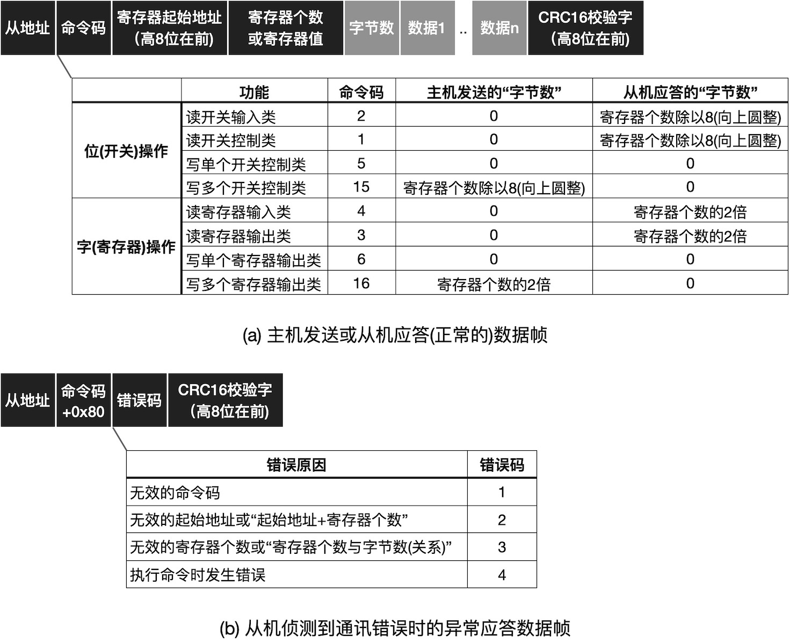

===========================
7.3 串口通讯协议
===========================

前一节中我们已经知道结构化的数据帧是异步串行通讯协议的基本特征之一。事实上，以字节为传输单位的异步串行通讯接口的每一个字节都是结构化的，
必须以起始位开始并以停止位终止一个字节的传输。结构化的数据帧是所有通讯协议的基本特征，无论是面向字节传输或是面向位传输的串行通讯，
结构化的信息不仅能保证收发双发同步，还能实现检错等。

当今最知名的通讯协议是TCP/IP协议，我们每天都在各种计算系统上使用该协议浏览网页、收发邮件、阅读新闻、与朋友交流等。如图7.12所示，
TCP/IP协议将用户层数据流逐层地结构化封装(每一个位都有特定作用)并经由物理层传输到另一个网络设备，TCP/IP网络接收设备将物理层接收到的数据包逐层地剥出用户数据。

.. image:: ../_static/images/c7/tcpip_protocol_datagram_encapsulation.jpg
  :scale: 18%
  :align: center

图7.12  TCP/IP协议的数据报文分层封装(IPv4)

上图可以看出，传输层使用TCP时用户层的最少数据个数为6个字节，使用UDP时最少数据个数是18个字节，然而物理层所传输的字节数至少是64字节(18字节的MAC头部信息和46字节数据)。
结构化的数据帧使得TCP/IP网络设备的发送者和接收者都能准确地封装和剥离前一层的特定信息，用户层软件的数据收发等完全不关心物理层的数据到底有多少个字节，
但不影响用户层数据流的传输。用户层的数据流，一般是两个应用程序之间的通讯，也是需要结构化的，如包含命令、数据长度和数据等，两个应用程序之间才能准确地交换数据。

在工业应用领域最知名的通讯协议之一是Modbus协议 [1]，详细的Modbus协议规范详见文档 [2]_。Modbus协议与TCP/IP协议存在本质区别，
Modbus协议仅仅是一种应用层协议，当我们使用Ethernet、WiFi等物理层时仍可以使用TCP/IP协议栈传输Modbus协议数据包，即Modbus/TCP版本，
TCP/IP协议包含OSI(开放心态互联)模型4层标准，因此Modbus仅仅与HTTP、SMTP、FTP等应用层协议相似。Modbus协议最初是定义是以异步串行通讯接口作为其物理层接口，
包括RS-232、RS-422、RS-485、光纤、无线电等通讯介质，自1.0a版本开始支持TCP/IP协议并以Ethernet作为物理层，Modbus+还支持HDLC(高级数据链路控制)协议(HDLC是一种面向位流的数据链路层协议)。
如图7.13，作为一种应用层协议，Modbus协议支持很多种常用的网络。

图7.13  Modbus协议是一种应用层协议

Modbus最初由Modicon公司(现在是Schneider Electric)于1979年定义，用于可编程逻辑控制器(PLC)之间通讯的目的，后来被广泛应用，还被公认为工业界的一种标准通讯协议。
Modbus是一种主从架构的协议，同一网络内的每个从机设备必须有一个惟一的地址(称作Modbus地址)用于主机寻址，同一个网络内至多有247个从机(有效的从机Modbus地址范围为1~247)，
同一个网络内仅支持一个主机。每一次的Modbus通讯都是由主机发起，被寻址的从机应答，这种“请求-应答”型通讯模式允许Modbus使用全双工或半双工的网络传输数据，
因此Modbus协议能够部署在很多种基础网络上。

Modbus协议是面向PLC通讯应用，协议设计者将PLC内部资源划分为4类：开关控制类、寄存器输出类、开关输入类和寄存器输入类，分别对应于嵌入式系统的DO、DI、AI和AO。
继电器是PLC上典型的开关控制类，主机可以通过Modbus协议控制PLC上的某个继电器线圈通电或断电(即开关控制)，也可以读取某个继电器线圈的状态，
所以此类位信息是可读可写的，Modbus协议按8个此类信息位组成一个字节的形式传输这些位信息。限位开关等是PLC上典型的开关输入类，
主机可以通过Modbus协议从PLC上读取某个或某些按钮的开/关状态，此类位信息是只读型的，Modbus协议要求按8位此类信息位组成一个字节来传输。
Modbus协议要求PLC上寄存器按16位宽度，传输时以高8位在前的规则，其中DAC是典型的寄存器输出类，而ADC则是寄存器输入类。
主机可以通过Modbus协议控制PLC上某个或某些DAC的输出，也可以读取DAC的输入，寄存器输出类显然是可读可写的，而寄存器输入类是只读的。

同时，Modbus协议设计者还将PLC上的4类资源映射到特定的地址空间，与我们在第2章所了解的“存储器映射”机理相似，主机控制某个继电器线圈是通过传输该线圈对应的地址编码给PLC来实现的。
遵循Modbus协议的PLC资源的存储器映射规则如图7.14所示。

图7.14  遵循Modbus协议的PLC资源映射

将PLC上的资源分类并分区映射，执行Modbus协议的网络上的每个PLC具有一个惟一的Modbus地址，主机通过Modbus协议能够精准地访问整个网络内任一继电器、按钮或模拟输入端等。

Modbus协议的数据帧是什么样的结构呢？如图7.15所示。正常情况下，主机发送和从机应答的数据帧的结构如图7.15(a)，黑色色块的信息域是必须存在的，灰色色块的域则根据命令码确定是否存在。
从机接收到主机发送来的数据帧后根据帧结构和各信息域的约束条件侦测是否有误，如果发现错误则给出异常应答帧，如图7.15(b)。

图7.15  Modbus协议的数据帧结构

Modbus协议的数据帧总是以从机地址字节为帧头，16位CRC校验字的低8位为帧尾，每个数据帧的第2个字节必须是命令码(或异常应答帧使用“0x80+命令码”)，
第3和4字节是寄存器的起始地址(有效值为0~9998)的高8位和低8位，第5和6字节是寄存器个数(或寄存器值)的高8位和低8位。此外，寄存器起始地址、寄存器个数和数据的字节数之间必须满足以下约束条件：

  1) 寄存器起始地址的有效值为0~9998
  2) 有效的寄存器个数为1～9999
  3) 有效的寄存器起始地址与有效的寄存器个数之和不大于9999
  4) 对于位(开关)操作类的命令码，数据的字节数必须等于寄存器个数除以8(向上圆整)
  5) 对于字(寄存器)操作类的命令码，数据的字节数必须是寄存器个数的2倍

Modbus协议要求从机根据上述的约束条件侦测数据帧是否有错误，如果发现错误则向主机发送异常应答帧(对应错误码是2、3、4)。
但是，如果从机发现CRC16校验失败则不必给主机任何应答。为什么发现CRC校验失败不必应答而违犯上述数值约束关系则需要发出异常应答？你觉得这样设计的原因有那些。

请注意，上述的Modbus协议并不包含扩展的协议部分，如文件读写、诊断等扩展的协议。在Arduino开源平台使用任一开源板的异步串行通讯接口和Modbus协议即可与PLC通讯，
其中Arduino开源板是Modbus的主机，需要执行Modbus主机协议，在Arduino开源社区有很多种Modbus主机协议的开源项目可用，如 [3]_ 。
当然也可以使用Arduino开源板来模拟PLC，并执行Modbus从机协议，如开源项目 [4]_ ，从而实现两个Arduino开源板通过异步串行通讯接口执行Modbus协议进行通讯。

-------------------------

虽然前面耗费很大篇幅来介绍Modbus协议，仍不能代替Modbus协议的规范(详见文档 [2]_ )，我们的目的是了解Modbus协议的基本数据帧结构，了解该协议的科学性。
当你需要自定义通讯协议时，Modbus协议及其规范是一种很好的参考范例。Modbus协议也是一种开放的应用层协议规范，任何人都可以使用、修改或自定义扩展的Modbus协议。
就像TCP/IP协议一样，大家共同遵循的开放的通讯协议有利于不同厂商的计算机系统之间互联，

除了Modbus协议之外，目前在用的串口通讯协议还有很多种，譬如PROFIBUS(PROcess FIeld BUS)、基金会现场总线FF(Foundation Fieldbus)、HostLink、
MECHATROLINK-II等，他们都可基于双绞线等物理层的RS-232、RS-422或RS-485接口，并使用MCU片上UART功能单元来实现的应用层协议。
使用UART功能单元实现的串口通讯始终以字节数据为最小传输单元，因此上述协议都是面向字节编码的数据流。

此外，CAN(控制器局域网)总线和CANOpen等都是工业界知名的通讯协议。CAN总线也是一种异步串行通讯接口，物理层也仅仅是一对双绞线，但CAN总线的数据帧是面向位编码的数据流，
CAN总线的数据链路层明确地定义数据帧的封装和传输、差错控制等。CAN总线是符合OSI的低层协议，仅包含物理层和数据链路层协议。
CANOpen是构建于CAN总线上的符合OSI的高层协议，与Modbus协议存在本质区别，他包含网络层、传输层和应用层。由于CAN总线属于多主网络，
CAN总线的任一节点都可以主动发起数据传输(在主从网络内仅主机可以发起数据传输)，使用CANOpen协议和CAN总线即可搭建极低成本的局域网(正如其名称的含义)，
这类网络的灵活性能够与Ethernet相媲美，但物理层成本比Ethernet低(一对双绞线vs四对双绞线)且距离更远，而且CAN总线控制器和驱动器的功耗也远低于Ethernet。

目前，CAN控制器就像UART一样几乎是通用的面向工业领域应用的MCU必备的片上功能单元，因为这些通讯接口的半导体实现都非常低，且功耗极低，
他们都适合低波特率(UART支持10Mbps及以下，CAN支持1Mbps及以下)的嵌入式系统的数据传输应用领域。

总之，基于UART功能单元的异步串行通讯接口使用字节编码的数据流，此类网络的数据传输机制绝大多数采用主从模式；基于CAN控制器的异步串行通讯接口使用位编码的数据流，
此类网络的数据传输机制多数采用对等模式。

-------------------------

参考文献：
::

  [1] https://modbus.org/
  [2] https://modbus.org/docs/Modbus_Application_Protocol_V1_1b3.pdf 
  [3] https://github.com/4-20ma/ModbusMaster 
  [4] https://github.com/yaacov/ArduinoModbusSlave
