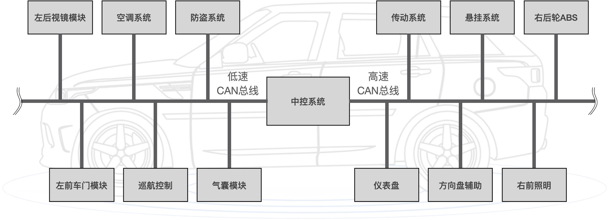
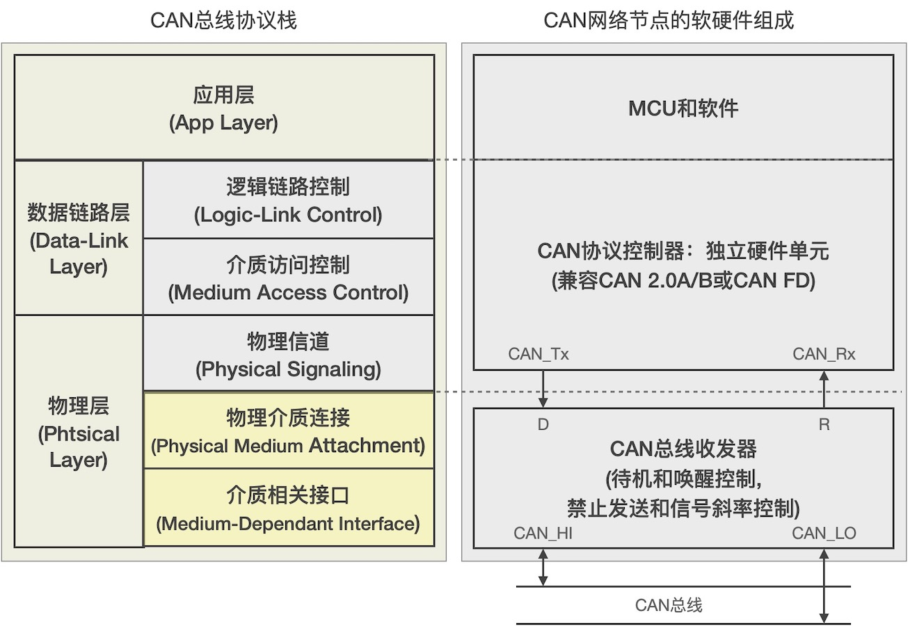
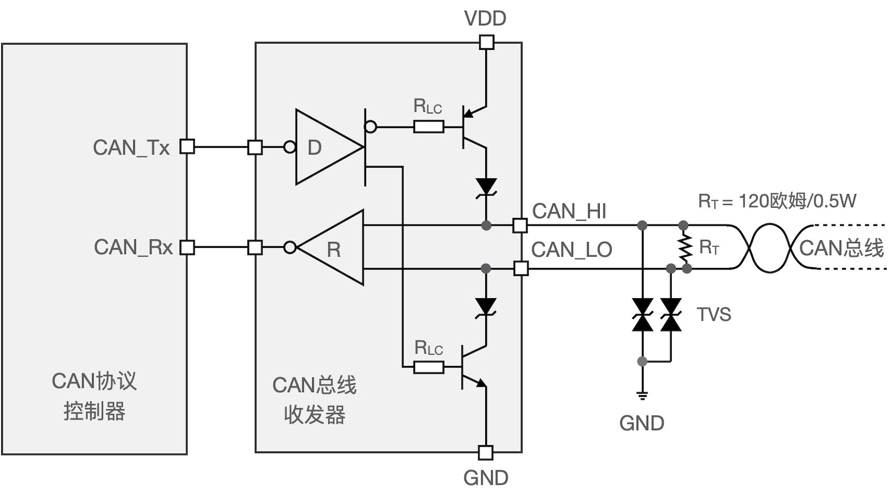
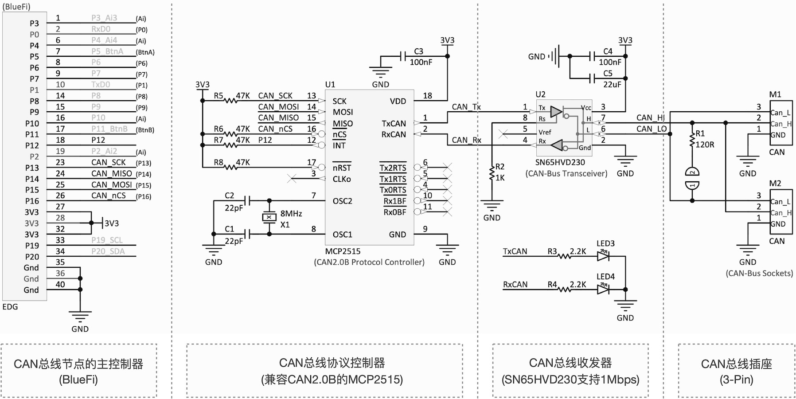
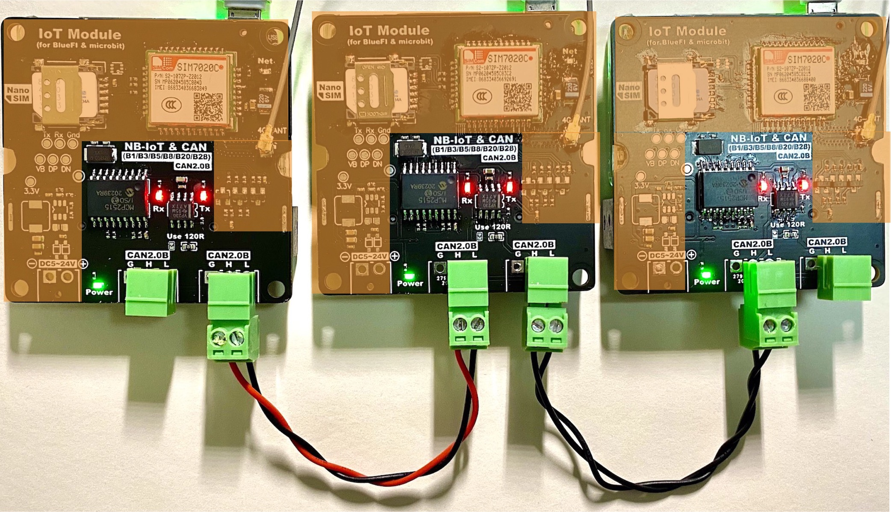

===========================
8.3 CAN总线接口--硬件
===========================

虽然CAN总线目前已应用于工业控制、机器人、医疗器械等领域，汽车控制领域是CAN总线的最大市场。保守地估算，按每辆车30个CAN网络节点，2019年全球汽车产量约9100万辆，
即27.3亿个CAN网络节点。在汽车领域，CAN网络节点被称作ECU(电子控制单元)，譬如汽车左右后视镜就是2个ECU，每个后视镜至少有2个马达(控制镜片绕2个方向旋转)和1个转向指示灯，
在CAN总线引入汽车之前这些ECU单元需要很多根控制信号和供电电缆连接到中控系统，现在CAN总线只需要4根(2根通讯和2根供电)电缆即可将这些ECU连接起来，
不仅降低电缆成本还极大地简化车内布线、维修等。

图8.12  CAN总线在汽车控制系统中的应用

图8.12给出汽车控制系统中典型的CAN总线应用示意图。本质上，每个ECU就是一个车载的嵌入式系统。我们使用“车载的”，因为车载的嵌入式系统与工业级、商业级和消费级嵌入式系统不同，
车用级别的嵌入式系统涉及人身安全且运行环境恶略(如电磁辐射、浪涌电流冲击、静电放电，以及高温、低温、长时间连续运行等)，半导体行业有专门的“车规级”/“汽车级”标准。
上图中标注的“低速CAN总线”和“高速CAN总线”将在下一节的内容中解释，我们在这里只需要知道汽车控制系统的网络分为多种层次。

CAN总线经历数十年的发展已经形成稳定的软硬件设计模型[1]。图8.13是参照CAN总线协议栈的CAN网络节点的硬件设计模型。

图8.13  CAN网路节点的硬件设计模型

目前第一代和第二代的CAN协议控制器均已被硬件化，即独立的集成电路或成熟的硬件功能单元的形态，而且绝大多数面向汽车控制、工业控制、机器人控制、
马达控制等应用领域的MCU和DSP都带有CAN协议控制器。硬化的CAN协议控制器不仅缩短CAN接口产品的设计周期，还能确保CAN总线时序的一致性，
当然硬件成本也非常低，还能降低CAN网络节点的CPU数据处理成本。独立的CAN协议控制器IC有很多种，Intel、NXP、TI、Microchip等知名半导体都有专门的产品线。

值得注意的是，虽然CAN总线的2个信号也是差分的，CAN总线收发器与RS485、RS422等差分信号收发器并不通用，根据前一节知识我们很清楚他们之间的区别。
图8.14给出CAN总线收发器的内部结构及其前后级接口的原理。在RS485等标准差分收发器中，逻辑‘1’和逻辑‘0’(或开路状态)都受驱动器控制，接收状态受控于专用的“enTxD”信号。
在CAN总线范畴，仅发送逻辑‘0’(显性位)时收发器处于受控状态，其他时刻收发器都是三态的(只能接收)。
图8.14所示的CAN总线收发器无需MCU或其他专用逻辑驱动的情况下即可实现这些状态模式。

图8.14  CAN总线收发器的内部原理结构及其前后级接口

CAN总线驱动器也有很多种型号，大多数半导体制造商都有CAN驱动器IC(毕竟每年有27.3亿颗销量的市场)。虽然CAN总线收发器的工作电源和接口逻辑电平电压也有多种，
我们只需要根据所用MCU、CAN协议控制器的I/O电平逻辑来选择即可，因为CAN总线采用差分信号的电压差和阈值来判定高低电平。

对于CAN总线的终端电阻，图8.14中的RT需要注意其功率。根据CAN总线的差分信号接口，当传输显性位‘0’时CAN_HI信号通过内部P型三极管被拉高至VDD，
同时CAN_LO信号被内部N型三极管强制拉低到GND，此时终端电阻两端的电压差是最大的，CAN总线的驱动电流被限制在50mA，那么120欧终端电阻的功率为0.3W(即0.05*0.05*120)，
这意味着至少选择1/3W(1210)或1/2W的规格。

根据CAN网络节点的硬件设计模型，图8.15是基于BlueFi的40P扩展接口的CAN接口的示例电路原理图。

图8.15  CAN网路节点的硬件设计示例：BlueFi-CAN拓展板

在图8.15所示的设计示例中，使用兼容CAN2.0B的独立CAN协议控制器IC——MCP2515，该协议控制器的详细资料链接都页面[2]，在页面[3]将会看到更多中CAN2.0B和CAN FD的独立协议控制器，
对于我们的目的选择使用那种CAN协议控制器并无本质区别，但是作为量产的CAN网络节点产品来说，建议使用兼容CAN FD标准的控制器更为合理。
考虑BlueFi的40P扩展接口仅有3.3V供电电源，而且所有功能扩展接口的逻辑电平电压都采用3.3V，独立的CAN协议控制器MCP2515是一种宽工作电压的IC(允许2.7~5.5V)，
我们可以使用BlueFi的40P扩展接口上的3.3V和GND为其供电，那么CAN总线收发器与CAN协议控制器之间的逻辑接口电压也必须采用3.3V的，
如果CAN总线收发器的工作电压也采用3.3V，意味着我们的CAN接口拓展板采用3.3V单工作电源，这样的设计更为简化。
在页面[4]中我们能找到很多种CAN总线收发器，SN65HVD230是价格较低的一种支持3.3V供电的CAN总线收发器。

图8.15中将完整的CAN拓展板的电路原图分割为4个部分：BlueFi拓展接口、CAN协议控制器、CAN总线收发器和CAN总线接口插座。
由于整个拓展板采用单3.3V供电，这个接口设计变得极为简单。独立的CAN协议控制器使用SPI接口与BlueFi主控制器(nRF52840)连接，
CAN协议控制器与CAN总线收发器之间的连接是常规的，CAN总线接口插座使用易插拔的形式。每个拓展板上都设计2个CAN总线接口插座，
目的是方便连线，三个BlueFi-CAN拓展板之间使用CAN总线通讯的实物连线如图8.16所示。从图8.15可以看出，两个CAN总线接口的插座上的CAN总线信号是相互连通的，
接线时只要注意区分CAN_HI和CAN_LO两个信号即可。

图8.16  三个BlueFi-CAN拓展板之间使用CAN总线通讯的实物连接

由于BlueFi的主控制器(nRF52840)片内没有CAN协议控制器和CAN总线收发器等功能单元，我们使用SPI接口的独立CAN协议控制器IC为BlueFi扩展出CAN接口，
整个CAN拓展板使用单3.3V供电电源使得拓展电路的设计非常简单。

-------------------------

本节以分层的CAN总线协议栈作为对照，引入CAN网络节点的硬件设计模型，并简要分析CAN总线收发器的前后级接口，然后参照硬件设计模型给出BlueFi-CAN拓展板的硬件设计。
虽然我们仅给出一种最简单的兼容CAN2.0B标准的CAN网络节点的硬件设计，而且尽可能地简化电路设计，CAN总线接口方面并未考虑电磁辐射、浪涌电流和静电放电等保护措施。

-------------------------

参考文献：
::

  [1] https://www.ti.com/lit/pdf/sloa101
  [2] https://www.microchip.com/wwwproducts/en/MCP2515
  [3] https://www.microchip.com/ParamChartSearch/Chart.aspx?branchID=1939
  [4] https://www.ti.com/interface/can-lin-transceivers-sbcs/overview.html
  [5] https://www.ti.com/document-viewer/SN65HVD230/datasheet/features-slos3463030#SLOS3463030

