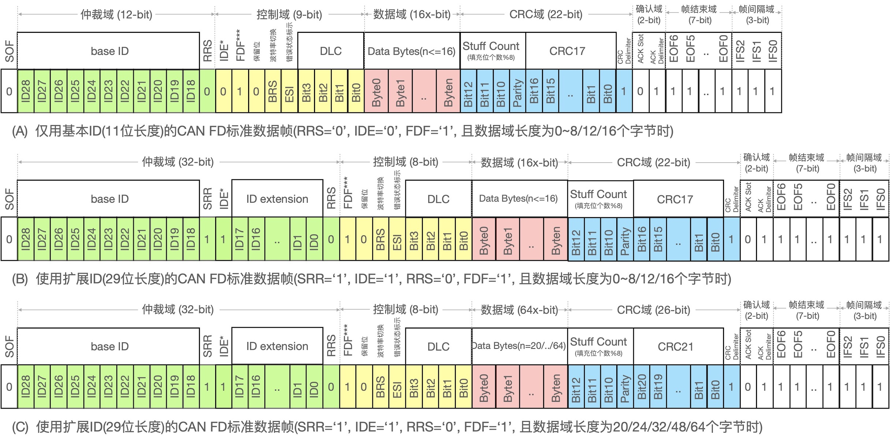

===========================
8.2 CAN总线接口--协议
===========================

这一节我们将详细地了解CAN总线的协议以深入地掌握CAN总线应用和设计。目前CAN总线的标准化被分割成6个部分，即ISO 11898-1~6，
这个6个部分分别对CAN总线的链路层和物理层、高速物理介质附属层、低速物理介质附属层、时间触发的CAN通讯(即TTCAN)、低功耗的高速物理附属层、
可选择性唤醒的高速物理附属层等进行标准化以便于全球CAN网络节点制造商的产品能够相互兼容和互联。这些标准化文档的简介在ISO组织网站 [1]_ 可以搜索到，
CAN网络节点产品的开发者必须仔细阅读这些文档确保自己的产品遵循这些标准。

目前在用CAN总线版本分为2.0A、2.0B、FD，虽然CAN XL已经启动但尚未正式应用，除了已废止的标准，在用的ISO 11898的6个部分分别对这三种版本的低层协议实施标准化。
低层协议仅包括数据链路层(DLL)和物理层(PHY)，CAN总线的高层协议基本上与行业有关。

在8.1节我们从CAN2.0A的一个标准数据帧的位流开始了解CAN总线，现在我们再深入了解CAN2.0A标准的协议。
CAN2.0A标准协议支持4种协议帧：标准数据帧、远程请求帧、错误帧和过载帧，其中错误帧和过载帧都属于容错处理。当数据帧发送节点发送数据期间侦测到数据发送错误，
则发起主动错误帧(由连续6个显性位‘0’代表错误帧标志和连续8个隐性位’1‘代表错误定界符)告知CAN网络上其他节点放弃本次通讯，当数据帧接收者侦测到数据错误时，
则可以直接发出被动错误帧(由连续6个隐性位‘1’代表错误帧标志和连续8个隐性位’1‘代表错误定界符)。当网络接收者侦测到连续的数据帧之间侦测到非法的显性位‘0’时，
则直接发出过载帧(由连续6个显性位‘0’代表过载帧标志和连续8个隐性位’1‘代表过载帧定界符)。根据我们目前对CAN总线的竞争和仲裁方法的认识，被动错误帧不影响数据帧的发送，
过载帧被触发时将会破坏数据帧的发送，这是因为6个连续的显性位‘0’将违反CAN总线的位填充规则，迫使数据帧的发送者停止发送或发起主动错误帧。

CAN总线的错误帧和过载帧的协议设计十分巧妙，使得CAN总线的数据传输效率极高且容错性也很高。事实上，在用的几种CAN总线版本始终沿用CAN2.0A的这种容错处理机制。
图8.6给出CAN2.0A标准的数据帧和远程请求帧，这两种位流是最常用的正常位流。信息发送者使用数据帧将节点数据广播到网络上，其他节点根据消息ID确定是否处理该消息。
某些节点需要主动地从其他节点读取信息时，只需要将远程请求帧(仅包含消息ID且无数据域)广播到网络上，然后具有对应消息ID的CAN网络节点将会发送一个标准的数据帧(包含有远程请求帧ID和数据)，
到网络上，主动发起远程请求帧的CAN总线节点将会收到请求的数据。

图8.6  CAN2.0A协议帧(标准数据帧和远程请求帧的位流格式)

CAN2.0A标准的数据帧和远程请求帧仅支持11位长度的ID，数据域长度为0~8个字节。如图8.6，CAN2.0A标准的数据帧和远程请求帧的主要区别是仲裁域的最后一个位：
RTR(Remote Transmission Request)，标准数据帧中该位是显性的(‘0’)，远程请求帧只能够该位是隐性的(‘1’)。此外，两种数据帧的控制域中4个DLC(Data Length Code)位用来指定数据域的字节个数，
标准数据帧中DLC[3:0]={0, 1, .., 8}，远程请求帧中DLC的4个位都是‘0’表示无数据域。

CAB2.0B标准仅仅是在CAN2.0A的基础上增加消息ID的位长度扩展，2.0B支持29个位长度的ID，同时将仲裁域的位个数也扩展至32个。为什么要扩展ID位长度呢？
CAN总线使用ID和RTR位来竞争和仲裁总线的占用权，并不对CAN网络节点做其他的寻址定义，消息ID就像网络上数据信息的地址资源一样，
按照存储器映射机制，消息ID的二进制位宽度影响CAN网络上所有节点的数据信息总容量。因此，CAN2.0A标准迭代至CAN2.0B本质上是CAN网络上信息总容量的提升。

引入29位的ID扩展之后，CAN2.0B还必须兼容CAN2.0A，即遵循CAN2.B标准的CAN网络节点和早期的CAN2.0A节点能够在同一个CAN网络上安全地传输数据，
这或许是制订CAN2.0B标准时的最大挑战。使用基本ID和ID扩展的CAN2.0B标准的数据帧和远程请求帧的位流格式如图8.7所示。

图8.7  CAN2.0B协议帧(两种ID位长度的标准数据帧和远程请求帧的位流格式)

对于图8.6和8.7的控制域的首位，在CAN2.0A标准的数据帧中该位称作保留位1(RB1)且始终保持为显性的(‘0’)，在CAN2.0B标准的数据帧中该位被称作IDE(IDentifier Extension)。
再来对比图8.7(a)和(b)，我们不难发现IDE位的作用，当遵循CAN2.0B标准的节点使用11位基本ID传送数据时该位保持显性(‘0’)与CAN2.0A标准的数据帧保持一致，
这样的数据帧在两种标准组成的CAN网络上传输时接收者不会有任何歧义；当遵循CAN2.0B标准的节点使用29位长的ID发送数据时该位则变成隐性(‘1’)，
遵循CAN2.0A的网络节点将忽略此类数据帧，遵循CAN2.0B的节点则能够识别这是一个29位长度的ID的数据帧或远程请求帧。

在8.1节中我们仅以CAN2.0A标准的位流来了解CAN总线的竞争和仲裁，把位流中的RB1和RB0两个保留位解释的非常简单，保留位本来是没有特定意义的，
标准中要求这些位保持显性位‘0’，如果CAN2.0A标准的产品开发者随意处理这些保留位，譬如发送者将数据帧中的这些保留位按隐性位‘1’发送，
很显然在两种标准的CAN网络节点共享一个CAN网络时将会引起歧义。CAN2.0A和CAN2.0B是一对非常好的技术迭代和向后兼容的案例，也让我们知道如何正确地处理“目前毫无意义的保留位”。

使用29位长度ID的CAN2.0B标准的数据帧中，如图8.7(b)，仲裁域总共有32个位，即29位ID、1位SRR(Substitute Remote Request，固定为‘1’)、
1位IDE(固定为‘1’代表此帧使用ID扩展)和1位RRS(Remote Request Substitution，RTR的替代位)，其中RRS位与CAN2.0A标准中的RTR位具有同等作用。

除了仲裁域之外，CAN2.0B标准的控制域和数据域等仍保持与CAN2.0A标准一致，而且CAN2.0B标准的控制域仍预留2个固定为‘0’的保留位。
这两种CAN总线标准被广泛使用近20年，CAN2.0A标准随未被弃用但遵循该标准的产品已非常少见。截至目前，CAN FD标准的诞生时间并不长，
ISO 11898-1的2015版本才正式将CAN FD纳入标准并同时废止2003版(仅包含CAN2.0A/B的定义)。相较于之前的2种版本，CAN FD标准的最大变化是增加数据域的字节个数(最大64个字节)和该域的波特率，
而且CAN FD标准不支持远程请求帧。在理论上，CAN FD仍兼容CAN2.0B标准，即支持两种标准的CAN网络节点可以共享同一个CAN网络，
继续保留11位宽度ID的数据帧。

图8.8  CAN FD协议帧(两种ID位长度和数据域长度的标准数据帧的位流格式)

此外，CAN FD标准的数据帧的CRC域也被调整，根据数据域的字节个数(16个字节及以下或20个字节及以上)分别使用17位或21位的CRC域位宽度。
图8.8给出11位宽度ID和29位宽度ID的CAN FD标准的数据帧格式，以及使用29位宽度ID和64个字节数据域的数据帧。

对比图8.7和8.8，CAN FD标准的仲裁域与CAN2.0B完全相同，但两者的控制域变化较大。同样使用11位ID时，在CAN2.0B标准数据帧的控制域的前2个保留位分别是IDE和一个保留位RB0，
但CAN FD标准数据帧的控制域的这两个位分别定义位IDE和FDF(FD Frame)；对于控制域的首个位，使用11位ID意味着IDE位都是‘0’，如果第二个位仍为‘0’则代表CAN2.0B数据帧，
如果第二个位为‘1’则代表CAN FD数据帧；当FDF为‘1’时，即CAN FD标准的数据帧，控制域的后续位将被重新定义。很显然，
使用11位ID时理论上允许CAN2.0B和CAN FD两种节点共享同一个CAN网络。

使用29位ID时，CAN2.0B控制域的2个保留位默认都是‘0’，在CAN FD标准数据帧的控制域中这两个位的首位被定义成FDF，当FDF为‘1’时，即CAN FD标准的数据帧标志位有效，
与CAN20.0B相比较，CAN FD数据帧中控制域的其他位被重新定义，分别为BRS(Bit Rate Switch)和ESI(Error State Indicator)。
BRS位是CAN FD标准数据帧的控制域中新增的一个关键位，当BRS为‘1’时，该位之后且直到CRC界定符之间的每一个位的传输波特率将切换位为8倍速；
顾名思义，ESI位在正常传输时保持‘0’，除非发送节点侦测到错误则将此位发送成‘1’。

值得注意的是，CAN FD标准是首次采用2种不同波特率传输单个数据帧的机制，使用规则是仲裁域到控制域BRS位(包含该位)采用低波特率(兼容CAN2.0B不超过1Mbps)，
BRS位之后直到CRC界定符的所有位采用8倍速传输，确认域、帧结束域和帧间隔域则恢复低波特率传输。CAN FD标准的数据域最长可达64个字节，这是CAN2.0A/B标准的8倍，
如果传输CAN FD标准数据帧时允许使用8倍速传输数据域和CRC域的各位，CAN FD传输64个字节数据时占用CAN总线的时间不大于CAN2.0A/B的8个字节数据域的耗时。
有些文献中称CAN FD标准支持的最大波特率可达10Mbps，事实上这是一种误解。

此外，CAN FD仍使用4个位DLC[3:0]来界定数据域的字节数，但是CAN FD支持最大为64字节的数据域，这是为什么呢？如果采用线性对应关系：(2^DLC的二进制位个数)-1 --> 数据域的字节个数，
对于数据域最大的字节个数为64的情况，合适的DLC的二进制位个数应等于7。事实上，CAN FD协议使用非线性的映射关系：

  1. DLC[3:0] <= 8，数据域的数据个数 = DLC[3:0]字节 (保持线性关系)
  2. DLC[3:0] = 9, 数据域的数据个数 = 12字节
  3. DLC[3:0] = 10, 数据域的数据个数 = 16字节
  4. DLC[3:0] = 11, 数据域的数据个数 = 20字节
  5. DLC[3:0] = 12, 数据域的数据个数 = 24字节
  6. DLC[3:0] = 13, 数据域的数据个数 = 32字节
  7. DLC[3:0] = 14, 数据域的数据个数 = 48字节
  8. DLC[3:0] = 15, 数据域的数据个数 = 64字节

在图8.8中可以看出，CAN FD标准的CRC域也有很大变化，不仅根据数据域的字节数改变CRC算法，还增加4个位(即Stuff Count子域)用于验证该域之前的数据帧中二进制位个数。
Stuff Count的前3个位：Stuff_Count[2:0] = 数据位个数%8(即除以8的余数)的格雷码；第4个位是Stuff_Count[2:0]的奇校验位。增加Stuff Count子域的目的是提升数据帧的检错能力。

格雷码(Grey Code)是一种可靠性较高的绝对编码方式，相邻的两个码之间仅有一个位不同，与其他编码(如连续的二进制编码)相比出错率更低。3位二进制码与格雷码对照关系：

  *  序数：0, 1, 2, 3, 4, 5, 6, 7
  *  3位二进制码：000, 001, 010, 011, 100, 101, 110, 111
  *  3位格雷编码：000, 001, 011, 010, 110, 111, 101, 100

比较三种版本的CAN标准，CAN总线的竞争和仲裁机制始终保持不变，即CAN网络架构始终不变；CAN2.0B标准增加消息ID的二进制位宽度以提升CAN网络上数据信息的总容量；
CAN FD标准将数据域的字节个数提高8倍并支持8倍波特率传输数据域，在不增加CAN数据帧传输时间的条件下将每帧的数据信息提高8倍；CAN FD标准使用改进的CRC域提升数据帧的检错能力。
很显然，CAN标准的每一次迭代的目的都是在信息容量、信息传输效率等方面的提升，这也正是为了满足汽车控制和工业控制等领域不断地提升的信息容量、信息交换速度。

对比三种不同CAN总线标准的数据帧格式，随着信息容量和传输速度不断地提升，数据帧的检错能力也随之提升，数据帧的结构越来越复杂。
尤其新标准向后兼容的需求等会不会使CAN总线的应用软硬件接口设计越来越复杂(兼容更多种标准)呢？不会的。

多种CAN标准的协议控制器都是成熟的硬件功能单元，无论是集成在MCU内部或是独立IC，图8.6～8.8的数据帧都是由协议控制器根据用户程序待传输的消息ID和消息数据自动封装而成的，
用户程序仅仅是把11位或29位宽度的消息ID和对应的消息体数据字节逐个写入CAN协议控制器的发送缓冲区或从接收缓冲区读回RAM的操作。
图8.9给出11宽度或29位宽度消息ID和消息数据封装成CAN2.0B标准的数据帧的操作。

图8.9  消息ID和消息数据如何封装成CAN2.0B标准的数据帧

图8.10给出11位或29位宽度消息ID和消息数据封装成CAN FD标准的数据帧的操作。

图8.10  消息ID和消息数据如何封装成CAN FD标准的数据帧

对于MCU片内的CAN协议控制器单元，消息ID和消息体数据缓冲区都是MCU片上外设的存储器单元，消息ID和消息体的读回(接收)/写入(发送)操作都是存储器单元的读写操作。
如果使用独立的CAN协议控制器IC，该IC可通过高速SPI、UART或并行总线接口与主MCU连接(片外功能单元的扩展)，
CAN总线的配置(消息ID的位宽度、波特率等)、发送缓冲区和接收缓冲区等都将被映射成寄存器，消息ID和消息体数据的读写操作本质上是通过SPI、UART或并行总线读写这些寄存器。

后续的两个小节中将分别介绍独立的CAN协议控制器的硬件和软件接口设计。

-------------------------

参考文献：
::

..  [1] https://www.iso.org/
