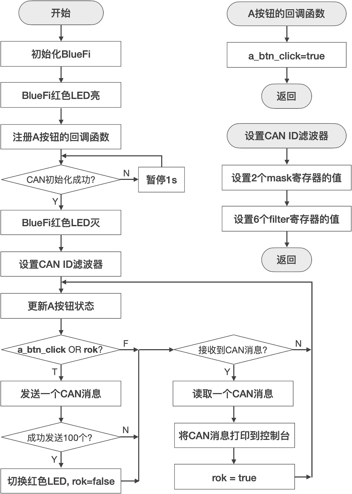

================================
8.4 CAN总线接口--软件编程及应用
================================

本节将使用前一节的CAN节点硬件接口示例来了解CAN总线的软件接口和编程应用。首先运行一个示例程序演示CAN总线通讯的效果，
然后分析CAN接口库的框架和接口的用法，初步了解CAN总线接口的配置、消息收发机制和软件编程应用。

运行CAN总线接口示例程序的硬件如图8.19所示。这是BlueFi的一种扩展板，图8.19(A)是该扩展板的实物照片，图8.19(B)是硬件功能结构和引脚资源占用说明。
该扩展板不仅由一个CAN总线接口，还带有一个NBIoT模块用于实现3G和4G蜂窝网的数据通讯，这部分蜂窝网通讯接口将在后续的内容中用到。
这个扩展板适合多种领域的物联网(IoT)应用，所以称这个扩展板为“IoT模块”。

.. image:: ../_static/images/c8/canbus_two_bluefis_iot_module.jpg
  :scale: 25%
  :align: center

图8.19  BlueFi的一种扩展板——IoT模块

IoT模块使用BlueFi的P13~P15等3个引脚分别作为SPI接口的SCK、MISO和MOSI信号，P16作为SPI的NSS片选信号，P12引脚作为MCP2515的中断请求信号。
也就是说IoT模块占用BlueFi的金手指上的5个扩展连接引脚。我们至少需要2个IoT模块和2个BlueFi来运行本节的示例程序，
如果你打算使用相似的硬件功能单元来运行示例程序，请务必根据硬件接口和资源占用情况修改本节的示例代码以及所用的接口库代码。

我们首先按照图8.19(A)所示的连接方法将两个插有BlueFi的IoT扩展板的CAN总线连接起来。请注意“CAN_H”与“CAN_L”两个信号不能交叉。
然后下载本节使用到的所有源文件和示例程序。

为了便于测试，请先删除“../Documents/Arduino/libraries/BlueFi”文件夹中的全部文件，然后下载下面的压缩文件包，
并解压到“../Documents/Arduino/libraries/BlueFi”文件夹中，

. :download:`本节内容所用到的BlueFi的BSP源文件 <../_static/dl_files/bluefi_ch8_4/BlueFi_bsp_ch8_4.zip>`

再下载下面的压缩包，即“CAN_MCP2515.zip”文件，然后将该压缩包解压到“../Documents/Arduino/libraries/”文件夹中，

. :download:`Arduino平台的MCP2515库文件 <../_static/dl_files/bluefi_ch8_4/CAN_MCP2515.zip>`

接着下载下面的压缩包，即“bluefi_nrf52840.zip”文件，其中的两个文件是BlueFi在Arduino平台的引脚定义，将该压缩包解压到RF52的Arduino安装路径的变种文件夹，
即“../Arduino/packages/adafruit/hardware/nrf52/0.21.0/variants/”文件夹，并覆盖该文件夹中已有的“bluefi_nrf52840”文件夹，

. :download:`BlueFi的兼容Arduino的引脚定义文件 <../_static/dl_files/bluefi_ch8_4/bluefi_nrf52840.zip>`

上述3个压缩包分别是BlueFi的BSP文件、CAN总线接口库文件(使用MCP2515)和BlueFi的兼容Arduino的引脚定义文件，
直接使用这些源文件可以快速搭建BlueFi和IoT扩展板的CAN总线通讯测试环境，当然你也可以自行修改这些源码以及对应的示例程序实现其他功能。

上述的软硬件准备工作完毕后，我们现在使用Arduino IDE可以打开“../Documents/Arduino/libraries/CAN_MCP2515/examples/transceiver_bluefi/transceiver_bluefi.ino”源文件，
并将BlueFi和IoT模块与电脑USB端口连接好，点击编译并下载，我们即可将第一个示例程序下载到两个BlueFi的FlashROM中。

如果你不打算编译和修改示例程序，可以直接将“../Documents/Arduino/libraries/CAN_MCP2515/examples/transceiver_bluefi/transceiver_bluefi.uf2”文件拖放到BLUEFFIBOOT磁盘即可。
还记得如何把连接到电脑的BlueFi映射成名称为“BLUEFIBOOT”的磁盘吗？(用USB数据线将BlueFi和电脑连接好之后，双击BlueFi的复位按钮，
BlueFi的5颗彩灯全部亮绿色同时电脑的资源管理器中将出现BLUEFIBOOT磁盘)。

两个BlueFi一旦开始运行示例程序，打开与BlueFi连接的电脑上Arduino IDE的串口监视器(即控制台)，然后按下任一BlueFi的A按钮，
我们将会再串口监视器上看到下面的信息：

.. code-block::  C
  :linenos:

  ..
  -------------- Got a message, ID: 0x401
  rData:0x31 0x32 0x33 0x34 0x35 0x36 0x37 0x38 , T:206.000s
  Successed to send a message
  -------------- Got a message, ID: 0x401
  rData:0x31 0x32 0x33 0x34 0x35 0x36 0x37 0x38 , T:206.003s
  Successed to send a message
  -------------- Got a message, ID: 0x401
  rData:0x31 0x32 0x33 0x34 0x35 0x36 0x37 0x38 , T:206.006s
  Successed to send a message
  -------------- Got a message, ID: 0x401
  rData:0x31 0x32 0x33 0x34 0x35 0x36 0x37 0x38 , T:206.009s
  Successed to send a message
  ..
  -------------- Got a message, ID: 0x401
  rData:0x31 0x32 0x33 0x34 0x35 0x36 0x37 0x38 , T:206.999s
  Successed to send a message
  ..

显然这些是3行打印信息的不断重复，但是“T:xxx.xxxs”中的数值是变化的，而且相邻两个重复信息中的这个值相差大约0.003s。
3行重复信息的第1行提示“收到一个CAN消息”且打印该消息的ID；第2行提示收到的CAN消息中的8字节数据“rData:..”和收到该消息时系统的累计运行时间“T:xxx.xxxs”;
第3行提示“成功地发送一个CAN消息”。根据这些提示我们不难发现，两个BlueFi通过IoT模块上的CAN总线连接起来，每3ms收发一对CAN消息。
同时，我们可以观察到BlueFi的红色LED指示灯不断地闪烁。如果我们将连接两个IoT模块的CAN总线插头拔掉一个，BlueFi的红色LED停止闪烁，
再将插头插回去后这个红色LED接着闪烁。拔掉插头则意味着断开两个IoT模块的CAN总线连接。

上述的CAN总线测试可以初步了解CAN总线的容错能力、可靠性和通讯速度。对照上述的运行效果，现在我们来查看示例代码：

.. code-block::  C
  :linenos:

  #include <can_mcp2515.h>
  #include <BlueFi.h>
  MCP_CAN can_bus(16);  // specify CS pin of MCP2515
  unsigned long myid = 0x401;
  unsigned char rlen=0, rbuf[8] = {0x0,0x0,0x0,0x0,0x0,0x0,0x0,0x0};
  unsigned char tcnt=0, tbuf[8] = {0x31,0x32,0x33,0x34,0x35,0x36,0x37,0x38};

  void set_id_filter(void) {
    // set mask, set both the mask to 0x3ff, the MSB of ID may be '0', or '1'
    can_bus.init_Mask(0, 0, 0x3ff); // there are 2 mask in mcp2515, we need to set both of them
    can_bus.init_Mask(1, 0, 0x3ff);
    // set filter, we can receive id from 0x001~0x006 or 0x401~0x406 only
    can_bus.init_Filter(0, 0, 0x001); // there are 6 filter in mcp2515
    can_bus.init_Filter(1, 0, 0x002);
    can_bus.init_Filter(2, 0, 0x003);
    can_bus.init_Filter(3, 0, 0x004);
    can_bus.init_Filter(4, 0, 0x005);
    can_bus.init_Filter(5, 0, 0x006);
  }

  bool a_btn_clicked = false;
  void cbf_a_btn_click(Button2& btn) {
    a_btn_clicked = true;
  }

  void setup() {
    bluefi.begin();
    bluefi.redLED.on();
    bluefi.aButton.setClickHandler(cbf_a_btn_click);
    while (CAN_OK != can_bus.begin(CAN_500KBPS)) {
      Serial.println("CAN BUS FAIL!");
      delay(1000);
    }
    bluefi.redLED.off();
    Serial.println("CAN BUS OK!");
    set_id_filter();
  }

  void loop() {
    static bool rok = false;
    bluefi.aButton.loop();
    if ( (a_btn_clicked) || (rok) ) {
      uint8_t tv = can_bus.sendMsgBuf(myid, 0, sizeof(tbuf), tbuf);
      switch (tv) {
        case CAN_OK:             Serial.println("Successed to send a message"); break;
        case CAN_GETTXBFTIMEOUT: Serial.println("Failed to send [error to get TxBuf]"); break;
        case CAN_SENDMSGTIMEOUT: Serial.println("Failed to send [timeout of sending]"); break;
        default: Serial.println("Failed to send [unknown error]"); break;
      }
      if ( ((tcnt++)>100) && (tv==CAN_OK) ) {
        bluefi.redLED.toggle();
        tcnt = 0;
      }
      a_btn_clicked = false;
      rok = false;
    }
    if( CAN_MSGAVAIL == can_bus.checkReceive() ) {
      can_bus.readMsgBuf(&rlen, rbuf);
      unsigned long rid = can_bus.getCanId();
      String _pstr = "-------------- Got a message, ID: 0x" + String(rid, HEX);
      Serial.println(_pstr);
      _pstr = "Data: ";
      for(int i = 0; i<rlen; i++)
          _pstr += "0x" + String(rbuf[i], HEX) + " ";
      Serial.println(_pstr + "T:" + String(millis()/1000.0, 3) + "s");
      rok = true;
    }
  }

除了Arduino程序的初始化函数“setup()”和主循环函数“loop()”之外，示例代码还包含“void set_id_filter(void)”子程序用于设置CAN协议控制器——MCP2515的ID滤波器，
以及“void cbf_a_btn_click(Button2& btn)”回调函数。在初始化函数“setup()”的最后一步调用“void set_id_filter(void)”子程序，
在该子程序中分别对MCP2515的两个mask寄存器和6个filter寄存器进行设置，以限制MCP2515仅接收ID为0x001~0x006和0x401~0x406的CAN消息，
关于CAN ID滤波器的mask和filter的用法稍后在解释；在初始化函数“setup()”中已经将“void cbf_a_btn_click(Button2& btn)”子程序注册为BlueFi的A按钮的回调函数，
在程序运行期间当我们按下A按钮时将自动执行该回调函数，这个回调函数仅一行语句，即将变量“a_btn_click”赋值为“true”。

为了更好地理解这个示例程序的代码，对应的程序流程见图8.20。

图8.20  CAN总线通讯示例程序流程

可以看出，在示例程序的主循环中首先调用“bluefi.aButton.loop()”更新BlueFi的A按钮的状态，期间如果A按钮被按下则自动执行我们已经注册的回调函数“void cbf_a_btn_click(Button2& btn)”;
然后判断变量“a_btn_clicked”或“rok”是否为“true”，如果“是”则调用“can_bus.sendMsgBuf(myid, 0, sizeof(tbuf), tbuf)”函数发送一个CAN消息(这个CAN消息的ID和内容分别由变量“myid”和“tbuf”指定)，
然后检查是否发送成功，如果发送成功发送且达到100个消息则调用“bluefi.redLED.toggle()”函数切换BlueFi的红色LED状态并清除发送消息的计数器(即变量“tcnt”)；
最后调用“can_bus.checkReceive()”函数并根据其返回值侦测是否接收到CAN消息，如果是则读取这个消息并打印到串口控制台，并将变量“rok”设置为“true”。

根据主循环流程的分析，我们可以看出给两个BlueFi上电或复位后BlueFi的红色LED是熄灭的状态，按下任一A按钮后红色LED开始闪烁，
每个闪烁周期内两个BlueFi已经通过CAN总线收发200对消息。在任一BlueFi上，按下A按钮或收到一个CAN消息则立即发送一个CAN消息，
A按钮就像一个触发开关，只要按下一次BlueFi立即发送一个CAN消息，当另一个BlueFi收到这个消息后立即发送一个消息，如此一来两个BlueFi就像打乒乓球一样“你发我收，我发你收”地重复进行下去，
随着测试时间的延长会不会出现“球丢了”的失误呢？很显然，任一一个消息丢失将会造成某个BlueFi不能接收到消息而终止通讯。

如果你能够修改和重新编译示例代码，可以尝试修改第4行的变量“myid”的赋值，修改为之外的任意值，
该变量的数据类型虽然是32位无符号整型数，根据CAN标准的ID域的有效位数：11位(CAN2.0的标准ID)和29位(扩展ID)，请选择合适的数值。
譬如我们修改“myid=0x409”，保持代码并重新编译和下载示例程序到两个BlueFi，其他保持不变再次测试两个BlueFi之间的CAN总线通讯，
不仅看不到上述的现象(红色LED闪烁，接收到消息的打印信息等)，虽然看到“Successed to send a message”打印信息但怀疑CAN总线并未发送成功。
事实上，按下某个BlueFi的A按钮后一个ID为0x409的CAN消息理解被发送到CAN总线上，另一个IoT模块的MCP2515也能够收到这个消息，
但是我们的示例程序却收不到该消息，主要原因是MCP2515的ID滤波器在起作用：仅接收ID为0x001~0x006和0x401~0x406这12种消息，
0x409显然不在这个有效范围内。这就是说，配置ID滤波器可以让MCP2515帮助我们的程序忽略掉大部分ID的消息，仅接收我们想要的消息，
这可以有效地提升CAN协议控制器和MCU/SoC之间的数据传输效率，也能节约MCU/SoC的时间。

几乎所有的CAN协议控制器都支持ID滤波器功能，而且都采用mask和filter两种配置寄存器，不同的CAN协议控制器的惟一区别是mask和filter寄存器的个数。
如何使用ID滤波器的mask和filter呢？对于11位的ID，可接受的ID必须满足等式“(~(filterValue ^ ID) | (~(maskValue & 0x7FF)))=0x7FF” (注：“～”表示反码运算；“^”表示异或运算；“&”表示与运算；“|”表示或运算)，
即可接受的ID包括：

  -  (~(maskValue & 0x7FF) | filterValue)
  -  ( (maskValue & 0x7FF) & filterValue)

对于29位的扩展ID，可接受的ID必须满足等式“(~(filterValue ^ ID) | (~(maskValue & 0x1FFF-FFFF)))=0x1FFF-FFFF” ，即可接受的ID包括：

  -  (~(maskValue & 0x1FFF-FFFF) | filterValue)
  -  ( (maskValue & 0x1FFF-FFFF) & filterValue)

对于具有m个mask和n个filter寄存器的CAN协议控制器，需要根据上述两种情况分别计算，可以确定2*m*n个(或类)可接受的ID。对于目标ID的任一一个位，可接受的条件如下表所示：

当消息ID的所有位都完全满足上标的可接受位的条件时，CAN协议控制器才会将该消息缓存供应用程序读取该消息。

在上面示例中，MCP2515具有2个mask寄存器和6个filter寄存器，我们想2个mask寄存器写入同一值0x3FF，向6个filter寄存器分别写入“1~6”，
根据上面的可接受ID的计算规则，可确定：

  -  (~(0x3FF & 0x7FF) | [0x001,0x002,0x003,0x004,0x005,0x006]) = [0x401,0x402,0x403,0x404,0x405,0x406]
  -  ( (0x3FF & 0x7FF) & [0x001,0x002,0x003,0x004,0x005,0x006]) = [0x001,0x002,0x003,0x004,0x005,0x006]

这些逻辑运算的结果即可说明“myid=0x409”时示例程序不能呈现最初的效果。

根据可接受ID的计算规则，如果将mask寄存器的每一个位都设置为‘1’时，则只能接收由filter寄存器指定的ID；如果将mask寄存器的每一个位都设置为‘0’时，
则所有ID都是可接受的。

现在我们需要来看一看上面示例中用到的CAN总线接口库，图8.21给出“../Documents/Arduino/libraries/CAN_MCP2515/”库文件夹中的主要文件说明，
除了上面使用过的“transceiver_bluefi”示例程序之外，在“examples”子文件夹中还有其他一些示例程序。这个使用SPI接口扩展的MCP2515的CAN总线接口库的源文件在“src”子文件夹中，
其中包含3个源文件，“mcp2515_dfs.h”指定MCP2515内部寄存器映射关系，“can_mcp2515.cpp”是接口库的源文件，“can_mcp2515.h”是接口库的头文件，
这个库的所有接口都可以在这个头文件中找到。

.. image:: ../_static/images/c8/canbus_software_if_library_files.jpg
  :scale: 25%
  :align: center

图8.21  CAN_MCP2515接口库文件夹的结构和主要源文件

这个CAN总线接口库依然使用分层抽象和封装的思路进行设计，其层次结构如图8.22所示。作为BlueFi一种功能拓展板，板上MCP2515通过SPI接口与BlueFi的主控制器连接，
软件接口库的底层必须使用SPI通讯接口访问MCP2515的内部寄存器，从CAN总线配置到收发CAN消息等操作实际上都是在访问(读/写)MCP2515内部寄存器。
图8.22中也给出了使用MCU/SoC片上CAN协议控制器的情况，此时我们无需使用SPI接口则根据MCU/SoC的相关文档确定CAN协议控制器的寄存器映射直接访问MCU/SoC的相关寄存器即可。
面向用户层的CAN总线接口应包含配置接口、发送CAN消息的接口、接收CAN消息的接口等。

.. image:: ../_static/images/c8/canbus_if_software_structure.jpg
  :scale: 25%
  :align: center

图8.22  CAN总线接口库的层次结构

打开“../Documents/Arduino/libraries/CAN_MCP2515/src/can_mcp2515.h”文件，我们可以清晰地看到“MCP_CAN”类的“public”域包含以下接口：

.. code-block::  C
  :linenos:

  MCP_CAN(byte _CS);
  byte begin(byte speedset);
  byte init_Mask(byte num, byte ext, unsigned long ulData);
  byte init_Filter(byte num, byte ext, unsigned long ulData);
  byte sendMsgBuf(unsigned long id, byte ext, byte rtr, byte len, byte *buf);
  byte sendMsgBuf(unsigned long id, byte ext, byte len, byte *buf);
  byte readMsgBuf(byte *len, byte *buf);
  byte readMsgBufID(unsigned long *ID, byte *len, byte *buf);
  byte checkReceive(void);
  byte checkError(void);
  unsigned long getCanId(void);
  byte isRemoteRequest(void);
  byte isExtendedFrame(void);

第1个接口是构造函数，输入参数用于指定SPI接口的NSS片选信号的引脚，在上面示例程序中我们传入的参数为16，即BlueFi的P16引脚与MCP2515的片选信号连接，
从图8.19和前一节的图8.15都可以确定。

第2个接口“byte begin(byte speedset)”是初始化CAN总线的操作，输入参数用于指定CAN总线的波特率，可用的CAN总线波特率共16种，
在“../Documents/Arduino/libraries/CAN_MCP2515/src/mcp2515_dfs.h”文件中的第275～292行定义。调用该接口时将会对MCP2515的某些寄存器(如波特率配置寄存器)进行读写操作，
如果这些读写操作都是成功的则返回“CAN_OK”，否则返回可能的错误原因对应的错误编码值(见“../Documents/Arduino/libraries/CAN_MCP2515/src/mcp2515_dfs.h”文件中的第294～302行的定义)。
在上面示例程序的初始化函数“setup()”中有一个“while”语句来判断CAN总线的初始化是否成功，如果我们未将BlueFi和IoT模块正确连接好并对他们通电，
我们的程序将停留在初始化的这个操作，很显然这属于硬件故障，无法进一步实现CAN总线通讯，程序停留在这一步是正常的设计。

第3个和第4个接口用于配置MCP2515的mask和filter寄存器，即ID滤波器的配置操作接口。每个接口的三个参数分别是寄存器的编号、是否是扩展ID和寄存器值。
MCP2515仅有2个mask寄存器其编号分别为0和1，6个filter寄存器的编号分别为0~5。“是否扩展ID”的参数为0时表示标准ID(即11位)，为1时表示扩展ID(即29位)。

第5个和第6个接口都是发送一个CAN消息的操作，区别是第5个接口可以发送一个远程请求帧(参数“rtr”设为1时)，第6个接口只能发送标准的CAN2.0B消息。
这两个接口的输入参数还有“id”、“ext”、“len”和“*buf”分别指定待发送的CAN消息的ID、是否是扩展ID、数据域的字节个数和数据指针。
根据这两个接口的返回值可以确定发送是否成功，如果发送成功则返回值为“CAN_OK”，否则返回可能的错误原因对应的错误码(见“../Documents/Arduino/libraries/CAN_MCP2515/src/mcp2515_dfs.h”文件中的第294～302行的定义)。

第7个和第8个接口都是用于从MCP2515读取一个接收到的CAN消息，两个接口的输入参数“*len”和“*buf”分别为返回值的两个指针，用来保存接收到的CAN消息的数据域的字节个数和数据，
第8个接口还有一个“*ID”的指针，用来保存接收到的CAN消息的ID值。第7个接口虽然没有ID参数，但可以单独使用第11个接口，即“unsigned long getCanId(void)”单独地获取当前接收到的CAN消息的ID。
第11个接口在不使用CAN消息的ID滤波器时很有意义，当有CAN消息接收到首先读取该消息的ID，如果该ID的消息可以忽略则不必读取消息的数据。

第9个接口是询问MCP2515是否接收到CAN消息，当调用该接口时的返回值为“CAN_MSGAVAIL”时表示已收到新的CAN消息。在上面的示例程序中我们在主循环中使用这个接口查询是否收到CAN消息，
如果该接口返回值为“CAN_MSGAVAIL”则调用“unsigned long getCanId(void)”接口读取消息的ID并打印到控制台，然后再调用“byte readMsgBuf(byte *len, byte *buf)”获取该消息的数据域的内容。

第10个接口用于查询当前的错误原因，该接口的返回值是错误原因对应的错误码。第11个接口用于查询当前接收到的CAN消息的ID。
第12个接口用于查询当前接收到的CAN消息是否为远程请求帧。第13个接口用于查询当前接收到的CAN消息的ID是否是29位的(即扩展ID)。

使用这12个接口函数，我们可以对CAN总线接口进行初始化和配置(波特率、ID滤波器等)，发送标准ID的或扩展ID的数据帧或远程帧，接收标准ID的或扩展ID的数据帧或远程帧。
当然所有的CAN消息的数据域都是采用C语言的基本数据类型——数组来保存，这个CAN总线接口库也并未使用任何高级的数据结构。

从CAN总线通讯的应用角度，总线上的任一节点需要实现的标准ID的或扩展ID的数据帧的收发，或者向总线上其他节点发送远程请求帧，或者响应其他节点发起的远程请求帧等功能。
使用本节的CAN总线接口库，我们可以设计很多种CAN总线通讯的应用系统。上面示例仅仅是2个节点通讯，如果我们有3个或更多个CAN节点连接在一个CAN总线上，
如何修改上面的示例程序实现这些节点之间的通讯。具体要求如下：

  - 某3-DoF机械手的3个关节马达控制器和主控制器之间采用CAN2.0B总线连接(即4个节点)，并使用标准ID
  - 主控制器产生ID为0x7F0且数据域仅1个字节，该字节为0x0表示关节停止运动、0x01则允许关节根据指令运动
  - 主控制器根据接收到的ID为0x7F1/2/3判断3个关节马达控制器是否与总线连接
  - 当主控制器上A按钮按下时增加3个关节的角位移(增量为某个固定值)并发出消息给关节马达控制器
  - 当主控制器上B按钮按下时减小3个关节的角位移(增量为某个固定值)并发出消息给关节马达控制器
  - 主控制器产生ID为0x3F1且数据域前后各4个字节分别指定关节1的关节角位移和最大角速度
  - 主控制器产生ID为0x3F2且数据域前后各4个字节分别指定关节2的关节角位移和最大角速度
  - 主控制器产生ID为0x3F3且数据域前后各4个字节分别指定关节3的关节角位移和最大角速度
  - 关节1接收到ID为0x7F0的CAN消息时设定为停止、运行状态，并发送ID为0x7F1且空数据域的消息
  - 在运行状态，如果关节1收到ID为0x3F1的消息后，根据数据域的运动参数完成伺服定位后立即发送ID为481且数据域前后4个字节分别指定关节1的故障码和当前实际角位移
  - 关节2接收到ID为0x7F0的CAN消息时设定为停止、运行状态，并发送ID为0x7F2且空数据域的消息
  - 在运行状态，如果关节2收到ID为0x3F1的消息后，根据数据域的运动参数完成伺服定位后立即发送ID为482且数据域前后4个字节分别指定关节2的故障码和当前实际角位移
  - 关节3接收到ID为0x7F0的CAN消息时设定为停止、运行状态，并发送ID为0x7F3且空数据域的消息
  - 在运行状态，如果关节3收到ID为0x3F1的消息后，根据数据域的运动参数完成伺服定位后立即发送ID为483且数据域前后4个字节分别指定关节3的故障码和当前实际角位移

根据这些具体要求(每个CAN总线节点的行为描述)分别定义主控制器和关节马达控制器的软件功能，CAN总线的初始化和正确的配置可以提高节点的通讯效率。
譬如对于关节1的马达控制器，当接收到ID为0x7F0的消息后根据数据域的值确定故障状态，并发送一个ID为0x7F1的空消息；
当收到ID为0x3F1的消息后如果在工作状态则根据参数控制马达运动并在完成后立即发送一个ID为0x481的消息，该消息的数据域来指定故障码和当前实际的角位移。
对于主控制器来说，通过发送ID为0x7F0的消息后侦听ID为0x7Fx(x=1,2,3)消息判断关节控制器的连接是否完好并启动/停止关节；
通过发送ID为0x3Fx(x=1,2,3)消息控制各关节的运动和运动参数，并侦听ID为0x48x(x=1,2,3)消息来判断各关节的执行结果，
如果ID为0x48x(x=1,2,3)消息的数据域中的实际角位移与设定的角位移之间偏差较小则表示该关节运动正常结束，
否则句数据域中的故障码确定故障原因(电机堵转、参数错误等)。

-------------------------

接下来我们使用CP2515的Python库、BlueFi的Python解释器和Python语言来了解CAN总线通讯的更多细节。我们知道，使用Python脚本语言可以避免长时间的编译和下载过程，
在需要频繁修改代码的调试和测试阶段，Python语言具有更高的效率。

当我们通过Arduino IDE编译和下载程序到BlueFi时，BlueFi的Python解释器固件已经被覆盖，如果需要恢复到Python解释器模式，
请使用USB数据线将BlueFi与电脑连接好，并双击BlueFi的复位按钮，当电脑资源管理器中出现BLUEFIBOOT磁盘时，将Python解释器固件拖放到BLUEFIBOOT磁盘即可恢复BlueFi的Python解释器。
当CIRCUITPY磁盘出现时，我们会发现之前的Python库、Python资源文件和code.py等文件都完好无损地保存着。具体的恢复过程请参考第4.1节最后一部分内容。

在使用BlueFi、IoT模块和Python语言实现CAN总线通讯之前，请下载下面的压缩包到本地电脑上，这是MCP2515的Python库源码文件，

. :download:`mcp2515的Python库源码文件 <../_static/dl_files/bluefi_ch8_4/hiibot_mcp2515.zip>`

解压后请将整个库文件夹拖放到CIRCUITPY磁盘的lib文件夹中，即“/CIRCUITPY/lib/”。然后打开“/CIRCUITPY/lib/hiibot_mcp2515/”文件夹，
可以看到4个“.py”后缀的文件，包括“mcp2515.py”、“canio.py”、“can_timer.py”等，这些都是脚本源码，允许我们使用任意文本编辑器修改这些库文件。

这些准备工作完毕后，我们首先运行一个示例程序，

.. code-block::  python
  :linenos:

  import time
  from hiibot_mcp2515.canio import Message
  from hiibot_mcp2515.mcp2515 import MCP2515 as CANBus
  ''' TODO: parameters of CANBus
      CANBus(baudrate, loopback, silent, debug)
          default: baudrate = 250000, 
                  loopback = False, # True (selftest, silent=True)
                  silent = False,   # True (as a can bus monitor)
                  debug = False,    # True (print all message)
  '''
  can_bus = CANBus(loopback=True, silent=True) 
  listener = can_bus.listen(timeout=0.1)

  def listenMessage():
      message_count = listener.in_waiting() # get message number
      if message_count>0:
          inMessage = listener.receive()
          return inMessage
      else:
          return None

  def sendMessage(message_id, message_data):
      message = Message(message_id, data=message_data)
      if can_bus.send(message):
          print("Successfully send one message")
      else:
          print("Failed to send")

  sendNoCnt = 0
  sendDlyCnt = 0
  while True:
      time.sleep(0.001)
      inMsg = listenMessage()
      if inMsg is not None:
          print("received: ID=", hex(inMsg.id), ", DATA {", str(inMsg.data, 'utf-8'), "}")
      sendDlyCnt += 1
      if sendDlyCnt>10:
          sendDlyCnt = 0
          outMsg = 'No: ' + str(sendNoCnt%10000)      # a string
          sendMessage(0x407, bytes(outMsg, 'utf-8'))  # b'No: xxxx'
          sendNoCnt += 1

使用复制-粘贴等操作将这个示例程序源码保存到CIRCUITPY磁盘的根目录中的code.py文件，请注意Python脚本语言的程序块对齐以避免错误。
或者打开MU编辑器，将这个示例代码粘贴到MU编辑器的新建文件中，并调整程序块的对齐，然后保存到CIRCUITPY磁盘的根目录中的code.py文件。
运行示例程序期间请打开MU的“串口”控制台，我们将会看到以下的提示：

.. code-block::  python
  :linenos:

  Successfully send one message
  received: ID= 0x407 , DATA { No: 0 }
  Successfully send one message
  received: ID= 0x407 , DATA { No: 1 }
  Successfully send one message
  received: ID= 0x407 , DATA { No: 2 }
  Successfully send one message
  received: ID= 0x407 , DATA { No: 3 }

显然这是一个2行提示信息的不断重复：首先提示成功地发送一个消息，然后提示接收的消息id和data。在示例程序的主循环中，
即第31～41行的代码中，首先程序暂停执行1ms；然后调用子程序“listenMessage()”并测试其返回值是否为“None”，如果不为“None”则打印接收的消息id和data；
然后将变量“sendDlyCnt”加一并判断其是否大于10，如果大于10则将其清零，设置字符串outMsg为“No: xxx”(其中的xxx是将变量“sendNoCnt”转换的字符串)，
调用“sendMessage(0x407, bytes(outMsg, 'utf-8'))”将字符串outMsg转换成字节数组(bytes)作为消息并设置ID为0x407发送出去。

大体上主循环程序就是检测是否接收到消息，如果接收到则打印输出消息的消息id和data，当主循环次数达10次时发送一个id为0x407且消息为“No: xxx”的字符串。
测试这个示例程序只需要一个BlueFi和一个IoT模块，因为这个示例程序初始化期间将MCP2515配置为“loopback”模式，即自发自收的模式。
这种看似没有意义的“loopback”模式非常适合于侦测MCU/SoC与CAN协议控制器之间连通性、CAN协议控制器的完整性，尤其适合片外扩展的CAN协议控制器，
譬如我们未将BlueFi插入IoT模块直接运行这个示例程序，不仅看不到接收的提示信息，甚至会出现程序错误退出的现象。

几乎所有CAN协议控制器都支持“loopback”模式，无论是独立的片外扩展的CAN协议控制器或是片上的，该模式作为CAN总线的软硬件自检目的。
示例代码的第11行语句在实例化MCP2515的“CANBus”类时，我们将输入参数“loopback”和“silent”都设置为“True”，
也就是将MCP2515初始化成“loopback”模式且保持“沉默”(即silent=True)。让CAN协议控制器保持“沉默”也就是禁止向CAN总线收发器发送任何信息。
保持“沉默”的CAN协议控制器仍能从CAN收发器接收信息，他就好比一个侦听节点，仅侦听CAN总线上的消息但从不发送消息。

通过这个示例，我们不仅了解CAN协议控制器的更多工作模式，还初步了解MCP2515的Python库接口，包括初始化配置、接收消息和发送消息。
如果需要更详细地了解这个MCP2515库的接口，只需要打开“/CIRCUITPY/lib/hiibot_mcp2515/”文件夹中的源文件即可。
如果需要跟C/C++的MCP2515库做个对比，他们在工作原理方面几乎完全相同，区别是各种操作接口的名称和输入/输出参数等细节。

下面我们尝试解决前面的3-DoF机械手的问题，首先来模拟关节马达控制器，即从节点。每个从节点只需要接收两种消息：ID=0x7F0和ID=0x3Fx(x=1,2,3，即本节点的识别码)。
当收到ID=0x7F0的消息时解析数据域的第一个字节作为状态码(停止或工作状态)并发送ID=0x7Fx(x=1,2,3，即本节点的识别码)的空数据域消息；
当收到ID=0x3Fx的消息且x与本节点识别码一致则解析数据域的前后4个字节分别作为设定的关节角位移和角速度，执行完毕后发送ID=0x7Fx(x=1,2,3，即本节点的识别码)的消息，
数据域的前4个字节为本节点故障码，后4个字节为本节点的实际角位移。模拟这样功能的从节点的示例代码如下：

.. code-block::  python
  :linenos:

  import struct
  import time
  from hiibot_mcp2515.canio import Match, Message, BusState
  from hiibot_mcp2515.mcp2515 import MCP2515 as CANBus
  can_bus = CANBus() # default parameters were used (Normal Mode) 
  listener = can_bus.listen(matches=[Match(0x7F0, mask=0x7FF), Match(0x3F1, mask=0x7FF),], timeout=0.01)  # 10ms
  canbusStateInfo = ('ACTIVE', 'WARNING', 'PASSIVE', 'OFF',)
  setPosition, setSpeed = 0, 0
  node_id = 1
  work_mode = ('stopped', 'working', 'trouble',)
  working = 1 # 0:stopped, 1:working, 2:trouble
  rok = False

  def recv():
      global rok, working, setPosition, setSpeed
      __inMsg = listener.receive()
      if __inMsg is not None:
          __id, __msg = __inMsg.id, __inMsg.data
          if __id==0x7F0:
              working = 1 if __msg[0]==1 else 0
              can_bus.send( Message( id=(0x7F0|node_id), data=b'' ) )  # response
              print(f'response for "0x7F0", work_mode={work_mode[working]}')
          elif (__id&(0x3F0|node_id))==(0x3F0|node_id):
              __ps = struct.unpack('<ll', __msg)  # 2 * signed long
              setPosition, setSpeed = __ps[0], __ps[1]
              if working==1:
                  rok = True
                  print(f'received: new position={setPosition}, maximal speed={setSpeed}')
              else:
                  print(f'received new command but work_mode={work_mode[working]}')
          else:
              pass

  old_bus_state = BusState.ERROR_ACTIVE
  while True:
      recv()
      bus_state = can_bus.state
      if bus_state != old_bus_state:
          old_bus_state = bus_state
          print(f"Bus state changed to {canbusStateInfo[bus_state]}")
          if bus_state in (BusState.ERROR_PASSIVE, BusState.BUS_OFF,):
              print('CAN Bus is troubled!!')
          elif bus_state in (BusState.ERROR_ACTIVE, BusState.ERROR_WARNING, ):
              print('CAN Bus is normal')
      if rok:
          rok = False
          __error = 0
          __realPosition = setPosition
          message = Message( id=(0x480|node_id), data=struct.pack("<Il", __error, __realPosition) )
          can_bus.send(message)
      time.sleep(0.001)

请注意，按照问题要求可知，每个马达控制器的从节点识别码是惟一的，对于不同的从节点必须修改第9行代码变量node_id的值，必须确保这个值的惟一性。
主循环中调用子程序“recv()”来接收并处理CAN总线上的消息，当收到消息后根据消息ID的值分别处理和响应，该子程序和主程序的“if ok”程序块正好实现前述的从节点的功能模拟。

对于3-DoF机械手的主控制器，即主节点，其功能稍显复杂，功能描述就占用更多文字。模拟主节点功能的代码如下：

.. code-block::  python
  :linenos:

  import struct
  import time
  from hiibot_mcp2515.canio import Match, Message, BusState
  from hiibot_mcp2515.mcp2515 import MCP2515 as CANBus
  from hiibot_bluefi.basedio import Button
  btn = Button()
  can_bus = CANBus() # default parameters were used (Normal Mode) 
  listener = can_bus.listen(timeout=0.01)  # all id 
  canbusStateInfo = ('ACTIVE', 'WARNING', 'PASSIVE', 'OFF',)
  work_mode = ('stopped', 'working', 'trouble',)
  onlineNodes = {}  # {1:online, ..}
  setPosition, realPositionNodes = {}, {}  # {1:xxx, ..}
  errorCodeNodes = {}  # {1:xx, ..}
  deltaPosition = 100

  def recv():
      global onlineNodes, errorCodeNodes, realPositionNodes
      __inMsg = listener.receive()
      if __inMsg is not None:
          __id, __msg = __inMsg.id, __inMsg.data
          if (__id&0x7F0)==0x7F0:
              if not (__id&0x00F) in onlineNodes:
                  onlineNodes[__id&0x00F] = 'online'
                  print(f'onlineNodes: {onlineNodes}')
          elif (__id&0x480)==0x480:
              __ps = struct.unpack('<Il', __msg)
              errorCode, setPosition = __ps[0], __ps[1]
              errorCodeNodes[__id&0x00F] = __ps[0]
              realPositionNodes[__id&0x00F] = __ps[1]
              print(f'received Node {__id&0x00F}: errorCode={__ps[0]}, real poseiton={__ps[1]}')
          else:
              pass

  old_bus_state = BusState.ERROR_ACTIVE
  print('Send a message for starting and polling online')
  can_bus.send( Message( id=0x7F0, data=b'\x01' ) )
  pret = time.monotonic()
  while True:
      time.sleep(0.001)
      recv()
      btn.Update()
      bus_state = can_bus.state
      if bus_state != old_bus_state:
          old_bus_state = bus_state
          print(f"Bus state changed to {canbusStateInfo[bus_state]}")
          if bus_state in (BusState.ERROR_PASSIVE, BusState.BUS_OFF,):
              print('CAN Bus is troubled!!')
          elif bus_state in (BusState.ERROR_ACTIVE, BusState.ERROR_WARNING, ):
              print('CAN Bus is normal')
      if (time.monotonic()-pret)>2.0:
          can_bus.send( Message( id=0x7F0, data=b'\x01' ) )
          pret = time.monotonic()
      if btn.A_wasPressed:
          for nodeID in onlineNodes:
              if setPosition.get(nodeID) is None:
                  setPosition[nodeID] = deltaPosition
              else:
                  setPosition[nodeID] += deltaPosition
              can_bus.send( Message( id=(0x3F0|nodeID), data=struct.pack("<ll", setPosition[nodeID], 1200) ) )
              print(f'send Node {nodeID} new position={setPosition[nodeID]}, and speed=1200rpm')
      if btn.B_wasPressed:
          for nodeID in onlineNodes:
              if setPosition.get(nodeID) is None:
                  setPosition[nodeID] = -deltaPosition
              else:
                  setPosition[nodeID] -= deltaPosition
              can_bus.send( Message( id=(0x3F0|nodeID), data=struct.pack("<ll", setPosition[nodeID], 1200) ) )
              print(f'send Node {nodeID} new position={setPosition[nodeID]}, and speed=1200rpm')

与从节点的代码相比，主节点的代码的确多了近20行，两者的主要区别是主节点的响应A和B按钮的代码(从节点没有这些功能)。根据主节点的要求，
当按下A按钮时增加所有从节点的关节角位移，当按下B按钮时减小所有从节点的关节角位移，这些都需要发送ID=0x3Fx(x=1,2,3)且数据域前后4字节分别为设定角位移和角速度值的CAN消息，
即第59行和第67行的代码。主节点还需要侦测那些从节点在线、那些从节点已完成定位操作等，主循环中调用函数“recv()”来实现这些功能。
仔细对比主节点和从节点的“recv()”函数的定义，同样是根据接收到的消息的ID来分别处理。

如果需要模拟解决这个3-DoF机械手的问题，我们至少需要2个BlueFi和IoT模块，他们分别模拟主节点和从节点，他们的程序代码都各自不同，
如果有多个从节点时，每个从节点的第9行代码中变量“node_id”的值必须各不相同以确保从节点识别码的惟一性。模拟试验之前的准备工作需要我们非常仔细。

当所有节点的CAN总线接口使用双绞线连接起来后，并为所有节点通电，通过扮演主节点的BlueFi的屏幕显示的信息即可了解在线的节点等信息，
按下该节点的A或B按钮进一步观察所有节点的屏幕上提示的信息。具体的模拟试验现象和结果不再赘述。

经过模拟试验之后，我们需要仔细分析示例中用到的MCP2515库的接口，以及每种接口的输入参数和返回值，并对照试验中的现象就很容易理解接口的设计和用法。
这样的分析过程不仅有利于掌握CAN总线的基本协议和通讯机制，还能掌握面向对象的软件设计和封装。

此外，我们在上面的示例代码中使用了Python的内建库——struct [1]，以及该库的打包(pack)和解包(unpack)函数，将若干个数据按指定字长和端模式打包成一个字节数组，
反过来也可以将一个字节数组顺序地分解成若干个置顶字长和端模式的数据。

-------------------------

当我们使用几个BlueFi和IoT模块将上面问题模拟解决之后，相信你一定能够发现CAN总线的更多的应用场景，虽然我们在基于CAN总线的底层操作接口来解决这些问题破费周章。
我们在本章第一节已经提到，CAN总线的国际标准ISO 11898仅仅是低层网络标准，截止目前我们也仅仅遵循这些标准的一部分了解CAN2.0A/B的相关软硬件接口。
<<<<<<< HEAD
那么CAN总线的高层网络标准又是什么样的呢？目前有很多种CAN总线的高层网络标准应用于不同的领域，譬如CANopen [2]、DeviceNet、SAE J1939和ODB2(在板诊断接口)等标准。
这些高层网络标准都是基于低层网络标准，且仅仅是为了统一用户层的通讯接口，以确保所有兼容CANopen等同类高层网络标准的网络节点能够共享同一个网络相互通讯、相互操作，
=======
那么CAN总线的高层网络标准又是什么样的呢？目前有很多种CAN总线的高层网络标准应用于不同的领域，譬如CANOpen [2]、DeviceNet和SAE J1939等标准。
这些高层网络标准都是基于低层网络标准，且仅仅是为了统一用户层的通讯接口，以确保所有兼容CANOpen等同类高层网络标准的网络节点能够相互通讯，
>>>>>>> parent of 9da4b21 (update ch8_4)
这样的兼容性很容易在同一个行业内实施，并为行业的产品制造商和供应商带来很多益处。

图8.23  CANOpen协议栈和协议帧 vs CAN总线低层网络协议和消息

我们在图8.23中简要地给出CANOpen协议栈和协议栈与CAN总线低层网络协议和消息之间的关系。兼容CANOpen协议的设备上的全部资源都采用我们熟悉的“寄存器映射”机制，
为了最大化复杂设备上的资源，CANOpen协议将全部资源映射为16位的索引(Index)和8位子索引(Sub-index)，每个资源的值最大可占用32位(即4字节)，
即允许每个CANOpen节点上资源多达2^24个。在CANOpen协议中将每个资源称作对象，所有资源的映射关系称作对象字典。很显然，对象字典可以是一种表格文件形式，
也可以是保存在ROM中的常数表(只读的对象)、RAM或EEPROM中的可变对象(可读的且可写的对象)，CANOpen协议接口只是对这些对象进行读/写操作。

CANOpen协议要求CAN总线上的每个节点都有惟一的识别码(ID)，而且节点识别码本身也是一种对象。而且兼容CANOpen协议的设备节点分为主节点和从节点两类，
主节点可以发起网络管理帧，包括对所有从节点的启动、停止、暂停、继续等操作指令，但从节点无需应答。主节点也可以使用从节点的惟一识别码发起一对一的问答型通讯，
<<<<<<< HEAD
常用操作就是读取或设置某个节点上的对象的值，这种操作的协议帧的ID由4位命令码和7位从节点识别码组成(在CANopen协议中称作COB-ID，即通讯对象ID)，
8字节数据域中首个字节是命令码(包括读/写单字节/双字/四字节等6种操作的命令)，第2和3字节是对象的索引，第4字节是对象的子索引，其余的4个字节则是对象的值，
对于读操作来说这4个字节都是0。虽然CANopen协议帧包含更多个信息域，但他们仍包含在标准CAN数据帧的ID和数据域中。此外，ACANopen协议不支持远程请求帧。
想要详细地掌握CANopen协议，建议阅读 [4]，该参考书对CAN总线和构建于CAN总线之上的CANopen协议的工作机制做了详细地阐述。
=======
常用操作就是读取或设置某个节点上的对象的值，这种操作的协议帧的ID由4位命令码和7位从节点识别码组成(在CANOpen协议中称作COB-ID)，
8字节数据域中首个字节是命令码(包括读/写单字节/双字/四字节等6种操作的命令)，第2和3字节是对象的索引，第4字节是对象的子索引，其余的4个字节则是对象的值，
对于读操作来说这4个字节都是0。虽然CANOpen协议帧包含更多个信息域，但他们仍包含在标准CAN数据帧的ID和数据域中。此外，ACANOpen协议不支持远程请求帧。
>>>>>>> parent of 9da4b21 (update ch8_4)

CANOpen协议并不涉及CAN总线通讯的硬件和传输控制，仅仅是对兼容CANOpen设备上的资源使用对象及其字典进行管理，主节点使用CANOpen协议帧来访问从节点上的对象，
如果我们将前面的3-DoF机械臂的主控制器和关节马达控制器设计成兼容CANOpen协议的节点，那么解决上面的问题会变得更容易。
我们将每个关节马达控制器的惟一识别码(譬如分别设置为1~3)、节点上关节角位移的设定值和实际值、节点上关节角速度的设定值和实际值等等都设计成对象，
并指定每个对象的索引和子索引值，那么主控制器通过写“关节角位移的设定值”，关节马达控制器根据角位移的设定值和实际值之间偏差等参数来控制关节马达的运动。

<<<<<<< HEAD
CANopen等高层网络协议标准的目标是提升行业内设备之间的兼容性和互联能力，还能大大地简化用户层应用程序的开发。这些CAN总线的高层协议标准可以通过互联网搜索引擎查阅到，限于篇幅不再赘述。

截至目前，我们所介绍的CAN总线和CAN节点设备仅仅是局域网的范畴内，网络节点并不能与外网连接。CAN总线仅适合工业领域的设备层，以及汽车ECU单元互联和机器人关节单元互联，
借助于CAN-Ethernet、CAN-WiFi、CAN-4G/5G等网关，这些基于CAN总线的系统仍可以连接到互联网(如云服务端)。图8.24以车辆为例给出CAN总线、CAN-4G/5G网关、
云服务、车辆运行和状态监测终端等设备之间的关系。

图8.24  CAN总线、车载CAN-4G/5G网关和IoT在汽车领域的应用

车联网非常适合使用蜂窝网；对于安装在室内的机械臂或在有限范围内移动机器人来说，使用WiFi联网不仅流量成本低，大多数场合的WiFi网速或许比蜂窝网更快；
固定在电器柜或嵌在工业设备内部的工业控制器，无线通讯都是很难实施的，使用Ethernet连接到互联网是最佳选择。CAN-Ethernet、CAN-WiFi、
CAN-4G/5G等网关的共同特点：一端与CAN总线连接，另一端通过互联网(万维网)连接到云服务端，网关能够监听CAN总线所有节点的状态和控制信息(譬如车辆的位置、
行驶速度、油门位置、刹车状态等)并写入云服务端的数据库中，网关还能够通过云服务平台与车主的手机App交互并接收车辆控制指令(譬如开启空调、打开/关闭车窗等)转发给车辆中控系统。

虽然CAN总线不能与外网直接连接，借助于网关我们依然将CAN总线所连接的系统接入互联网来实现IoT。
=======
CANOpen等高层网络协议标准的目标是提升行业内设备之间的兼容性和互联能力，还能大大地简化用户层应用程序的开发。
这些CAN总线的高层协议标准可以通过互联网搜索引擎查阅到，限于篇幅不再赘述。
>>>>>>> parent of 9da4b21 (update ch8_4)

-------------------------

参考文献：
::

  [1] https://docs.python.org/3/library/struct.html
  [2] https://www.can-cia.org/groups/specifications/
<<<<<<< HEAD
  [3] https://en.wikipedia.org/wiki/CANopen
  [4] Pfeiffer Olaf,  A. Ayre, and C. Keydel, Embedded Networking with CAN and CANopen, Copperhill Media Corporation, 2008
=======
>>>>>>> parent of 9da4b21 (update ch8_4)

