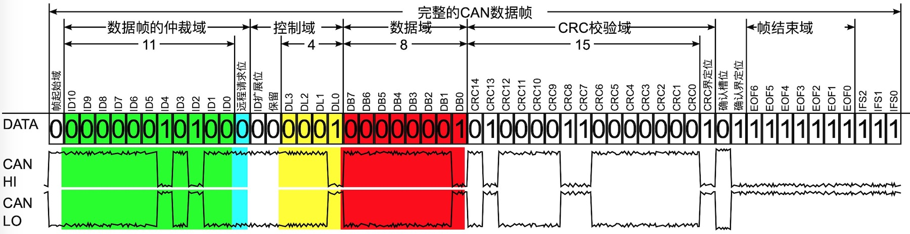
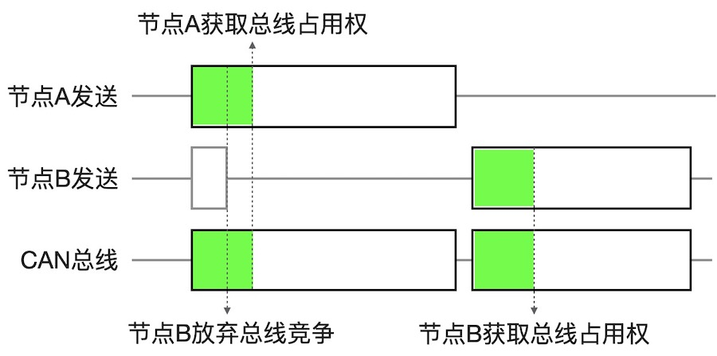
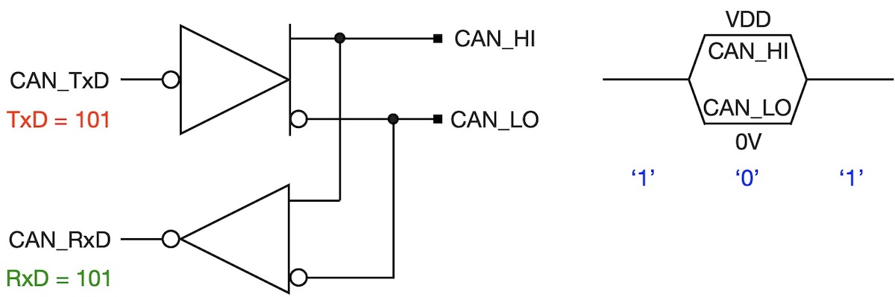
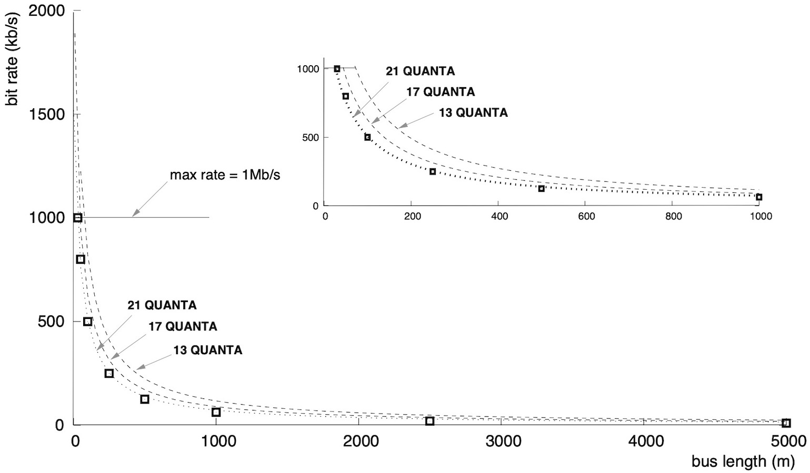
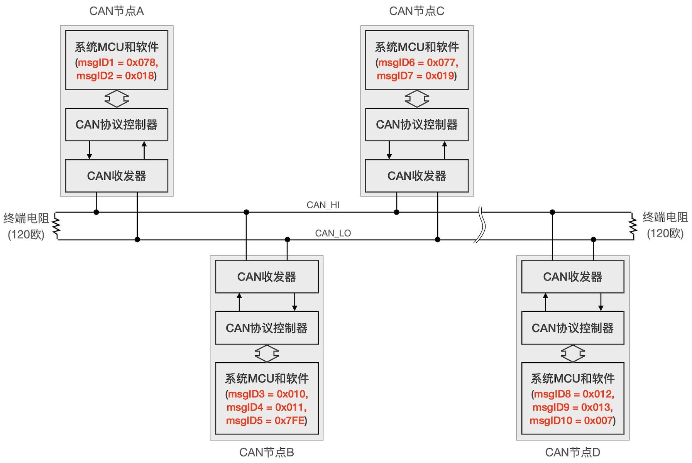

===========================
8.1 CAN总线简介
===========================

CAN总线是一种异步串行通讯低层网络。对照OSI模型，CAN总线规范仅包含物理层和数据链路层的标准。然而，构建在CAN总线之上的应用层协议(即OSI模型的高层协议)有多种，
譬如针对汽车控制领域和工业控制领域的CANOpen协议、针对工业控制领域的DeviceNet协议、针对公交车和卡车控制领域的SAE J1939协议、针对轻型电动汽车领域的EnergyBus协议等。

CAN总线最初由著名的汽车零部件供应商——德国Bosch于1983年制定的，1986年国际汽车工程师协会(SAE)大会上正式公开发布，1991年使用CAN总线的首台汽车——奔驰W140正式推出[1]。
2020年国际CAN大会(iCC)上启动CAN XL(被称为第三代CAN)标准，CAN总线已经历近40年的发展，在汽车控制领域CAN总线仍被广泛使用。CAN总线为什么能够得到广泛认可呢？

CAN总线具有以下几个特点：

  1. 高可靠性。CAN总线采用无主的网络架构，网络传输不依赖于主机的可靠性。CAN总线采用消息ID和消息体的传输机制(无网络节点ID)，每个节点可发送或接收多个ID的消息，任何节点失效都不会影响其他节点和网络。
  2. 低成本。CAN总线物理层采用低压差分信号，CAN总线物理层接口的收发器成本与RS485收发器相接近，但CAN总线收发器具有网络侦测能力(每个节点都可以检测自己发出的信号)。
  3. 高传输效率。CAN总线使用面向位流编码的短数据帧，每个位都采用不归零编码，数据域最大长度位8字节。传输短数据帧时占用的网络周期短，受干扰或导致错误数据位的概率低，而且重传的时间也短。
  4. 易组网。CAN总线采用消息ID(11位或29位两种长度的消息ID)的二进制‘0’位的多少分配消息传输优先级，允许多个节点自动竞争和仲裁获取总线的占用权，甚至支持即插即用的节点。
  5. 开放协议和生态系统。CAN总线得到广泛应用的关键应归功于Bosch最初采用的开放版权策略，以及由半导体制造商(协议栈的硬件化)、汽车零部件开发商、软件开发商和行业协会等共同参与而打造的CAN总线生态。

本节以CAN2.0A版本为例了解CAN总线的上述基本特点和相关的基本概念。

-------------------------

CAN总线的物理层使用双绞线作为网络介质，两个信号分别称作CAN_HI和CAN_LO，他们组成一对差分信号，由CAN总线节点的物理层接口——总线收发器驱动。
CAN总线的数据帧是面向二进制位编码的结构化位流，每个数据帧都包含帧起始域、仲裁域、控制域、数据域、CRC校验域、确认域、帧结束域和帧间隔域等。

在CAN总线的规范中，将二进制位‘0’定义为“显性位”或“显性信号”、‘1’定义为“隐性位”或“隐性信号”。在传输显性位‘0’时，CAN_HI信号将被拉高到CAN总线收发器的工作电源电压VDD，
同时CAN_LO信号将被拉低到CAN总线收发器GND；传输隐性位‘1’时，CAN总线收发器不驱动CAN_HI和CAN_LO两个信号，即两个信号处于浮空状态，此时两总线信号受120欧姆终端匹配的影响都保持2V左右。

图8.1  CAN2.0A数据帧(位流)和物理层CAN_HI和CAN_LO信号之间关系示意图[1]

在图8.1中，假设某个CAN总线节点发出一个数据帧，其中帧ID=0x014且仅1个字节的数据0x01，这个完整的CAN总线数据帧由55个二进制位组成，
并结构化为8个信息域，其中绿色、黄色和红色背景的三个信息域分别是仲裁域(即信息ID)、控制域(指定信息域长度)和数据域(帧数据)，
按照我们的假设，这三个信息域的二进制位是确定的。此外，CRC校验域的内容是根据该域之前的位流内容计算得到15位长度的CRC值(循环冗余校验码)。
帧起始域、帧确认域、帧结束域和帧间隔域等都是固定的信息，即所有CAN2.0A数据帧的这些域都是相同的，这些固定内容的信息域用于同步CAN数据帧。

上图能够清楚地看出，CAN总线发送‘0’和‘1’时CAN_HI和CAN_LO两信号的电压状态。CAN总线物理层的收发器有很多种型号，甚至他们的工作电压各不相同(如3.3V或5V)，
但是CAN总线允许使用不同型号的总线收发器节点共用同一个网络，这是因为CAN总线接收器以CAN_HI和CAN_LO两信号的电压差和阈值来判定‘0’和‘1’信号：
显性位‘0’的电压差的阈值为2.3V(大于2.3V为逻辑‘0’)，隐性位‘1’的电压差阈值为0.6V(小于0.6V为逻辑‘1’)。

CAN数据帧的起始域仅有1个显性位‘0’。由于CAN总线的空闲状态或接收状态是浮空的，CAN_HI和CAN_LO两信号的电压差为0，即总线处于隐性位‘1’的状态，
显性位‘0’作为帧起始域具有明确的同步作用。此外，CAN总线传输显性位‘0’时两总线信号由收发器主动地驱动，从隐性位‘1’跳变到显性位‘0’的过渡期更短，
所以帧起始域信号的初始变化更斜率更大。虽然CAN总线的经历多个版本演变，帧起始域并没有变化。

CAN数据帧的11位帧/消息ID域和远程请求标志位组成仲裁域，有时候还把这个域称作优先级域，当然这些称呼都是名副其实的。与RS485总线组成的网络不同，CAN总线不对节点编址，
但要求CAN总线节点传输的数据帧/消息进行编址，即帧/消息ID，每个发送节点拥有一个或多个消息ID用于帧标示，接收者则根据需要接收或忽略网络上的消息。
原则上，CAN总线的消息发送者使用惟一ID发送消息。譬如汽车中控发出左后视镜和右后视镜的角度调整消息必需采用不同的ID，左右后视镜的控制器节点根据消息ID接收自己的指令，
忽略其他指令。

CAN总线是一种多主(或无主)网络架构，任何节点都可以随时启动消息发送过程，但是发送者必须在发送消息ID期间侦测网络状态确保是否发送成功，
一旦发送不成功则停止发送过程，直到网络恢复空闲状态后再次启动发送过程。我们把CAN总线发送帧/消息ID和远程请求标志位的过程称作抢占总线的仲裁过程。如图8.2所示。

图8.2  CAN总线占用权的仲裁过程示意图

如前所述，发送隐性位‘1’时两个总线信号是浮空的，而发送显性位‘0’时两个总线信号受总线收发器直接驱动。这也就是说，如果两个CAN节点同时发送数据，
假设A节点发送‘0’、B节点发送‘1’，那么总线上实际传送的是‘0’，即隐性位‘1’被显性位‘0’覆盖。在图8.2所示的仲裁过程中，如果两个CAN节点同时启动数据帧传输，
起始域是显性位‘0’显然可以准确地传送，假设两个节点传输的消息ID不是完全相同的，譬如A节点正在传输的消息ID为‘b00000010100’(十六进制表示为0x014)，
B节点正在传输的消息ID为‘b00000100100’(十六进制表示为0x024)，那么B节点传输到ID[6]的‘1’时将会失败，因为该隐性位‘1’被A节点的ID[6]位所覆盖，
此时B节点按照CAN总线的仲裁机制立即退出总线竞争，A节点将成功地将消息发送出去，一旦A节点发送完毕则立即释放总线，B节点侦测到总线空闲后则再次启动消息发送过程，
此时如果没有其他节点与B节点竞争总线则B节点也能成功地将消息发送出去。 

显然，CAN总线的竞争和仲裁机制需要收发器的支持。CAN总线收发器不仅具有差分驱动和差分接收能力，还具有收发环路，即发送的同时还支持接收。
CAN总线收发器的结构原理如图8.3所示，与标准差分信号驱动器(如RS485收发器)相比CAN总线收发器的输入和输出端采用反相逻辑。

图8.3  CAN总线收发的结构(反相逻辑)和收发环路

在原理上收发环路允许CAN总线节点的CAN协议控制器能够侦测每一个数据位是否发送成功，但在高速CAN网络中必须考虑信号在双绞线上传输延迟，
譬如B节点发送隐性位ID[6]时，远端的A节点正好发送显性位ID[6]，B节点收发器的接收环路收到显性位‘0’的延迟与两个节点的传输线长度有关。
按照5ns/m的传输延迟来估算，1000m长度的双绞线引起的信号延迟约5us！这意味着长传输线的CAN网络必须采用很低的波特率(虽然CAN2.0支持1Mbps)。
此外，CAN总线收发器也会有一定的传输延迟，需要根据每个型号的收发器来确定。图8.4给出CAN总线波特率与网络节点个数(QUANTA)、网络传输线长度之间的关系图线[2]。

图8.4  CAN总线的波特率和传输线长度之间关系

根据图8.4可以看出，1Mbps仅适合25米21个节点的CAN总线，0.8Mbps适合50米21个节点，当传输线长度达1Km时只能采用100K以下的波特率。
我们用简单的反例计算来理解图8.4，1Mbps的位传输时间正好是1us，100m传输线的双向传输(发送和接收)延迟为1us(即200*5ns)，
很显然发送者无法在单个位传输时间内确定是否发送成功。

现在再回来看A和B两个节点竞争总线的仲裁过程，A节点的消息ID小于B节点的，两个节点同时竞争总线时A节点胜出并获得总线占用权。事实上，
CAN总线的竞争和仲裁结果正是根据参与竞争的消息ID来确定：ID值最小的节点将获得总线占用权。因此，将帧/消息ID域和远程请求标志位称作优先级域是实至名归的。

仲裁域的最后一个位(即远程请求标志位)会在什么情况下有仲裁作用呢？仅在ID域完全相同的情况下，这个位才会影响仲裁结果。很显然，ID域不相同的两个或多个节点之间的总线竞争和仲裁结果是确定的，
远程请求标志位将不会有作用。ID域完全相同的两个或多个节点对CAN总线的竞争只会发生在：一个或多个节点主动地同时向某个远程节点请求特定ID的消息时，
该远程节点也正好要发送此特定ID的消息。注意，远程请求帧的这个标志位是隐性的(即‘1’)，但标准的CAN数据帧的这个标志位是显性的(即‘0’)。
现在我们已经很清楚地知道，ID域完全相同的远程请求帧和数据帧之间的竞争和仲裁结果：发送数据帧的节点将赢得总线占用权。举一个简单例子，
某汽车温度控制节点(CAN节点)的消息ID固定为0x078，汽车中控台发出请求温度消息的远程请求帧，该远程请求帧的ID域为0x078且远程请求标志位为‘1’，
同时温度控制节点正好发送温度消息，该数据帧的ID域为0x078且远程请求标志位为‘0’，最终温度控制节点赢得总线占用权，中控台的远程请求帧未发送成功，
但是中控台仍接收到温度数据帧。

在CAN数据帧的仲裁域之后是控制域，该域的第一个位是ID扩展帧的标志位，对于11位帧/消息ID的数据帧来说该位固定是显性的，对于29位帧/消息ID的数据帧则该位固定是隐性的。
控制域的第2个位是预留未来使用的固定位，CAN总线规范中要求预留位默认是显性的，但接收节点将会忽略这些位的实际值。

CAN2.0B和CAN FD规范都支持29位长度的帧/消息ID，并将仲裁域拓展至32个位，包含11位标准的+原远程请求标志位(固定为‘1’)和预留位(固定为‘1’)+18位拓展帧/消息ID+远程请求标志位。
按照CAN总线的向后兼容原则，允许CAN2.0A、CAN2.0B和CAN FD等三类节点共享同一个CAN总线，根据前述的CAN总线竞争和仲裁机制，你能确定哪类节点的消息优先级最高呢？

CAN数据帧的控制域还包含有数据域长度信息，在CAN2.0A/B和CAN FD规范中该信息都只占用4个二进制位(DL3~0)。遵循CAN2.0A/B规范的节点发送的数据域长度至多8个字节，
这个域仍预留一个冗余位，然而支持0～64个字节数据域长度的CAN FD规范只能采用非线性的编码，因此CAN FD的数据域长度只能取{0～8，12, 16, 20, 24, 32, 48, 64}个字节。
换句话说，如果遵循CAN FD规范的节点要传输9个字节的数据必须填充成12个字节才能传输。

紧跟CAN数据帧的控制域之后是可变长度的数据域，该域的二进制位个数为8*DL[0:3]。在CAN FD和CAN XL规范中允许使用更高的波特率传输该域的位流，
但CAN2.0A/B规范中要求使用仲裁域和控制域相同的波特率传输数据域。

CRC校验域、帧确认域、帧结束域和帧间隔域是所有CAN规范中都有的信息域。CRC校验域是发送节点根据起始域、仲裁域、控制域和数据域的位流并按特定的CRC15多项式函数计算出来的，
接收者使用同样的CRC算法计算接收到位流的15位CRC校验值与实际接收到的CRC校验值比较来判定接收的位流的正确性，接收者(根据消息ID判定)发现数据有误则在接收确认域期间发出错误帧通知发送者，
错误帧/消息的发送者则启动消息重新发送的过程。

-------------------------

我们通过分析CAN2.0A规范的CAN数据帧的8个域及其作用初步了解CAN总线的消息ID、总线竞争和仲裁、发送显性位和隐性位时总线信号状态等。CAN总线是一种多主网络架构，
每个CAN节点的数据信息被系统设计和维护者分配惟一的ID，CAN总线收发器允许CAN协议控制器监测网络状态，任何时候任何节点都可以主动地将节点的数据信息和对应的惟一ID封装成数据帧并启动消息发送，
该发送过程是否成功将取决于总线状态和总线竞争的仲裁结果，如果发送失败(抢占总线失败或收到发送错误帧)则CAN协议控制器将通过重试机制再次发送。
图8.5给出CAN总线、CAN网络节点和CAN消息ID之间的关系。

图8.5  CAN总线、CAN网络节点和CAN消息ID之间关系

图8.5可以看出，一个CAN网络节点可以拥有一个或多个消息ID，但在整个CAN网络内每一个消息ID必须保持惟一性。图中哪个消息ID的优先级最高呢？
哪个最低呢？CAN协议控制器是CAN网络节点上的关键功能单元，前述的CAN总线竞争和仲裁由该功能单元独立完成。目前CAN协议控制器都是MCU内置的或外置的硬件功能单元，
该单元与系统MCU之间采用高速总线连接，每个节点的应用层数据被标注上惟一消息ID后传输给CAN协议控制器，CAN协议控制器负责将该消息广播到CAN总线上，
CAN总线上的所有CAN节点(包括发送者自己)都能接收到该消息，系统MCU可通过配置CAN协议控制器仅接收某些特定ID的消息，但接收到这些特定ID的消息时才将消息ID和消息体传送给系统MCU。

现在看起来，使用CAN总线组网是非常容易的，尤其使用CAN总线传输系统应用层的数据信息几乎不消耗MCU的存储资源和CPU时间。但是，CAN总线并不是实时网络，
一个节点的消息被成功地发送和接收的时间是不确定的，尤其CAN总线上多个节点之间的数据传输非常频繁时，某些低优先级的消息可能会传输失败。
虽然RS485总线、ModBus等协议构建的主从网络采用主机轮询各从机的效率比较低，但借助于固定周期的从机轮询机制可以确保数据传输的实时性。
关于CAN总线的数据传输延迟，不同的CAN网络环境的总线竞争和仲裁周期、数据帧传输失败的概率等理论计算和实践验证请参考[3]的第4章。

我们在本节中所了解的多主或无主网络架构的CAN总线节点对总线占用权的竞争和仲裁方案被称作CSMA/CA，即载波侦听多路访问/碰撞避免。这个方案与多主网络架构的以太网的碰撞侦测方案十分相似，
在IEEE 802.3标准中使用CSMA/CD(即载波侦听多路访问/碰撞侦测)和随机避退算法的方案解决以太网节点之间的碰撞。但是，CSMA/CA和CSMA/CD具有本质的区别，
CSMA/CD是一种碰撞侦测和被动避退的方案，以太网节点发送数据同时侦测碰撞，如果发生碰撞则进入碰撞处理流程：首先立即停止数据发送并开始向网络发送阻塞信息以增强碰撞效果让其他节点尽快侦测到碰撞，
然后停止发送信息释放网络并等待随机时间再次启动数据发送，如果碰撞依然存在则启动随机避退算法再尝试发送，如果尝试16次都是失败的则放弃发送。
根据本节的CAN总线使用仲裁域竞争总线的仲裁过程，CSMA/CA的主动避退碰撞只发生在低优先级(较大的消息ID)的数据帧，如果参与总线竞争的消息ID是惟一的，
低优先级消息的发送将被延期，高优先级消息总是能成功地发送出去。比较两种碰撞避退方案，CSMA/CA的效率更高，高优先级的消息具有较高的实时性，
在繁忙的网络环境中，CSMA/CD不仅效率低，所有数据帧的传输延迟完全无法预测。总之，CAN总线的CSMA/CA仲裁机制是非破坏性的，而CSMA/CD则是破坏性的仲裁。

最后还需要了解CAN总线相关的另一个重要概念——位填充。位填充操作是由CAN协议控制器自动完成，CAN总线操作软件仅仅对CAN协议控制器做配置而已：是否启用位填充。
CAN总线数据帧的位填充指的是，待发送的位流如果出现连续5个同极性位时则插入一个相反极性的位。位填充操作可以确保接收者与发送者有足够多的跳变保持同步，
这是因为CAN总线采用不归零编码。位填充操作由发送者自动添加，并由接收者自动删除，CAN总线的应用层数据不受任何影响。CAN数据帧的位填充仅仅对帧起始域、
仲裁域、控制域、数据域和CRC校验域有作用。如果我们的软件配置CAN协议控制器启用位填充功能，当接收到连续6个或以上同极性位则视为总线发送错误，
CAN协议控制器将发出总线错误信息。

-------------------------

参考文献：
::

  [1] https://en.wikipedia.org/wiki/CAN_bus
  [2] http://inst.cs.berkeley.edu/~ee249/fa08/Lectures/handout_canbus2.pdf
  [3] Marco Di Natale, Haibo Zeng, Paolo Giusto, and Arkadeb Ghosal, Understanding and Using the Controller Area Network Communication Protocol: Theory and Practice, Springer, 2012 

