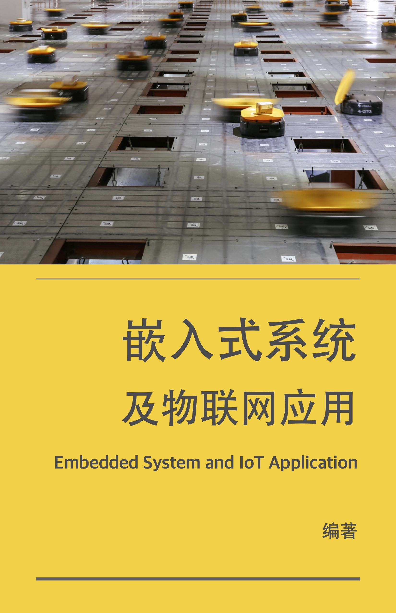
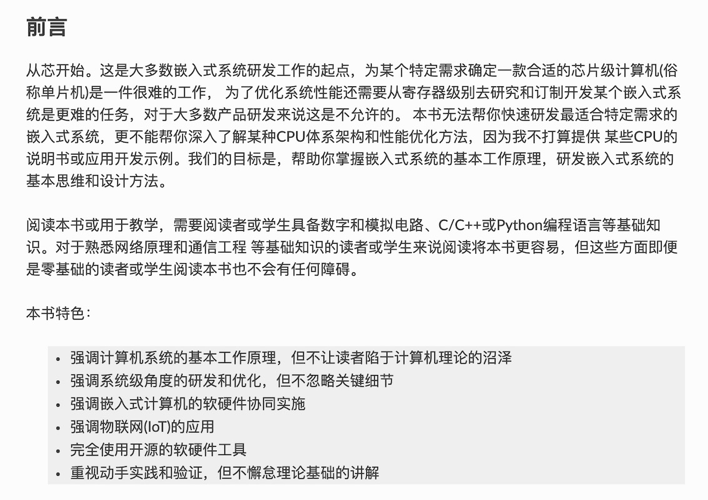

.. The Embedded System documentation master file, created by
   sphinx-quickstart on Fri Nov 22 16:08:05 2019.
   You can adapt this file completely to your liking, but it should at least
   contain the root `toctree` directive.

===============================================
嵌入式系统及应用
===============================================

关于封面
-------------

封面图片来自央视财经频道“物流分拣机器人”新闻报道的截图。

当我们畅想AI和无人驾驶给未来生活带来什么样的影响时，物流分拣机器人已经在国内许多物流配送基地欢快地奔跑着。据新闻报道的数据，
与人工物流分拣相比，机器分拣的准确率高达99.6%！这仅仅是机器换人的个例，更多的机器换人正在各种车间进行着。机器换人的基础是
智能机器，其核心确是各种各样的嵌入式计算机系统。我们看得到的智能机器表面上只是执行特定动作的动力传输机构，以及感知环境的传感器。
然而，智能机器的控制中心才是知识和技术最密集的关键部件，这个控制中心也是本书的核心——嵌入式系统。

---------------------------------------------

---------------------------------------------

.. toctree::
   :maxdepth: 2

   c1_introduction/index_c1.rst

.. toctree::
   :maxdepth: 2

   c2_ec_structure/index_c2.rst

.. toctree::
   :maxdepth: 2

   c3_ec_software/index_c3.rst

.. toctree::
   :maxdepth: 2

   c4_ec_basedio/index_c4.rst

.. toctree::
   :maxdepth: 2

   c5_ec_i2c_if/index_c5.rst

.. toctree::
   :maxdepth: 2

   c6_ec_spi_if/index_c6.rst

.. toctree::
   :maxdepth: 2

   c7_ec_uart_if/index_c7.rst

.. toctree::
   :maxdepth: 2

   c8_can/index_c8.rst

.. toctree::
   :maxdepth: 2

   c9_wln/index_c9.rst

.. toctree::
   :maxdepth: 2

   ca_bbniot/index_c10.rst

--------------------------------------------------

.. toctree::
   :maxdepth: 2

   cb_references/index_c11.rst

.. toctree::
   :maxdepth: 2

   cc_acknowledge/index_c12.rst

